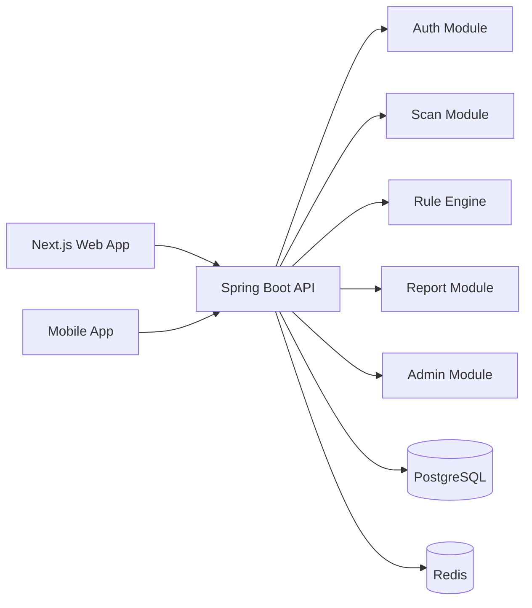
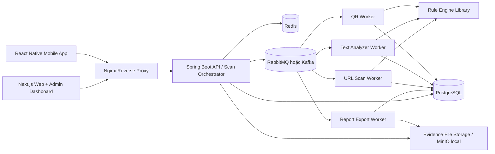
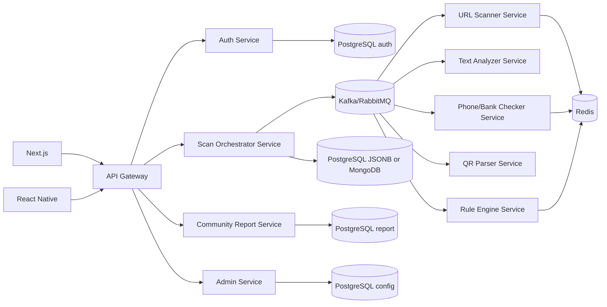
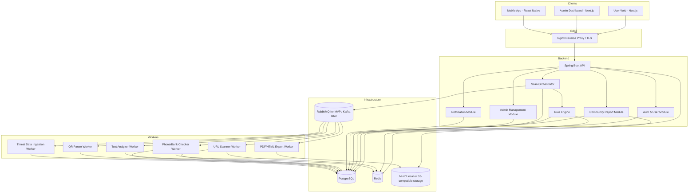
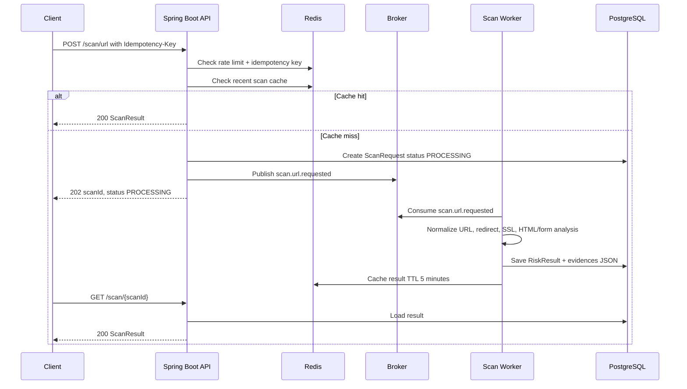
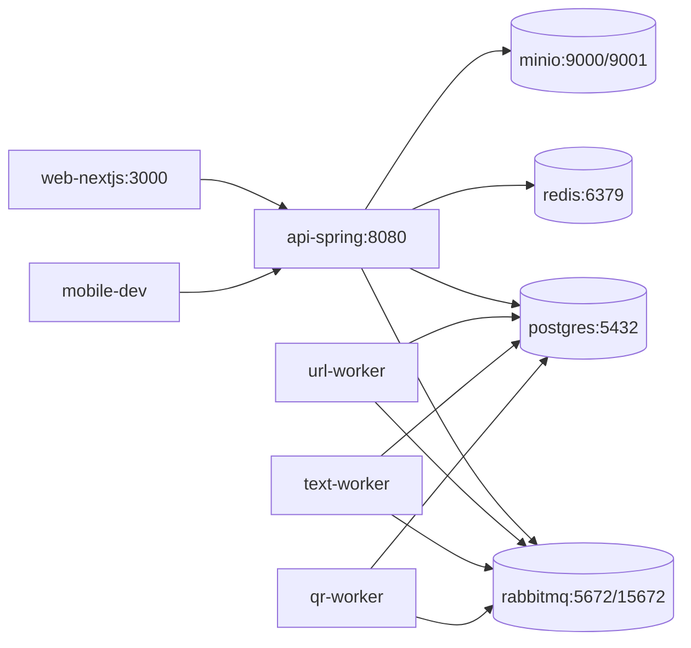
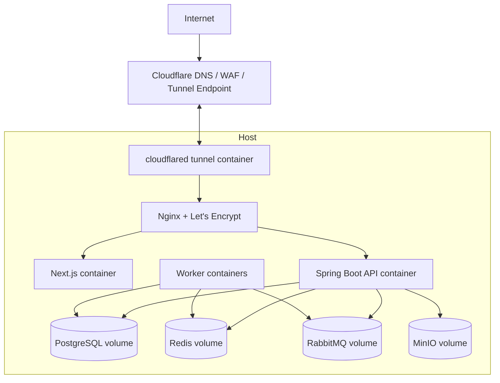

# Thiết kế kiến trúc hệ thống Anti-Scam Platform

**Ngày tạo:** 2026-07-28
**Phạm vi:** Thiết kế kiến trúc cho nền tảng web/mobile cảnh báo rủi ro lừa đảo trực tuyến dựa trên tài liệu Week1 và Week2.
**Tech stack mong muốn:** Next.js, Java Spring Boot, PostgreSQL, Redis, Docker Compose, mobile app và có khả năng mở rộng microservice.

## 1. Tóm tắt yêu cầu từ Week1 và Week2

Hệ thống hướng đến người dùng phổ thông, giúp kiểm tra rủi ro trước khi bấm link, nhập thông tin cá nhân, quét QR hoặc chuyển khoản. Các loại đầu vào chính gồm:

- URL/link đáng nghi.
- Nội dung tin nhắn, bài đăng giao dịch hoặc đoạn hội thoại.
- Biểu mẫu/HTML công khai của website.
- Số điện thoại.
- Số tài khoản ngân hàng.
- QR code chứa URL, text hoặc thông tin chuyển khoản VietQR.
- Báo cáo lừa đảo do cộng đồng gửi lên.

Kết quả cần trả về theo hướng dễ hiểu:

- Điểm rủi ro từ 0 đến 100.
- Mức cảnh báo: `SAFE`, `CAUTION`, `DANGER`.
- Bằng chứng/evidence theo từng rule.
- Giải thích lý do và khuyến nghị hành động.
- Lịch sử scan cho user và dashboard quản trị cho admin.

Ràng buộc quan trọng:

- MVP nên dùng rule-based + heuristic vì giải thích được, dễ test và vừa sức.
- Mobile app không được vượt quyền, không đọc SMS/call log/notification ngầm. Ưu tiên share link, paste text, manual input và QR scanner.
- Backend Java Spring Boot là lõi nghiệp vụ.
- Redis dùng cho cache, rate limiting, idempotency key và distributed lock nhẹ.
- PostgreSQL lưu dữ liệu quan hệ, có thể dùng `JSONB` cho kết quả scan có format khác nhau.
- Có Docker Compose để chạy local trong giai đoạn dev và sau này deploy trên AWS EC2 hoặc VPS thầy tài trợ.

## 2. Đề xuất nhanh

Kiến trúc khuyến nghị cho nhóm 4 thành viên là **Modular Monolith + Event-Driven Workers**.

Lý do:

- Dễ triển khai hơn full microservices trong giai đoạn khóa luận.
- Vẫn tách module rõ: auth, scan, rule engine, report, admin, workers.
- Dùng queue để xử lý các tác vụ chậm như URL fetch, redirect, SSL, HTML parse, report export.
- Có sẵn boundary để tách thành microservice nếu scope tăng.
- PostgreSQL + `JSONB` đủ để lưu kết quả scan khác format trong MVP; có thể bổ sung MongoDB/OpenSearch sau.

## 3. Phương án kiến trúc

### 3.1. Phương án A - Modular Monolith đơn giản

Một ứng dụng Spring Boot duy nhất gồm các package/module nghiệp vụ. Next.js và mobile app gọi REST API trực tiếp. PostgreSQL lưu toàn bộ dữ liệu, Redis cache/rate limit.



**Ưu điểm:** dễ code, dễ debug, dễ demo, ít overhead vận hành.
**Nhược điểm:** các tác vụ scan chậm có thể block request nếu không thiết kế async; khi code lớn cần kỷ luật module tốt.
**Phù hợp khi:** nhóm muốn MVP nhanh và tập trung vào API, rule engine, dashboard.

### 3.2. Phương án B - Modular Monolith + Event-Driven Workers (khuyến nghị)

Spring Boot API đóng vai trò API layer và scan orchestrator. Các job scan nặng được đẩy vào message broker. Worker có thể nằm trong cùng codebase nhưng chạy thành process/container riêng.



**Ưu điểm:** cân bằng giữa đơn giản và mở rộng; request nhanh hơn; worker có thể scale riêng; hợp với scan bất đồng bộ.
**Nhược điểm:** cần thêm broker và quản lý job status; test integration phức tạp hơn phương án A.
**Phù hợp khi:** nhóm muốn có microservice-ready architecture nhưng vẫn giữ scope vừa sức.

### 3.3. Phương án C - Full Microservices

Mỗi miền nghiệp vụ là một service riêng. Các service giao tiếp qua REST/gRPC cho query đồng bộ và Kafka/RabbitMQ cho event/job bất đồng bộ. Có thể kết hợp PostgreSQL cho dữ liệu quan hệ và MongoDB/OpenSearch cho scan result/log search.



**Ưu điểm:** scale từng service độc lập; phù hợp khi cần SQL + NoSQL và team lớn hơn.
**Nhược điểm:** quá nhiều boilerplate, deploy/test/debug khó hơn; nhóm 4 người dễ bị lệch focus khỏi mục tiêu khóa luận.
**Phù hợp khi:** đã có MVP ổn định hoặc muốn biến thành sản phẩm dài hạn.

## 4. Kiến trúc khuyến nghị chi tiết



### 4.1. Luồng scan đồng bộ và bất đồng bộ

Với các endpoint nhẹ như check phone/account bằng cache, API có thể trả về ngay. Với URL scan cần fetch network, follow redirect, check SSL và parse HTML, nên dùng job bất đồng bộ hoặc hybrid:

- Nếu cache có kết quả gần đây: trả về ngay.
- Nếu scan nhẹ và dưới timeout 2-3 giây: xử lý sync.
- Nếu scan nặng hoặc cần fetch HTML: tạo `ScanRequest`, đẩy job vào broker, trả `scanId` với status `PROCESSING`.
- Client poll `GET /scan/{scanId}` hoặc dùng WebSocket/SSE trong phiên bản sau.



## 5. Giải thích từng module

### 5.1. Next.js Web App

Phục vụ người dùng web và admin dashboard. Nên dùng một Next.js project với role-based routing:

- User pages: scan URL, scan text, check phone, check bank account, scan history, submit report.
- Admin pages: dashboard, report review, risk entity management, rule management, audit log.
- Gọi backend qua REST API `/v1`.
- Validate input cơ bản ở client nhưng backend vẫn là nơi validate chính.

### 5.2. Mobile App

Khuyến nghị chọn **React Native + Expo Dev Client** cho MVP.

Lý do:

- Cùng ngôn ngữ với Next.js, dễ chia sẻ mindset UI và DTO.
- Đủ cho manual input, share target, paste foreground và QR scanner.
- Có thể build Android trước, iOS sau.
- Nếu cần native feature như Android Call Screening, có thể thêm native module hoặc tách sang Kotlin trong giai đoạn nâng cao.

Tính năng MVP:

- Share link vào app để scan.
- Paste text/link khi app ở foreground.
- Manual input phone/account.
- QR scanner bằng camera runtime permission.
- Xem lịch sử và gửi report.

Không nên làm MVP:

- Đọc SMS ngầm.
- Notification listener.
- Accessibility service.
- Clipboard auto monitoring nền.

### 5.3. Nginx Reverse Proxy

Dùng làm entrypoint khi deploy trên AWS EC2 hoặc VPS thầy tài trợ:

- Terminate TLS bằng Let's Encrypt.
- Reverse proxy `/api` đến Spring Boot.
- Reverse proxy Next.js web app.
- Giới hạn request cơ bản ở tầng edge nếu cần.

Trong local Docker Compose, Nginx có thể optional. Dev có thể gọi trực tiếp Next.js và API.

### 5.4. Spring Boot API

Đây là lõi backend:

- REST API theo Week2 API spec: `/auth`, `/scan/*`, `/reports`, `/admin/*`.
- Validate input, sanitize dữ liệu nhạy cảm.
- Spring Security + JWT + refresh token.
- RBAC với role `USER`, `ADMIN`.
- Tạo scan request, điều phối worker, gom kết quả và trả response chung.
- Rate limiting và idempotency qua Redis.

Package gợi ý:

```text
com.antiscam.auth
com.antiscam.user
com.antiscam.scan
com.antiscam.rule
com.antiscam.report
com.antiscam.admin
com.antiscam.notification
com.antiscam.common
```

### 5.5. Auth & User Module

Chịu trách nhiệm:

- Đăng ký, đăng nhập, refresh token.
- Hash password bằng BCrypt/Argon2.
- Lưu role, status, verification state.
- Quản lý session/refresh token.
- Audit các thao tác nhạy cảm.

Database chính:

- `users`
- `roles` hoặc enum role trong user
- `refresh_tokens`
- `audit_logs`

### 5.6. Scan Orchestrator

Module điều phối mọi loại scan.

Chịu trách nhiệm:

- Nhận request scan từ API.
- Chuẩn hóa input và xác định `inputType`.
- Kiểm tra cache gần đây.
- Tạo `scan_requests`.
- Quyết định xử lý sync hay publish job.
- Gom kết quả từ scanner và rule engine.
- Lưu `risk_results`.

Đây là nơi quan trọng để giữ API response thống nhất dù mỗi scanner có output khác nhau.

### 5.7. URL Scanner Worker

Chịu trách nhiệm:

- Normalize URL.
- Validate URL format.
- Tách domain, subdomain, path, query.
- Phát hiện IP thay domain, URL quá dài, ký tự bất thường, shortener.
- Theo redirect chain với timeout và max redirect.
- Kiểm tra HTTPS/SSL cơ bản.
- Kiểm tra blacklist/whitelist.
- Domain similarity/typosquatting bằng Levenshtein/Jaro-Winkler.
- Nếu cần, fetch HTML công khai và chuyển cho HTML/Form Analyzer.

Thư viện gợi ý:

- Java HttpClient hoặc OkHttp.
- Apache Commons Validator.
- Apache Commons Text.
- Jsoup.

### 5.8. HTML/Form Analyzer

Có thể là submodule của URL Scanner trong MVP.

Chịu trách nhiệm:

- Parse HTML bằng Jsoup.
- Trích xuất form/input.
- Phát hiện input nhạy cảm: password, OTP, PIN, CVV, CCCD, bank, account.
- Kiểm tra form action khác domain, action không HTTPS.
- Tìm keyword lừa đảo trong nội dung công khai.

Không lưu password, OTP, số thẻ hoặc dữ liệu đăng nhập của người dùng.

### 5.9. Text Analyzer Worker

Chịu trách nhiệm:

- Tiền xử lý tiếng Việt ở mức đơn giản.
- Extract URL, phone number, bank account, amount, OTP-like pattern, deadline.
- Match keyword theo nhóm: khẩn cấp, giả mạo cơ quan, yêu cầu thông tin nhạy cảm, chuyển tiền, quá tốt để tin.
- Phát hiện composite pattern: giả mạo ngân hàng, fake job, fake shipper, hoàn tiền giả, khẩn cấp + thông tin nhạy cảm.
- Cross-reference URL/phone/account bằng các module tương ứng.

Trong MVP nên rule-based. ML/LLM chỉ nên ghi ở hướng phát triển.

### 5.10. Phone/Bank Checker Worker

Chịu trách nhiệm:

- Normalize phone theo format VN, ví dụ `0912345678` thành `+84912345678`.
- Normalize account number, bank code.
- Hash giá trị nhạy cảm trước khi lookup/log nếu cần.
- Lookup `risk_entities` và `scam_reports`.
- Tính điểm dựa trên blacklist, số report, report đã verify và time-decay.
- Cache phone/account hot trong Redis.

### 5.11. QR Parser Worker

QR không phải scanner độc lập hoàn toàn, mà là "input router".

Chịu trách nhiệm:

- Decode QR bằng mobile app hoặc backend worker.
- Phân loại raw data: URL, VietQR, plain text, unknown.
- Nếu URL: gọi URL Scanner.
- Nếu VietQR: parse bank code, account number, amount, content, rồi gọi Bank Checker và Text Analyzer.
- Nếu plain text: gọi Text Analyzer.

Với MVP, nên decode QR trên mobile để giảm upload ảnh. Backend nhận `qrData` đã decode như API Week2.

### 5.12. Rule Engine

Đây là lõi giải thích rủi ro của hệ thống.

Chịu trách nhiệm:

- Load active rules từ PostgreSQL và Redis cache.
- Evaluate simple rule và composite rule.
- Cộng điểm với weight, priority và threshold.
- Sinh evidence: `ruleCode`, `ruleName`, `score`, `severity`, `description`.
- Map điểm thành `SAFE`, `CAUTION`, `DANGER`.

Bảng chính:

- `risk_rules`
- `rule_conditions`
- `rule_actions` nếu cần mở rộng

Rule engine nên được viết thành Java library/module riêng để worker nào cũng dùng được. Khi tách microservice, module này có thể thành Rule Service.

### 5.13. Community Report Module

Chịu trách nhiệm:

- Người dùng gửi report kèm loại entity, giá trị, mô tả, bằng chứng.
- Lưu trạng thái: `PENDING`, `UNDER_REVIEW`, `VERIFIED`, `REJECTED`, `RESOLVED`, `NEED_MORE_INFO`.
- Admin duyệt report.
- Nếu verified, tạo/cập nhật `risk_entities`.
- Tính reputation của reporter nếu có.
- Chống spam bằng rate limit và audit log.

File bằng chứng nên lưu ở object storage local MinIO khi dev; khi deploy trên AWS EC2 hoặc VPS thầy tài trợ có thể dùng MinIO tự host hoặc S3-compatible storage.

### 5.14. Admin Management Module

Chịu trách nhiệm:

- Quản lý risk entities: domain, URL, phone, bank account, keyword, brand.
- Quản lý rules và weights.
- Duyệt report.
- Xem dashboard thống kê scan/report/risk level/top scam types.
- Xem audit logs.

Admin dashboard nên là một phần của Next.js app, dùng role `ADMIN` để bảo vệ route.

### 5.15. Notification Module

MVP chỉ cần notification nhẹ:

- Gửi email xác thực tài khoản nếu có.
- Thông báo report đã duyệt/từ chối.
- Thông báo scan async đã xong nếu client có polling hoặc push sau này.

Giai đoạn sau có thể thêm push notification cho mobile.

### 5.16. Threat Data Ingestion Worker

Đây là module mở rộng để nạp dữ liệu blacklist/whitelist từ nguồn public hoặc dataset mẫu:

- Import file CSV/JSON của domain, phone, bank account, brand list.
- Lưu `risk_sources`.
- Tạo/cập nhật `risk_entities`.
- Ghi audit và version của dataset.

Trong MVP, có thể chỉ làm import từ file mẫu để demo.

### 5.17. Report Export Worker

Chịu trách nhiệm:

- Tạo PDF/HTML report cho kết quả scan hoặc dashboard.
- Chạy async vì export có thể chậm.
- Lưu file vào MinIO/S3-compatible storage.

Thư viện gợi ý: OpenPDF hoặc JasperReports.

## 6. Data architecture

### 6.1. PostgreSQL là database chính

PostgreSQL phù hợp để lưu dữ liệu quan hệ và workflow kiểm duyệt:

- `users`
- `scan_requests`
- `risk_results`
- `risk_entities`
- `risk_rules`
- `rule_conditions`
- `scam_reports`
- `evidence_files`
- `audit_logs`
- `risk_sources`

Với kết quả scan có format khác nhau, dùng `JSONB` trong `risk_results`:

```sql
risk_results
- id
- scan_request_id
- risk_score
- risk_level
- confidence
- summary
- analysis_json JSONB
- evidences_json JSONB
- recommendation_json JSONB
- created_at
```

Cách này giúp:

- URL scan có `urlFeatures`, `domainAnalysis`, `redirectChain`.
- Text scan có `extractedEntities`, `keywordMatches`, `patternMatches`.
- QR scan có `qrType`, `parsedData`, `accountCheck`.
- Phone/account scan có `reportCount`, `verifiedReports`, `timeDecayScore`.

### 6.2. Khi nào cần NoSQL

Chưa cần NoSQL trong MVP nếu PostgreSQL `JSONB` đủ đáp ứng. Cần xem xét MongoDB/OpenSearch khi:

- Kết quả scan rất đa dạng và thay đổi liên tục.
- Cần search full-text/log/evidence trên nhiều trường động.
- Cần analytics trên lượng event lớn.
- Full microservice mỗi service sở hữu schema riêng.

Lựa chọn mở rộng:

- MongoDB: lưu scan documents đa dạng.
- OpenSearch: search audit log, scan result, dashboard query.
- ClickHouse: analytics/time-series lớn.

## 7. Redis architecture

Redis dùng cho bốn nhóm việc:

### 7.1. Cache

- Recent scan result: TTL 5 phút.
- Blacklist/whitelist hot: TTL 1-24 giờ.
- Active rules: TTL 5-15 phút, invalidate khi admin update.
- Phone/account lookup: TTL 15 phút.

### 7.2. Rate limiting

Dùng key theo user/IP/endpoint:

```text
rate:{userId}:{endpoint}:{window}
rate:ip:{ip}:{endpoint}:{window}
```

Gợi ý limit theo Week2:

- Free user `POST /scan/*`: 50 request/giờ.
- Authenticated user: 200 request/giờ.
- `POST /reports`: 10 request/ngày.
- Admin: 500 request/giờ.

### 7.3. Idempotency

Cho các endpoint tạo tài nguyên hoặc scan:

```text
idempotency:{userId}:{idempotencyKey}
```

Giá trị lưu:

- request hash.
- response body hoặc `scanId`.
- status.
- TTL 24 giờ.

Nếu client retry cùng key và cùng request hash, API trả lại kết quả cũ. Nếu cùng key nhưng request hash khác, trả `409 IDEMPOTENCY_KEY_CONFLICT`.

### 7.4. Distributed lock

Dùng cho các tác vụ:

- Import dataset.
- Rebuild cache rule.
- Export report lớn.
- Deduplicate scan cùng normalized input.

## 8. Message broker: RabbitMQ hay Kafka

### 8.1. Khuyến nghị cho MVP: RabbitMQ

RabbitMQ hợp với job queue:

- Dễ cài qua Docker Compose.
- Dễ route job theo loại: `scan.url`, `scan.text`, `scan.qr`, `report.export`.
- Có ack/retry/dead-letter queue.
- Phù hợp tác vụ worker cần xử lý rồi cập nhật DB.

### 8.2. Khi nào chọn Kafka

Kafka hợp hơn nếu:

- Muốn event streaming và analytics lâu dài.
- Cần replay event để build dashboard/history.
- Có nhiều consumer đọc cùng event: statistics, notification, ML pipeline.
- Service đã tách rõ và team quen vận hành Kafka.

### 8.3. Cách thiết kế để đổi được broker

Trong code Spring Boot, nên bọc message publishing sau interface:

```text
ScanJobPublisher.publishUrlScanRequested(...)
ScanJobPublisher.publishTextScanRequested(...)
ReportEventPublisher.publishReportVerified(...)
```

MVP có thể implement bằng RabbitMQ. Sau này đổi sang Kafka mà không đổi business service.

## 9. Docker Compose local

Local dev nên có các container:



File `docker-compose.yml` sau này nên gồm:

- `postgres`
- `redis`
- `rabbitmq`
- `minio`
- `api`
- `url-worker`
- `text-worker`
- `qr-worker`
- `report-worker`
- `web`
- optional `nginx`

Trong giai đoạn đầu, nếu chưa có app code, Compose có thể chỉ chạy infrastructure:

- PostgreSQL
- Redis
- RabbitMQ
- MinIO

## 10. Deploy trên AWS EC2 / VPS thầy tài trợ

Khi triển khai thật, nhóm có thể dùng **AWS EC2** hoặc **VPS thầy tài trợ** như một server Linux chạy Docker Compose production. Hai lựa chọn này có kiến trúc gần giống nhau, khác chủ yếu ở cách cấp máy, firewall, backup và chi phí.



Khuyến nghị triển khai:

- Có thể dùng `cloudflared` tunnel để không cần expose trực tiếp IP/port của AWS EC2 hoặc VPS thầy tài trợ.
- Vẫn nên giữ Nginx làm reverse proxy nội bộ để route `web` và `api`.
- Bật HTTPS bằng Cloudflare ở phía ngoài; Let's Encrypt trên Nginx có thể giữ nếu nhóm muốn fallback khi không dùng tunnel.
- Không expose PostgreSQL/Redis/RabbitMQ/MinIO console ra public internet nếu không cần.
- Nếu dùng Cloudflare Tunnel, có thể không cần mở port `80`/`443` inbound trên server; chỉ cần SSH theo IP tin cậy để vận hành.
- Dùng Docker Compose production profile.
- Lưu secret bằng `.env` trên server, không commit lên repo.
- Backup PostgreSQL hằng ngày.
- Backup MinIO/evidence files theo lịch.
- Bật log rotation cho Docker.
- Theo dõi health check API và worker.

Gợi ý chọn giữa AWS EC2 và VPS thầy tài trợ:

| Tiêu chí        | AWS EC2                                                   | VPS thầy tài trợ                              |
| ----------------- | --------------------------------------------------------- | ------------------------------------------------- |
| Chi phí          | Có thể tốn phí nếu vượt free tier hoặc chạy lâu | Phù hợp nếu được tài trợ sẵn             |
| Tính học thuật | Tốt để trình bày cloud deployment                    | Tốt để demo thực tế, kiểm soát đơn giản |
| Vận hành        | Có security group, IAM, snapshot                         | Phụ thuộc nhà cung cấp VPS                    |
| Khuyến nghị     | Dùng nếu nhóm muốn học cloud                         | Dùng nếu ưu tiên ổn định chi phí và demo |

### 10.1. Cloudflare Tunnel / cloudflared

`cloudflared` là lựa chọn phù hợp cho MVP, staging và demo khóa luận vì server chỉ cần tạo kết nối outbound đến Cloudflare. Người dùng truy cập domain public qua Cloudflare, còn IP thật của AWS EC2 hoặc VPS không cần public trực tiếp.

Mô hình gợi ý:

- `app.antiscam.vn` trỏ đến Next.js web thông qua Nginx.
- `api.antiscam.vn` trỏ đến Spring Boot API thông qua Nginx.
- `admin.antiscam.vn` có thể trỏ đến admin dashboard và bật thêm Cloudflare Access nếu muốn giới hạn người vào.

Phân biệt cách dùng:

| Cách dùng  | Phù hợp                   | Ghi chú                                                                                     |
| ------------ | --------------------------- | -------------------------------------------------------------------------------------------- |
| Quick tunnel | Demo nhanh, test tạm thời | Không nên dùng production vì URL tạm và khó quản lý                                 |
| Named tunnel | Staging/production          | Gắn với domain thật, có config ổn định và chạy được bằng Docker Compose/systemd |

Lưu ý vận hành:

- Không đưa token tunnel lên Git.
- Chạy `cloudflared` như một container trong Docker Compose production hoặc service systemd trên server.
- Chỉ expose service nội bộ cho Nginx, ví dụ `web:3000` và `api:8080`.
- Không publish PostgreSQL, Redis, RabbitMQ, MinIO ra internet qua tunnel.
- Có thể kết hợp Cloudflare WAF, rate limiting và Access cho route admin.
- Nếu Cloudflare Tunnel gặp sự cố, nhóm nên có phương án fallback bằng SSH và port `80`/`443` chỉ mở khi thật sự cần.

## 11. API boundary gợi ý

Giữa client và backend:

- `POST /v1/auth/register`
- `POST /v1/auth/login`
- `POST /v1/auth/refresh`
- `POST /v1/scan/url`
- `POST /v1/scan/text`
- `POST /v1/scan/phone`
- `POST /v1/scan/bank-account`
- `POST /v1/scan/qr`
- `GET /v1/scan/history`
- `GET /v1/scan/{scanId}`
- `POST /v1/reports`
- `GET /v1/reports/my`
- `GET /v1/admin/dashboard/overview`
- `GET /v1/admin/rules`
- `POST /v1/admin/rules`
- `GET /v1/admin/risk-entities`
- `POST /v1/admin/reports/{reportId}/review`

Response nên thống nhất:

```json
{
  "success": true,
  "data": {},
  "message": "Optional message"
}
```

Lỗi nên thống nhất:

```json
{
  "success": false,
  "error": {
    "code": "VALIDATION_ERROR",
    "message": "Dữ liệu không hợp lệ",
    "details": []
  },
  "timestamp": "2026-07-28T10:00:00Z",
  "path": "/v1/scan/url"
}
```

## 12. Security, privacy và trust-by-design

Kiến trúc cần thể hiện hệ thống không chỉ "phát hiện scam" mà còn đáng tin.

### 12.1. Nguyên tắc dữ liệu

- Không yêu cầu người dùng nhập OTP, mật khẩu, số thẻ.
- Không đọc SMS, notification, call log ngầm.
- Chỉ scan data user chủ động gửi.
- Hash phone/account nếu dùng cho lookup/log.
- Evidence file cần có giới hạn kích thước và validate content type.
- User có thể xem và xóa lịch sử scan của mình.

### 12.2. Bảo mật API

- HTTPS bắt buộc khi deploy.
- JWT access token ngắn hạn, refresh token dài hạn hơn.
- BCrypt/Argon2 cho password.
- RBAC cho admin.
- Rate limiting Redis.
- Idempotency key cho scan/report.
- Audit log cho admin action.
- Validate và timeout tất cả request fetch URL để tránh SSRF.

### 12.3. Chống SSRF khi scan URL

URL Scanner phải chặn:

- Private IP ranges: `127.0.0.0/8`, `10.0.0.0/8`, `172.16.0.0/12`, `192.168.0.0/16`.
- Link-local/meta-data IP.
- `localhost`, `.local`, internal hostname.
- Redirect đến private IP.
- Port nguy hiểm hoặc port không cho phép.

Chỉ cho phép HTTP/HTTPS, giới hạn timeout, response size và redirect count.

## 13. Chia việc cho nhóm 4 thành viên

Nguyên tắc chia việc: **chia theo module nghiệp vụ, không chia theo role frontend/backend/data**. Mỗi thành viên sở hữu một vertical slice end-to-end gồm UI, API, database/cache/event, test và demo flow cho module của mình. Cách này giúp tất cả thành viên đều có cơ hội làm fullstack, đồng thời vẫn giữ được ranh giới trách nhiệm rõ ràng.

Trước khi tách việc, cả nhóm nên cùng thống nhất:

- API contract chung: request/response, error format, pagination, idempotency key.
- Database naming convention và migration convention.
- Cách dùng Redis cho cache, rate limiting và idempotency.
- Event naming nếu dùng RabbitMQ/Kafka, ví dụ `scan.requested`, `scan.completed`, `report.submitted`.
- Component UI dùng chung cho risk score, evidence, badge trạng thái, form nhập liệu.

### Thành viên 1 - Module Tài khoản, xác thực và hồ sơ tin cậy

Phạm vi nghiệp vụ:

- Đăng ký, đăng nhập, JWT, refresh token.
- User profile và lịch sử hoạt động cơ bản.
- RBAC cho `USER` và `ADMIN`.
- Audit log cho hành động quan trọng.
- Rate limiting/idempotency nền tảng dùng chung cho các API nhạy cảm.

Phần fullstack cần làm:

- Next.js: trang đăng nhập, đăng ký, hồ sơ cá nhân, trạng thái phiên đăng nhập.
- Mobile: màn hình đăng nhập, lưu token an toàn, gọi API hồ sơ.
- Spring Boot: Auth Controller, User Service, JWT filter, RBAC middleware.
- PostgreSQL: bảng `users`, `refresh_tokens`, `audit_logs`.
- Redis: rate limit login, idempotency cho API thay đổi dữ liệu nếu cần.
- Test/demo: login thành công/thất bại, token hết hạn, route admin bị chặn với user thường.

### Thành viên 2 - Module Scan URL và phân tích trang web

Phạm vi nghiệp vụ:

- Người dùng nhập hoặc chia sẻ URL để kiểm tra.
- Scan Orchestrator nhận request và tạo scan job.
- URL Scanner kiểm tra domain, redirect, HTTPS, metadata, form đăng nhập, dấu hiệu giả mạo.
- HTML/Form Analyzer trích xuất evidence có thể giải thích cho người dùng.
- Chống SSRF, timeout và giới hạn kích thước response khi fetch URL.

Phần fullstack cần làm:

- Next.js: form scan URL, trang chi tiết kết quả URL, trạng thái pending/completed.
- Mobile: nhận URL từ share target hoặc nhập tay, hiển thị kết quả scan.
- Spring Boot: `POST /v1/scans/url`, `GET /v1/scans/{id}`, URL scan service.
- Worker: consumer xử lý job scan URL qua RabbitMQ/Kafka.
- PostgreSQL: `scan_requests`, `scan_results`, `scan_evidence` với `JSONB`.
- Redis: cache kết quả scan theo normalized URL, lock tránh scan trùng.
- Test/demo: scan URL an toàn, URL rủi ro, URL redirect, URL bị chặn do private IP.

### Thành viên 3 - Module Scan nội dung, QR và thực thể rủi ro

Phạm vi nghiệp vụ:

- Scan nội dung tin nhắn, đoạn chat, mô tả giao dịch.
- Decode và phân loại QR/VietQR.
- Kiểm tra số điện thoại, tài khoản ngân hàng, email, domain trong nội dung.
- Quản lý `RiskEntity` như phone, bank account, domain, keyword, merchant.
- Rule Engine evaluator dùng chung cho URL/text/QR/entity.

Phần fullstack cần làm:

- Next.js: form scan text, màn hình kết quả theo từng evidence, trang tra cứu phone/bank/domain.
- Mobile: manual input, paste text, QR scanner.
- Spring Boot: API scan text, API scan QR, API lookup entity, Rule Engine module.
- Worker: consumer xử lý text/QR nếu scan cần chạy async.
- PostgreSQL: `risk_entities`, `risk_rules`, `rule_conditions`, `entity_matches`.
- Redis: cache lookup entity, cache rule set active.
- Test/demo: tin nhắn lừa đảo mẫu, QR hợp lệ, QR chứa URL đáng ngờ, entity nằm trong blacklist.

### Thành viên 4 - Module Báo cáo cộng đồng, duyệt admin và dashboard

Phạm vi nghiệp vụ:

- Người dùng gửi report về URL, số điện thoại, tài khoản ngân hàng hoặc nội dung nghi ngờ.
- Admin duyệt report, cập nhật trạng thái và chuyển report thành risk entity/rule nếu hợp lệ.
- Dashboard thống kê số lượt scan, loại rủi ro, report mới, entity mới.
- Import dataset blacklist/whitelist mẫu trong giai đoạn demo.

Phần fullstack cần làm:

- Next.js: trang gửi report, admin review queue, dashboard thống kê.
- Mobile: màn hình gửi report nhanh từ kết quả scan hoặc nhập tay.
- Spring Boot: Report Controller, Admin Controller, moderation workflow.
- Worker: job import dataset hoặc job cập nhật thống kê định kỳ.
- PostgreSQL: `community_reports`, `report_reviews`, `admin_actions`, bảng thống kê aggregate nếu cần.
- Redis: cache dashboard summary, rate limit gửi report.
- Test/demo: gửi report, admin duyệt/từ chối, report được chuyển thành risk entity, dashboard cập nhật.

### 13.1. Cách phối hợp để không bị lệch kiến trúc

- Mỗi module phải có ít nhất một flow chạy được từ UI đến database.
- Mỗi thành viên viết tài liệu ngắn cho API, schema và test case của module mình.
- Pull request nên review chéo giữa các module để mọi người hiểu thêm phần của nhau.
- Các phần dùng chung như auth middleware, error response, Docker Compose, CI hoặc rule engine interface nên được pair programming theo từng buổi ngắn.
- Demo cuối mỗi tuần nên theo user flow, không theo layer kỹ thuật. Ví dụ: "người dùng scan URL", "người dùng scan QR", "admin duyệt report".

## 14. Lộ trình triển khai gợi ý

### Phase 1 - MVP nên có

- Auth + user/admin role.
- PostgreSQL schema chính.
- Rule Engine có 20-30 rule.
- Scan URL.
- Scan text.
- Check phone/bank account.
- QR data routing.
- Community report.
- Admin review report.
- Next.js dashboard có thống kê cơ bản.
- React Native mobile app với manual input, share link và QR scanner.
- Docker Compose local.

### Phase 2 - Nâng cao

- Async scan status với worker riêng.
- Report export PDF/HTML.
- Dataset ingestion worker.
- Redis cache invalidation tốt hơn.
- WebSocket/SSE cho scan completion.
- Mobile push notification.

### Phase 3 - Microservice/Hybrid

- Tách URL Scanner Service.
- Tách Text Analyzer Service.
- Thêm MongoDB/OpenSearch cho scan result/search nếu cần.
- Kafka cho event streaming analytics.
- ML prototype cho URL hoặc text.
- Deploy production trên AWS EC2 hoặc VPS thầy  tài trợ, ưu tiên Cloudflare Tunnel nếu nhóm muốn ẩn IP server.

## 15. Kết luận kiến trúc

Với nhóm 4 thành viên và mục tiêu khóa luận, không nên bắt đầu bằng full microservices. Kiến trúc tốt nhất là modular monolith có event-driven workers:

- Frontend Next.js cho user/admin.
- Mobile React Native + Expo Dev Client cho MVP.
- Backend Java Spring Boot làm API và orchestration.
- PostgreSQL làm database chính, `JSONB` cho kết quả scan đa dạng.
- Redis cho cache, rate limiting, idempotency và lock.
- RabbitMQ cho job queue trong MVP; Kafka là hướng mở rộng nếu cần event streaming.
- Docker Compose để dev local; khi deploy dùng AWS EC2 hoặc VPS thầy tài trợ với Nginx, Cloudflare Tunnel, HTTPS và Docker Compose production.

Hướng này đủ thực tế để demo, đủ rõ module để viết báo cáo thiết kế, và đủ mở rộng để tách microservice khi project lớn hơn.
