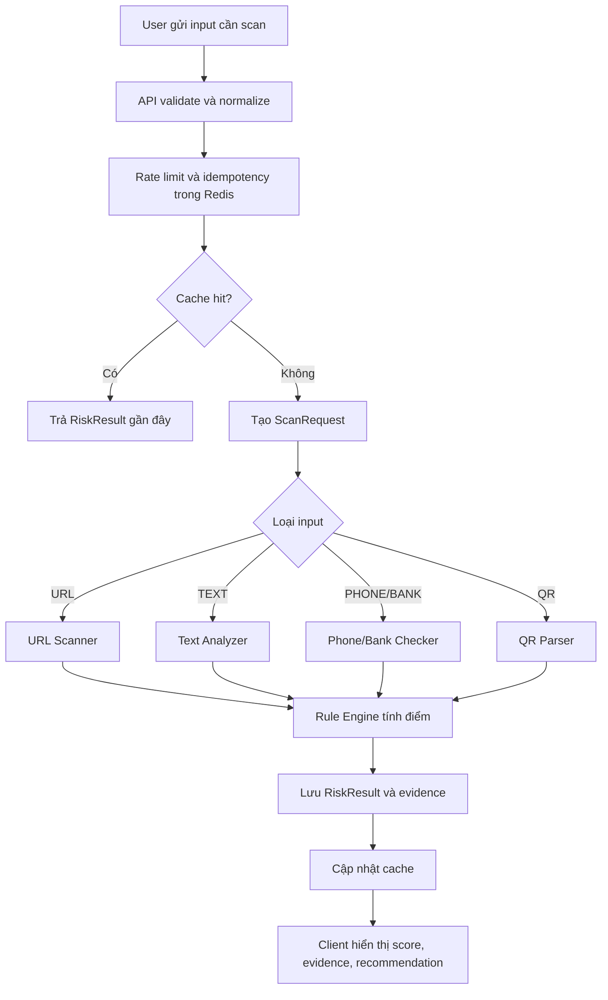

# Phân tích flow theo phân hệ người dùng

**Project:** Anti-Scam Platform  
**Tuần:** Week 5  
**Nguồn tổng hợp:** Week1-Week4

## 1. Phạm vi và căn cứ

Tài liệu này tổng hợp flow sản phẩm từ các tài liệu Week1 đến Week4, tập trung vào những phân hệ có tác nhân người dùng rõ ràng. Phạm vi MVP ưu tiên:

- Web user: scan URL, text, số điện thoại, số tài khoản, QR raw/upload, xem lịch sử, gửi báo cáo.
- Mobile user: thao tác chủ động bằng paste/manual input, share target, foreground clipboard action và QR camera.
- Admin: dashboard, duyệt báo cáo, quản lý rule, quản lý risk entity, audit.
- Hệ thống: scan orchestrator, workers, rule engine, cache, report storage.

Căn cứ chính:

- Week1 đề xuất đề tài: đối tượng sử dụng, chức năng user/admin, quy trình nghiệp vụ.
- Week1 feedback giảng viên: minh bạch dữ liệu, giải thích cảnh báo, quy trình cộng đồng, không kết luận tuyệt đối.
- Week2 API Specification: auth, scan, history, report, admin, dashboard, rate limit.
- Week2 Mobile Permissions Analysis: không đọc SMS/notification/call log/clipboard ngầm; user chủ động paste/share/scan.
- Week2 phân tích thuật toán: URL scanner, HTML/form analyzer, text analyzer, phone/bank checker, QR parser, rule engine.
- Week3 kiến trúc: Next.js web, React Native mobile, Spring Boot API, RabbitMQ workers, PostgreSQL, Redis, MinIO.
- Week4 feature list: Auth/User, Text/Phone/Bank/QR & Rule Engine, Risk Result Card, rule management.

## 2. Nhóm tác nhân và quyền

| Tác nhân | Mô tả | Quyền chính |
|---|---|---|
| Khách chưa đăng nhập | Người mới vào hệ thống, có thể xem giới thiệu và có thể scan giới hạn nếu sản phẩm cho phép anonymous. | Xem landing/onboarding, đăng ký, đăng nhập, scan giới hạn theo rate limit nếu bật anonymous scan. |
| User đã đăng nhập | Người dùng phổ thông cần kiểm tra rủi ro trước khi bấm link, nhập thông tin hoặc chuyển tiền. | Scan, xem kết quả, xem lịch sử, gửi report, xem report của mình, quản lý profile. |
| Mobile user | User dùng app mobile trong tình huống thực tế: nhận tin nhắn, thấy QR, thấy link trong Zalo/Messenger/SMS/browser. | Paste/share/input chủ động, quét QR khi cấp CAMERA, xem kết quả ngắn gọn, gửi report. |
| Admin/Moderator | Người kiểm duyệt báo cáo cộng đồng và vận hành dữ liệu cảnh báo. | Duyệt report, thêm blacklist/whitelist, xem bằng chứng, cập nhật entity, xem dashboard. |
| Admin cấu hình rule | Người điều chỉnh bộ rule chấm điểm và trọng số rủi ro. | CRUD rule, bật/tắt rule, preview rule, audit thay đổi. |
| Hệ thống worker | Tác nhân hệ thống xử lý bất đồng bộ và cập nhật kết quả. | Xử lý URL/text/entity/QR, tính risk result, cache, retry/dead-letter. |

## 3. Nguyên tắc flow bắt buộc

1. User chủ động gửi dữ liệu: hệ thống chỉ scan URL/text/phone/bank/QR mà user paste, nhập, share hoặc quét.
2. Mobile MVP không đọc ngầm SMS, notification, call log, danh bạ, Accessibility Service hoặc clipboard nền.
3. Kết quả là đánh giá rủi ro, không phải kết luận pháp lý. UI dùng cách nói như "có dấu hiệu rủi ro", "đã có báo cáo", "nên xác minh lại".
4. Mỗi kết quả cần có risk score, risk level, evidence và recommendation để user ra quyết định.
5. Dữ liệu nhạy cảm phải được mask/redact: OTP, mật khẩu, số thẻ, CVV, số điện thoại, số tài khoản.
6. Admin thay đổi rule/entity/report phải có audit log.
7. Scan và report cần có rate limit, idempotency và ownership check.

## 4. Bản đồ phân hệ

| Phân hệ | Tác nhân chính | Mục tiêu | Đầu vào | Đầu ra |
|---|---|---|---|---|
| Auth & User | Khách, User, Admin | Định danh, phân quyền, profile, token. | Email/username/password, refresh token. | JWT, profile, role, session state. |
| URL/Form Scanner | User, Mobile user | Kiểm tra link, domain, redirect, TLS, HTML/form. | URL, context, save history. | RiskResult có URL features, domain analysis, form evidence. |
| Text Analyzer | User, Mobile user | Phân tích SMS/chat/bài đăng/giao dịch. | Text, source, save history. | Entity trích xuất, keyword/pattern match, evidence, recommendation. |
| Phone/Bank Checker | User, Mobile user | Tra cứu số điện thoại/STK trước giao dịch. | Phone hoặc bank account + bank code. | Risk score, report count, blacklist/whitelist status, khuyến nghị. |
| QR Scanner | User, Mobile user | Decode QR/VietQR và route sang scanner phù hợp. | QR data, QR type hint, ảnh QR/mobile camera. | Parsed QR, sub-scan result, RiskResult tổng hợp. |
| History & Result | User, Admin khi cần audit | Lưu và xem lại scan. | scanId, filter type/level/date. | Danh sách scan, chi tiết result, status PROCESSING/FAILED. |
| Community Report | User | Đóng góp bằng chứng lừa đảo. | Entity type/value, scam type, mô tả, evidence file, amount/date optional. | Report PENDING/UNDER_REVIEW/VERIFIED/REJECTED. |
| Admin Moderation | Admin/Moderator | Biến report hợp lệ thành risk entity. | Report queue, evidence, related reports, auto analysis. | Review decision, created/updated risk entity, notification. |
| Rule & Entity Management | Admin cấu hình rule | Điều chỉnh tập luật và danh sách rủi ro. | Rule/entity CRUD, filter, preview payload. | Active rule version, cache invalidation, audit log. |
| Dashboard & Export | Admin | Theo dõi tình hình scan/report/rủi ro. | Period, metric, groupBy, filters. | KPI, chart, trend, top scam type, export. |

## 5. Flow tổng quát scan rủi ro

Trạng thái chuẩn:

- `PENDING`: đã nhận request nhưng chưa xử lý.
- `PROCESSING`: đang xử lý sync chậm hoặc async worker.
- `COMPLETED`: có `RiskResult`.
- `FAILED`: lỗi validate, timeout, worker fail sau retry, hoặc service unavailable.

## 6. Flow chi tiết theo phân hệ

### F01. Đăng ký tài khoản

**Tác nhân:** Khách chưa đăng nhập  
**Mục tiêu:** Tạo tài khoản USER để scan có lịch sử và gửi report.  
**API:** `POST /v1/auth/register`

1. Khách mở trang đăng ký.
2. Nhập email, username, password, confirm password.
3. Frontend validate email format, password length, confirm password.
4. API kiểm tra username/email trùng, rate limit theo IP, hash password bằng BCrypt.
5. Hệ thống tạo user role `USER`, status `ACTIVE`.
6. UI chuyển sang trang đăng nhập hoặc tự động đăng nhập tùy quyết định sản phẩm.
7. Nếu lỗi, UI hiện inline error tại trường bị lỗi.

**Cần lưu ý UI:** Không nói password bị "yếu" chung chung; hiện điều kiện tối thiểu rõ ràng. Không hiện thông tin backend stack khi lỗi.

### F02. Đăng nhập, refresh token và logout

**Tác nhân:** User, Admin  
**Mục tiêu:** Xác thực người dùng, gắn role và bảo vệ route.  
**API:** `POST /v1/auth/login`, `POST /v1/auth/refresh`, `POST /v1/auth/logout`

1. User nhập username/email và password.
2. API rate limit 5 lần sai / IP / 15 phút.
3. Nếu đúng, API trả access token ngắn hạn và refresh token.
4. Client lưu token trong bộ nhớ an toàn: web ưu tiên httpOnly cookie hoặc memory strategy; mobile dùng Secure Storage.
5. Khi access token hết hạn, client gọi refresh token.
6. API rotate refresh token; nếu phát hiện reuse, thu hồi toàn bộ session.
7. Logout thu hồi refresh token và client xóa session local.

**Nhấn mạnh:** Route `/admin/*` chỉ cho role `ADMIN`; user thường bị chặn 403 và quay về trang phù hợp.

### F03. Xem profile và lịch sử gần đây

**Tác nhân:** User đã đăng nhập  
**Mục tiêu:** Quản lý thông tin tài khoản và tiếp tục các scan gần đây.  
**API:** `GET /v1/users/me`, `GET /v1/scan/history`

1. User vào trang profile.
2. API trả username, email, role, created_at, số lượt scan.
3. UI hiện thông tin cơ bản và danh sách scan gần đây.
4. User có thể mở chi tiết scan hoặc vào trang đổi mật khẩu.

**Quyền riêng tư:** Không hiện token, password hash, refresh token. Input nhạy cảm trong lịch sử cần bị mask.

### F04. Scan URL/Link trên web

**Tác nhân:** User, khách nếu bật anonymous scan  
**Mục tiêu:** Kiểm tra link đáng nghi trước khi truy cập.  
**API:** `POST /v1/scan/url`, `GET /v1/scan/{scanId}`

1. User dán URL và chọn context optional như SMS/Zalo/Email/Browser.
2. Frontend validate URL format và hiện cảnh báo không cần truy cập link.
3. API normalize URL, expand shortener nếu cần, kiểm tra idempotency/cache.
4. Nếu cache miss, API tạo `ScanRequest` và xử lý sync hoặc publish job.
5. URL Scanner kiểm tra HTTPS/TLS, redirect chain, domain, typosquatting, blacklist/whitelist, HTML/form nếu an toàn.
6. Rule Engine tính điểm 0-100 và tạo evidence.
7. UI hiện Risk Result Card:
   - SAFE: cho phép tiếp tục nhưng vẫn khuyến nghị cẩn trọng.
   - CAUTION: giải thích các tín hiệu đáng nghi.
   - DANGER: khuyến nghị không truy cập, xác minh qua kênh chính thức, gửi report.

**Trạng thái lỗi:** URL không hợp lệ, rate limit, URL timeout, bị SSRF guard chặn, service unavailable.

### F05. Scan HTML/Form đáng nghi

**Tác nhân:** User web  
**Mục tiêu:** Phân tích form đáng nghi khi user có HTML/source hoặc nội dung form.  
**API đề xuất:** `POST /v1/scan/url` nếu lấy HTML từ URL; phase sau có thể có `POST /v1/scan/form`

1. User dán URL của trang có form hoặc dán HTML/form content nếu có chức năng riêng.
2. Hệ thống parse HTML bằng Jsoup trong giới hạn an toàn.
3. Scanner phát hiện input password, OTP, PIN, CVV, CCCD, bank/account, form action cross-domain, action không HTTPS, hidden URL lạ.
4. Rule Engine cộng điểm và tạo evidence về form.
5. UI hiện các trường nhạy cảm đã mask, không render HTML nguy hiểm.

**MVP note:** Form analysis có thể nằm trong URL Scanner thay vì screen riêng nếu cần giữ scope gọn.

### F06. Scan nội dung tin nhắn/giao dịch

**Tác nhân:** User web, Mobile user  
**Mục tiêu:** Kiểm tra SMS/chat/email/bài đăng mua bán/tuyển dụng/thuê trọ.  
**API:** `POST /v1/scan/text`, `GET /v1/scan/{scanId}`

1. User paste text vào textarea hoặc mobile input.
2. User chọn source: SMS, ZALO, MESSENGER, EMAIL, MARKETPLACE, OTHER.
3. Frontend hiện nhắc nhở không dán OTP/mật khẩu/số thẻ nếu không cần.
4. API sanitize, validate max length, redact pattern nhạy cảm trước khi log.
5. Text Analyzer trích xuất URL, phone, bank account, amount, OTP-like, deadline.
6. Analyzer match keyword group và composite pattern như giả mạo ngân hàng, fake job, shipper giả, hoàn tiền giả.
7. Nếu có URL/phone/account, hệ thống cross-reference sang scanner tương ứng.
8. Rule Engine trả kết quả có evidence và recommendation.
9. UI hiện 3-5 lý do chính trước, cho mở rộng chi tiết evidence nếu user muốn xem thêm.

**Cảnh báo ngôn ngữ:** Không viết "đây chắc chắn là lừa đảo"; dùng "nội dung có dấu hiệu rủi ro cao".

### F07. Kiểm tra số điện thoại

**Tác nhân:** User web, Mobile user  
**Mục tiêu:** Kiểm tra số điện thoại trước khi gọi lại, chuyển tiền hoặc trao đổi giao dịch.  
**API:** `POST /v1/scan/phone`

1. User nhập số điện thoại Việt Nam ở dạng `0xx` hoặc `+84xx`.
2. Frontend validate format và normalize hiển thị.
3. API normalize về canonical `+84...`, hash để lookup/cache/log.
4. Checker trả `risk_entities` và `scam_reports`, tính report count, verified reports, last report date, time-decay.
5. UI hiện:
   - Risk level và score.
   - Số lượng báo cáo và trạng thái verified/pending.
   - Loại scam phổ biến nếu có.
   - Giá trị phone bị mask.
   - Nút gửi report nếu user có bằng chứng.

**Chống abuse:** Rate limit và mask response để tránh dùng hệ thống enumerate danh sách số điện thoại.

### F08. Kiểm tra số tài khoản ngân hàng

**Tác nhân:** User web, Mobile user  
**Mục tiêu:** Kiểm tra STK trước khi chuyển tiền, đặt cọc, mua hàng.  
**API:** `POST /v1/scan/bank-account`

1. User nhập số tài khoản, chọn ngân hàng optional và tên chủ tài khoản nếu có.
2. Frontend bỏ khoảng trắng/dấu gạch, validate độ dài.
3. API hash account number, lookup blacklist/whitelist/report history.
4. Hệ thống tính score dựa trên verified entity, report count, time-decay, bank code.
5. UI hiện cảnh báo nếu account nằm trong blacklist đã verify hoặc có nhiều báo cáo gần đây.
6. User có thể gửi report kèm bằng chứng giao dịch.

**Data minimization:** Không lưu nội dung giao dịch nhạy cảm ngoài mục đích scan/report; response public chỉ mask STK.

### F09. Scan QR/VietQR

**Tác nhân:** User web, Mobile user  
**Mục tiêu:** Kiểm tra QR trước khi truy cập link hoặc chuyển tiền.  
**API:** `POST /v1/scan/qr`

1. Web user upload ảnh QR hoặc dán raw QR data; mobile user bấm quét QR và cấp CAMERA runtime.
2. Client decode QR trên thiết bị nếu có thể, gửi `qrData` và `qrType=AUTO/URL/VIETQR/TEXT`.
3. API validate payload size và idempotency.
4. QR Parser phân loại:
   - URL: route sang URL Scanner.
   - VietQR: parse bank code, account number, amount, content; route sang Bank Checker và Text Analyzer.
   - Plain text: route sang Text Analyzer.
   - Unknown: trả CAUTION với evidence format không nhận diện.
5. UI hiện parsed data có mask, sub-scan result và RiskResult tổng hợp.

**Mobile permission:** Chỉ xin CAMERA khi user bấm quét QR; nếu từ chối quyền thì hiện fallback nhập raw data/upload ảnh.

### F10. Mobile Share Target

**Tác nhân:** Mobile user  
**Mục tiêu:** Kiểm tra link/text từ app khác mà không đọc dữ liệu ngầm.  
**API:** `POST /v1/scan/url` hoặc `POST /v1/scan/text`

1. User thấy link/nội dung đáng nghi trong Zalo, Messenger, SMS app, browser.
2. User long-press hoặc share, chọn Anti-Scam Check.
3. Mobile app mở Share Target screen, nhận text/URL do user chủ động share.
4. App tự phân loại URL hay text, cho user xác nhận hoặc tự động scan nếu rõ ràng.
5. App hiện result summary và action: không mở link, copy hotline chính thức, gửi report.

**Ranh giới privacy:** Flow này không dùng READ_SMS, Notification Listener, Accessibility Service hay clipboard monitoring.

### F11. Foreground clipboard/manual input

**Tác nhân:** Mobile user  
**Mục tiêu:** Kiểm tra nội dung vừa copy khi app đang mở.  
**API:** scan endpoints tương ứng

1. User copy link/tin nhắn từ app khác.
2. User mở Anti-Scam.
3. User bấm nút "Kiểm tra từ clipboard" hoặc paste vào input.
4. App chỉ đọc clipboard sau thao tác bấm nút, không lắng nghe thay đổi clipboard nền.
5. App scan và hiện kết quả.

**Fallback:** Nếu clipboard rỗng hoặc không có nội dung hợp lệ, đưa user về Manual Input tabs.

### F12. Xem lịch sử scan

**Tác nhân:** User đã đăng nhập  
**Mục tiêu:** Tra cứu lại các lần scan và tiếp tục hành động.  
**API:** `GET /v1/scan/history`, `GET /v1/scan/{scanId}`

1. User vào History.
2. UI gọi API với filter type, risk level, date, page.
3. Danh sách hiện input masked, type, risk level, scannedAt.
4. User mở chi tiết scan để xem full analysis/evidence/recommendation.
5. User có thể gửi report từ scan detail nếu có thêm bằng chứng.

**Ownership:** User chỉ xem scan của mình. Admin chỉ xem khi có quyền audit/moderation.

### F13. Gửi báo cáo lừa đảo

**Tác nhân:** User đã đăng nhập  
**Mục tiêu:** Đóng góp dữ liệu cộng đồng sau khi gặp entity đáng nghi.  
**API:** `POST /v1/reports`, `GET /v1/reports/my`

1. User bấm "Gửi báo cáo" từ result card hoặc vào form report riêng.
2. Form auto-fill entity type/value nếu đi từ scan result.
3. User chọn scam type, nhập mô tả, upload bằng chứng, số tiền mất optional, ngày giao dịch optional.
4. API validate, rate limit 10 report/ngày, lưu evidence file vào MinIO nếu có.
5. Report vào trạng thái `PENDING`.
6. UI cảm ơn và hiện estimated review time 24-48 giờ.
7. User xem trang "Báo cáo của tôi" để theo dõi PENDING/UNDER_REVIEW/VERIFIED/REJECTED/REQUEST_MORE_INFO.

**Công bằng:** Báo cáo của user không lập tức kết luận entity là lừa đảo; cần admin verify trước khi đưa vào blacklist verified.

### F14. Admin duyệt báo cáo

**Tác nhân:** Admin/Moderator  
**Mục tiêu:** Xác minh report và cập nhật dữ liệu cộng đồng.  
**API:** `GET /v1/admin/reports`, `GET /v1/admin/reports/{reportId}`, `POST /v1/admin/reports/{reportId}/review`

1. Admin mở queue report với filter status/priority/type.
2. UI hiện report mới kèm entity, mô tả, evidence, reporter reputation, auto analysis.
3. Admin mở chi tiết để xem timeline, related reports, evidence file.
4. Admin chọn action:
   - `APPROVE`: thêm/cập nhật risk entity, status VERIFIED.
   - `REJECT`: không đủ bằng chứng hoặc sai phạm vi.
   - `REQUEST_MORE_INFO`: yêu cầu user bổ sung bằng chứng.
5. Hệ thống ghi audit log, cập nhật report status, optional notify reporter.
6. Nếu approve, hệ thống invalidate cache entity và ảnh hưởng scan sau.

**Cảnh báo vận hành:** UI cần hiện rõ tác động "add to blacklist" để admin không bấm nhầm.

### F15. Admin quản lý Risk Entities

**Tác nhân:** Admin/Moderator  
**Mục tiêu:** Quản lý domain, URL, phone, bank account, keyword, brand trong blacklist/whitelist.  
**API:** `GET /v1/admin/risk-entities`, `POST /v1/admin/risk-entities`, `PUT /v1/admin/risk-entities/{entityId}`

1. Admin vào trang risk entities.
2. Filter theo type/status/risk level/source.
3. Admin thêm entity thủ công hoặc cập nhật entity do report verified tạo ra.
4. Hệ thống normalize/hash giá trị nhạy cảm, lưu display masked.
5. Cache lookup bị invalidate.
6. Audit log ghi ai thay đổi, thay đổi gì, lúc nào.

**UI yêu cầu:** Admin có thể xem full value khi cần kiểm duyệt; user public chỉ thấy masked value.

### F16. Admin quản lý Rule Engine

**Tác nhân:** Admin cấu hình rule  
**Mục tiêu:** Điều chỉnh scoring mà không deploy lại code.  
**API:** `GET /v1/admin/rules`, `POST /v1/admin/rules`, `PUT /v1/admin/rules/{ruleId}`, `DELETE /v1/admin/rules/{ruleId}`, `GET /v1/rules/evaluate/preview`

1. Admin xem danh sách rule theo category URL/TEXT/PHONE/BANK/QR/COMPOSITE.
2. Admin mở rule detail để xem weight, severity, condition, explanation template, recommendation template.
3. Admin tạo/sửa/bật/tắt rule.
4. Nếu có preview, admin nhập payload mẫu để xem rule match và score dự kiến.
5. Khi lưu, hệ thống tăng rule version, rebuild active rule cache, ghi audit log.
6. Worker scan mới load rule snapshot version mới; scan đang chạy giữ snapshot cũ để kết quả nhất quán.

**Chống lỗi:** UI cần cảnh báo nếu weight quá cao, rule bị trùng code, hoặc điều kiện không hợp lệ.

### F17. Admin dashboard và trend

**Tác nhân:** Admin  
**Mục tiêu:** Theo dõi vận hành và xác định xu hướng rủi ro.  
**API:** `GET /v1/admin/dashboard/overview`, `GET /v1/admin/dashboard/trends`

1. Admin chọn period 7d/30d/custom.
2. Dashboard hiện tổng scans, byType, byRiskLevel, reports pending/verified/rejected, entities trong blacklist, top scam types.
3. Trend chart hiện scans/danger/report theo ngày.
4. Admin click vào KPI để drill down sang report queue, scan list hoặc entity list.
5. Phase 2 có thể export HTML/PDF.

**Mục đích:** Dashboard giúp admin ưu tiên kiểm duyệt và cập nhật rule/entity, không phải màn hình cho user phổ thông.

### F18. Audit và bảo mật vận hành

**Tác nhân:** Admin, hệ thống  
**Mục tiêu:** Truy vết hành động nhạy cảm.  
**API đề xuất:** `GET /v1/admin/audit-logs`

1. Hệ thống ghi audit log cho login, logout, đổi mật khẩu, admin review report, rule/entity change.
2. Admin lọc audit theo actor, action, date, target.
3. Audit log là append-only; không cho xóa/sửa trên UI.
4. Khi có sự cố, admin dùng audit để truy lại thay đổi làm ảnh hưởng kết quả scan.

## 7. Quan hệ giữa các flow

| Flow nguồn | Phụ thuộc | Lý do |
|---|---|---|
| Scan URL/Text/Phone/Bank/QR | Auth optional/required | Lưu history, ownership, rate limit theo user. |
| Text Scan | URL Scanner, Phone/Bank Checker | Text có thể chứa URL, số điện thoại, STK cần cross-reference. |
| QR Scan | URL Scanner, Text Analyzer, Bank Checker | QR có thể chứa URL, text hoặc VietQR. |
| Report | Auth, MinIO, Admin Moderation | Report cần userId, evidence file và review queue. |
| Admin Report Approve | Risk Entities, Cache, Audit | Report verified tạo/cập nhật entity và invalidate cache. |
| Rule Management | Rule Engine, Redis, Audit | Rule change ảnh hưởng scoring các scan mới. |
| Dashboard | ScanRequest, RiskResult, ScamReport, RiskEntity | Tổng hợp metric vận hành. |

## 8. Flow ưu tiên cho MVP demo

| Thứ tự | Flow | Lý do ưu tiên |
|---|---|---|
| 1 | F01-F03 Auth/Profile | Nền tảng cho history, report, admin RBAC. |
| 2 | F04 URL Scan | Giá trị anti-phishing rõ nhất, có API mẫu và evidence để demo. |
| 3 | F06 Text Scan | Gắn với người dùng VN, giải thích được keyword/pattern. |
| 4 | F07-F08 Phone/Bank Check | Cần cho giao dịch đời sống và report cộng đồng. |
| 5 | F09 QR Scan | Phù hợp hành vi thanh toán QR, mobile permission hợp lệ. |
| 6 | F13-F15 Community Report/Admin Review/Entity | Tạo vòng lặp dữ liệu cộng đồng. |
| 7 | F16 Rule Management | Cho thấy Rule Engine cấu hình được. |
| 8 | F17 Dashboard | Phục vụ demo admin và báo cáo đồ án. |
| 9 | F10-F11 Mobile share/clipboard/manual | Nên có nếu nhóm làm mobile MVP; giúp chứng minh không vượt quyền. |

## 9. Các flow không đưa vào MVP

| Flow | Lý do trì hoãn |
|---|---|
| Đọc SMS tự động | Vi phạm privacy/policy, cần quyền nhạy cảm và không phù hợp MVP khóa luận. |
| Notification Listener đọc thông báo app khác | Rủi ro cao, dễ bị xem là spyware, khó duyệt store. |
| Accessibility Service để bắt nội dung màn hình | Vượt phạm vi, nhạy cảm, khó giải trình. |
| Đọc call log/danh bạ | Không cần cho MVP và xâm phạm dữ liệu cá nhân. |
| ML/LLM scoring mặc định | Cần dataset, baseline, metric và chi phí; để Phase 3. |
| Microservice tách riêng | Week3 chọn modular monolith cho nhóm 4 người; tách sau khi có nhu cầu scale thật. |
