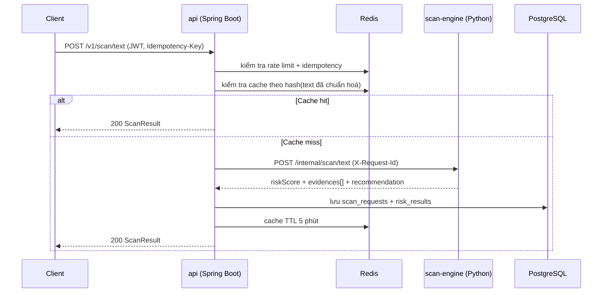
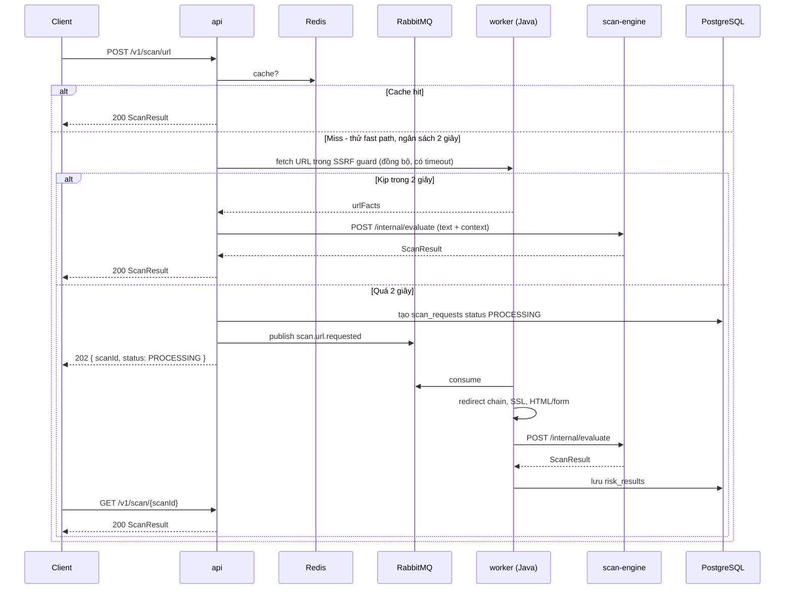
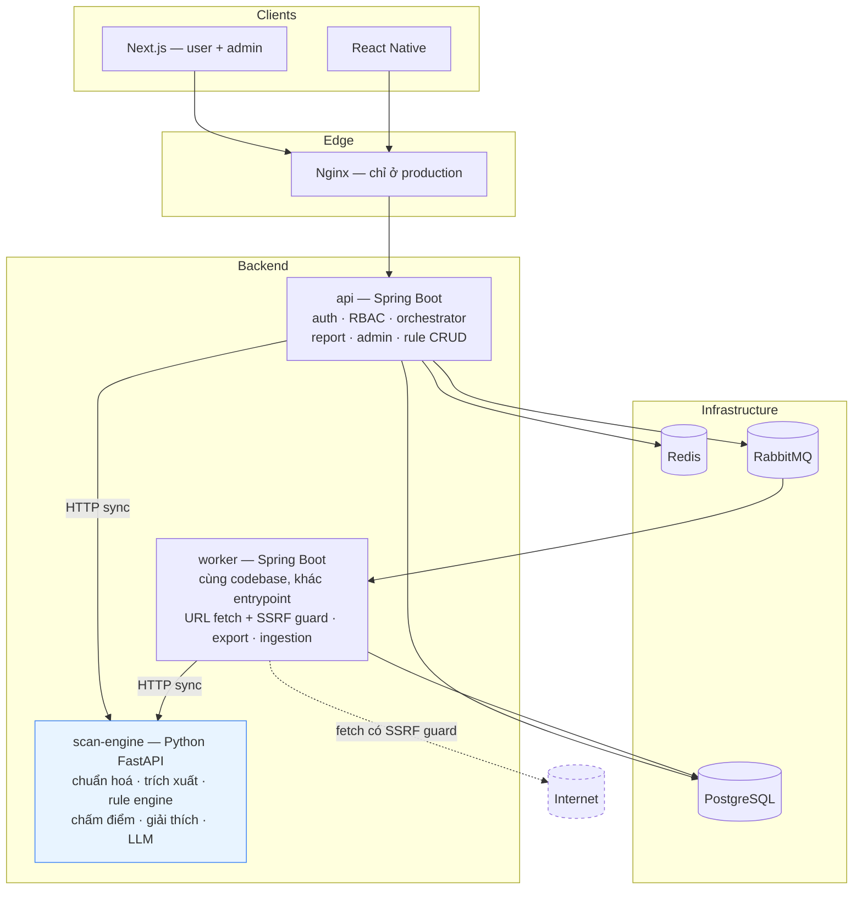

# Kiến trúc hệ thống Anti-Scam Platform — bản v2

**Ngày:** 2026-09-04
**Trạng thái:** Đề xuất, chờ nhóm và giảng viên duyệt
**Thay thế:** một phần [`Week3/01_Thiet_ke_kien_truc/Thiet_ke_kien_truc_he_thong.md`](../../Week3/01_Thiet_ke_kien_truc/Thiet_ke_kien_truc_he_thong.md)
**Liên quan:** [`Week2/02_Phan_Tich_Nghiep_Vu/API_Specification.md`](../../Week2/02_Phan_Tich_Nghiep_Vu/API_Specification.md) · [`Week4/Tong_hop_Feature_List_Week4.md`](../../Week4/Tong_hop_Feature_List_Week4.md)

---

## 1. Vì sao cần bản v2

Bản Week 3 chọn **Modular Monolith + Event-Driven Workers**. Hướng đó vẫn giữ nguyên. Bản v2 chỉ sửa **liều lượng** và **ranh giới**, sau khi có ba dữ kiện mới:

| Dữ kiện mới | Hệ quả |
|---|---|
| Đã có `services/scan-engine` chạy được (Python FastAPI, 16 rule, 23 test xanh) | Hệ thống thành đa ngôn ngữ — phải chốt ranh giới Java/Python trước khi cả nhóm code |
| Đo được text scan tốn **~1-5ms** (CPU thuần, không I/O) | Đẩy `/scan/text` qua message queue là lãng phí, không phải tối ưu |
| Week 4 lộ ra Slice 3 bị trùng người, Slice 4 chưa có chủ | Cần một cơ chế điều phối bằng **contract**, không phải bằng họp |

Ba vấn đề cụ thể của bản Week 3 được sửa trong v2:

1. **"Worker" bị hiểu thành "deployable".** Week 3 liệt kê 6 worker như 6 container. Đó là 6 *module* nghiệp vụ. Một tiến trình worker consume nhiều queue là đủ.
2. **Async bị áp dụng cho cả tác vụ không cần async.** Week 3 để `/scan/text` đi qua RabbitMQ. Việc này thêm 1 round-trip, thêm trạng thái `PROCESSING`, thêm điểm hỏng — để tiết kiệm 5ms.
3. **Chưa có ranh giới ngôn ngữ.** Không chốt thì mỗi người sẽ tự hiểu một kiểu.

---

## 2. Nguyên tắc kiến trúc

Sáu nguyên tắc dưới đây là căn cứ để giải quyết mọi tranh luận thiết kế về sau.

| # | Nguyên tắc | Diễn giải |
|---|---|---|
| **NT-1** | **Async khi caller không cần câu trả lời để phản hồi** | Không phải "async thì hiện đại hơn". Người dùng đang chờ thì phải sync. |
| **NT-2** | **Java sở hữu I/O và trạng thái. Python là hàm thuần.** | Mọi truy cập DB, mạng, file đều ở Java. Python nhận dữ liệu, trả điểm. |
| **NT-3** | **Điểm rủi ro được tính ở đúng một chỗ** | Mọi điểm phải truy ngược được về một `ruleCode`. Không có nguồn điểm thứ hai. |
| **NT-4** | **Contract là nguồn sự thật, không phải code** | OpenAPI trong `contracts/` quyết định DTO. Code phải khớp contract, không phải ngược lại. |
| **NT-5** | **Suy giảm có kiểm soát** | Thành phần phụ chết thì hệ thống mất tính năng, không sập. LLM chết → vẫn có kết quả rule. |
| **NT-6** | **Hoãn mọi thứ chưa dùng tới** | Không dựng hạ tầng cho nhu cầu tưởng tượng. Thêm khi có lý do cụ thể. |

---

## 3. Các quyết định kiến trúc (ADR)

### ADR-01 · Giữ Modular Monolith, không tách microservices

**Quyết định:** giữ nguyên lựa chọn Week 3.
**Lý do:** nhóm 4 người, deploy chung một nhịp, không có nhu cầu scale riêng từng miền. Full microservices (Phương án C của Week 3) sẽ đẩy phần lớn thời gian vào boilerplate và vận hành, kéo trọng tâm khỏi mục tiêu khóa luận.
**Giữ lại trong báo cáo:** phần so sánh 3 phương án của Week 3 vẫn có giá trị học thuật, chỉ không triển khai phương án C.

### ADR-02 · Tách `scan-engine` thành service riêng viết bằng Python

**Quyết định:** lõi phân tích và chấm điểm là một service Python FastAPI độc lập.
**Lý do:**

- Xử lý tiếng Việt (bỏ dấu, leetspeak, chuẩn hoá) và tích hợp LLM về sau thuận lợi hơn hẳn trên Python.
- Service không có DB nên test được bằng `pytest` mà không cần hạ tầng, và chạy được nhiều bản sao.
- Đã có sẵn và đang chạy đúng (mốc M1).

**Đánh đổi chấp nhận:** hai ngôn ngữ, hai CI pipeline, thêm một network hop. Giảm nhẹ bằng ADR-03 — chỉ **một** thành viên cần viết Python.

### ADR-03 · Java sở hữu I/O và trạng thái, Python là hàm thuần

**Quyết định:**

| | Spring Boot (`api`, `worker`) | Python (`scan-engine`) |
|---|---|---|
| Truy cập PostgreSQL / Redis | ✅ | ❌ |
| Gọi mạng ra ngoài (fetch URL, WHOIS) | ✅ | ❌ |
| Xác thực, phân quyền, biết user là ai | ✅ | ❌ |
| Chuẩn hoá, trích xuất thực thể | ❌ | ✅ |
| Đánh giá rule, tính điểm, sinh giải thích | ❌ | ✅ |
| Gọi LLM | ❌ | ✅ |

**Lý do:**

- `scan-engine` không tự gọi mạng ra ngoài nên **không bao giờ trở thành lỗ hổng SSRF** — SSRF guard chỉ cần làm ở một chỗ, trong `worker` Java.
- Khải, Kiên, Thắng vẫn viết Java đúng như kế hoạch Week 4. Chỉ Hùng viết Python.
- Ranh giới "hàm thuần" khiến `scan-engine` deterministic và test được không cần mock.

### ADR-04 · Gọi nội bộ dùng HTTP đồng bộ, không RPC qua message queue

**Quyết định:** `api`/`worker` gọi `scan-engine` bằng HTTP đồng bộ, timeout 2s, có circuit breaker.
**Không làm:** gửi message vào RabbitMQ rồi chờ reply queue.
**Lý do:** RPC qua queue chậm hơn HTTP, cần correlation ID và reply queue riêng, và gần như không debug được khi có sự cố. Queue chỉ dùng cho job dài và event fan-out.

### ADR-05 · Async chỉ đặt ở biên API, và chỉ cho tác vụ có I/O mạng

Xem chi tiết ở [mục 4](#4-sync-hay-async--quyết-định-cho-từng-lời-gọi).

### ADR-06 · Mono-repo

**Quyết định:** toàn bộ services, apps, contracts, infra nằm trong một repository.
**Lý do:**

- Một lệnh `docker compose up` chạy được cả hệ thống.
- Đổi contract thì sửa API + web + mobile trong **một** PR — không lệch version chéo repo.
- Một CI config, một chỗ chạy test.
- Nộp khóa luận: giảng viên clone một lần là chạy được.

**Khi nào multi-repo mới đáng:** khi các team deploy độc lập theo nhịp khác nhau và cần tách quyền truy cập. Không đúng với nhóm này.
**Lưu ý:** mono-repo ≠ monolith. Mỗi service vẫn build và deploy độc lập được.

### ADR-07 · Contract-first bằng OpenAPI

**Quyết định:** `contracts/openapi/` là nguồn sự thật của mọi DTO công khai. Sinh type TypeScript cho web/mobile từ đó.
**Lý do bổ sung:** đây cũng là cơ chế giải quyết vụ **Slice 3 bị trùng người**. Ai muốn đổi hợp đồng API phải sửa file trong `contracts/`, và mọi PR đụng file đó cả nhóm đều thấy. Điều phối bằng contract, không bằng cuộc họp.

### ADR-08 · Hoãn MinIO, Kafka và việc tách 6 worker container

| Hoãn | Lý do | Khi nào xem lại |
|---|---|---|
| **MinIO** | Chỉ cần khi có upload file bằng chứng | Khi Slice 4 (Community Report) bắt đầu |
| **Kafka** | Quá tầm; RabbitMQ đủ cho job queue | Không, trong phạm vi khóa luận |
| **6 worker container** | Là 6 module, không phải 6 tiến trình | Khi có bằng chứng một loại job nghẽn riêng |
| **Nginx ở local dev** | Chỉ cần khi deploy thật | `docker-compose.prod.yml` |

---

## 4. Sync hay async — quyết định cho từng lời gọi

Quy tắc (NT-1): **async khi caller không cần câu trả lời để phản hồi.**

| Lời gọi | Kiểu | Độ trễ dự kiến | Lý do |
|---|---|---|---|
| Client → `POST /v1/scan/text` | **Sync** | ~5ms | CPU thuần, người dùng đang chờ |
| Client → `POST /v1/scan/phone` · `/bank-account` | **Sync** | ~20ms | 1 truy vấn DB + cache Redis |
| Client → `POST /v1/scan/qr` | **Tuỳ nội dung** | — | QR chứa text → sync; chứa URL → theo luồng URL |
| Client → `POST /v1/scan/url` | **Sync-first, escalate** | 5ms – 15s | Fetch mạng, redirect, SSL |
| `api` → `scan-engine` | **Sync HTTP** | ~5ms | Là lời gọi hàm qua mạng, không I/O |
| `worker` → LLM | **Sync trong worker** | 1–3s | Đã nằm trong luồng async, không cần async lồng async |
| Report `VERIFIED` → cập nhật `risk_entities` | **Async (event)** | — | Không ai đợi kết quả |
| Export PDF · nạp threat feed · gửi email | **Async** | — | Chậm, fire-and-forget |

### 4.1. Luồng đồng bộ — `POST /v1/scan/text`



Không có queue, không có `scanId` để poll, không có trạng thái `PROCESSING`.

### 4.2. Luồng sync-first có leo thang — `POST /v1/scan/url`

Đây là pattern chính của bản v2, và là mục kỹ thuật đáng viết vào báo cáo.



**Hợp đồng client:** mọi endpoint `POST /v1/scan/*` đều có thể trả `200` (có kết quả) hoặc `202` (có `scanId`). Client xử lý được cả hai. Nhờ vậy sau này đổi một endpoint từ sync sang async không phải sửa client.

---

## 5. Thành phần và ranh giới

### 5.1. Ba đơn vị triển khai



| Đơn vị | Ngôn ngữ | Sở hữu trạng thái | Ra được Internet |
|---|---|---|---|
| `api` | Spring Boot | PostgreSQL, Redis | Không |
| `worker` | Spring Boot | PostgreSQL | **Có** (duy nhất, trong SSRF guard) |
| `scan-engine` | Python FastAPI | **Không có** | **Không** |

Chỉ **một** thành phần được gọi ra Internet. Điều đó khiến SSRF guard chỉ phải làm và kiểm thử ở một chỗ.

### 5.2. Hợp đồng nội bộ giữa Java và Python

`scan-engine` không tra cứu dữ liệu. Khi cần dữ kiện từ DB hoặc từ mạng, Java lấy trước rồi truyền vào.

```
Giai đoạn 1   POST /internal/extract    { text }
              → { urls, phoneNumbers, bankAccounts, amounts, otpCodes }

Giai đoạn 2   (Java: tra risk_entities, fetch URL, đo tuổi tên miền...)

Giai đoạn 3   POST /internal/evaluate   { text, context: { entityHits, urlFacts, domainAgeDays } }
              → { riskScore, riskLevel, evidences[], recommendation }
```

Điểm luôn được tính ở đúng một chỗ (NT-3). Đây là bất biến mà test `test_every_point_traces_back_to_a_rule` trong `scan-engine` đang khoá lại — giữ được nó thì khi thêm lớp LLM, mô hình không thể lén thay đổi điểm số.

**Lộ trình áp dụng:** mốc M1–M3 dùng một endpoint `POST /internal/scan/text` như hiện tại. Chỉ tách `extract` / `evaluate` khi thực sự có enrichment từ DB (mốc M4).

### 5.3. Lớp LLM nằm ở đâu

LLM là một module **bên trong** `scan-engine`, sau feature flag `ai.enabled`:

- Rule engine quyết định `riskScore` và `riskLevel`. LLM **không** được đổi hai giá trị này.
- LLM đóng góp: nhãn loại lừa đảo, bắt biến thể lách rule, và viết `explanation` / `recommendation` bằng tiếng Việt tự nhiên.
- Nếu LLM đóng góp điểm thì phải thành một evidence riêng, `source: "llm"`, có trần cứng (đề xuất ±15 điểm).
- LLM lỗi hoặc hết quota → bỏ qua, trả kết quả rule (NT-5).
- Dữ liệu nhạy cảm (số tài khoản, OTP, số điện thoại) phải được che trước khi gửi ra API bên ngoài.

---

## 6. Bố cục mono-repo

```
KLTN-Scam-Risk-Detector/
├── services/
│   ├── api/                  # Spring Boot — nghiệp vụ, DB, auth
│   ├── worker/               # dùng chung codebase api, entrypoint khác
│   └── scan-engine/          # Python FastAPI — ĐÃ CÓ (mốc M1)
│       ├── app/
│       ├── tests/
│       └── postman/
├── apps/
│   ├── web/                  # Next.js — user + admin dashboard
│   └── mobile/               # React Native
├── contracts/
│   └── openapi/              # NGUỒN SỰ THẬT của mọi DTO công khai
├── infra/
│   ├── docker-compose.yml         # dev
│   ├── docker-compose.prod.yml    # EC2 / VPS
│   └── nginx/
├── document/                 # tài liệu khóa luận
└── specs/                    # Spec Kit
```

---

## 7. Lộ trình tích hợp

Mỗi mốc phải có một bằng chứng chạy được — không nhận "đã code xong" nếu không demo được.

| Mốc | Nội dung | Bằng chứng |
|---|---|---|
| **M1** ✅ | `scan-engine` chạy độc lập, rule engine giải thích được | Postman 16 request xanh, pytest 23/23 |
| **M2** | `docker compose up` (postgres + redis + scan-engine). `api` skeleton + auth. `api` gọi `scan-engine` sync | login lấy JWT → `/scan/text` → có bản ghi trong `scan_requests` |
| **M3** | Next.js gọi `api`. Lịch sử scan, `GET /v1/scan/{scanId}` | Web → api → scan-engine end-to-end |
| **M4** | RabbitMQ + `worker`, **chỉ cho `/scan/url`**. SSRF guard | `202` + poll ra kết quả; scan `169.254.169.254` bị chặn |
| **M5** | LLM trong `scan-engine` sau flag. Đo Precision/Recall rule-only vs hybrid | Bật/tắt flag, so hai response trên cùng input |
| **M6** | Community Report → duyệt → `risk_entities` | Duyệt report xong, scan lại thấy điểm thay đổi |

**RabbitMQ chỉ xuất hiện ở M4.** Trước đó không dựng — theo NT-6.

---

## 8. Chuẩn vận hành

Sáu điều dưới đây là phần "chuẩn doanh nghiệp" ở quy mô này. Không cần nhiều hơn.

| # | Yêu cầu | Cách làm |
|---|---|---|
| 1 | **Contract-first** | OpenAPI trong `contracts/`, sinh type TS cho web/mobile |
| 2 | **Correlation ID** | `X-Request-Id` truyền qua mọi hop (api → queue → worker → scan-engine), ghi vào mọi log. Không có nó thì không debug được luồng async |
| 3 | **Idempotency** | `Idempotency-Key` trên mọi `POST /v1/scan/*`, lưu Redis TTL 24h; trùng key khác request hash → `409` |
| 4 | **Suy giảm có kiểm soát** | Timeout + circuit breaker (Resilience4j) khi gọi `scan-engine`. LLM chết → vẫn trả kết quả rule |
| 5 | **Endpoint nội bộ không ra Internet** | `/internal/*` chỉ nghe trong docker network; Nginx không proxy tới |
| 6 | **Cấu hình qua biến môi trường** | Không hardcode connection string, không commit khoá API |

Bổ sung nên có: `/health` (liveness) và `/ready` (readiness) trên cả ba service — `scan-engine` đã có `/health`.

---

## 9. Ảnh hưởng tới phân công Week 4

Bản v2 **không** thay đổi vertical slice của ai. Chỉ làm rõ mỗi người viết ngôn ngữ nào:

| Slice | Người | Ngôn ngữ | Ghi chú |
|---|---|---|---|
| (1) Auth & User | Hùng | Spring Boot | Không đổi |
| (2) Scan URL & SSRF guard | Khải | Spring Boot (`worker`) | Fetch mạng ở Java — đúng như kế hoạch |
| (3a) Rule Engine + Text Analyzer | Kiên | **cần chốt** | Xem ghi chú bên dưới |
| (3b) Entity Checker + QR Parser | Thắng | Spring Boot (`api`) | Tra `risk_entities` là truy cập DB → Java |
| (4) Community Report + Admin | **chưa có chủ** | Spring Boot | Vẫn là rủi ro tiến độ lớn nhất |
| `scan-engine` (chấm điểm + LLM) | Hùng | Python | Một người giữ, ranh giới hẹp |

**Hai việc phải chốt trong buổi họp gần nhất:**

1. **Slice 3a của Kiên.** Rule Engine hiện đã nằm trong `scan-engine` (Python). Hai lựa chọn: (a) Kiên viết Python cùng phần rule, hoặc (b) Kiên nhận phần Rule **Admin** ở Java — CRUD rule, quản lý weight, audit log, trang admin quản lý rule, và `scan-engine` nạp rule từ DB thay vì từ file. Phương án (b) giữ Kiên ở Java và vẫn là một slice trọn vẹn.
2. **Slice 4 vẫn chưa có người.** Community Report là nguồn dữ liệu cho `risk_entities` — đầu vào chấm điểm của cả URL, Phone và Bank. Nếu không ai làm thì bảng đó rỗng và toàn bộ phần tra cứu thực thể không có gì để tra.

---

## 10. Rủi ro và cách giảm

| Rủi ro | Mức | Giảm thiểu |
|---|---|---|
| Slice 4 không có người → `risk_entities` rỗng | **Cao** | Chốt người trong tuần này; tạm thời seed dữ liệu mẫu từ file để demo |
| Hai ngôn ngữ làm chậm nhóm | Trung bình | Chỉ 1 người viết Python; ranh giới hẹp và cố định (ADR-03) |
| `scan-engine` chết kéo sập tính năng scan | Trung bình | Stateless nên chạy 2 replica; circuit breaker; `api` trả `503` có thông điệp rõ |
| Trọng số rule chưa có cơ sở thống kê | **Cao** *(với hội đồng)* | Gán nhãn tập dữ liệu thật ở M5, báo cáo Precision/Recall/F1 |
| Free tier LLM hết quota giữa buổi bảo vệ | Trung bình | Feature flag tắt được; chuẩn bị Ollama self-host làm phương án dự phòng |
| Dựng RabbitMQ quá sớm làm chậm M2–M3 | Thấp | Hoãn tới M4 theo NT-6 |

---

## 11. Những gì bản v2 không đổi so với Week 3

Để tránh hiểu nhầm là làm lại từ đầu:

- Modular Monolith + Event-Driven Workers — **giữ nguyên**.
- PostgreSQL là DB chính, dùng `JSONB` cho `risk_results` — **giữ nguyên**.
- Redis cho cache, rate limit, idempotency, distributed lock — **giữ nguyên**.
- RabbitMQ cho MVP, không Kafka — **giữ nguyên**.
- Next.js một project cho cả user và admin, RBAC theo route — **giữ nguyên**.
- React Native + Expo, không đọc SMS/notification/call log ngầm — **giữ nguyên**.
- Deploy Docker Compose trên EC2 hoặc VPS — **giữ nguyên**.
- Hợp đồng JSON `riskScore` / `riskLevel` / `evidences[]` / `recommendation` theo API Specification Week 2 — **giữ nguyên**.

---

*Người soạn: Hùng · Chờ nhóm và giảng viên duyệt · Phiên bản 2.0*
