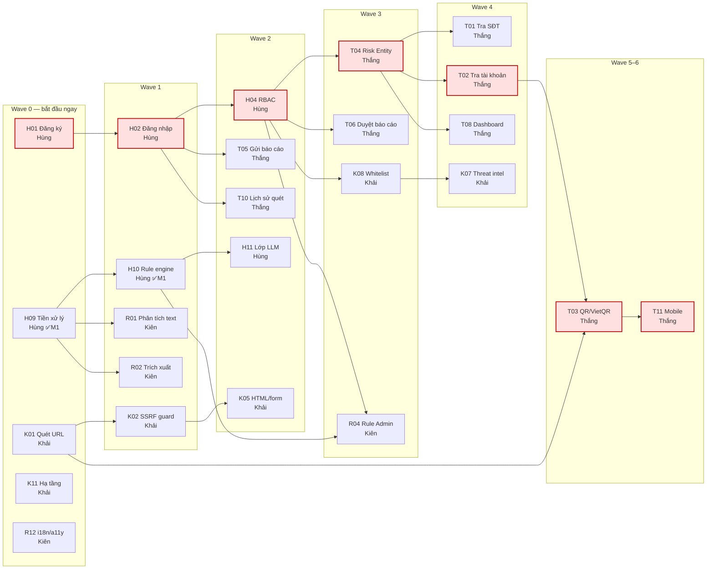
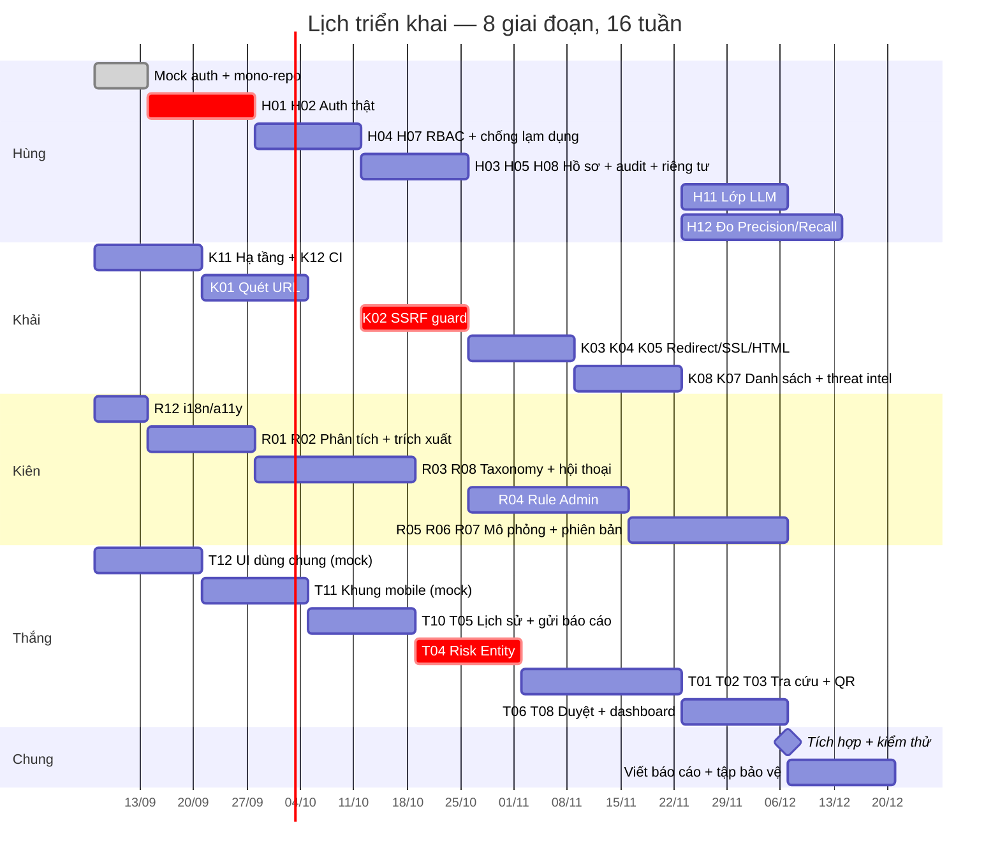

# Kế hoạch phát triển — Anti-Scam Platform

**Ngày:** 2026-09-06
**Căn cứ:** [`Danh_sach_tinh_nang_toan_he_thong.md`](../02_Danh_sach_tinh_nang/Danh_sach_tinh_nang_toan_he_thong.md) (48 nhóm · 353 tính năng) · [`Kien_truc_he_thong_v2.md`](../01_Kien_truc_v2/Kien_truc_he_thong_v2.md)
**Phương pháp:** đồ thị phụ thuộc giữa 48 nhóm được tính bằng máy — phân lớp topo, đường găng, điểm phối hợp chéo. Không có nhóm nào tạo chu trình.

---

## 1. Tóm tắt điều hành

Bốn kết luận quan trọng nhất, tất cả rút ra từ đồ thị phụ thuộc chứ không phải cảm tính:

| # | Kết luận | Hệ quả |
|---|---|---|
| **1** | **H01 (Đăng ký tài khoản) chặn 25 trong 48 nhóm, thuộc cả 4 người** | Nếu H01 trễ 1 tuần, cả nhóm trễ 1 tuần. Phải gỡ nút này trước tiên. |
| **2** | **Thắng không có việc nào ở Wave 0 và Wave 1** | Nếu làm đúng thứ tự phụ thuộc, Thắng ngồi chờ ~2–3 tuần đầu. Phải đảo việc cho anh ấy. |
| **3** | **Đường găng dài 7 nhóm: H01 → H02 → H04 → T04 → T02 → T03 → T11** | Đây là chuỗi không thể rút ngắn bằng cách thêm người. Nó quyết định thời gian tối thiểu của dự án. |
| **4** | **Chỉ có 12 điểm phụ thuộc chéo người** | Mức ghép nối thấp — chia việc tốt. Chốt xong 12 hợp đồng API này là bốn người chạy song song được gần như hoàn toàn. |

### Hai hành động phải làm ngay trong tuần này

> **Hành động 1 — Dựng auth giả (mock auth) trước khi làm auth thật.**
> Một endpoint dev cấp JWT cố định cho user `test` và `admin`, bật bằng biến môi trường `AUTH_MOCK=true`.
> Chi phí: nửa ngày của Hùng. Lợi ích: **gỡ 25 nhóm ra khỏi trạng thái chờ**, ba người còn lại bắt đầu ngay ngày đầu tiên.

> **Hành động 2 — Đảo thứ tự việc của Thắng.**
> Cho Thắng làm T12 (thư viện UI dùng chung) và T11 (khung ứng dụng mobile) trước, **chạy trên dữ liệu giả**, không chờ backend. Đây là việc hoàn toàn không phụ thuộc API.

---

## 2. Nguyên tắc lập kế hoạch

| # | Nguyên tắc | Diễn giải |
|---|---|---|
| KH-1 | **Wave là lớp phụ thuộc, không phải hộp thời gian** | Không ai phải chờ cả wave xong mới làm tiếp. Mỗi người có chuỗi riêng, cứ hết việc trước là làm việc sau. |
| KH-2 | **Hợp đồng trước, code sau** | Nhóm phụ thuộc nhau thì chốt schema trong `contracts/openapi/` trước, rồi hai bên code song song với mock. |
| KH-3 | **Chặn thì mock, đừng chờ** | Chờ người khác là lãng phí duy nhất không có lý do chính đáng. Luôn có phiên bản giả để đi tiếp. |
| KH-4 | **Mỗi giai đoạn kết thúc bằng thứ chạy được** | Không nhận "đã code xong". Phải demo được bằng Postman, curl, hoặc giao diện thật. |
| KH-5 | **Khoá phạm vi ở `P0` trước** | 103 tính năng `P0` là mục tiêu. `P1` chỉ làm khi `P0` của cả nhóm đã xong. |
| KH-6 | **Ưu tiên nhóm chặn nhiều người** | Khi phải chọn giữa hai việc, làm việc đang chặn người khác trước. |

---

## 3. Đồ thị phụ thuộc

48 nhóm quá dày để vẽ hết. Sơ đồ dưới chỉ giữ **các nhóm nằm trên đường găng và các nhóm chặn người khác** — phần còn lại chạy song song tự do.



*Ô viền đỏ là đường găng.*

---

## 4. Bảy lớp song song (Wave)

Các nhóm **cùng một wave không phụ thuộc nhau**, làm song song được.

| Wave | Hùng | Khải | Kiên | Thắng | Tổng |
|---|---|---|---|---|---|
| **0** | H01, H09 | K01, K11 | R12 | — | 5 |
| **1** | H02, H10 | K02, K06, K10, K12 | R01, R02 | — | 8 |
| **2** | H03, H04, H06, H07, H11 | K03, K04, K05, K09 | R03, R08 | T05, T10 | 13 |
| **3** | H05, H08, H12 | K08 | R04, R09 | T04, T06, T12 | 9 |
| **4** | — | K07 | R05, R06, R07, R10, R11 | T01, T02, T07, T08, T09 | 11 |
| **5** | — | — | — | T03 | 1 |
| **6** | — | — | — | T11 | 1 |

**Đọc bảng này thế nào:** Hùng hết việc ở Wave 3, Khải ở Wave 4, còn Thắng phải chạy tới Wave 6. Nghĩa là **cuối dự án Thắng sẽ là người bị dồn việc**, trong khi Hùng và Khải rảnh dần. Mục 8 xử lý việc này.

---

## 5. Đường găng

```
H01 Đăng ký  →  H02 Đăng nhập  →  H04 RBAC  →  T04 Risk Entity  →  T02 Tra tài khoản  →  T03 QR/VietQR  →  T11 Mobile
   Hùng            Hùng             Hùng          Thắng                Thắng                Thắng             Thắng
```

**7 nhóm nối tiếp nhau. Thêm người vào cũng không rút ngắn được** — đây là giới hạn dưới về thời gian của dự án.

### Cách rút ngắn thật sự

| Cách | Rút được | Chi phí |
|---|---|---|
| **Mock auth** — T04, T05, T06, T10 khởi động không cần H01/H02/H04 xong | **Cắt 3 mắt xích đầu** → đường găng còn 4 | Nửa ngày |
| **Tách T04** — bảng `risk_entities` + API tra cứu làm trước, trang admin làm sau | Cho T01/T02 chạy sớm hơn ~1 tuần | Không |
| **T03 dùng dữ liệu VietQR mẫu** — không chờ T02 hoàn chỉnh | Cho T03 chạy song song T02 | Không |
| **T11 làm khung mobile từ đầu** — màn hình + điều hướng chạy trên mock | Bỏ T11 khỏi đường găng | Không |

Áp cả 4 cách thì đường găng thực tế **rút từ 7 xuống còn 4 nhóm**.

---

## 6. Lịch triển khai theo giai đoạn

Bảy sprint, mỗi sprint 2 tuần. **Ngày dưới đây là giả định — thay bằng ngày thật khi biết lịch bảo vệ.** Cột "Mốc" ánh xạ sang các mốc M1–M6 của tài liệu kiến trúc.

| Sprint | Thời gian | Mốc | Mục tiêu | Bằng chứng nghiệm thu |
|---|---|---|---|---|
| **S0** | 07/09 – 13/09 | — | Chuẩn bị: mono-repo, mock auth, chốt 12 hợp đồng API | `docker compose up` chạy; 3 người kia lấy được JWT giả |
| **S1** | 14/09 – 27/09 | M2 | Auth thật + DB + api gọi scan-engine | Đăng ký → đăng nhập → `/scan/text` → có bản ghi trong `scan_requests` |
| **S2** | 28/09 – 11/10 | M3 | Web quét URL/text, lịch sử quét, RBAC | Web → api → scan-engine chạy thông; user thường bị chặn `/admin` |
| **S3** | 12/10 – 25/10 | M4 | URL scan bất đồng bộ + SSRF guard + Risk Entity | `202` + poll ra kết quả; scan `169.254.169.254` bị chặn |
| **S4** | 26/10 – 08/11 | M5 | Tra cứu SĐT/tài khoản/QR + Rule Admin | Duyệt 1 báo cáo → scan lại thấy điểm đổi |
| **S5** | 09/11 – 22/11 | M6 | Báo cáo cộng đồng + kiểm duyệt + dashboard | Vòng dữ liệu khép kín: báo cáo → duyệt → entity → điểm |
| **S6** | 23/11 – 06/12 | — | Lớp LLM + đo Precision/Recall + mobile | Bật/tắt `ai.enabled` so 2 kết quả; app mobile quét được QR |
| **S7** | 07/12 – 20/12 | — | Hoàn thiện, kiểm thử, viết báo cáo, tập bảo vệ | Chạy trên VPS; toàn bộ `P0` xong |

### Sơ đồ Gantt



---

## 7. Mười hai điểm phối hợp chéo người

Đây là **toàn bộ** chỗ hai người phải nói chuyện với nhau. Chốt xong 12 hợp đồng này thì bốn người chạy độc lập.

| # | Nhóm cần | Người cần | Phụ thuộc | Người cung cấp | Cần chốt cái gì trước |
|---|---|---|---|---|---|
| 1 | K08 Whitelist/Blacklist | Khải | H04 RBAC | Hùng | Cách đọc vai trò từ JWT |
| 2 | R01 Phân tích nội dung | Kiên | H09 Tiền xử lý | Hùng | Hàm chuẩn hoá trả về gì |
| 3 | R02 Trích xuất thực thể | Kiên | H09 Tiền xử lý | Hùng | Định dạng entity trả về |
| 4 | R04 Rule Admin | Kiên | H04 RBAC | Hùng | Quyền `ADMIN` trên route rule |
| 5 | R04 Rule Admin | Kiên | H10 Rule engine | Hùng | Schema bảng `risk_rules` / `rule_conditions` |
| 6 | R10 Trợ lý hỏi đáp | Kiên | H11 Lớp LLM | Hùng | Interface `LlmProvider` |
| 7 | T03 QR/VietQR | Thắng | K01 Quét URL | Khải | Hợp đồng gọi URL scan nội bộ |
| 8 | T04 Risk Entity | Thắng | H04 RBAC | Hùng | Quyền `ADMIN` trên route entity |
| 9 | T05 Gửi báo cáo | Thắng | H02 Đăng nhập | Hùng | Lấy `userId` từ Security Context |
| 10 | T06 Duyệt báo cáo | Thắng | H04 RBAC | Hùng | Vai trò `ADMIN` / `MODERATOR` |
| 11 | T08 Dashboard | Thắng | H04 RBAC | Hùng | Quyền `ADMIN` |
| 12 | T10 Lịch sử quét | Thắng | H02 Đăng nhập | Hùng | Kiểm tra quyền sở hữu bản ghi |

**Nhận xét:** 9 trong 12 điểm đều trỏ về Hùng (H02, H04, H09, H10, H11). Đây là bằng chứng số học cho kết luận ở mục 1 — **Hùng là nút cổ chai của cả nhóm**. Hùng nên hoàn thành và công bố hợp đồng của H02/H04 trong Sprint S0–S1, kể cả khi phần thân chưa xong.

---

## 8. Cân bằng khối lượng

Vấn đề đã phát hiện ở [danh sách tính năng](../02_Danh_sach_tinh_nang/Danh_sach_tinh_nang_toan_he_thong.md), nay có thêm dữ liệu wave xác nhận:

| Người | `P0` | Wave cuối | Vấn đề |
|---|---|---|---|
| Hùng | 32 | 3 | Dồn việc **đầu** dự án, rảnh về sau |
| Khải | 27 | 4 | Cân đối |
| Kiên | 13 | 4 | **Nhẹ nhất** — lõi rule đã xong ở M1 |
| Thắng | 31 | 6 | Dồn việc **cuối** dự án, nặng nhất |

### Đề xuất điều chỉnh

| Việc | Từ | Sang | Lý do |
|---|---|---|---|
| **T04 Risk Entity** | Thắng | **Kiên** | T04 nằm trên đường găng và chặn T01/T02/T08. Kiên đang nhẹ nhất và rảnh đúng lúc T04 cần khởi động (Wave 3). |
| **T08 Dashboard quản trị** | Thắng | **Kiên** | Wave 4 — Kiên còn chỗ trống, Thắng thì đang gánh T01/T02/T03. |
| **H12 Đo Precision/Recall** | Hùng | giữ nguyên, **Kiên hỗ trợ gán nhãn dữ liệu** | Gán nhãn 300–500 mẫu là việc tốn thời gian, không nên để một người làm. |

Sau điều chỉnh: Kiên 13 → ~24 `P0`, Thắng 31 → ~20 `P0`. Khối lượng cân hơn hẳn và đường găng ngắn lại vì T04 không còn phải xếp hàng sau T05/T10 của Thắng.

---

## 9. Cái gì làm song song được, cái gì không

### Làm song song được ngay từ ngày đầu

- **Bốn hướng hoàn toàn độc lập:** hạ tầng/CI của Khải (K11, K12) · tiền xử lý + rule của Hùng (H09, H10 — đã xong M1) · i18n/a11y của Kiên (R12) · UI dùng chung + khung mobile của Thắng (T12, T11 với mock).
- **Frontend và backend của cùng một tính năng** — nếu đã chốt schema trong `contracts/openapi/`, người làm web dùng mock server đi trước, không chờ API thật.
- **Viết test và viết code** — bộ test nghiệp vụ (như 12 case của scan-engine) viết được trước khi có implementation.

### Bắt buộc nối tiếp, không song song được

| Chuỗi | Vì sao |
|---|---|
| H01 → H02 → H04 | Không thể phân quyền khi chưa có phiên đăng nhập, không thể có phiên khi chưa có tài khoản |
| K01 → K02 → K03/K04/K05 | Phải chuẩn hoá URL rồi mới fetch an toàn, fetch được rồi mới phân tích nội dung |
| T04 → T01/T02 | Không tra cứu được thực thể khi bảng `risk_entities` chưa tồn tại |
| T05 → T06 → T04 | Phải có báo cáo mới có gì để duyệt; duyệt xong mới sinh entity |
| H10 → H11 | LLM là lớp phủ lên rule engine, không thể có trước |
| R04 → R05 → R06 | Phải có CRUD rule mới mô phỏng được; mô phỏng được mới đánh phiên bản có ý nghĩa |

### Bẫy song song hoá cần tránh

> Đừng để hai người cùng sửa một file `contracts/openapi/`. Chốt schema trong một buổi họp ngắn, một người ghi, rồi cả hai code theo. Sửa đồng thời là nguồn xung đột lớn nhất trong mono-repo.

---

## 10. Rủi ro tiến độ

| Rủi ro | Mức | Dấu hiệu sớm | Xử lý |
|---|---|---|---|
| **H01/H02 trễ → 25 nhóm chờ** | **Cao** | Hết tuần S0 chưa có mock auth | Mock auth là bắt buộc, không phải tuỳ chọn |
| **Thắng bị dồn việc cuối kỳ** | **Cao** | Sang S4 mà T04 chưa xong | Chuyển T04, T08 sang Kiên ngay từ S0 |
| **Trùng lặp code do không chốt contract** | Trung bình | Hai người cùng viết một DTO | Áp KH-2: hợp đồng trước, code sau |
| **Free tier LLM hết quota lúc bảo vệ** | Trung bình | — | `ai.enabled=false` vẫn chạy đủ; chuẩn bị Ollama cục bộ |
| **Ôm quá nhiều `P1`/`P2`** | **Cao** | Cuối S4 mà `P0` chưa xong | Rà soát cuối mỗi sprint, cắt thẳng tay |
| **SSRF guard làm ẩu** | Cao *(rủi ro bảo mật)* | Không có test tấn công | K02 phải có bộ test tấn công mới được nghiệm thu |
| **Tích hợp dồn vào cuối** | **Cao** | Hết S3 vẫn chưa chạy end-to-end | Mỗi sprint phải demo được xuyên suốt, không demo từng phần rời |

---

## 11. Điều kiện nghiệm thu từng sprint

Không nhận "đã code xong". Mỗi sprint phải demo được đúng một kịch bản:

| Sprint | Kịch bản demo bắt buộc |
|---|---|
| S0 | `docker compose up` → `curl /health` cả 3 service trả `UP`; ba người lấy được JWT giả |
| S1 | Đăng ký → đăng nhập → gọi `/v1/scan/text` bằng token thật → thấy bản ghi trong `scan_requests` |
| S2 | Trên web: đăng nhập → quét một tin nhắn → xem kết quả → mở lịch sử → user thường vào `/admin` bị chặn |
| S3 | Quét `http://vietc0mbank.com` → `202` + `scanId` → poll ra `DANGER`; quét `169.254.169.254` bị SSRF guard chặn |
| S4 | Tra một số điện thoại có trong `risk_entities` → ra `CAUTION`; quét QR VietQR → nhận diện đúng số tài khoản |
| S5 | Gửi báo cáo → admin duyệt → `risk_entities` cập nhật → quét lại thấy điểm tăng |
| S6 | Cùng một tin nhắn, bật/tắt `ai.enabled`, so hai response; app mobile quét QR bằng camera |
| S7 | Chạy trên VPS qua HTTPS; toàn bộ `P0` xong; báo cáo có số liệu Precision/Recall |

---

## 12. Việc cần làm ngay tuần này

- [ ] **Hùng** — dựng mock auth (`AUTH_MOCK=true`), công bố hợp đồng JWT cho cả nhóm
- [ ] **Khải** — dựng mono-repo theo bố cục ADR-06, `docker-compose.yml` với postgres + redis + scan-engine
- [ ] **Cả nhóm** — họp 1 buổi chốt 12 hợp đồng API ở mục 7, ghi vào `contracts/openapi/`
- [ ] **Cả nhóm** — chốt điều chỉnh khối lượng ở mục 8 (T04, T08 chuyển sang Kiên)
- [ ] **Cả nhóm** — thay ngày giả định ở mục 6 bằng ngày thật, căn theo lịch bảo vệ
- [ ] **Kiên** — bắt đầu R12 (i18n/a11y), là nhóm duy nhất không phụ thuộc ai
- [ ] **Thắng** — bắt đầu T12 (UI dùng chung) trên dữ liệu giả, không chờ backend

---

*Người soạn: Hùng · Ngày 2026-09-06 · Chờ nhóm rà soát và chốt lịch*
