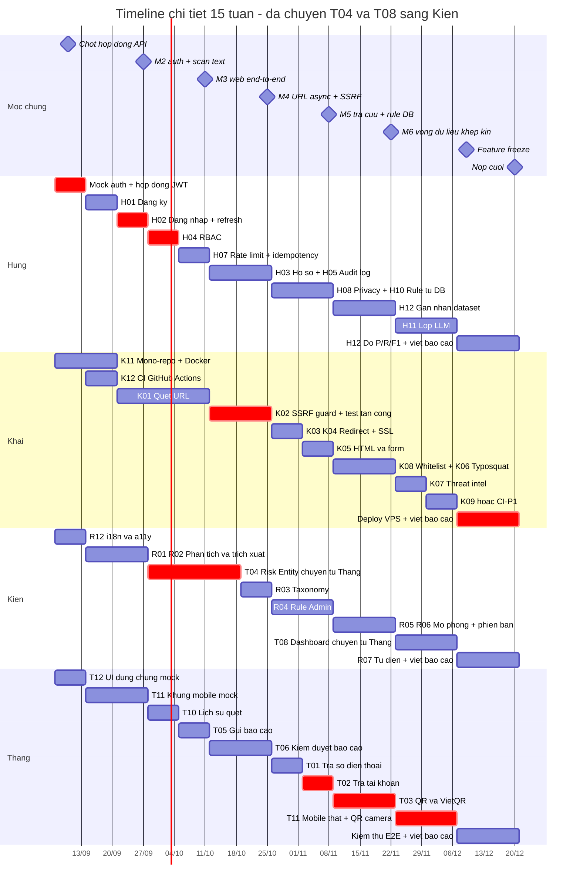

# Timeline chi tiết theo tuần — Anti-Scam Platform

**Ngày soạn:** 2026-09-07
**Phạm vi:** 15 tuần làm việc (07/09/2026 → 20/12/2026) + 1 tuần dự phòng
**Căn cứ:** [`Ke_hoach_phat_trien.md`](../03_Ke_hoach_phat_trien/Ke_hoach_phat_trien.md) · [`Danh_sach_tinh_nang_toan_he_thong.md`](../02_Danh_sach_tinh_nang/Danh_sach_tinh_nang_toan_he_thong.md) · [`Kien_truc_he_thong_v2.md`](../01_Kien_truc_v2/Kien_truc_he_thong_v2.md)

> **Quan hệ với `Ke_hoach_phat_trien.md`:** tài liệu kia trả lời *"làm theo thứ tự nào và vì sao"*. Tài liệu này trả lời *"ai phải nộp cái gì, vào ngày nào"*. Khi hai tài liệu mâu thuẫn, tài liệu này thắng về **ngày**, tài liệu kia thắng về **thứ tự phụ thuộc**.

---

## 0. Ba giả định đã áp dụng — phải xác nhận trong buổi họp đầu tiên

| # | Giả định | Nếu sai thì sao |
|---|---|---|
| 1 | **Ngày bắt đầu 07/09/2026, bảo vệ khoảng cuối 12/2026.** | Đổi ngày bắt đầu → dịch toàn bộ bảng, giữ nguyên số tuần tương đối. |
| 2 | **Đã áp dụng điều chỉnh khối lượng ở mục 8 kế hoạch: T04 Risk Entity và T08 Dashboard chuyển từ Thắng sang Kiên.** Các dòng liên quan đánh dấu ⚠. | Nếu nhóm không chốt chuyển, Thắng gánh thêm ~11 `P0` ở W04–W07 và W12–W13 — đường găng dài thêm khoảng 2 tuần. |
| 3 | **Mỗi người làm được ~15–20 giờ/tuần** (còn học môn khác). Deadline dưới đây tính theo nhịp đó, không phải nhịp full-time. | Nếu ai chỉ làm được dưới 10 giờ/tuần thì phải cắt `P1` của người đó ngay từ W01, đừng đợi tới W12. |

---

## 1. Nhịp làm việc cố định trong tuần

Deadline không chỉ là "cuối tuần". Mỗi tuần có 4 mốc cứng, lặp lại y hệt suốt 15 tuần:

| Thời điểm | Ai | Phải xong việc gì | Nộp ở đâu |
|---|---|---|---|
| **Thứ 2, 20:00** | Cả nhóm | Standup 20 phút: tuần trước xong gì, tuần này làm gì, đang bị chặn bởi ai | Biên bản trong `document/WeekNN/` |
| **Thứ 6, 17:00** | Từng người | **Code freeze tuần** — mở Pull Request, CI xanh | GitHub PR |
| **Thứ 7, 12:00** | Người review chéo | Review xong PR được phân công, `Approve` hoặc ghi rõ việc cần sửa | GitHub PR review |
| **Chủ nhật, 21:00** | Từng người | Nộp **Báo cáo tính năng** (nếu đóng một nhóm `Hxx/Kxx/Rxx/Txx`) + **Báo cáo tuần cá nhân** | `document/WeekNN/BaoCao/` |

**Cặp review chéo cố định** — để không ai review chính mình, và để mỗi người buộc phải đọc code người khác:

| Người viết | Người review | Lý do ghép |
|---|---|---|
| Hùng | Khải | Auth và hạ tầng đụng nhau ở cấu hình, biến môi trường, Docker |
| Khải | Thắng | SSRF guard và QR/URL của Thắng dùng chung tầng fetch |
| Kiên | Hùng | Rule Admin (Java) phải khớp rule engine (Python) của Hùng |
| Thắng | Kiên | Risk Entity của Kiên là đầu vào tra cứu của Thắng |

**Quy tắc trễ hạn:** trễ quá **48 giờ** so với bảng dưới thì phải báo trong nhóm chat **trước** khi deadline tới, kèm ngày mới và lý do. Trễ im lặng nghiêm trọng hơn trễ có báo, vì nó làm hỏng kế hoạch của người đang chờ mình.

---

## 2. Bản đồ 15 tuần

| Tuần | Ngày | Sprint | Mốc kiến trúc | Trọng tâm của cả nhóm |
|---|---|---|---|---|
| **W01** | 07/09 – 13/09 | S0 | — | Mock auth · mono-repo · chốt 12 hợp đồng API |
| **W02** | 14/09 – 20/09 | S1 | M2 | Đăng ký · Docker Compose · CI · trích xuất thực thể |
| **W03** | 21/09 – 27/09 | S1 | **M2 ✔** | Đăng nhập thật · `api` gọi `scan-engine` |
| **W04** | 28/09 – 04/10 | S2 | M3 | RBAC · quét URL · bảng `risk_entities` · lịch sử quét |
| **W05** | 05/10 – 11/10 | S2 | **M3 ✔** | Chống lạm dụng · gửi báo cáo · web end-to-end |
| **W06** | 12/10 – 18/10 | S3 | M4 | SSRF guard · hồ sơ · admin entity · hàng đợi duyệt |
| **W07** | 19/10 – 25/10 | S3 | **M4 ✔** | Test tấn công SSRF · audit log · duyệt báo cáo |
| **W08** | 26/10 – 01/11 | S4 | M5 | Redirect/SSL · rule từ DB · tra số điện thoại |
| **W09** | 02/11 – 08/11 | S4 | **M5 ✔** | HTML/form · trang admin rule · tra tài khoản |
| **W10** | 09/11 – 15/11 | S5 | M6 | Whitelist/blacklist · mô phỏng rule · QR |
| **W11** | 16/11 – 22/11 | S5 | **M6 ✔** | Typosquatting · phiên bản rule · dataset gán nhãn |
| **W12** | 23/11 – 29/11 | S6 | — | Lớp LLM · threat intel · dashboard · mobile thật |
| **W13** | 30/11 – 06/12 | S6 | — | Đo Precision/Recall · QR camera · Share Target |
| **W14** | 07/12 – 13/12 | S7 | — | **Feature freeze 09/12** · deploy VPS · viết báo cáo |
| **W15** | 14/12 – 20/12 | S7 | — | Kiểm thử hồi quy · nộp báo cáo · tập bảo vệ |
| **W16** | 21/12 – 27/12 | — | — | **Dự phòng — không lên kế hoạch việc mới** |

---

## 3. Timeline chi tiết từng tuần

Cột **Hạn** dùng ký hiệu `T2`–`T7`, `CN` là thứ trong tuần đó. `⚠` = việc đã chuyển chủ theo mục 8 kế hoạch. `🔴` = deadline cứng, trễ là kéo người khác trễ theo.

---

### W01 · 07/09 – 13/09 · Sprint S0 — Chuẩn bị

| Người | Mã | Việc phải xong | Hạn | Bằng chứng nghiệm thu |
|---|---|---|---|---|
| **Cả nhóm** | — | Họp chốt: (a) chuyển T04 + T08 sang Kiên, (b) ngày bảo vệ thật, (c) cặp review chéo | **T2 08/09** | Biên bản họp có đủ 4 xác nhận trong chat |
| **Hùng** | H01-mock | 🔴 Mock auth: `POST /dev/token` cấp JWT cố định cho `test` và `admin`, bật bằng `AUTH_MOCK=true` | **T4 09/09** | Ba người còn lại tự lấy được token và gọi được endpoint có `@PreAuthorize` |
| **Hùng** | — | Công bố hợp đồng JWT (claims `sub`, `username`, `roles`, `exp`) vào `contracts/openapi/auth.yaml` | T6 11/09 | File đã merge vào `main` |
| **Khải** | K11 | Mono-repo theo bố cục ADR-06 + `infra/docker-compose.yml` (postgres, redis, scan-engine) | T6 11/09 | `docker compose up` → `curl :8000/health` trả `UP` |
| **Khải** | K11 | Dockerfile multi-stage cho `scan-engine`, `.env.example`, không commit khoá | T6 11/09 | Image build được từ máy sạch |
| **Kiên** | R12 | Cấu hình i18n cho `apps/web` (mặc định `vi`), tách chuỗi ra file ngôn ngữ | T6 11/09 | Đổi biến ngôn ngữ → giao diện đổi chuỗi |
| **Kiên** | R12 | Bảng màu + biểu tượng + nhãn chữ cho `SAFE`/`CAUTION`/`DANGER`, kiểm tra tương phản WCAG AA | T6 11/09 | Ảnh chụp kèm số tương phản đo được |
| **Thắng** | T12 | `RiskResultCard` chạy trên dữ liệu giả: điểm, mức, màu, biểu tượng, danh sách bằng chứng, khuyến nghị | T6 11/09 | Trang `/demo/card` render đủ 3 mức rủi ro |
| **Cả nhóm** | — | Chốt **12 hợp đồng API** ở mục 7 kế hoạch, ghi vào `contracts/openapi/` | **T5 10/09** | 12 schema có trong repo, **một người ghi** — không sửa đồng thời |

> **Vì sao mock auth phải xong ngày 09/09:** H01 chặn 25 trong 48 nhóm. Không có mock auth thì Khải, Kiên, Thắng ngồi chờ hết W02–W03.

---

### W02 · 14/09 – 20/09 · Sprint S1 → mốc M2

| Người | Mã | Việc phải xong | Hạn | Bằng chứng nghiệm thu |
|---|---|---|---|---|
| **Hùng** | H01 | Đăng ký email + mật khẩu, BCrypt cost ≥ 10, ràng buộc UNIQUE, validate độ mạnh | T6 18/09 | `POST /v1/auth/register` → bản ghi trong `users`; mật khẩu không xuất hiện trong log |
| **Hùng** | H01 | Migration `users` bằng Flyway, không sửa schema bằng tay | T6 18/09 | `flyway migrate` chạy được từ DB rỗng |
| **Khải** | K11 | Dockerfile `api`, endpoint `/health` + `/ready` trên cả 3 service | T5 17/09 | 3 endpoint đều trả `UP` |
| **Khải** | K12 | GitHub Actions chạy `pytest` + `mvn test` trên mỗi PR, chặn merge khi đỏ | T6 18/09 | Một PR test đỏ bị chặn merge thật |
| **Kiên** | R02 | Nối `POST /internal/extract` — URL, SĐT `+84`, số tài khoản, số tiền, OTP | T6 18/09 | Test trên 10 tin nhắn mẫu, không nhầm SĐT với số tài khoản |
| **Kiên** | R01 | Hoàn thiện 6 nhóm từ khoá + 5 mẫu tổ hợp trong `scan-engine` | T6 18/09 | `pytest` xanh, thêm ít nhất 5 case mới |
| **Thắng** | T11 | Khung mobile Expo: điều hướng, 4 tab nhập liệu (URL/văn bản/SĐT/số tài khoản), Secure Storage | T6 18/09 | Chạy trên máy thật hoặc emulator, gọi mock API |

---

### W03 · 21/09 – 27/09 · Sprint S1 → **nghiệm thu M2**

| Người | Mã | Việc phải xong | Hạn | Bằng chứng nghiệm thu |
|---|---|---|---|---|
| **Hùng** | H02 | 🔴 Đăng nhập trả JWT (TTL 15') + refresh token (7 ngày), **lưu hash** refresh trong DB | **T6 25/09** | Đăng nhập → nhận cặp token; bảng `refresh_tokens` không có plain text |
| **Hùng** | H02 | 🔴 Refresh token rotation + đăng xuất thu hồi token của phiên hiện tại | **T6 25/09** | Dùng lại token cũ → `401` |
| **Hùng** | — | `api` gọi `scan-engine` sync qua HTTP, timeout 2s, circuit breaker Resilience4j | T6 25/09 | Tắt `scan-engine` → `api` trả `503` có thông điệp rõ, không treo |
| **Khải** | K01 | Chuẩn hoá URL (thêm scheme, hạ chữ thường host, bỏ port mặc định, sắp query) + tách thành phần | T6 25/09 | Bộ test 15 URL biến thể cho ra cùng dạng chuẩn |
| **Kiên** | R01 | Trang quét nội dung trên web: nhập text → hiển thị điểm và từng bằng chứng | T6 25/09 | Quét thật qua `api`, không phải mock |
| **Kiên** | R03 | Khởi động taxonomy: liệt kê và phân loại các mẫu lừa đảo phổ biến ở Việt Nam | T6 25/09 | Danh sách ≥ 8 mẫu, mỗi mẫu có mã, tên, dấu hiệu nhận biết |
| **Thắng** | T11 | Màn hình kết quả mobile dùng `RiskResultCard`, gọi API qua mock auth | T6 25/09 | Quét văn bản trên mobile ra kết quả thật từ `scan-engine` |
| **Cả nhóm** | — | **Nghiệm thu M2** | **CN 27/09** | Đăng ký → đăng nhập → `POST /v1/scan/text` bằng token thật → có bản ghi trong `scan_requests` |

---

### W04 · 28/09 – 04/10 · Sprint S2 → mốc M3

| Người | Mã | Việc phải xong | Hạn | Bằng chứng nghiệm thu |
|---|---|---|---|---|
| **Hùng** | H04 | 🔴 Hai vai trò `USER`/`ADMIN` trong JWT, chặn `/v1/admin/*`, trả `403` rõ ràng | **T6 02/10** | User thường gọi route admin → `403` có `errorCode` |
| **Hùng** | H04 | 🔴 Middleware Next.js chặn `/admin/*` phía client | **T6 02/10** | Vào `/admin` bằng tài khoản thường → bị đá về trang chủ |
| **Khải** | K01 | `POST /v1/scan/url` theo pattern sync-first, cache Redis theo `urlHash` TTL 5' | T6 02/10 | Gọi 2 lần cùng URL → lần 2 trả từ cache, đo được độ trễ giảm |
| **Khải** | K01 | Dấu hiệu cơ bản: IP thay tên miền, URL quá dài, `@` trong host, ký tự bất thường | T6 02/10 | 5 URL độc hại mẫu đều sinh `evidences[]` đúng |
| **Kiên** ⚠ | T04 | Bảng `risk_entities` + migration: loại thực thể, giá trị, trạng thái `SUSPECTED`/`VERIFIED`/`CLEARED` | T6 02/10 | Migration chạy từ DB rỗng, có index trên `(entity_type, entity_value)` |
| **Kiên** ⚠ | T04 | API tra cứu nội bộ + `RiskEntityService.upsertFromReport()` — **hợp đồng cho Thắng dùng ở W06** | T6 02/10 | Interface đã merge, có Javadoc, Thắng xác nhận gọi được |
| **Thắng** | T10 | `GET /v1/scan/history` phân trang cursor, chỉ trả bản ghi của chính người dùng | T6 02/10 | User A không thấy bản ghi của user B |
| **Thắng** | T10 | `GET /v1/scan/{scanId}` kiểm tra quyền sở hữu, trả **`404`** thay vì `403` | T6 02/10 | Test khoá lại đúng mã `404` — không lộ sự tồn tại của bản ghi |

---

### W05 · 05/10 – 11/10 · Sprint S2 → **nghiệm thu M3**

| Người | Mã | Việc phải xong | Hạn | Bằng chứng nghiệm thu |
|---|---|---|---|---|
| **Hùng** | H07 | Rate limit: đăng nhập 5 lần sai/IP/15', đăng ký 5 req/phút/IP, quét 50/200/500 mỗi giờ | T6 09/10 | Script gọi vượt ngưỡng → `429` kèm `Retry-After` |
| **Hùng** | H07 | `Idempotency-Key` trên mọi `POST /v1/scan/*`, Redis TTL 24h, trùng key khác hash → `409` | T6 09/10 | Gửi 2 lần cùng key cùng body → 1 bản ghi; khác body → `409 IDEMPOTENCY_KEY_CONFLICT` |
| **Khải** | K01 | Trang kết quả chi tiết URL trên web, hiển thị từng bằng chứng | T6 09/10 | Quét `http://vietc0mb4nk-verify.com` → trang hiện đủ evidence |
| **Kiên** ⚠ | T04 | 🔴 **Hoàn tất T04 phần lõi** — schema + API + upsert, đã merge vào `main` | **T6 09/10** | Chặn T01, T02, T06 và K08. Thắng và Khải xác nhận gọi được |
| **Thắng** | T05 | `POST /v1/reports` (loại thực thể, giá trị, mô tả) + rate limit 10 báo cáo/ngày/user | T6 09/10 | Gửi báo cáo thứ 11 trong ngày → `429` |
| **Thắng** | T05 | Nút "Gửi báo cáo" ngay trong trang kết quả quét, điền sẵn dữ liệu đã quét | T6 09/10 | Bấm nút → form đã có sẵn giá trị entity |
| **Cả nhóm** | — | **Nghiệm thu M3** | **CN 11/10** | Web: đăng nhập → quét tin nhắn → xem kết quả → mở lịch sử; user thường vào `/admin` bị chặn |

---

### W06 · 12/10 – 18/10 · Sprint S3 → mốc M4

| Người | Mã | Việc phải xong | Hạn | Bằng chứng nghiệm thu |
|---|---|---|---|---|
| **Hùng** | H03 | Xem hồ sơ + đổi mật khẩu (yêu cầu mật khẩu cũ, thu hồi **toàn bộ** refresh token sau khi đổi) | T6 16/10 | Đổi mật khẩu → mọi phiên khác bị đá ra |
| **Khải** | K02 | Chặn dải IP nội bộ `127/8`, `10/8`, `172.16/12`, `192.168/16`, `169.254/16`, `::1`, `fc00::/7` | T6 16/10 | Quét `http://169.254.169.254` bị chặn trước khi mở kết nối |
| **Khải** | K02 | Phân giải DNS trước → kiểm tra IP đích → mới kết nối; chỉ cho `http`/`https`; giới hạn size và timeout | T6 16/10 | Tên miền trỏ về `127.0.0.1` bị chặn |
| **Kiên** ⚠ | T04 | Trang admin quản lý entity: tìm kiếm, lọc theo loại và trạng thái, phân trang | T6 16/10 | Admin lọc `PHONE` + `VERIFIED` ra đúng tập |
| **Thắng** | T06 | 6 trạng thái báo cáo + hàng đợi duyệt cho admin, sắp xếp theo mức độ và thời gian | T6 16/10 | Trang `/admin/reports` liệt kê đúng thứ tự |

---

### W07 · 19/10 – 25/10 · Sprint S3 → **nghiệm thu M4**

| Người | Mã | Việc phải xong | Hạn | Bằng chứng nghiệm thu |
|---|---|---|---|---|
| **Hùng** | H05 | Bảng `audit_logs` append-only + ghi log thao tác nhạy cảm + lưu `X-Request-Id` mỗi bản ghi | T6 23/10 | Đăng nhập, đổi mật khẩu, admin duyệt đều có bản ghi kèm request id |
| **Khải** | K02 | 🔴 Kiểm tra lại IP đích ở **mỗi** bước chuyển hướng, không chỉ URL đầu tiên | **T6 23/10** | Redirect từ domain công khai về `127.0.0.1` bị chặn ở bước 2 |
| **Khải** | K02 | 🔴 **Bộ test tấn công** — `169.254.169.254`, `localhost`, redirect nội bộ, DNS rebinding | **T6 23/10** | **Không có bộ test này thì K02 không được nghiệm thu**, dù code đã chạy |
| **Kiên** | R03 | Taxonomy hoàn thiện + gán nhãn loại lừa đảo vào kết quả quét | T6 23/10 | Quét tin nhắn "trúng thưởng" → kết quả có nhãn mẫu tương ứng |
| **Thắng** | T06 | Duyệt báo cáo → gọi `RiskEntityService.upsertFromReport()` → ghi audit log | T6 23/10 | Duyệt 1 báo cáo → `risk_entities` có bản ghi mới hoặc số đếm tăng |
| **Cả nhóm** | — | **Nghiệm thu M4** | **CN 25/10** | Quét `http://vietc0mbank.com` → `202` + `scanId` → poll ra `DANGER`; quét `169.254.169.254` bị chặn |

---

### W08 · 26/10 – 01/11 · Sprint S4 → mốc M5

| Người | Mã | Việc phải xong | Hạn | Bằng chứng nghiệm thu |
|---|---|---|---|---|
| **Hùng** | H08 | Che dữ liệu nhạy cảm trong log: số tài khoản → `****1234`, SĐT → `+849****678` | T6 30/10 | `grep` toàn bộ log của một phiên quét — không tìm thấy số đầy đủ |
| **Hùng** | H08 | Người dùng xoá được lịch sử quét của mình (từng bản ghi và toàn bộ) | T6 30/10 | Xoá xong `GET /v1/scan/history` không còn bản ghi đó |
| **Khải** | K03 | Theo redirect tối đa 5 bước, ghi lại toàn bộ chuỗi, cảnh báo chuỗi dài hoặc có vòng lặp | T6 30/10 | URL rút gọn 3 bước → chuỗi hiện đủ 3 hop |
| **Khải** | K04 | Kiểm tra HTTPS, chứng chỉ còn hạn và khớp tên miền | T6 30/10 | Trang có chứng chỉ hết hạn → sinh evidence tương ứng |
| **Kiên** | R04 | Bảng `risk_rules` + `rule_conditions` + migration | T6 30/10 | Nạp 16 rule hiện có từ `rules.json` vào DB bằng script |
| **Thắng** | T01 | `POST /v1/scan/phone`, chuẩn hoá `+84`, tra `risk_entities` + đếm báo cáo, cache Redis 15' | T6 30/10 | Tra số đã bị báo cáo → `CAUTION` kèm số lượt báo cáo |

---

### W09 · 02/11 – 08/11 · Sprint S4 → **nghiệm thu M5**

| Người | Mã | Việc phải xong | Hạn | Bằng chứng nghiệm thu |
|---|---|---|---|---|
| **Hùng** | H10 | `scan-engine` nạp rule từ PostgreSQL thay vì file, cache Redis, vô hiệu cache khi admin sửa | T6 06/11 | Admin đổi trọng số → quét lại thấy điểm đổi, không cần restart |
| **Hùng** | H12 | Khởi động tập dữ liệu gán nhãn: chốt cấu trúc file, nguồn dữ liệu, quy ước nhãn | T6 06/11 | `datasets/labeled/README.md` + 100 mẫu đầu tiên |
| **Khải** | K05 | Parse HTML bằng Jsoup, trích xuất `<form>`/`<input>`, phát hiện input nhạy cảm (password, OTP, CVV, CCCD) | T6 06/11 | Trang phishing mẫu → liệt kê đúng các input nhạy cảm |
| **Khải** | K05 | Cảnh báo `form action` trỏ sang tên miền khác hoặc không dùng HTTPS | T6 06/11 | Sinh evidence riêng, có `ruleCode` |
| **Kiên** | R04 | Trang admin rule: liệt kê, tìm kiếm, lọc, tạo/sửa/bật-tắt, chỉnh trọng số + audit log | T6 06/11 | Sửa 1 rule → có bản ghi trong `audit_logs` |
| **Thắng** | T02 | `POST /v1/scan/bank-account`, validate mã ngân hàng VN, tra `risk_entities`, cache 15' | T6 06/11 | Mã ngân hàng sai → `400` có thông điệp rõ |
| **Cả nhóm** | — | **Nghiệm thu M5** | **CN 08/11** | Tra một SĐT có trong `risk_entities` → `CAUTION`; admin sửa rule → điểm quét đổi theo |

---

### W10 · 09/11 – 15/11 · Sprint S5 → mốc M6

| Người | Mã | Việc phải xong | Hạn | Bằng chứng nghiệm thu |
|---|---|---|---|---|
| **Hùng** | H12 | Gán nhãn đạt **250/500 mẫu** | T6 13/11 | Đếm được trong file dataset |
| **Hùng** | H06 | *(P1 — làm nếu kịp)* Danh sách thiết bị đang đăng nhập, thu hồi từng thiết bị | T6 13/11 | — |
| **Khải** | K08 | Whitelist tên miền tin cậy + blacklist tên miền đã xác minh, vô hiệu cache Redis khi đổi | T6 13/11 | Thêm domain vào whitelist → quét lại điểm giảm ngay |
| **Khải** | K08 | Trang admin quản lý danh sách + ghi audit log mọi thay đổi | T6 13/11 | Mọi thao tác có vết trong `audit_logs` |
| **Kiên** | R05 | `GET /v1/rules/evaluate/preview` — chạy thử rule trên văn bản mẫu, **không ghi lịch sử** | T6 13/11 | Gọi preview 10 lần → `scan_requests` không tăng |
| **Kiên** | R05 | Giao diện sandbox: nhập văn bản → xem rule nào khớp, cộng bao nhiêu điểm | T6 13/11 | Demo được trên web |
| **Thắng** | T03 | `POST /v1/scan/qr` nhận `qrData`, phân loại URL/VietQR/văn bản, parse VietQR (mã NH, STK, số tiền, nội dung) | T6 13/11 | Chuỗi VietQR mẫu → tách đúng 4 trường |

---

### W11 · 16/11 – 22/11 · Sprint S5 → **nghiệm thu M6**

| Người | Mã | Việc phải xong | Hạn | Bằng chứng nghiệm thu |
|---|---|---|---|---|
| **Hùng** | H12 | 🔴 Gán nhãn đủ **500 mẫu** (Kiên hỗ trợ 150 mẫu) | **T6 20/11** | Chặn toàn bộ phần đo Precision/Recall ở W13–W14 |
| **Khải** | K06 | Typosquatting: homoglyph Unicode, thương hiệu ở subdomain, thêm/bớt gạch nối, đảo ký tự | T6 20/11 | `vietcombank.ke-gian.com` và `vietcombamk.com` đều bị bắt |
| **Kiên** | R06 | Đánh phiên bản bộ rule + lưu `ruleVersion` vào từng bản ghi kết quả quét | T6 20/11 | Bản ghi cũ giữ nguyên version cũ sau khi admin sửa rule |
| **Kiên** | H12 | Hỗ trợ Hùng gán nhãn **150 mẫu** | T6 20/11 | Đếm được trong file dataset |
| **Thắng** | T03 | QR chứa URL bắt buộc đi qua SSRF guard + giải mã QR từ ảnh tải lên trên web | T6 20/11 | QR chứa `http://127.0.0.1` bị chặn |
| **Cả nhóm** | — | **Nghiệm thu M6** | **CN 22/11** | Vòng dữ liệu khép kín: gửi báo cáo → admin duyệt → `risk_entities` cập nhật → quét lại thấy điểm tăng |

---

### W12 · 23/11 – 29/11 · Sprint S6

| Người | Mã | Việc phải xong | Hạn | Bằng chứng nghiệm thu |
|---|---|---|---|---|
| **Hùng** | H11 | Interface `LlmProvider` + feature flag `ai.enabled` + ràng buộc output bằng JSON Schema, retry 1 lần | T6 27/11 | Tắt flag → hệ thống chạy đủ, chỉ mất phần diễn giải |
| **Hùng** | H11 | 🔴 **Che PII trước khi gửi ra API ngoài** — số tài khoản, SĐT, OTP | **T6 27/11** | Ghi log payload gửi đi — không có PII thật |
| **Khải** | K07 | Nạp threat intel từ CSV/JSON + nguồn công khai, khử trùng lặp, ghi phiên bản dataset | T6 27/11 | Nạp 1 file 1000 dòng → `risk_sources` có bản ghi phiên bản |
| **Kiên** ⚠ | T08 | Dashboard quản trị: lượt quét theo ngày/tuần/tháng, phân bố `SAFE`/`CAUTION`/`DANGER` | T6 27/11 | Biểu đồ có dữ liệu thật, không phải mock |
| **Thắng** | T11 | Mobile gọi API thật: đăng nhập lưu token vào Secure Storage, 4 tab hoạt động | T6 27/11 | Đăng nhập tài khoản thật trên app, quét ra kết quả |

---

### W13 · 30/11 – 06/12 · Sprint S6

| Người | Mã | Việc phải xong | Hạn | Bằng chứng nghiệm thu |
|---|---|---|---|---|
| **Hùng** | H11 | Điểm LLM thành evidence riêng `source: "llm"`, **trần cứng ±15 điểm**; LLM chết → trả kết quả rule | T6 04/12 | Ngắt mạng LLM giữa chừng → vẫn có kết quả |
| **Hùng** | H12 | Script đo Precision / Recall / F1 / độ trễ cho 3 cấu hình: rule-only, LLM-only, hybrid | T6 04/12 | Chạy `python scripts/evaluate.py` ra bảng số |
| **Khải** | K09 / K12 | Lưu HTML thô làm bằng chứng **hoặc** hoàn thiện CI-P1 (lint, coverage, log JSON có `X-Request-Id`) — chọn 1 | T6 04/12 | Chốt lựa chọn trong standup T2 30/11 |
| **Kiên** | R07 | Quản lý từ điển từ khoá qua trang admin, thêm/xoá không cần deploy lại | T6 04/12 | Thêm từ khoá → quét lại bắt được ngay |
| **Kiên** ⚠ | T08 | Hoàn thiện dashboard: top loại lừa đảo, top entity bị báo cáo, báo cáo theo trạng thái | T6 04/12 | Demo được trên dữ liệu thật |
| **Thắng** | T11 | Trình quét QR bằng camera, **giải mã trên thiết bị**, chỉ gửi `qrData` lên server | T6 04/12 | Quét QR thật bằng camera điện thoại |
| **Thắng** | T11 | Share Target nhận link và văn bản từ Zalo/Messenger/SMS, tự định tuyến theo nội dung | T6 04/12 | Chia sẻ 1 link từ Zalo sang app → ra kết quả quét |
| **Cả nhóm** | — | Nghiệm thu S6 | **CN 06/12** | Bật/tắt `ai.enabled` so hai response trên cùng input; app mobile quét QR bằng camera |

---

### W14 · 07/12 – 13/12 · Sprint S7 — Hoàn thiện

| Người | Mã | Việc phải xong | Hạn | Bằng chứng nghiệm thu |
|---|---|---|---|---|
| **Cả nhóm** | — | 🔴 **FEATURE FREEZE** — từ ngày này chỉ sửa lỗi, không thêm tính năng mới | **T4 09/12** | PR thêm tính năng sau mốc này bị từ chối |
| **Khải** | K11 | `docker-compose.prod.yml` + Nginx + TLS Let's Encrypt, deploy lên VPS | **T6 11/12** | Truy cập được qua HTTPS từ máy ngoài |
| **Hùng** | H12 | Chạy đo trên tập 500 mẫu, lập ma trận nhầm lẫn + danh sách case sai | T6 11/12 | Bảng số liệu đưa thẳng vào báo cáo |
| **Hùng** | — | Viết chương "Chấm điểm, rule engine và lớp AI" | CN 13/12 | Bản nháp chương |
| **Kiên** | R12 | Rà soát i18n/a11y toàn hệ thống: điều hướng bàn phím, không truyền tin chỉ bằng màu | T6 11/12 | Checklist WCAG AA đã tick |
| **Kiên** | — | Viết chương "Rule Admin, tri thức và trải nghiệm người dùng" | CN 13/12 | Bản nháp chương |
| **Thắng** | — | Kiểm thử end-to-end web + mobile, lập danh sách lỗi, sửa theo mức ưu tiên | T6 11/12 | Bảng lỗi có trạng thái |
| **Thắng** | — | Viết chương "Cộng đồng, quản trị và ứng dụng mobile" | CN 13/12 | Bản nháp chương |
| **Khải** | — | Viết chương "URL, bảo mật mạng, hạ tầng và vận hành" | CN 13/12 | Bản nháp chương |

---

### W15 · 14/12 – 20/12 · Sprint S7 — Nộp và bảo vệ

| Ngày | Ai | Việc phải xong | Bằng chứng |
|---|---|---|---|
| **T2 14/12** | Cả nhóm | Kiểm thử hồi quy toàn hệ thống theo 8 kịch bản demo S0–S7 | Biên bản test có kết quả từng kịch bản |
| **T3 15/12** | Cả nhóm | Sửa lỗi phát hiện ở kiểm thử hồi quy | Số lỗi mức `P0` bằng 0 |
| **T4 16/12** | Từng người | 🔴 Nộp đủ **Báo cáo tính năng** cho mọi nhóm `P0` mình phụ trách | Đủ file trong `document/Week15/BaoCao/` |
| **T5 17/12** | Cả nhóm | Ghép 4 chương thành báo cáo hoàn chỉnh, thống nhất thuật ngữ | Bản PDF v1 |
| **T6 18/12** | Cả nhóm | Slide + phân vai thuyết trình | Bộ slide |
| **T7 19/12** | Cả nhóm | Tập bảo vệ đủ 2 lượt, bấm giờ, chuẩn bị câu hỏi phản biện | 20 câu hỏi dự kiến + câu trả lời |
| **CN 20/12** | Cả nhóm | 🔴 **Bản nộp cuối** — code trên `main`, hệ thống chạy trên VPS, báo cáo PDF | Link repo + link hệ thống + file PDF |

---

### W16 · 21/12 – 27/12 · Dự phòng

Tuần này **không có kế hoạch việc mới**. Nó tồn tại để hấp thụ trễ hạn. Nếu tới 20/12 mọi thứ đúng hạn thì tuần này dùng để nghỉ và ôn câu hỏi phản biện — không phải để nhét thêm `P1`.

---

## 4. Deadline gom theo từng người

### 4.1. Hùng — Định danh, bảo mật, lõi chấm điểm & AI

| Hạn | Mã | Sản phẩm phải nộp |
|---|---|---|
| 🔴 09/09 | H01-mock | Mock auth `AUTH_MOCK=true` |
| 11/09 | — | Hợp đồng JWT trong `contracts/openapi/auth.yaml` |
| 18/09 | H01 | Đăng ký + BCrypt + migration `users` |
| 🔴 25/09 | H02 | Đăng nhập, JWT + refresh rotation, đăng xuất |
| 25/09 | — | `api` → `scan-engine` sync + circuit breaker |
| 🔴 02/10 | H04 | RBAC `USER`/`ADMIN` + chặn `/v1/admin/*` + middleware Next.js |
| 09/10 | H07 | Rate limit + Idempotency-Key |
| 16/10 | H03 | Hồ sơ + đổi mật khẩu |
| 23/10 | H05 | Audit log append-only + `X-Request-Id` |
| 30/10 | H08 | Che PII trong log + xoá lịch sử quét |
| 06/11 | H10 | Nạp rule từ DB + cache Redis |
| 13/11 | H12 | 250/500 mẫu gán nhãn |
| 🔴 20/11 | H12 | 500/500 mẫu gán nhãn |
| 🔴 27/11 | H11 | `LlmProvider` + `ai.enabled` + che PII trước khi gửi ra ngoài |
| 04/12 | H11 · H12 | Evidence `source:"llm"` trần ±15 · script đo P/R/F1 |
| 11/12 | H12 | Số liệu Precision/Recall + ma trận nhầm lẫn |
| 13/12 | — | Chương báo cáo về chấm điểm và AI |

### 4.2. Khải — URL, mạng, threat intel & vận hành

| Hạn | Mã | Sản phẩm phải nộp |
|---|---|---|
| 11/09 | K11 | Mono-repo + `docker-compose.yml` + Dockerfile `scan-engine` |
| 17/09 | K11 | `/health` + `/ready` trên cả 3 service |
| 18/09 | K12 | GitHub Actions chạy test, chặn merge khi đỏ |
| 25/09 | K01 | Chuẩn hoá URL + tách thành phần |
| 02/10 | K01 | `POST /v1/scan/url` sync-first + cache + dấu hiệu cơ bản |
| 09/10 | K01 | Trang kết quả URL trên web |
| 16/10 | K02 | Chặn dải IP nội bộ + DNS resolve trước + giới hạn size/timeout |
| 🔴 23/10 | K02 | Kiểm tra IP ở mỗi redirect + **bộ test tấn công** |
| 30/10 | K03 · K04 | Chuỗi chuyển hướng + SSL/TLS |
| 06/11 | K05 | Parse HTML, form, input nhạy cảm |
| 13/11 | K08 | Whitelist/blacklist + trang admin + vô hiệu cache |
| 20/11 | K06 | Typosquatting nâng cao (homoglyph, subdomain) |
| 27/11 | K07 | Nạp threat intel + ghi phiên bản dataset |
| 04/12 | K09 / K12 | Bằng chứng trang **hoặc** CI-P1 (chọn 1) |
| 🔴 11/12 | K11 | Deploy VPS chạy HTTPS |
| 13/12 | — | Chương báo cáo về URL, bảo mật mạng và hạ tầng |

### 4.3. Kiên — Văn bản, rule, Risk Entity & dashboard ⚠

| Hạn | Mã | Sản phẩm phải nộp |
|---|---|---|
| 11/09 | R12 | i18n + bảng màu/biểu tượng đạt WCAG AA |
| 18/09 | R02 · R01 | Trích xuất thực thể + 6 nhóm từ khoá |
| 25/09 | R01 · R03 | Trang quét nội dung + khởi động taxonomy |
| 02/10 ⚠ | T04 | Bảng `risk_entities` + `RiskEntityService.upsertFromReport()` |
| 🔴 09/10 ⚠ | T04 | Hoàn tất T04 phần lõi — **chặn 4 nhóm của Thắng và Khải** |
| 16/10 ⚠ | T04 | Trang admin quản lý entity |
| 23/10 | R03 | Taxonomy hoàn thiện + gán nhãn loại lừa đảo |
| 30/10 | R04 | Bảng `risk_rules` + `rule_conditions` |
| 06/11 | R04 | Trang admin rule + audit log |
| 13/11 | R05 | Preview rule + sandbox UI |
| 20/11 | R06 · H12 | Phiên bản bộ rule · hỗ trợ gán nhãn 150 mẫu |
| 27/11 ⚠ | T08 | Dashboard quản trị phần 1 |
| 04/12 | R07 · T08 | Từ điển từ khoá qua admin · hoàn thiện dashboard |
| 11/12 | R12 | Rà soát a11y toàn hệ thống |
| 13/12 | — | Chương báo cáo về rule admin và trải nghiệm |

### 4.4. Thắng — Tra cứu, cộng đồng, kiểm duyệt & mobile

| Hạn | Mã | Sản phẩm phải nộp |
|---|---|---|
| 11/09 | T12 | `RiskResultCard` trên dữ liệu giả |
| 18/09 | T11 | Khung mobile Expo + 4 tab + Secure Storage |
| 25/09 | T11 | Màn hình kết quả mobile gọi API qua mock auth |
| 02/10 | T10 | Lịch sử quét + `GET /v1/scan/{scanId}` trả `404` khi không sở hữu |
| 09/10 | T05 | `POST /v1/reports` + rate limit + nút gửi trong trang kết quả |
| 16/10 | T06 | 6 trạng thái báo cáo + hàng đợi duyệt |
| 23/10 | T06 | Duyệt → upsert entity → audit log |
| 30/10 | T01 | Tra số điện thoại + cache 15' |
| 06/11 | T02 | Tra số tài khoản + validate mã ngân hàng |
| 13/11 | T03 | `POST /v1/scan/qr` + parse VietQR |
| 20/11 | T03 | QR chứa URL đi qua SSRF guard + giải mã QR từ ảnh |
| 27/11 | T11 | Mobile gọi API thật + Secure Storage |
| 04/12 | T11 | QR camera giải mã trên thiết bị + Share Target |
| 11/12 | — | Kiểm thử end-to-end web + mobile |
| 13/12 | — | Chương báo cáo về cộng đồng, quản trị và mobile |

---

## 5. Mười deadline cứng của cả dự án

Trễ một trong mười mốc này là kéo người khác trễ theo. Đây là danh sách nên dán ở chỗ dễ thấy nhất.

| # | Ngày | Người | Việc | Ai bị ảnh hưởng nếu trễ |
|---|---|---|---|---|
| 1 | **09/09** | Hùng | Mock auth | Cả 3 người còn lại — 25/48 nhóm bị chặn |
| 2 | **10/09** | Cả nhóm | Chốt 12 hợp đồng API | Mọi cặp làm việc chéo |
| 3 | **25/09** | Hùng | H02 đăng nhập thật | T05, T10 của Thắng |
| 4 | **02/10** | Hùng | H04 RBAC | T04, T06, T08, K08, R04 — 5 nhóm của 3 người |
| 5 | **09/10** | Kiên ⚠ | T04 phần lõi | T01, T02, T03 của Thắng và K08 của Khải |
| 6 | **23/10** | Khải | K02 + bộ test tấn công | T03 của Thắng; là điểm bảo mật hội đồng chắc chắn sẽ hỏi |
| 7 | **06/11** | Thắng | T02 tra tài khoản | T03 → T11, phần cuối đường găng |
| 8 | **20/11** | Hùng + Kiên | 500 mẫu gán nhãn | Toàn bộ chương đánh giá của báo cáo |
| 9 | **09/12** | Cả nhóm | Feature freeze | Chất lượng bản nộp |
| 10 | **11/12** | Khải | Deploy VPS chạy HTTPS | Buổi bảo vệ |

---

## 6. Gantt theo phân công đã điều chỉnh

---

## 7. Khi trễ hạn thì cắt gì

Thứ tự cắt, từ cắt trước tới cắt sau. **Không cắt theo cảm tính giữa lúc gấp** — cứ theo đúng thứ tự này:

| Thứ tự | Cắt cái gì | Vì sao cắt được |
|---|---|---|
| 1 | Toàn bộ `P2` còn lại | Đã có chỗ trong chương "Hướng phát triển" của báo cáo |
| 2 | K09 ảnh chụp trang, K10 extension, R11 quiz, T09 thông báo email, R10 trợ lý | Không nằm trên đường găng, không ai phụ thuộc |
| 3 | R05 mô phỏng rule, R06 phiên bản rule | Rule Admin vẫn dùng được khi thiếu hai cái này |
| 4 | H06 bảo mật nâng cao, phần tuỳ chỉnh giao diện của H03 | Không ảnh hưởng luồng demo |
| 5 | T08 dashboard | Số liệu có thể trình bày bằng truy vấn SQL trong lúc bảo vệ |
| 6 | H11 lớp LLM | `ai.enabled=false` — hệ thống vẫn chạy đủ (NT-5). Nhưng cắt cái này là mất một phần trọng tâm học thuật, chỉ cắt khi thật sự hết đường |

**Không được cắt trong mọi trường hợp:** H01, H02, H04, H07 (idempotency), K01, K02 (kể cả bộ test tấn công), R01, R02, T04, T05, T06, T10, T12, K11, K12, và bộ test rule của H12. Đây là khung tối thiểu để hệ thống chạy được và để báo cáo có nội dung.

---

## 8. Bảng theo dõi tiến độ — cập nhật mỗi thứ 2

Copy bảng này vào biên bản standup hằng tuần. Điền lại từ đầu mỗi tuần, không sửa chồng lên bảng cũ:

| Người | Việc tuần trước | Xong? | Việc tuần này | Đang bị ai chặn | Rủi ro trễ |
|---|---|---|---|---|---|
| Hùng | | ☐ | | | |
| Khải | | ☐ | | | |
| Kiên | | ☐ | | | |
| Thắng | | ☐ | | | |

**Quy ước cột "Xong?":** chỉ tick khi đã merge vào `main`, CI xanh, **và** đã nộp Báo cáo tính năng theo [chuẩn báo cáo code](../05_Chuan_bao_cao_code/00_Quy_dinh_bao_cao_code.md). "Code chạy trên máy em" không phải là xong.

---

*Người soạn: Hùng · Ngày 2026-09-07 · Chờ nhóm xác nhận 3 giả định ở mục 0*
