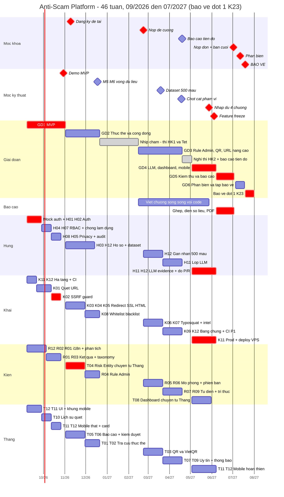

# Timeline chi tiết — Anti-Scam Platform

**Ngày soạn:** 2026-09-07 · **Sửa lớn:** 2026-09-16 (căn lại theo lịch khoa)
**Phạm vi:** 46 tuần · 07/09/2026 → 31/07/2027
**Hai mốc cố định:** **MVP xong 30/10/2026** · **Bảo vệ đợt 1 K23: 19/07 – 31/07/2027**
**Căn cứ lịch:** `CTDA_Ke-hoach-nam-2026-2027` — Kế hoạch năm học 2026–2027, Khoa CNTT, cột **K23**

> ⚠️ **Bản 2026-09-07 đã sai ngày bảo vệ.** Bản cũ giả định bảo vệ ~15/09/2027 và nộp bản cuối 27/08/2027.
> Lịch khoa cho K23 đợt 1: **nộp đơn bảo vệ 28/06–03/07/2027 · phản biện 12/07–17/07/2027 · bảo vệ 19/07–31/07/2027**.
> Ngày nộp cũ rơi **sau khi đợt bảo vệ đã đóng gần 4 tuần**. Toàn bộ GĐ3–GĐ7 đã được kéo lên; chi tiết ở mục 2.1.
**Căn cứ:** [`Ke_hoach_phat_trien.md`](../03_Ke_hoach_phat_trien/Ke_hoach_phat_trien.md) · [`Danh_sach_tinh_nang_toan_he_thong.md`](../02_Danh_sach_tinh_nang/Danh_sach_tinh_nang_toan_he_thong.md) · [`Kien_truc_he_thong_v2.md`](../01_Kien_truc_v2/Kien_truc_he_thong_v2.md)

> **Quan hệ với `Ke_hoach_phat_trien.md`:** tài liệu kia trả lời *"làm theo thứ tự nào và vì sao"*. Tài liệu này trả lời *"ai nộp cái gì, ngày nào"*. Khi hai bên lệch nhau, tài liệu này thắng về **ngày**, tài liệu kia thắng về **thứ tự phụ thuộc**.

---

## 0. Điều cần hiểu trước khi đọc bảng

### Dự án này có hai nhịp khác hẳn nhau

| | Giai đoạn 1 — MVP | Giai đoạn 2 trở đi |
|---|---|---|
| **Thời gian** | 07/09 → 01/11/2026 (8 tuần) | 02/11/2026 → 31/07/2027 (38 tuần) |
| **Nhịp** | **Gấp.** ~15–20 giờ/tuần/người | **Thong thả.** ~8–12 giờ/tuần/người |
| **Chu kỳ** | Deadline **mỗi tuần** | Deadline **mỗi 2 tuần** |
| **Phạm vi** | 13 nhóm tính năng, chỉ `P0` | 35 nhóm còn lại + `P1` |

> **Nói thẳng một điều:** mốc "MVP trong tháng 10" nghĩa là **8 tuần đầu không giãn ra được bao nhiêu** — đó là khối lượng tối thiểu để có một hệ thống chạy được đầu-cuối.
>
> **Và nói thẳng điều thứ hai (mới, 16/09):** chỗ giãn ở nửa sau **không còn nhiều như bản cũ tưởng**. Bản cũ chừa 11 tuần cuối cho kiểm thử + viết báo cáo (05/07 → 29/08). Lịch thật chỉ còn **4 tuần** (07/06 → 02/07). Bảy tuần đó không lấy lại được bằng cách làm chăm hơn — phải lấy lại bằng **viết báo cáo song song từ GĐ3** và **cắt phạm vi sớm**, xem mục 2.2 và mục 8.

### Bốn giả định đã áp dụng — xác nhận trong buổi họp đầu tiên

| # | Giả định | Nếu sai thì sao |
|---|---|---|
| 1 | ~~MVP nghiệm thu 30/10/2026, bảo vệ khoảng 15/09/2027, nộp bản cuối 27/08/2027.~~ → **ĐÃ SAI, ĐÃ SỬA 16/09.** Nay: **MVP 30/10/2026 · nộp đơn bảo vệ + bản cuối 02/07/2027 · phản biện 12/07–17/07/2027 · bảo vệ 19/07–31/07/2027** (lịch khoa, K23 đợt 1) | Nếu nhóm chuyển sang **bảo vệ đợt 2** thì toàn bộ GĐ3–GĐ7 giãn ra ~8 tháng; phải chốt trước 09/11/2026 vì lúc đăng ký đề tài là chọn đợt |
| 2 | **T04 Risk Entity và T08 Dashboard chuyển từ Thắng sang Kiên** (mục 8 kế hoạch). Các dòng liên quan có dấu ⚠. | Nếu không chốt chuyển, Thắng gánh thêm ~11 `P0` ở GĐ2 và GĐ4 |
| 3 | **Khối nhịp chậm nay là 21/12/2026 – 14/02/2027**, bám đúng lịch khoa: thi cuối kỳ HK1 21/12–02/01 (nghỉ) · HK2 tuần 1–3 04/01–23/01 (**làm nhẹ, không nghỉ** — bản cũ bỏ phí 3 tuần này) · Tết 25/01–13/02 (nghỉ hẳn, mùng 1 là 06/02/2027) | Nếu lịch thi đổi thì dịch khối, giữ nguyên 3 tuần làm nhẹ tháng 1 — đó là chỗ đã dùng để bù cho việc kéo GĐ3 lên sớm |
| 4 | ~~Có thêm một kỳ nghỉ hè/thi HK2 chưa đưa vào bảng.~~ → **ĐÃ TRA RA, ĐÃ ĐƯA VÀO.** Lịch khoa có: thi cuối kỳ HK2 **19/04–01/05/2027** và **nghỉ thi THPT Quốc Gia 07/06–26/06/2027** (3 tuần, không có lớp) | Ba tuần THPT QG là **thời gian vàng** — nó nằm đúng ngay trước hạn nộp 02/07 và đã được xếp thành toàn bộ GĐ6. Nếu trường cấm vào trường/lab trong 3 tuần đó thì vẫn làm từ xa được, nhưng phải báo sớm |
| 5 | **Nhóm bảo vệ đợt 1 K23 (tháng 7/2027), không phải đợt 2.** Suy ra từ tên tổ chức `KLTN-2023-HCMSU` = khóa 2023 = K23. | 🔴 **Phải xác nhận ngay trong buổi họp gần nhất.** Nếu nhóm thuộc khóa khác thì đọc lại cột tương ứng trong lịch khoa và dựng lại mục 2.1 — mọi ngày ở nửa sau tài liệu này đều treo vào giả định đó |

---

## 1. Nhịp làm việc

### Giai đoạn 1 — nhịp tuần (07/09 → 01/11/2026)

| Thời điểm | Ai | Việc | Nộp ở đâu |
|---|---|---|---|
| **Thứ 2, 20:00** | Cả nhóm | Standup 20 phút: xong gì, làm gì, đang bị chặn bởi ai | Biên bản trong `document/WeekNN/` |
| **Thứ 6, 17:00** | Từng người | **Code freeze tuần** — mở PR, CI xanh | GitHub PR |
| **Thứ 7, 12:00** | Người review chéo | Review xong, `Approve` hoặc ghi rõ việc cần sửa | GitHub PR review |
| **Chủ nhật, 21:00** | Từng người | Báo cáo tính năng (nếu đóng nhóm) + Báo cáo tuần | `document/WeekNN/BaoCao/` |

### Giai đoạn 2 trở đi — nhịp hai tuần (từ 02/11/2026)

| Thời điểm | Ai | Việc |
|---|---|---|
| **Thứ 2 đầu sprint, 20:00** | Cả nhóm | Chốt việc 2 tuần tới |
| **Thứ 6 cuối sprint, 17:00** | Từng người | Code freeze sprint — mở PR |
| **Chủ nhật cuối sprint, 21:00** | Từng người | Báo cáo tính năng + báo cáo sprint (thay cho báo cáo tuần) |
| **Giữa sprint (thứ 2 tuần lẻ)** | Cả nhóm | Check-in 10 phút trong nhóm chat, không cần họp |

**Trong 8 tuần nhịp chậm (21/12/2026 – 14/02/2027):** bỏ hết deadline cứng, chỉ giữ một tin nhắn cập nhật mỗi 2 tuần. Không nộp báo cáo sprint. **Lưu ý 3 tuần 04/01 – 23/01 vẫn làm nhẹ, không nghỉ.**

### Cặp review chéo cố định

| Người viết | Người review | Lý do ghép |
|---|---|---|
| Hùng | Khải | Auth và hạ tầng đụng nhau ở cấu hình, biến môi trường, Docker |
| Khải | Thắng | SSRF guard và QR/URL của Thắng dùng chung tầng fetch |
| Kiên | Hùng | Rule Admin (Java) phải khớp rule engine (Python) |
| Thắng | Kiên | Risk Entity của Kiên là đầu vào tra cứu của Thắng |

**Quy tắc trễ hạn:** trễ quá **48 giờ** thì phải báo trong nhóm chat **trước** khi deadline tới, kèm ngày mới và lý do. Trễ im lặng nghiêm trọng hơn trễ có báo.

---

## 2. Bản đồ 46 tuần

| Giai đoạn | Thời gian | Số tuần | Nội dung | Mốc |
|---|---|---|---|---|
| **GĐ1** | 07/09 – 01/11/2026 | 8 | **MVP** — auth, quét văn bản, quét URL, SSRF guard, lịch sử, hạ tầng | M2 · M3 · M4 |
| **GĐ2** | 02/11 – 20/12/2026 | 7 | Thực thể, tra cứu, báo cáo cộng đồng, kiểm duyệt, rule từ DB | **Đăng ký đề tài 09–14/11** · M5 · M6 |
| **Nhịp chậm** | 21/12/2026 – 14/02/2027 | 8 | Thi HK1 (nghỉ) → **tháng 1 làm nhẹ** → Tết (nghỉ hẳn) | — |
| **GĐ3** | 15/02 – 18/04/2027 | 9 | Rule Admin, QR/VietQR, URL nâng cao, dataset gán nhãn, khởi động LLM · **bắt đầu viết báo cáo** | **Nộp đề cương 22–27/02** |
| **Nghỉ** | 19/04 – 02/05/2027 | 2 | Thi cuối kỳ HK2 + báo cáo tiến độ. Không nhận việc code mới | **Báo cáo tiến độ 19–24/04** |
| **GĐ4** | 03/05 – 06/06/2027 | 5 | Lớp LLM, dashboard, mobile hoàn thiện, đo Precision/Recall | 🔴 **Feature freeze T6 04/06** |
| **GĐ5** | 07/06 – 02/07/2027 | 4 | Kiểm thử hồi quy, đo lại, ghép báo cáo, deploy · *(trùng 3 tuần nghỉ thi THPT QG)* | 🔴 **Nộp đơn + bản cuối T6 02/07** |
| **GĐ6** | 05/07 – 17/07/2027 | 2 | Slide, video demo dự phòng, tập bảo vệ | **Phản biện 12–17/07** |
| **BẢO VỆ** | 19/07 – 31/07/2027 | 2 | 🔴 **Bảo vệ đợt 1 K23** | — |

> GĐ7 của bản cũ đã biến mất: phần "tập bảo vệ" nay gộp vào GĐ6, vì giữa ngày nộp (02/07) và ngày bảo vệ (19/07) chỉ còn **hai tuần rưỡi**, không phải ba tuần thong thả như bản cũ.

### 2.1. Đã dịch những gì so với bản 2026-09-07

| Giai đoạn | Bản cũ | Bản mới | Lệch |
|---|---|---|---|
| GĐ1 MVP | 07/09 – 01/11/2026 | **giữ nguyên** | — |
| GĐ2 | 02/11 – 27/12/2026 (8t) | 02/11 – **20/12**/2026 (7t) | −1 tuần · thi HK1 bắt đầu 21/12, bản cũ cho sprint cuối đâm vào tuần thi |
| Nhịp chậm | 28/12 – 21/02 (8t nghỉ) | **21/12 – 14/02** (8t, 3 tuần giữa là làm nhẹ) | sớm 1 tuần · thu hồi 3 tuần tháng 1 |
| GĐ3 | 22/02 – 18/04/2027 (8t) | **15/02** – 18/04/2027 (9t) | +1 tuần |
| *(mới)* Nghỉ thi HK2 | — | **19/04 – 02/05/2027** | thêm 2 tuần nghỉ mà bản cũ không biết |
| GĐ4 | 19/04 – 13/06/2027 (8t) | **03/05 – 06/06**/2027 (5t) | −3 tuần |
| GĐ5 + GĐ6 cũ | 14/06 – 29/08/2027 (11t) | **07/06 – 02/07**/2027 (4t) | **−7 tuần** ← chỗ đau nhất |
| GĐ7 cũ | 30/08 – 19/09/2027 (3t) | **05/07 – 17/07**/2027 (2t) | −1 tuần |
| Nộp bản cuối | 27/08/2027 | **02/07/2027** | **sớm 8 tuần** |
| Bảo vệ | ~15/09/2027 | **19/07 – 31/07/2027** | **sớm 8 tuần** |

### 2.2. Bảy tuần bị mất — lấy lại bằng cách nào

Bản cũ dành 11 tuần cuối cho "kiểm thử hồi quy + đo lại + viết 4 chương báo cáo". Lịch thật chỉ cho **4 tuần**. Không có cách nào viết 4 chương báo cáo trong 4 tuần **nếu tới lúc đó mới bắt đầu viết**. Ba thay đổi bắt buộc:

1. 🔴 **Viết báo cáo song song, bắt đầu từ GĐ3 — không dồn về cuối.** Bản đề cương nộp 22–27/02/2027 chính là dàn ý báo cáo; từ đó trở đi mỗi người viết dần chương của mình theo tính năng vừa làm xong. Tới 07/06 phải có **bản nháp cả 4 chương**, GĐ5 chỉ còn việc ghép, sửa và bổ sung số liệu. Chi tiết hạn ở GĐ3 và GĐ4.
2. 🔴 **Chốt cắt phạm vi vào 04/06/2027, không phải 11/06.** Và nếu tới **cuối GĐ3 (18/04)** mà còn nợ quá 3 nhóm `P0` thì cắt luôn từ lúc đó theo thứ tự mục 8 — đừng đợi tới tháng 6 mới cắt, lúc đó cắt không kịp nữa.
3. 🔴 **Số liệu Precision/Recall phải chốt trong GĐ4, không đo lại sau feature freeze.** Bản cũ cho đo lại 2 tuần (19/07–01/08) sau khi đóng băng. Nay không còn chỗ: mô hình đóng băng 04/06 thì số liệu cuối cùng đo trong tuần 07/06–13/06, và đó là số đưa thẳng vào báo cáo.

---

### 2.3. Mốc hành chính KLTN — lịch khoa, K23 đợt 1

**Những mốc này bản cũ không có dòng nào.** Chúng là cửa hành chính: trễ một cái là hỏng cả năm, không bù được bằng code.

| Ngày | Mốc | Ai làm | Ghi chú |
|---|---|---|---|
| **09/11 – 14/11/2026** | 🔴 **Đăng ký đề tài KLTN đợt 1 K23** | Cả nhóm + GVHD | **Gần nhất — chỉ còn ~8 tuần.** Đăng ký đợt 1 là chốt luôn việc bảo vệ tháng 7/2027. Rơi đúng tuần 7 HK1, trùng tuần hạn T04 của Kiên |
| **22/02 – 27/02/2027** | 🔴 **Nộp đề cương KLTN đợt 1 K23** | Cả nhóm | Tuần 2 của GĐ3. Dùng luôn đề cương làm **dàn ý báo cáo cuối** — xem mục 2.2 |
| **19/04 – 24/04/2027** | **Báo cáo tiến độ** | Cả nhóm | Trùng thi cuối kỳ HK2 (19/04–01/05). Đã xếp thành tuần nghỉ code, chỉ trình bày cái đã có |
| **28/06 – 03/07/2027** | 🔴 **Nộp đơn bảo vệ + bản cuối** | Cả nhóm | Chốt nội bộ **T6 02/07**. Nộp đơn ngay đầu tuần 28/06, đừng để tới ngày cuối |
| **12/07 – 17/07/2027** | 🔴 **Phản biện** | Cả nhóm | Báo cáo phải tới tay phản biện **trước 12/07**. Trùng tuần giữa kỳ HK3 (05/07–10/07) |
| **19/07 – 31/07/2027** | 🔴 **BẢO VỆ ĐỢT 1 K23** | Cả nhóm | Chuẩn bị cho **ngày sớm nhất 19/07**, không phải ngày muộn nhất |

### Các tuần lịch trường đâm vào lịch làm việc

| Khoảng | Việc của trường | Đã xử lý thế nào |
|---|---|---|
| 02/11 – 07/11/2026 | Giữa kỳ HK1 | GĐ2 sprint 1 giảm tải |
| **21/12/2026 – 02/01/2027** | Thi cuối kỳ HK1 | Nghỉ hẳn — GĐ2 rút ngắn còn 7 tuần để tránh |
| 04/01 – 23/01/2027 | HK2 tuần 1–3, chưa thi gì | **Làm nhẹ** — bản cũ bỏ phí 3 tuần này |
| **25/01 – 13/02/2027** | Nghỉ Tết (mùng 1: 06/02) | Nghỉ hẳn 3 tuần |
| 01/03 – 06/03/2027 | Giữa kỳ HK2 | GĐ3 tuần 3 giảm tải |
| **19/04 – 01/05/2027** | Thi cuối kỳ HK2 + báo cáo tiến độ | Nghỉ code 2 tuần, đã đưa thành khối riêng |
| 10/05/2027 | HK3 bắt đầu | GĐ4 chạy song song HK3 — đầu kỳ tải nhẹ, tranh thủ |
| **07/06 – 26/06/2027** | Nghỉ thi THPT Quốc Gia (3 tuần, không có lớp) | **Thời gian vàng** — toàn bộ GĐ5 nằm ở đây |
| 05/07 – 10/07/2027 | Giữa kỳ HK3 | Trùng tuần làm slide. Làm slide xong trước 04/07 nếu được |

---

# GIAI ĐOẠN 1 · MVP — chi tiết theo tuần

**07/09 → 01/11/2026 · 8 tuần · nhịp gấp**

## Phạm vi MVP — 13 nhóm, không hơn

Mọi thứ ngoài danh sách này **không thuộc MVP**, kể cả khi nó là `P0`. Ai làm xong việc của mình sớm thì giúp người đang chậm, **không** tự nhận thêm nhóm mới.

| Người | Nhóm trong MVP |
|---|---|
| **Hùng** | mock auth · H01 Đăng ký · H02 Đăng nhập · H04 RBAC · H07 Chống lạm dụng · H05 Audit log · H08 Che PII *(H09, H10 đã xong ở M1)* |
| **Khải** | K11 Hạ tầng · K12 CI · K01 Quét URL · K02 SSRF guard |
| **Kiên** | R12 i18n/a11y · R01 Phân tích nội dung · R02 Trích xuất · R03 Taxonomy |
| **Thắng** | T12 UI dùng chung · T10 Lịch sử quét · T11 Khung mobile |

**Hoãn sang GĐ2:** T04, T05, T06, T01, T02, T03, T07, T08, T09, R04–R11, K03–K10, H03, H06, H11, H12.

## Kịch bản demo MVP — ngày 30/10/2026

Đây là thứ duy nhất quyết định MVP đạt hay không đạt. Chạy một mạch, không dừng giữa chừng:

> `docker compose up` → đăng ký tài khoản → đăng nhập → dán một tin nhắn lừa đảo tiếng Việt → nhận điểm rủi ro kèm danh sách bằng chứng và khuyến nghị → dán một URL giả mạo ngân hàng → nhận `DANGER` → thử quét `http://169.254.169.254` → bị SSRF guard chặn → mở lịch sử quét thấy đủ 3 lần quét → đăng nhập bằng tài khoản khác, không thấy lịch sử của người trước → mở app mobile, quét lại tin nhắn đầu tiên, ra cùng kết quả.

---

## W01 · 07/09 – 13/09 — Chuẩn bị

| Người | Mã | Việc phải xong | Hạn | Bằng chứng nghiệm thu |
|---|---|---|---|---|
| **Cả nhóm** | — | Họp chốt 4 giả định ở mục 0, đặc biệt việc chuyển T04 + T08 sang Kiên | **T2 08/09** | Biên bản có đủ 4 xác nhận trong chat |
| **Hùng** | mock auth | 🔴 `POST /dev/token` cấp JWT cố định cho `test` và `admin`, bật bằng `AUTH_MOCK=true` | **T4 09/09** | Ba người còn lại tự lấy được token và gọi được endpoint có `@PreAuthorize` |
| **Hùng** | — | Hợp đồng JWT (claims `sub`, `username`, `roles`, `exp`) vào `contracts/openapi/auth.yaml` | T6 11/09 | File đã merge vào `main` |
| **Khải** | K11 | Mono-repo theo ADR-06 + `infra/docker-compose.yml` (postgres, redis, scan-engine) | T6 11/09 | `docker compose up` → `curl :8000/health` trả `UP` |
| **Khải** | K11 | Dockerfile multi-stage cho `scan-engine`, `.env.example`, không commit khoá | T6 11/09 | Image build được từ máy sạch |
| **Kiên** | R12 | i18n cho `apps/web` (mặc định `vi`), tách chuỗi ra file ngôn ngữ | T6 11/09 | Đổi biến ngôn ngữ → giao diện đổi chuỗi |
| **Kiên** | R12 | Bảng màu + biểu tượng + nhãn chữ cho `SAFE`/`CAUTION`/`DANGER`, đạt tương phản WCAG AA | T6 11/09 | Ảnh chụp kèm số tương phản đo được |
| **Thắng** | T12 | `RiskResultCard` trên dữ liệu giả: điểm, mức, màu, biểu tượng, bằng chứng, khuyến nghị | T6 11/09 | Trang `/demo/card` render đủ 3 mức rủi ro |
| **Cả nhóm** | — | Chốt **12 hợp đồng API** ở mục 7 kế hoạch, ghi vào `contracts/openapi/` | **T5 10/09** | 12 schema trong repo, **một người ghi** — không sửa đồng thời |

> **Vì sao mock auth phải xong 09/09:** H01 chặn 25 trong 48 nhóm. Không có mock auth thì Khải, Kiên, Thắng ngồi chờ hết W02–W03 — mất 25% thời gian của giai đoạn MVP.

---

## W02 · 14/09 – 20/09

| Người | Mã | Việc phải xong | Hạn | Bằng chứng nghiệm thu |
|---|---|---|---|---|
| **Hùng** | H01 | Đăng ký email + mật khẩu, BCrypt cost ≥ 10, ràng buộc UNIQUE, validate độ mạnh | T6 18/09 | `POST /v1/auth/register` → bản ghi trong `users`; mật khẩu không có trong log |
| **Hùng** | H01 | Migration `users` bằng Flyway, không sửa schema bằng tay | T6 18/09 | `flyway migrate` chạy từ DB rỗng |
| **Khải** | K11 | Dockerfile `api`, endpoint `/health` + `/ready` trên cả 3 service | T5 17/09 | 3 endpoint trả `UP` |
| **Khải** | K12 | GitHub Actions chạy `pytest` + `mvn test` trên mỗi PR, chặn merge khi đỏ | T6 18/09 | Một PR test đỏ bị chặn merge thật |
| **Kiên** | R02 | Nối `POST /internal/extract` — URL, SĐT `+84`, số tài khoản, số tiền, OTP | T6 18/09 | Test trên 10 tin nhắn mẫu, không nhầm SĐT với số tài khoản |
| **Thắng** | T11 | Khung mobile Expo: điều hướng, 4 tab nhập liệu, Secure Storage | T6 18/09 | Chạy trên máy thật hoặc emulator, gọi mock API |

---

## W03 · 21/09 – 27/09 → **nghiệm thu M2**

| Người | Mã | Việc phải xong | Hạn | Bằng chứng nghiệm thu |
|---|---|---|---|---|
| **Hùng** | H02 | 🔴 Đăng nhập trả JWT (15') + refresh token (7 ngày), **lưu hash** trong DB | **T6 25/09** | Bảng `refresh_tokens` không có plain text |
| **Hùng** | H02 | 🔴 Refresh token rotation + đăng xuất thu hồi token phiên hiện tại | **T6 25/09** | Dùng lại token cũ → `401` |
| **Hùng** | — | `api` gọi `scan-engine` sync qua HTTP, timeout 2s, circuit breaker Resilience4j | T6 25/09 | Tắt `scan-engine` → `api` trả `503` rõ ràng, không treo |
| **Khải** | K01 | Chuẩn hoá URL (thêm scheme, hạ chữ thường host, bỏ port mặc định, sắp query) + tách thành phần | T6 25/09 | Bộ test 15 URL biến thể ra cùng dạng chuẩn |
| **Kiên** | R01 | Hoàn thiện 6 nhóm từ khoá + 5 mẫu tổ hợp trong `scan-engine` | T6 25/09 | `pytest` xanh, thêm ít nhất 5 case mới |
| **Kiên** | R01 | Trang quét nội dung trên web: nhập text → hiện điểm và từng bằng chứng | T6 25/09 | Quét thật qua `api`, không phải mock |
| **Thắng** | T11 | Màn hình kết quả mobile dùng `RiskResultCard`, gọi API qua mock auth | T6 25/09 | Quét văn bản trên mobile ra kết quả thật |
| **Cả nhóm** | — | **Nghiệm thu M2** | **CN 27/09** | Đăng ký → đăng nhập → `POST /v1/scan/text` bằng token thật → có bản ghi trong `scan_requests` |

---

## W04 · 28/09 – 04/10

| Người | Mã | Việc phải xong | Hạn | Bằng chứng nghiệm thu |
|---|---|---|---|---|
| **Hùng** | H04 | 🔴 Vai trò `USER`/`ADMIN` trong JWT, chặn `/v1/admin/*`, trả `403` rõ ràng | **T6 02/10** | User thường gọi route admin → `403` có `errorCode` |
| **Hùng** | H04 | 🔴 Middleware Next.js chặn `/admin/*` phía client | **T6 02/10** | Vào `/admin` bằng tài khoản thường → bị đá về trang chủ |
| **Khải** | K01 | `POST /v1/scan/url` theo pattern sync-first, cache Redis theo `urlHash` TTL 5' | T6 02/10 | Gọi 2 lần cùng URL → lần 2 từ cache, đo được độ trễ giảm |
| **Khải** | K01 | Dấu hiệu cơ bản: IP thay tên miền, URL quá dài, `@` trong host, ký tự bất thường | T6 02/10 | 5 URL độc hại mẫu đều sinh `evidences[]` đúng |
| **Kiên** | R01 | Trang kết quả chi tiết: đánh dấu đoạn văn bản đã kích hoạt rule | T6 02/10 | Quét tin nhắn → đoạn khớp rule được tô sáng |
| **Thắng** | T10 | `GET /v1/scan/history` phân trang cursor, chỉ trả bản ghi của chính người dùng | T6 02/10 | User A không thấy bản ghi của user B |
| **Thắng** | T10 | `GET /v1/scan/{scanId}` kiểm tra quyền sở hữu, trả **`404`** thay vì `403` | T6 02/10 | Test khoá lại đúng mã `404` — không lộ sự tồn tại của bản ghi |

---

## W05 · 05/10 – 11/10 → **nghiệm thu M3**

| Người | Mã | Việc phải xong | Hạn | Bằng chứng nghiệm thu |
|---|---|---|---|---|
| **Hùng** | H07 | Rate limit: đăng nhập 5 lần sai/IP/15', đăng ký 5 req/phút/IP, quét 50/200/500 mỗi giờ | T6 09/10 | Gọi vượt ngưỡng → `429` kèm `Retry-After` |
| **Hùng** | H07 | `Idempotency-Key` trên mọi `POST /v1/scan/*`, Redis TTL 24h, trùng key khác hash → `409` | T6 09/10 | Cùng key cùng body → 1 bản ghi; khác body → `409 IDEMPOTENCY_KEY_CONFLICT` |
| **Khải** | K01 | Trang kết quả chi tiết URL trên web, hiển thị từng bằng chứng | T6 09/10 | Quét `http://vietc0mb4nk-verify.com` → trang hiện đủ evidence |
| **Kiên** | R02 | Hiển thị thực thể đã trích xuất trong trang kết quả (URL, SĐT, số tài khoản, số tiền) | T6 09/10 | Quét tin nhắn có đủ 4 loại → hiện đủ 4 |
| **Thắng** | T10 | Lọc lịch sử theo loại đầu vào / mức rủi ro / khoảng thời gian | T6 09/10 | Lọc `DANGER` trong 7 ngày ra đúng tập |
| **Thắng** | T12 | Bằng chứng mở rộng / thu gọn được từng rule | T6 09/10 | Bấm vào một evidence → hiện mô tả đầy đủ |
| **Cả nhóm** | — | **Nghiệm thu M3** | **CN 11/10** | Web: đăng nhập → quét tin nhắn → xem kết quả → mở lịch sử; user thường vào `/admin` bị chặn |

---

## W06 · 12/10 – 18/10

| Người | Mã | Việc phải xong | Hạn | Bằng chứng nghiệm thu |
|---|---|---|---|---|
| **Hùng** | H08 | Che dữ liệu nhạy cảm trong log: số tài khoản → `****1234`, SĐT → `+849****678` | T6 16/10 | `grep` toàn bộ log một phiên quét — không thấy số đầy đủ |
| **Hùng** | H08 | Người dùng xoá được lịch sử quét của mình | T6 16/10 | Xoá xong `GET /v1/scan/history` không còn bản ghi đó |
| **Khải** | K02 | Chặn dải IP nội bộ `127/8`, `10/8`, `172.16/12`, `192.168/16`, `169.254/16`, `::1`, `fc00::/7` | T6 16/10 | Quét `http://169.254.169.254` bị chặn trước khi mở kết nối |
| **Khải** | K02 | Phân giải DNS trước → kiểm tra IP đích → mới kết nối; chỉ cho `http`/`https`; giới hạn size + timeout | T6 16/10 | Tên miền trỏ về `127.0.0.1` bị chặn |
| **Kiên** | R03 | Taxonomy: liệt kê và phân loại mẫu lừa đảo phổ biến ở Việt Nam, gán nhãn vào kết quả quét | T6 16/10 | ≥ 8 mẫu có mã, tên, dấu hiệu; quét "trúng thưởng" → ra nhãn đúng |
| **Thắng** | T11 | Mobile gọi API bằng **auth thật**, bỏ mock, token lưu Secure Storage | T6 16/10 | Đăng nhập tài khoản thật trên app |

---

## W07 · 19/10 – 25/10 → **nghiệm thu M4**

| Người | Mã | Việc phải xong | Hạn | Bằng chứng nghiệm thu |
|---|---|---|---|---|
| **Hùng** | H05 | Bảng `audit_logs` append-only + ghi thao tác nhạy cảm + lưu `X-Request-Id` | T6 23/10 | Đăng nhập, đổi mật khẩu đều có bản ghi kèm request id |
| **Khải** | K02 | 🔴 Kiểm tra lại IP đích ở **mỗi** bước chuyển hướng, không chỉ URL đầu tiên | **T6 23/10** | Redirect từ domain công khai về `127.0.0.1` bị chặn ở bước 2 |
| **Khải** | K02 | 🔴 **Bộ test tấn công** — `169.254.169.254`, `localhost`, redirect nội bộ, DNS rebinding | **T6 23/10** | **Không có bộ test này thì K02 không được nghiệm thu**, dù code đã chạy |
| **Kiên** | R12 | Rà soát a11y trên mọi trang đã có: điều hướng bàn phím, không truyền tin chỉ bằng màu | T6 23/10 | Checklist WCAG AA đã tick từng trang |
| **Thắng** | T12 | `RiskResultCard` dùng chung thật sự giữa web và mobile, một nguồn định nghĩa | T6 23/10 | Sửa card một chỗ → cả hai nền tảng đổi theo |
| **Cả nhóm** | — | **Nghiệm thu M4** | **CN 25/10** | Quét `http://vietc0mbank.com` → ra `DANGER`; quét `169.254.169.254` bị chặn |

---

## W08 · 26/10 – 01/11 — Ổn định và demo MVP

| Ngày | Ai | Việc phải xong | Bằng chứng |
|---|---|---|---|
| **T3 27/10** | Cả nhóm | 🔴 **Đóng băng phạm vi MVP** — từ đây chỉ sửa lỗi, không thêm tính năng | PR thêm tính năng bị từ chối |
| **T3–T4 27–28/10** | Cả nhóm | Chạy thử kịch bản demo MVP đủ 3 lượt, ghi lại mọi chỗ vấp | Bảng lỗi có mức ưu tiên |
| **T5 29/10** | Khải | Deploy MVP lên VPS hoặc môi trường staging | Truy cập được từ máy ngoài |
| **T5 29/10** | Cả nhóm | Sửa hết lỗi mức `P0` phát hiện ở bước trên | Số lỗi `P0` bằng 0 |
| **T6 30/10** | Cả nhóm | 🔴 **DEMO MVP** — chạy trọn kịch bản ở đầu giai đoạn, không dừng giữa chừng | Quay màn hình lại làm bằng chứng |
| **CN 01/11** | Từng người | Nộp Báo cáo tính năng cho toàn bộ 13 nhóm MVP | Đủ file trong `document/Week08/BaoCao/` |

---

# GIAI ĐOẠN 2 · Thực thể & cộng đồng

**02/11 → 20/12/2026 · 7 tuần · 3 sprint hai tuần + 1 sprint một tuần · nhịp thong thả**

> **Rút 1 tuần so với bản cũ.** Thi cuối kỳ HK1 bắt đầu **21/12/2026**; bản cũ để sprint D chạy tới 27/12, tức đâm thẳng vào tuần thi. Sprint D nay còn 1 tuần và mốc M5+M6 giữ nguyên ngày 18/12.
>
> 🔴 **Tuần 09/11 – 14/11 có việc hành chính bắt buộc: ĐĂNG KÝ ĐỀ TÀI KLTN ĐỢT 1 K23.** Rơi đúng tuần cuối sprint A, cùng tuần hạn T04 của Kiên. Xem mục 2.3.

Mục tiêu: khép kín vòng dữ liệu — người dùng báo cáo → admin duyệt → sinh thực thể rủi ro → lần quét sau điểm thay đổi. Đây là phần làm cho hệ thống "sống", và là mốc M5 + M6.

## Sprint A · 02/11 – 15/11

| Người | Mã | Việc | Hạn | Bằng chứng |
|---|---|---|---|---|
| **Kiên** ⚠ | T04 | 🔴 Bảng `risk_entities` + migration + API tra cứu + `RiskEntityService.upsertFromReport()` | **T6 13/11** | Chặn T05/T06 của Thắng và K08 của Khải. Interface có Javadoc, Thắng xác nhận gọi được |
| **Thắng** | T05 | `POST /v1/reports` + rate limit 10 báo cáo/ngày/user + nút gửi trong trang kết quả | T6 13/11 | Báo cáo thứ 11 trong ngày → `429` |
| **Hùng** | H03 | Hồ sơ + đổi mật khẩu (thu hồi **toàn bộ** refresh token sau khi đổi) | T6 13/11 | Đổi mật khẩu → mọi phiên khác bị đá ra |
| **Khải** | K03 · K04 | Chuỗi chuyển hướng tối đa 5 bước + kiểm tra HTTPS, hạn chứng chỉ, khớp tên miền | T6 13/11 | URL rút gọn 3 bước → hiện đủ 3 hop |
| **Cả nhóm** | — | 🔴 **ĐĂNG KÝ ĐỀ TÀI KLTN ĐỢT 1 K23** (mốc hành chính của khoa) | **09/11 – 14/11** | Đã nộp hồ sơ đăng ký, có xác nhận của GVHD. **Trễ cái này là mất cả năm** |

## Sprint B · 16/11 – 29/11

| Người | Mã | Việc | Hạn | Bằng chứng |
|---|---|---|---|---|
| **Kiên** ⚠ | T04 | Trang admin quản lý entity: tìm kiếm, lọc theo loại và trạng thái, phân trang | T6 27/11 | Admin lọc `PHONE` + `VERIFIED` ra đúng tập |
| **Thắng** | T06 | 6 trạng thái báo cáo + hàng đợi duyệt + duyệt → `upsertFromReport()` → audit log | T6 27/11 | Duyệt 1 báo cáo → `risk_entities` có bản ghi mới hoặc số đếm tăng |
| **Hùng** | H12 | Chốt cấu trúc tập dữ liệu gán nhãn + 100 mẫu đầu tiên | T6 27/11 | `datasets/labeled/README.md` + 100 mẫu |
| **Khải** | K05 | Parse HTML bằng Jsoup, phát hiện input nhạy cảm, cảnh báo `form action` khác domain | T6 27/11 | Trang phishing mẫu → liệt kê đúng input nhạy cảm |

## Sprint C · 30/11 – 13/12

| Người | Mã | Việc | Hạn | Bằng chứng |
|---|---|---|---|---|
| **Thắng** | T01 · T02 | Tra SĐT (chuẩn hoá `+84`) và tra số tài khoản (validate mã ngân hàng VN), cache Redis 15' | T6 11/12 | Tra số đã bị báo cáo → `CAUTION` kèm số lượt báo cáo |
| **Kiên** | R04 | Bảng `risk_rules` + `rule_conditions` + script nạp 16 rule hiện có từ `rules.json` | T6 11/12 | Migration chạy từ DB rỗng, 16 rule vào đủ |
| **Hùng** | H10 | `scan-engine` nạp rule từ PostgreSQL, cache Redis, vô hiệu cache khi admin sửa | T6 11/12 | Đổi trọng số trong DB → quét lại thấy điểm đổi, không restart |
| **Khải** | K08 | Whitelist/blacklist tên miền + vô hiệu cache Redis khi đổi + audit log | T6 11/12 | Thêm domain vào whitelist → quét lại điểm giảm ngay |

## Sprint D · 14/12 – 20/12  *(1 tuần — tránh tuần thi HK1)*

| Người | Mã | Việc | Hạn | Bằng chứng |
|---|---|---|---|---|
| **Kiên** | R04 | Trang admin rule: liệt kê, tìm kiếm, tạo/sửa/bật-tắt, chỉnh trọng số + audit log | T6 18/12 | Sửa 1 rule → có bản ghi trong `audit_logs` |
| **Cả nhóm** | — | 🔴 **Nghiệm thu M5 + M6 — vòng dữ liệu khép kín** | **T6 18/12** | Gửi báo cáo → admin duyệt → `risk_entities` cập nhật → quét lại thấy điểm tăng |
| **Cả nhóm** | — | Dọn nợ kỹ thuật, tổng kết học kỳ 1, chốt danh sách việc còn thiếu | CN 27/12 | Bảng đối chiếu `P0` đã xong / còn nợ |

---

# NHỊP CHẬM · Thi học kỳ 1 và Tết

**21/12/2026 → 14/02/2027 · 8 tuần · không có deadline cứng**

Giai đoạn này tồn tại vì nó **sẽ** xảy ra dù có đưa vào kế hoạch hay không. Đưa vào bảng thì đỡ phải giả vờ là mình vẫn đang chạy đúng tiến độ.

> **Khác bản cũ:** khối này nay **bắt đầu sớm 1 tuần** (21/12 thay vì 28/12) để né tuần thi HK1 đầu tiên, và **kết thúc sớm 1 tuần** (14/02 thay vì 21/02) để GĐ3 có thêm tuần làm đề cương. Quan trọng nhất: **3 tuần đầu tháng 1 nay là tuần làm việc nhẹ, không phải nghỉ** — bản cũ bỏ phí chúng.

| Khoảng | Chế độ | Việc gợi ý |
|---|---|---|
| **21/12 – 02/01** | **Nghỉ hẳn** — thi cuối kỳ HK1 | Không có việc |
| **04/01 – 23/01** | **Nhẹ, ~4–6 giờ/tuần** *(HK2 tuần 1–3, chưa thi gì — đây là 3 tuần bản cũ bỏ phí)* | Hùng: gán nhãn dataset tới 300 mẫu · Kiên: viết bài cho R09 thư viện kiến thức · Khải: khảo sát nguồn threat intel cho K07 · Thắng: sửa lỗi tồn đọng, polish giao diện |
| **25/01 – 13/02** | **Nghỉ hẳn** — Tết Nguyên Đán (mùng 1 rơi vào 06/02/2027) | Không có việc |
| 14/02 | Khởi động lại | Họp rà soát trạng thái, chốt kế hoạch GĐ3 và phân công viết đề cương |

**Mốc mềm duy nhất — 14/02/2027:** tập dữ liệu gán nhãn đạt 300/500 mẫu. Trễ mốc này không kéo ai, nhưng trễ thì áp lực dồn vào GĐ3 — mà GĐ3 nay còn phải gánh thêm việc viết báo cáo.

---

# GIAI ĐOẠN 3 · Rule Admin, QR và URL nâng cao

**15/02 → 18/04/2027 · 9 tuần · 1 tuần đề cương + 4 sprint**

> **Bắt đầu sớm 1 tuần** (15/02 thay vì 22/02) — thu hồi từ khối nhịp chậm. Tuần đầu dành cho đề cương KLTN.
>
> 🔴 **Từ giai đoạn này mỗi người bắt đầu viết chương báo cáo của mình.** Đây là thay đổi bắt buộc so với bản cũ: lịch thật chỉ còn 4 tuần cuối, không đủ để viết 4 chương từ đầu. Xem mục 2.2.

## Tuần đề cương · 15/02 – 21/02

| Người | Việc | Hạn | Bằng chứng |
|---|---|---|---|
| **Cả nhóm** | 🔴 **Soạn đề cương KLTN** — bài toán, phạm vi, kiến trúc, phương pháp đánh giá, kế hoạch | **T6 19/02** | GVHD đã đọc và góp ý trước khi nộp |
| **Cả nhóm** | 🔴 **NỘP ĐỀ CƯƠNG KLTN ĐỢT 1 K23** | **22/02 – 27/02** | Đã nộp theo đúng mẫu của khoa |
| **Cả nhóm** | Chốt **dàn ý báo cáo cuối** bám theo đề cương, chia rõ 4 chương theo mục 5 | T6 19/02 | Dàn ý có đủ đề mục cấp 2 cho cả 4 chương |

## Sprint E · 22/02 – 07/03

| Người | Mã | Việc | Hạn |
|---|---|---|---|
| **Kiên** | R05 | `GET /v1/rules/evaluate/preview` + giao diện sandbox chạy thử rule, không ghi lịch sử | T6 05/03 |
| **Thắng** | T03 | `POST /v1/scan/qr`, phân loại URL/VietQR/văn bản, parse VietQR (mã NH, STK, số tiền, nội dung) | T6 05/03 |
| **Khải** | K06 | Typosquatting: homoglyph Unicode, thương hiệu ở subdomain, thêm/bớt gạch nối | T6 05/03 |
| **Hùng** | H12 | Dataset đạt 400/500 mẫu | T6 05/03 |

## Sprint F · 08/03 – 21/03

| Người | Mã | Việc | Hạn |
|---|---|---|---|
| **Thắng** | T03 | QR chứa URL bắt buộc đi qua SSRF guard + giải mã QR từ ảnh tải lên trên web | T6 19/03 |
| **Kiên** | R06 | Đánh phiên bản bộ rule + lưu `ruleVersion` vào từng bản ghi kết quả quét | T6 19/03 |
| **Khải** | K07 | Nạp threat intel từ CSV/JSON + nguồn công khai, khử trùng lặp, ghi phiên bản dataset | T6 19/03 |
| **Hùng** | H12 | 🔴 **Dataset đủ 500 mẫu** (Kiên hỗ trợ 150 mẫu) | **T6 19/03** |
| **Từng người** | — | 📝 Viết xong **phần cơ sở lý thuyết + hiện trạng** của chương mình | T6 19/03 |

## Sprint G · 22/03 – 04/04

| Người | Mã | Việc | Hạn |
|---|---|---|---|
| **Hùng** | H11 | Interface `LlmProvider` + feature flag `ai.enabled` + JSON Schema ràng buộc output, retry 1 lần | T6 02/04 |
| **Kiên** | R07 | Quản lý từ điển từ khoá qua trang admin, thêm/xoá không cần deploy lại | T6 02/04 |
| **Thắng** | T07 | Uy tín người báo cáo: tính điểm theo tỷ lệ được duyệt, phát hiện báo cáo trùng lặp | T6 02/04 |
| **Khải** | K09 | Lưu HTML thô làm bằng chứng + ảnh chụp trang bằng headless browser | T6 02/04 |

## Sprint H · 05/04 – 18/04

| Người | Mã | Việc | Hạn |
|---|---|---|---|
| **Hùng** | H11 | 🔴 **Che PII trước khi gửi ra API ngoài** — số tài khoản, SĐT, OTP | **T6 16/04** |
| **Kiên** | R09 | Thư viện kiến thức: bài viết theo chủ đề, tìm kiếm, gợi ý trong trang kết quả quét | T6 16/04 |
| **Thắng** | T09 | Thông báo trong ứng dụng khi báo cáo được duyệt hoặc bị từ chối | T6 16/04 |
| **Khải** | K12 | Lint (Checkstyle, ruff, ESLint) + đo độ phủ + log JSON có `X-Request-Id` xuyên suốt | T6 16/04 |
| **Từng người** | — | 📝 Viết xong **phần thiết kế + hiện thực** của chương mình (mô tả cái đã code tới nay) | T6 16/04 |
| **Cả nhóm** | — | 🔴 **Điểm chốt cắt phạm vi sớm** — nếu còn nợ quá 3 nhóm `P0` thì cắt ngay theo mục 8 | **T6 18/04** |

---

# NGHỈ · Thi cuối kỳ HK2 và báo cáo tiến độ

**19/04 → 02/05/2027 · 2 tuần · không nhận việc code mới**

Lịch khoa: **thi cuối kỳ HK2/2627 từ 19/04 đến 01/05/2027**, và **báo cáo tiến độ K23 rơi vào 19/04 – 24/04**. Bản cũ không biết hai mốc này và đã xếp sprint I chạy đè lên. Nay tách ra thành khối nghỉ riêng.

| Ngày | Ai | Việc | Bằng chứng |
|---|---|---|---|
| **19/04 – 24/04** | Cả nhóm | 🔴 **BÁO CÁO TIẾN ĐỘ** với khoa — trình bày cái đã có, **không code thêm để kịp** | Slide ngắn + demo bản đang chạy |
| 19/04 – 01/05 | Từng người | Thi cuối kỳ HK2 | — |
| 02/05 | Cả nhóm | Họp khởi động GĐ4, chốt danh sách cắt phạm vi đã quyết ở 18/04 | Bảng phạm vi GĐ4 đã chốt |

---

# GIAI ĐOẠN 4 · LLM, dashboard và mobile hoàn thiện

**03/05 → 06/06/2027 · 5 tuần · 3 sprint**

> ⚠️ **Đây là giai đoạn căng nhất của cả dự án.** Bản cũ cho phần này **8 tuần**; lịch thật chỉ còn **5 tuần**, và sprint I cũ (19/04–02/05) đã bị tuần thi HK2 nuốt mất. Nội dung của 4 sprint cũ nay phải nhét vào 3 sprint.
>
> **Không thể làm hết. Phải cắt.** Các dòng đánh dấu ✂️ là đề xuất cắt sẵn theo đúng thứ tự ở mục 8 — nhóm chốt lại trong buổi họp 02/05. Nếu không cắt gì thì chắc chắn trượt mốc feature freeze 04/06.

## Sprint I · 03/05 – 16/05  *(gánh cả sprint I và J của bản cũ)*

| Người | Mã | Việc | Hạn |
|---|---|---|---|
| **Hùng** | H11 | 🔴 Điểm LLM thành evidence riêng `source: "llm"`, **trần cứng ±15**; LLM chết → trả kết quả rule | **T6 14/05** |
| **Hùng** | H12 | Script đo Precision / Recall / F1 / độ trễ cho 3 cấu hình: rule-only, LLM-only, hybrid | T6 14/05 |
| **Kiên** ⚠ | T08 | Dashboard: lượt quét theo ngày/tuần/tháng, phân bố `SAFE`/`CAUTION`/`DANGER` | T6 14/05 |
| **Kiên** ⚠ | T08 | ✂️ *(đề xuất cắt — mục 8 thứ tự 6)* Hoàn thiện dashboard: top loại lừa đảo, top entity, báo cáo theo trạng thái | T6 14/05 |
| **Thắng** | T11 | Trình quét QR bằng camera, **giải mã trên thiết bị**, chỉ gửi `qrData` lên server | T6 14/05 |
| **Thắng** | T11 | ✂️ *(đề xuất cắt)* Share Target nhận link/văn bản từ Zalo/Messenger/SMS | T6 14/05 |
| **Khải** | K11 | 🔴 `docker-compose.prod.yml` + Nginx + TLS Let's Encrypt | **T6 14/05** |
| **Khải** | K11 | Sao lưu và phục hồi PostgreSQL định kỳ + script deploy một lệnh | T6 14/05 |
| **Từng người** | — | 📝 Viết xong **phần đánh giá/kết quả** của chương mình *(số liệu điền sau)* | T6 14/05 |

## Sprint J · 17/05 – 30/05

| Người | Mã | Việc | Hạn |
|---|---|---|---|
| **Hùng** | H12 | 🔴 Chạy đo trên tập 500 mẫu + ma trận nhầm lẫn + danh sách case sai | **T6 28/05** |
| **Khải** | K11 | 🔴 Deploy toàn hệ thống lên VPS chạy HTTPS, chạy thử end-to-end từ máy ngoài | **T6 28/05** |
| **Kiên** | R10 · R11 | ✂️ **CẮT** *(P2 — mục 8 thứ tự 2)* Trợ lý hỏi đáp, quiz nhận biết lừa đảo | — |
| **Thắng** | T12 | ✂️ **CẮT phần xuất PDF** *(mục 8 thứ tự 3)*. Giữ chia sẻ kết quả qua link công khai có hạn | T6 28/05 |
| **Từng người** | — | 📝 **Bản nháp hoàn chỉnh chương của mình** — mọi mục đã có chữ, chỉ còn thiếu số liệu cuối | 🔴 **T6 28/05** |

## Sprint K · 31/05 – 06/06  *(1 tuần — đóng băng)*

| Người | Mã | Việc | Hạn |
|---|---|---|---|
| **Cả nhóm** | — | 🔴 **Rà soát toàn bộ `P0` và `P1`** — bảng đối chiếu đã xong / còn nợ / quyết định cắt | **T5 03/06** |
| **Cả nhóm** | — | Dọn nợ kỹ thuật, trả nợ những nhóm còn dở | T5 03/06 |
| **Cả nhóm** | — | 🔴 **FEATURE FREEZE** — từ đây chỉ sửa lỗi, PR thêm tính năng bị từ chối | 🔴 **T6 04/06** |

> **Sprint K là điểm không quay lại.** Bản cũ cho mốc này ngày 11/06 rồi vẫn còn 3 tuần GĐ5 để hoàn thiện. **Nay không còn tuần đệm nào** — sau 04/06 là vào thẳng kiểm thử và viết báo cáo. Cái gì chưa xong tới 03/06 thì cắt hẳn theo mục 8, không mang sang.

---

# GIAI ĐOẠN 5 · Kiểm thử, đo đạc và hoàn tất báo cáo

**07/06 → 02/07/2027 · 4 tuần**

> **Bốn tuần này thay cho 11 tuần của bản cũ (GĐ5 + GĐ6).** Làm được là vì **ba tuần 07/06 – 26/06 trùng kỳ nghỉ thi THPT Quốc Gia — không có lớp**, và vì bản nháp cả 4 chương đã xong từ 28/05 ở GĐ4.
>
> 🔴 **Nếu tới 07/06 mà chưa có bản nháp 4 chương thì kế hoạch này vỡ.** Đó là điều kiện tiên quyết, không phải lời khuyên.

| Khoảng | Ai | Việc | Hạn |
|---|---|---|---|
| 07/06 – 13/06 | Cả nhóm | Kiểm thử hồi quy toàn hệ thống theo mọi kịch bản nghiệm thu M2–M6 + kịch bản MVP | 🔴 **T6 11/06** — lỗi mức `P0` bằng 0 |
| 07/06 – 13/06 | Hùng | 🔴 Chạy đo **lần cuối** Precision/Recall/F1 trên bản đã đóng băng — **đây là số đưa vào báo cáo, không đo lại nữa** | 🔴 **T6 11/06** |
| 14/06 – 20/06 | Từng người | Điền số liệu cuối vào chương của mình, hoàn chỉnh phần đánh giá và kết luận | 🔴 **T6 18/06** |
| 14/06 – 20/06 | Khải | Deploy bản cuối lên VPS, theo dõi chạy ổn định **3 ngày liên tục** | 🔴 **T6 18/06** |
| 21/06 – 27/06 | Cả nhóm | Ghép 4 chương, thống nhất thuật ngữ và ký hiệu, dựng **bản PDF v1** gửi GVHD | 🔴 **T6 25/06** |
| 28/06 – 02/07 | Cả nhóm | Sửa theo góp ý GVHD, dựng bản PDF cuối | T4 30/06 |
| **28/06 – 03/07** | Cả nhóm | 🔴 **NỘP ĐƠN BẢO VỆ** *(mốc hành chính của khoa)* — nộp ngay đầu tuần, đừng để tới ngày cuối | 🔴 **T2 28/06** |
| **28/06 – 03/07** | Cả nhóm | 🔴 **NỘP BẢN CUỐI** — code trên `main`, hệ thống chạy HTTPS, báo cáo PDF | 🔴 **T6 02/07** |

> **Vì sao đo Precision/Recall phải xong 11/06 chứ không phải cuối tháng 7 như bản cũ:** mô hình đóng băng 04/06. Số liệu đo ngày 11/06 là số cuối cùng. Bản cũ còn 2 tuần để đo lại sau feature freeze — **nay không còn tuần nào**. Nếu số liệu xấu thì đó là số phải giải thích trong báo cáo, không phải số để đi sửa mô hình.

**Phân chia 4 chương báo cáo:**

| Chương | Người | Nội dung |
|---|---|---|
| Chấm điểm, rule engine và lớp AI | Hùng | H09–H12: chuẩn hoá tiếng Việt, mô hình rule, lớp LLM, số liệu Precision/Recall |
| URL, bảo mật mạng, hạ tầng và vận hành | Khải | K01–K12: SSRF guard, typosquatting, threat intel, Docker, CI/CD |
| Rule Admin, tri thức và trải nghiệm người dùng | Kiên | R01–R12 + T04, T08: phân tích văn bản, quản trị rule, taxonomy, a11y |
| Cộng đồng, quản trị và ứng dụng mobile | Thắng | T01–T12: tra cứu thực thể, báo cáo cộng đồng, kiểm duyệt, QR, mobile |

---

# GIAI ĐOẠN 6 · Phản biện và tập bảo vệ

**05/07 → 17/07/2027 · 2 tuần**

| Khoảng | Việc | Hạn |
|---|---|---|
| 05/07 – 10/07 | Bộ slide + phân vai thuyết trình + **quay video demo dự phòng** | T6 09/07 |
| 05/07 – 10/07 | ⚠️ *Trùng tuần giữa kỳ HK3 (05/07 – 10/07).* Làm xong slide trước 04/07 nếu thu xếp được | — |
| **12/07 – 17/07** | 🔴 **PHẢN BIỆN** *(mốc hành chính của khoa)* — báo cáo phải tới tay phản biện **trước 12/07** | 🔴 **T6 09/07** |
| 12/07 – 17/07 | Tập bảo vệ đủ **3 lượt** có bấm giờ; lập 30 câu hỏi phản biện dự kiến kèm câu trả lời | T6 16/07 |

---

# 🔴 BẢO VỆ ĐỢT 1 K23

**19/07 → 31/07/2027**

Lịch khoa xếp bảo vệ đợt 1 K23 trải trên **hai tuần: 19/07 – 24/07 và 26/07 – 31/07**. Ngày cụ thể do khoa phân.

> **Chuẩn bị cho ngày sớm nhất là 19/07, không phải ngày muộn nhất.** Nếu nhóm bị xếp vào tuần đầu mà kế hoạch tính theo tuần sau thì mất trắng một tuần chuẩn bị.

> **Video demo dự phòng là bắt buộc.** Nếu mạng hỏng hoặc VPS chết đúng lúc bảo vệ mà không có video thì mất trắng phần demo — phần dễ ghi điểm nhất.

---

## 5. Mười sáu deadline cứng của cả dự án

**Bốn dòng ⚖️ là mốc hành chính của khoa — trễ là hỏng cả năm, không bù được bằng cách code chăm hơn.**

| # | Ngày | Người | Việc | Ai bị ảnh hưởng nếu trễ |
|---|---|---|---|---|
| 1 | **09/09/2026** | Hùng | Mock auth | Cả 3 người còn lại — 25/48 nhóm bị chặn |
| 2 | **10/09/2026** | Cả nhóm | Chốt 12 hợp đồng API | Mọi cặp làm việc chéo |
| 3 | **25/09/2026** | Hùng | H02 đăng nhập thật | T10 của Thắng, mốc M2 |
| 4 | **02/10/2026** | Hùng | H04 RBAC | Toàn bộ phần admin của GĐ2 |
| 5 | **23/10/2026** | Khải | K02 + **bộ test tấn công** | Điểm bảo mật hội đồng chắc chắn sẽ hỏi |
| 6 | **30/10/2026** | Cả nhóm | **DEMO MVP** | Mốc cam kết với giảng viên |
| 7 | ⚖️ **09–14/11/2026** | Cả nhóm | **Đăng ký đề tài KLTN đợt 1 K23** | Trễ là **không được bảo vệ tháng 7/2027** |
| 8 | **13/11/2026** | Kiên ⚠ | T04 phần lõi | T05, T06 của Thắng và K08 của Khải |
| 9 | **18/12/2026** | Cả nhóm | Nghiệm thu M5 + M6 — vòng dữ liệu khép kín | Toàn bộ giá trị nghiệp vụ của hệ thống |
| 10 | ⚖️ **22–27/02/2027** | Cả nhóm | **Nộp đề cương KLTN đợt 1 K23** | Cửa hành chính. Đề cương cũng là dàn ý báo cáo cuối |
| 11 | **19/03/2027** | Hùng + Kiên | 500 mẫu gán nhãn | Toàn bộ chương đánh giá của báo cáo |
| 12 | **18/04/2027** | Cả nhóm | **Điểm chốt cắt phạm vi sớm** — còn nợ > 3 nhóm `P0` thì cắt ngay | Khả năng về đích của GĐ4 |
| 13 | ⚖️ **19–24/04/2027** | Cả nhóm | **Báo cáo tiến độ** với khoa | Đánh giá giữa kỳ của GVHD |
| 14 | **28/05/2027** | Từng người | 📝 **Bản nháp đủ 4 chương báo cáo** | Điều kiện tiên quyết để GĐ5 kịp 4 tuần |
| 15 | 🔴 **04/06/2027** | Cả nhóm | **FEATURE FREEZE** | Thời gian còn lại cho kiểm thử và báo cáo |
| 16 | ⚖️ **28/06 – 02/07/2027** | Cả nhóm | **Nộp đơn bảo vệ + NỘP BẢN CUỐI** | Buổi bảo vệ. Phản biện đọc bài từ 12/07 |

### Ba mốc bản cũ ghi sai — đừng dùng lại

| Bản cũ ghi | Thực tế |
|---|---|
| Feature freeze 02/07/2027 | **04/06/2027** — sớm hơn 4 tuần |
| Nộp bản cuối 27/08/2027 | **02/07/2027** — sớm hơn 8 tuần |
| Bảo vệ ~15/09/2027 | **19/07 – 31/07/2027** — sớm hơn 8 tuần |

---

## 6. Deadline gom theo từng người

### 6.1. Hùng — Định danh, bảo mật, lõi chấm điểm & AI

| Hạn | Mã | Sản phẩm |
|---|---|---|
| 🔴 09/09/2026 | mock auth | Mock auth `AUTH_MOCK=true` |
| 11/09/2026 | — | Hợp đồng JWT trong `contracts/openapi/auth.yaml` |
| 18/09/2026 | H01 | Đăng ký + BCrypt + migration `users` |
| 🔴 25/09/2026 | H02 | Đăng nhập, refresh rotation, đăng xuất, circuit breaker |
| 🔴 02/10/2026 | H04 | RBAC + chặn `/v1/admin/*` + middleware Next.js |
| 09/10/2026 | H07 | Rate limit + Idempotency-Key |
| 16/10/2026 | H08 | Che PII trong log + xoá lịch sử quét |
| 23/10/2026 | H05 | Audit log append-only + `X-Request-Id` |
| 13/11/2026 | H03 | Hồ sơ + đổi mật khẩu |
| 27/11/2026 | H12 | Cấu trúc dataset + 100 mẫu |
| 11/12/2026 | H10 | Nạp rule từ DB + cache Redis |
| *(nhịp chậm)* | H12 | 300 mẫu — mốc mềm 14/02/2027 |
| 05/03/2027 | H12 | 400 mẫu |
| 🔴 19/03/2027 | H12 | **500 mẫu** |
| 02/04/2027 | H11 | `LlmProvider` + `ai.enabled` + JSON Schema |
| 🔴 16/04/2027 | H11 | Che PII trước khi gửi ra API ngoài |
| 🔴 14/05/2027 | H11 | Evidence `source:"llm"` trần ±15 + fallback |
| 14/05/2027 | H12 | Script đo P/R/F1 ba cấu hình |
| 🔴 28/05/2027 | H12 | Số liệu + ma trận nhầm lẫn + phân tích case sai |
| 🔴 28/05/2027 | 📝 | **Bản nháp hoàn chỉnh chương báo cáo** |
| 🔴 11/06/2027 | H12 | **Đo lần cuối trên bản đã đóng băng — số này vào thẳng báo cáo** |
| 🔴 18/06/2027 | 📝 | Chương báo cáo đã điền đủ số liệu |

### 6.2. Khải — URL, mạng, threat intel & vận hành

| Hạn | Mã | Sản phẩm |
|---|---|---|
| 11/09/2026 | K11 | Mono-repo + `docker-compose.yml` + Dockerfile |
| 17/09/2026 | K11 | `/health` + `/ready` trên cả 3 service |
| 18/09/2026 | K12 | GitHub Actions chạy test, chặn merge khi đỏ |
| 25/09/2026 | K01 | Chuẩn hoá URL + tách thành phần |
| 02/10/2026 | K01 | `POST /v1/scan/url` + cache + dấu hiệu cơ bản |
| 09/10/2026 | K01 | Trang kết quả URL trên web |
| 16/10/2026 | K02 | Chặn dải IP nội bộ + DNS resolve trước |
| 🔴 23/10/2026 | K02 | Kiểm tra IP mỗi redirect + **bộ test tấn công** |
| 29/10/2026 | K11 | Deploy MVP lên staging |
| 13/11/2026 | K03 · K04 | Chuỗi chuyển hướng + SSL/TLS |
| 27/11/2026 | K05 | Parse HTML, form, input nhạy cảm |
| 11/12/2026 | K08 | Whitelist/blacklist + audit log |
| 05/03/2027 | K06 | Typosquatting nâng cao |
| 19/03/2027 | K07 | Nạp threat intel + phiên bản dataset |
| 02/04/2027 | K09 | Bằng chứng HTML + ảnh chụp trang |
| 16/04/2027 | K12 | Lint + độ phủ + log JSON |
| 🔴 14/05/2027 | K11 | `docker-compose.prod.yml` + Nginx + TLS |
| 14/05/2027 | K11 | Sao lưu/phục hồi PostgreSQL + script deploy |
| 🔴 28/05/2027 | K11 | Deploy VPS chạy HTTPS |
| 🔴 28/05/2027 | 📝 | **Bản nháp hoàn chỉnh chương báo cáo** |
| 🔴 18/06/2027 | K11 | Deploy bản cuối, chạy ổn định 3 ngày liên tục |
| 🔴 18/06/2027 | 📝 | Chương báo cáo đã điền đủ số liệu |

### 6.3. Kiên — Văn bản, rule, Risk Entity & dashboard ⚠

| Hạn | Mã | Sản phẩm |
|---|---|---|
| 11/09/2026 | R12 | i18n + bảng màu/biểu tượng WCAG AA |
| 18/09/2026 | R02 | Trích xuất thực thể qua `/internal/extract` |
| 25/09/2026 | R01 | 6 nhóm từ khoá + trang quét văn bản trên web |
| 02/10/2026 | R01 | Đánh dấu đoạn văn bản đã kích hoạt rule |
| 09/10/2026 | R02 | Hiển thị thực thể đã trích xuất trong kết quả |
| 16/10/2026 | R03 | Taxonomy + gán nhãn loại lừa đảo |
| 23/10/2026 | R12 | Rà soát a11y toàn bộ trang đã có |
| 🔴 13/11/2026 ⚠ | T04 | Bảng `risk_entities` + API + `upsertFromReport()` |
| 27/11/2026 ⚠ | T04 | Trang admin quản lý entity |
| 11/12/2026 | R04 | Bảng `risk_rules` + `rule_conditions` |
| 18/12/2026 | R04 | Trang admin rule + audit log |
| 05/03/2027 | R05 | Preview rule + sandbox UI |
| 19/03/2027 | R06 · H12 | Phiên bản bộ rule · hỗ trợ gán nhãn 150 mẫu |
| 02/04/2027 | R07 | Từ điển từ khoá qua admin |
| 16/04/2027 | R09 | Thư viện kiến thức chống lừa đảo |
| 🔴 14/05/2027 ⚠ | T08 | Dashboard phần 1 |
| 14/05/2027 ⚠ | T08 | ✂️ *(đề xuất cắt — mục 8 thứ tự 6)* Dashboard hoàn thiện |
| — | R10 · R11 | ✂️ **CẮT** *(P2 — mục 8 thứ tự 2)* Trợ lý hỏi đáp, quiz |
| 🔴 28/05/2027 | 📝 | **Bản nháp hoàn chỉnh chương báo cáo** |
| 🔴 18/06/2027 | 📝 | Chương báo cáo đã điền đủ số liệu |

### 6.4. Thắng — Tra cứu, cộng đồng, kiểm duyệt & mobile

| Hạn | Mã | Sản phẩm |
|---|---|---|
| 11/09/2026 | T12 | `RiskResultCard` trên dữ liệu giả |
| 18/09/2026 | T11 | Khung mobile Expo + 4 tab + Secure Storage |
| 25/09/2026 | T11 | Màn hình kết quả mobile |
| 02/10/2026 | T10 | Lịch sử quét + `GET /v1/scan/{scanId}` trả `404` |
| 09/10/2026 | T10 · T12 | Lọc lịch sử · bằng chứng mở rộng/thu gọn |
| 16/10/2026 | T11 | Mobile dùng auth thật |
| 23/10/2026 | T12 | `RiskResultCard` dùng chung thật giữa web và mobile |
| 13/11/2026 | T05 | `POST /v1/reports` + rate limit + nút gửi |
| 27/11/2026 | T06 | Kiểm duyệt: 6 trạng thái + hàng đợi + duyệt → upsert |
| 11/12/2026 | T01 · T02 | Tra SĐT + tra số tài khoản + cache 15' |
| 05/03/2027 | T03 | `POST /v1/scan/qr` + parse VietQR |
| 19/03/2027 | T03 | QR chứa URL qua SSRF guard + giải mã từ ảnh |
| 02/04/2027 | T07 | Uy tín người báo cáo + chống spam |
| 16/04/2027 | T09 | Thông báo trong ứng dụng |
| 🔴 14/05/2027 | T11 | QR camera giải mã trên thiết bị |
| 14/05/2027 | T11 | ✂️ *(đề xuất cắt)* Share Target từ Zalo/Messenger/SMS |
| 28/05/2027 | T12 | Chia sẻ link công khai · ✂️ **cắt phần xuất PDF** *(mục 8 thứ tự 3)* |
| 🔴 28/05/2027 | 📝 | **Bản nháp hoàn chỉnh chương báo cáo** |
| 🔴 18/06/2027 | 📝 | Chương báo cáo đã điền đủ số liệu |

---

## 7. Sơ đồ tổng thể

---

## 8. Khi trễ hạn thì cắt gì

Thứ tự cắt, từ cắt trước tới cắt sau. **Không cắt theo cảm tính giữa lúc gấp.**

> 🔴 **Đổi so với bản cũ: phải cắt SỚM hơn nhiều.** Bản cũ cho tới 11/06/2027 mới quyết cắt, vì sau đó vẫn còn 11 tuần. Lịch thật chỉ còn 4 tuần sau feature freeze, nên có **hai điểm chốt cắt**:
>
> - **18/04/2027** (cuối GĐ3) — còn nợ quá 3 nhóm `P0` thì cắt ngay từ đây, đừng đợi.
> - **03/06/2027** (trước feature freeze 04/06) — chốt lần cuối, cái gì chưa xong thì cắt hẳn.
>
> Các mục 1–3 dưới đây **đã được đề xuất cắt sẵn** trong bảng GĐ4 (đánh dấu ✂️), chờ nhóm xác nhận ở buổi họp 02/05/2027.

| Thứ tự | Cắt cái gì | Vì sao cắt được |
|---|---|---|
| 1 | Toàn bộ `P2` còn lại | Đã có chỗ trong chương "Hướng phát triển" của báo cáo |
| 2 | R10 trợ lý hỏi đáp, R11 quiz, K10 extension | Không nằm trên đường găng, không ai phụ thuộc |
| 3 | T09 thông báo email, K09 ảnh chụp trang, T12 xuất PDF | Là tiện ích, không phải nghiệp vụ lõi |
| 4 | R05 mô phỏng rule, R06 phiên bản rule | Rule Admin vẫn dùng được khi thiếu |
| 5 | H06 bảo mật nâng cao, T07 uy tín người báo cáo | Không ảnh hưởng luồng demo |
| 6 | T08 dashboard | Số liệu có thể trình bày bằng truy vấn SQL lúc bảo vệ |
| 7 | H11 lớp LLM | `ai.enabled=false` — hệ thống vẫn chạy đủ (NT-5). Cắt cái này là mất một phần trọng tâm học thuật, chỉ cắt khi hết đường |

**Không được cắt trong mọi trường hợp:** toàn bộ 13 nhóm MVP, cộng T04, T05, T06, T01, T02, R04, và H12 phần đo Precision/Recall. Đây là khung tối thiểu để hệ thống có nghiệp vụ và để báo cáo có nội dung đánh giá.

---

## 9. Bảng theo dõi tiến độ

Copy vào biên bản standup. Trong GĐ1 điền hằng tuần; từ GĐ2 điền mỗi 2 tuần.

| Người | Việc kỳ trước | Xong? | Việc kỳ này | Đang bị ai chặn | Rủi ro trễ |
|---|---|---|---|---|---|
| Hùng | | ☐ | | | |
| Khải | | ☐ | | | |
| Kiên | | ☐ | | | |
| Thắng | | ☐ | | | |

**Quy ước cột "Xong?":** chỉ tick khi đã merge vào `main`, CI xanh, **và** đã nộp Báo cáo tính năng theo [chuẩn báo cáo code](../05_Chuan_bao_cao_code/00_Quy_dinh_bao_cao_code.md). "Code chạy trên máy em" không phải là xong.

---

*Người soạn: Hùng · Ngày 2026-09-07*
*Sửa lớn: 2026-09-16 — căn lại toàn bộ nửa sau theo `CTDA_Ke-hoach-nam-2026-2027` (Kế hoạch năm học 2026–2027, Khoa CNTT, cột K23). Ngày bảo vệ dời từ ~15/09/2027 về **19/07 – 31/07/2027**; nộp bản cuối dời từ 27/08/2027 về **02/07/2027**.*
*🔴 Chờ nhóm xác nhận 5 giả định ở mục 0 — đặc biệt **giả định 5: nhóm bảo vệ đợt 1 K23**. Mọi ngày ở nửa sau tài liệu treo vào giả định đó.*
