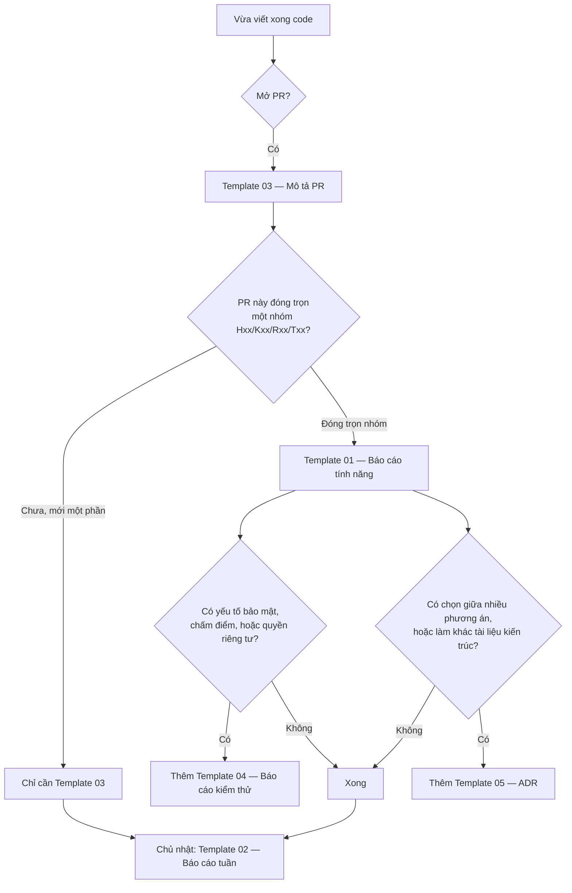

# Quy định báo cáo code — Anti-Scam Platform

**Ngày soạn:** 2026-09-07
**Áp dụng từ:** W01 (07/09/2026), cho cả 4 thành viên
**Liên quan:** [`Timeline_chi_tiet_theo_tuan.md`](../04_Timeline_chi_tiet/Timeline_chi_tiet_theo_tuan.md) · [`Danh_sach_tinh_nang_toan_he_thong.md`](../02_Danh_sach_tinh_nang/Danh_sach_tinh_nang_toan_he_thong.md)

---

## 1. Vấn đề tài liệu này giải quyết

Nhóm 4 người, 4 miền riêng, 3 ngôn ngữ (Java, Python, TypeScript), 48 nhóm tính năng. Nếu mỗi người chỉ commit code rồi nói "xong rồi", thì đến tuần thứ 10 sẽ xảy ra đúng ba chuyện:

1. **Không ai gọi được code của người khác** vì không biết endpoint tên gì, nhận gì, trả gì.
2. **Viết trùng nhau** — hai người cùng viết một DTO, một hàm chuẩn hoá số điện thoại.
3. **Tới lúc viết báo cáo khóa luận thì không nhớ mình đã làm gì** và vì sao lại làm như vậy, phải đọc lại code của chính mình từ đầu.

Ba việc đó tốn nhiều thời gian hơn hẳn thời gian viết báo cáo. **Báo cáo code không phải thủ tục hành chính — nó là cách để ba người còn lại dùng được code của bạn mà không cần hỏi bạn.**

### Một tiêu chí kiểm tra duy nhất

> **Đưa báo cáo cho một thành viên khác trong nhóm. Người đó phải làm được hai việc mà không hỏi bạn câu nào: (a) gọi được code của bạn, (b) giải thích lại được cho giảng viên bạn đã làm gì.**

Nếu không đạt được cả hai thì báo cáo chưa xong, bất kể nó dài bao nhiêu trang.

---

## 2. Năm loại báo cáo và khi nào dùng

| Mẫu | Tên | Khi nào viết | Ai đọc | Độ dài hợp lý |
|---|---|---|---|---|
| [`Template_01`](Template_01_Bao_cao_tinh_nang.md) | **Báo cáo tính năng** (BCTN) | Đóng xong một nhóm `Hxx`/`Kxx`/`Rxx`/`Txx` | 3 thành viên còn lại + giảng viên | 2–4 trang |
| [`Template_02`](Template_02_Bao_cao_tuan_ca_nhan.md) | **Báo cáo tuần / sprint cá nhân** | Chủ nhật cuối mỗi chu kỳ — **hằng tuần** trong giai đoạn MVP, **mỗi 2 tuần** từ tháng 11/2026 | Cả nhóm | 1 trang |
| [`Template_03`](Template_03_Mo_ta_Pull_Request.md) | **Mô tả Pull Request** | Mỗi lần mở PR | Người review chéo | 15–30 dòng |
| [`Template_04`](Template_04_Bao_cao_kiem_thu.md) | **Báo cáo kiểm thử** | Nhóm tính năng có yếu tố bảo mật hoặc chấm điểm | Giảng viên + người review | 1–3 trang |
| [`Template_05`](Template_05_Quyet_dinh_ky_thuat_ADR.md) | **Quyết định kỹ thuật (ADR)** | Khi chọn giữa nhiều phương án, hoặc khi đi ngược tài liệu kiến trúc | Cả nhóm, và hội đồng | 1 trang |

**Bắt buộc:** BCTN và Báo cáo tuần. Ba loại còn lại viết khi có tình huống tương ứng.

### Sơ đồ chọn mẫu



---

## 3. Quy tắc đặt tên và chỗ lưu

### Chỗ lưu

```
document/
└── WeekNN/                          # NN = số tuần, ví dụ Week07
    └── BaoCao/
        ├── BCTN_H02_Dang_nhap_va_phien_Hung.md
        ├── BCKT_K02_SSRF_guard_Khai.md
        ├── ADR_09_Chon_thu_vien_parse_VietQR_Thang.md
        └── Tuan_W07_Kien.md
```

### Quy tắc tên file

| Loại | Khuôn tên | Ví dụ |
|---|---|---|
| Báo cáo tính năng | `BCTN_<Mã nhóm>_<Ten_ngan>_<Nguoi>.md` | `BCTN_T04_Risk_Entity_Kien.md` |
| Báo cáo tuần | `Tuan_W<NN>_<Nguoi>.md` | `Tuan_W07_Thang.md` |
| Báo cáo kiểm thử | `BCKT_<Mã nhóm>_<Ten_ngan>_<Nguoi>.md` | `BCKT_K02_SSRF_guard_Khai.md` |
| ADR | `ADR_<số>_<Ten_quyet_dinh>_<Nguoi>.md` | `ADR_09_Chon_thu_vien_QR_Thang.md` |

Theo quy tắc chung của [`document/README.md`](../../README.md): **không khoảng trắng, tiếng Việt không dấu trong tên file**. Nội dung bên trong thì viết tiếng Việt có dấu bình thường.

---

## 4. Quy ước Git đi kèm

Báo cáo chỉ hữu ích khi truy ngược được về commit. Ba quy ước dưới đây là tối thiểu.

### 4.1. Tên nhánh

```
<loai>/<ma-nhom>-<mo-ta-ngan>
```

| Loại | Dùng khi | Ví dụ |
|---|---|---|
| `feat` | Thêm tính năng | `feat/H02-refresh-token-rotation` |
| `fix` | Sửa lỗi | `fix/K02-redirect-bo-sot-kiem-tra-ip` |
| `refactor` | Sửa cấu trúc, không đổi hành vi | `refactor/R04-tach-rule-repository` |
| `docs` | Chỉ sửa tài liệu | `docs/W07-bao-cao-tinh-nang-T06` |
| `test` | Chỉ thêm test | `test/K02-bo-test-tan-cong-ssrf` |
| `chore` | Cấu hình, CI, phụ thuộc | `chore/K12-them-coverage-badge` |

### 4.2. Commit message

```
<loai>(<ma-nhom>): <viec da lam, thi qua khu, tieng Viet khong dau hoac co dau deu duoc>

<Neu can: giai thich VI SAO lam vay, khong phai LAM GI - code da noi lam gi roi>
```

Ví dụ tốt:

```
feat(H02): luu hash refresh token thay vi plain text

Neu DB bi lo thi ke tan cong khong the dung truc tiep refresh token
de lay access token moi. Dung SHA-256 chu khong BCrypt vi refresh token
da du entropy, khong can chong brute-force cham.
```

Ví dụ không đạt: `update`, `fix bug`, `commit lan 3`, `abc`.

### 4.3. Một PR = một mục đích

Không gộp "thêm tính năng T05" với "đổi format toàn bộ file" trong một PR. Người review sẽ không tìm ra thay đổi thật giữa 2000 dòng đổi format.

---

## 5. Chuẩn comment trong code

Báo cáo giải thích **hệ thống**. Comment giải thích **đoạn code**. Hai thứ không thay thế nhau.

### 5.1. Đầu mỗi file/lớp — bắt buộc

Mỗi file nguồn mở đầu bằng một khối 3–8 dòng trả lời: *file này chịu trách nhiệm gì, và vì sao nó tồn tại*. Đây là thứ người khác đọc đầu tiên khi mở code của bạn.

Mẫu Java:

```java
/**
 * T04 · Risk Entity — nguồn sự thật về các thực thể đã bị báo cáo lừa đảo
 * (tên miền, URL, số điện thoại, số tài khoản, từ khoá, thương hiệu).
 *
 * Vì sao tách riêng: T01/T02/T03 và K08 đều tra cứu cùng một tập dữ liệu này.
 * Nếu mỗi nhóm tự truy vấn thì logic tính trạng thái sẽ lệch nhau.
 *
 * Ai gọi: PhoneScanService, BankAccountScanService, ReportModerationService.
 * Người phụ trách: Kiên.
 */
```

Mẫu Python — xem file [`services/scan-engine/app/engine/normalizer.py`](../../../services/scan-engine/app/engine/normalizer.py), file đó đang làm đúng chuẩn này và dùng làm mẫu tham chiếu cho cả nhóm.

### 5.2. Trong thân hàm

Chỉ comment ở ba chỗ:

| Comment ở đâu | Ví dụ |
|---|---|
| Chỗ code **không hiển nhiên** vì lý do nghiệp vụ | `// Trả 404 chứ không phải 403: 403 lộ ra rằng scanId này có tồn tại` |
| Chỗ code **trông như lỗi nhưng là cố ý** | `// Chỉ deleet token có chứa chữ cái, để '0912345678' không bị đổi thành 'ogiasasesta'` |
| Chỗ có **đánh đổi** đã cân nhắc | `// Dùng SHA-256 thay BCrypt: refresh token đã đủ entropy, không cần hash chậm` |

**Không comment** những thứ code đã nói: `// tăng i lên 1`, `// trả về user`. Comment loại này làm loãng và sẽ lệch với code sau vài lần sửa.

---

## 6. Định nghĩa "xong" (Definition of Done)

Một nhóm tính năng chỉ được tick "xong" khi đủ **cả 8** điều:

- [ ] Code đã merge vào `main`, không còn nhánh treo
- [ ] CI xanh — test của cả 3 service đều chạy qua
- [ ] Có test cho **đường đúng** và ít nhất một **đường sai** (input xấu, thiếu quyền, vượt giới hạn)
- [ ] Hợp đồng API đã cập nhật trong `contracts/openapi/` **nếu** có endpoint công khai mới hoặc đổi
- [ ] Migration DB chạy được từ database rỗng, không cần thao tác tay
- [ ] Đã có **Báo cáo tính năng** theo `Template_01`
- [ ] Người review chéo đã `Approve`
- [ ] Demo được bằng lệnh `curl` hoặc giao diện thật, có trong mục "Cách chạy thử" của báo cáo

> Điều cuối là điều dễ bỏ qua nhất và cũng quan trọng nhất. Nguyên tắc KH-4 của kế hoạch: **không nhận "đã code xong" nếu không demo được.**

---

## 7. Checklist review chéo

Người review dán checklist này vào phần bình luận PR và tick từng dòng. Review 10 phút có checklist tốt hơn review 30 phút không có gì để bám vào.

```markdown
### Checklist review — <tên người review>

**Hiểu được không**
- [ ] Đọc mô tả PR xong, tôi hiểu PR này làm gì mà không cần hỏi tác giả
- [ ] Mỗi file mới đều có khối comment đầu file nói rõ trách nhiệm

**Đúng không**
- [ ] Có test cho đường đúng và ít nhất một đường sai
- [ ] Input từ người dùng đều được validate trước khi dùng
- [ ] Lỗi được xử lý, không nuốt exception vào khối catch rỗng

**An toàn không**
- [ ] Không có khoá, mật khẩu, token nào bị commit
- [ ] Không ghi log mật khẩu, OTP, số thẻ, số tài khoản đầy đủ, SĐT đầy đủ
- [ ] Route admin có kiểm tra vai trò ở phía server, không chỉ ẩn nút ở client
- [ ] Không nối chuỗi vào câu SQL

**Có làm hỏng người khác không**
- [ ] Không đổi hợp đồng API đang có mà không sửa `contracts/openapi/` và không báo nhóm
- [ ] Không sửa file người khác đang làm dở mà chưa hỏi
- [ ] Migration không xoá cột/bảng đang được nhóm khác dùng

**Kết luận:** ☐ Approve ☐ Cần sửa (ghi rõ bên dưới)
```

---

## 8. Sai lầm thường gặp khi viết báo cáo

| Sai lầm | Vì sao dở | Sửa thế nào |
|---|---|---|
| Chép code vào báo cáo | Code đã có trong repo. Chép vào chỉ làm báo cáo dài mà không thêm thông tin | Chỉ trích 5–15 dòng ở chỗ **khó hiểu**, kèm giải thích vì sao viết vậy |
| Viết "đã hoàn thành chức năng đăng nhập" | Người đọc không biết gọi thế nào, trả gì, lỗi ra sao | Ghi endpoint, ví dụ request/response thật, danh sách mã lỗi |
| Chỉ ghi **làm gì**, không ghi **vì sao** | Cái làm gì thì đọc code là biết. Cái vì sao thì mất luôn nếu không ghi | Mục "Quyết định kỹ thuật và đánh đổi" trong `Template_01` là bắt buộc, không được để trống |
| Không ghi hạn chế đã biết | Hội đồng sẽ tìm ra, và lúc đó bạn bị động | Tự ghi trước ở mục "Hạn chế đã biết". Biết hạn chế của hệ thống mình là điểm cộng, không phải điểm trừ |
| Để trống mục "Ảnh hưởng tới người khác" | Người khác sẽ vỡ code lúc merge và không hiểu vì sao | Ghi rõ endpoint mới, DTO đổi, bảng mới, biến môi trường mới |
| Viết báo cáo sau 3 tuần | Không nhớ nữa, viết lại từ đọc code — tốn gấp 3 lần | Viết ngay khi mở PR, lúc đó mọi thứ còn trong đầu |

---

## 9. Nộp báo cáo — 4 bước

1. Copy file mẫu tương ứng từ thư mục này.
2. Đổi tên theo quy tắc ở mục 3, đặt vào `document/WeekNN/BaoCao/`.
3. Điền hết các mục. Mục nào không áp dụng thì ghi `Không áp dụng — <lý do một dòng>`, **không xoá mục và không để trống**.
4. Commit cùng nhánh code (`docs/...` nếu là báo cáo riêng), dán link báo cáo vào phần mô tả PR.

---

*Người soạn: Hùng · Ngày 2026-09-07 · Áp dụng từ W01, rà soát lại sau W04*
