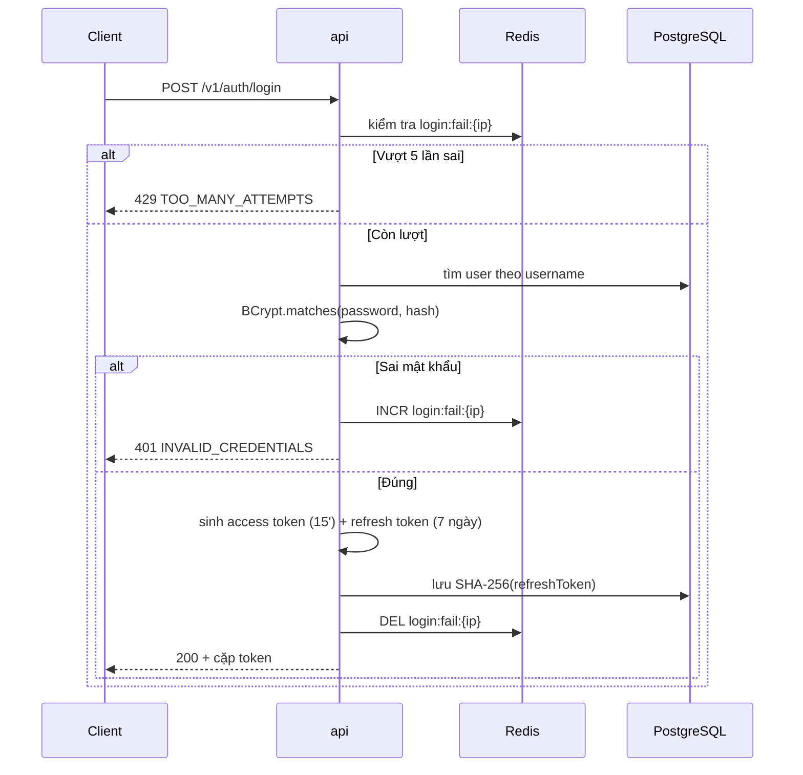

# [Mã nhóm] · [Tên nhóm tính năng] — Báo cáo tính năng

> **Mẫu số 01 · Báo cáo tính năng (BCTN)** — dùng khi đóng xong một nhóm `Hxx`/`Kxx`/`Rxx`/`Txx`.
> Copy file này, đổi tên thành `BCTN_<Mã>_<Ten_ngan>_<Nguoi>.md`, đặt vào `document/WeekNN/BaoCao/`.
> **Xoá toàn bộ khối trích dẫn hướng dẫn (bắt đầu bằng `>`) sau khi điền xong.**
> Mục nào không áp dụng thì ghi `Không áp dụng — <lý do>`, đừng xoá mục.

---

## Thông tin chung

| Trường | Giá trị |
|---|---|
| **Mã nhóm tính năng** | `[H02]` |
| **Tên nhóm** | [Đăng nhập & quản lý phiên] |
| **Người thực hiện** | [Tên] |
| **Người review chéo** | [Tên] |
| **Thành phần** | `[api]` `[worker]` `[engine]` `[web]` `[mobile]` `[ext]` `[infra]` |
| **Tuần / Sprint** | [W03 · S1] |
| **Mốc kiến trúc** | [M2] |
| **Pull Request** | [#12](link) |
| **Commit chính** | `[abc1234]` |
| **Trạng thái** | ☐ Đang làm ☐ Chờ review ☐ Đã merge ☐ Đã nghiệm thu |
| **Ngày nộp báo cáo** | [YYYY-MM-DD] |

---

## 1. Tóm tắt trong 30 giây

> Ba câu, viết cho người **không** làm phần này. Nếu người đọc chỉ đọc mục này rồi đóng file, họ vẫn phải nắm được ý chính.

- **Tôi đã làm gì:** [Một câu. Ví dụ: "Xây luồng đăng nhập cấp JWT 15 phút kèm refresh token 7 ngày có xoay vòng."]
- **Ai dùng được ngay:** [Ví dụ: "Thắng dùng để lấy `userId` cho T05/T10; Kiên dùng để bảo vệ route rule admin."]
- **Chạy thử nhanh nhất:** [Một lệnh. Ví dụ: `curl -X POST localhost:8080/v1/auth/login -d '{"username":"test","password":"Test@123"}'`]

---

## 2. Phạm vi đã làm

> Đối chiếu với danh sách tính năng gốc. Mục đích: người đọc biết chính xác **cái gì đã có, cái gì chưa** — không phải đoán.

### 2.1. Đã hoàn thành

| Ưu tiên | Tính năng (chép từ danh sách gốc) | Bằng chứng |
|---|---|---|
| `P0` | [Đăng nhập trả JWT access token TTL 15 phút + refresh token TTL 7 ngày] | [`AuthServiceTest#login_tra_ve_cap_token`] |
| `P0` | [Lưu refresh token dạng hash trong DB] | [Truy vấn `SELECT * FROM refresh_tokens` — cột `token_hash`] |
| `P1` | [...] | [...] |

### 2.2. Chưa làm — và vì sao

| Ưu tiên | Tính năng | Lý do hoãn | Dự kiến làm ở |
|---|---|---|---|
| `P1` | [Phát hiện token reuse → thu hồi toàn bộ phiên] | [Cần bảng `token_family`, để sau khi H05 audit log xong] | [W07] |
| `P2` | [Đăng nhập Google OAuth] | [Ngoài phạm vi `P0`, đưa vào chương Hướng phát triển] | [Không làm] |

---

## 3. Hợp đồng API

> Bỏ mục này nếu nhóm tính năng không có endpoint (ví dụ nhóm hạ tầng, thư viện UI).
> **Đây là mục người khác đọc nhiều nhất.** Ghi đủ để họ gọi được mà không cần mở code.

### 3.1. Danh sách endpoint

| Method | Path | Quyền | Mục đích |
|---|---|---|---|
| `POST` | `/v1/auth/login` | Công khai | Đăng nhập, cấp cặp token |
| `POST` | `/v1/auth/refresh` | Công khai (cần refresh token) | Xoay vòng token |
| `POST` | `/v1/auth/logout` | `USER` | Thu hồi phiên hiện tại |

### 3.2. Chi tiết từng endpoint

#### `POST /v1/auth/login`

**Request**

```json
{
  "username": "nguyenvana",
  "password": "MatKhau@123"
}
```

**Response `200`**

```json
{
  "accessToken": "eyJhbGciOiJIUzI1NiJ9...",
  "refreshToken": "8f3a...",
  "expiresIn": 900,
  "tokenType": "Bearer"
}
```

**Mã lỗi**

| HTTP | `errorCode` | Khi nào xảy ra | Client nên làm gì |
|---|---|---|---|
| `401` | `INVALID_CREDENTIALS` | Sai username hoặc mật khẩu | Hiện thông báo chung, **không** nói rõ sai cái nào |
| `429` | `TOO_MANY_ATTEMPTS` | Quá 5 lần sai trong 15 phút cùng IP | Đọc header `Retry-After`, khoá nút đăng nhập |
| `403` | `ACCOUNT_LOCKED` | Tài khoản bị admin khoá | Hiện lý do khoá |

> **Nếu có thay đổi phá vỡ tương thích (breaking change)**, ghi rõ ở đây: field nào bị bỏ, ai đang dùng, đã báo cho ai.

### 3.3. Cập nhật contract

- [ ] Đã cập nhật `contracts/openapi/[tên file].yaml`
- [ ] Đã sinh lại type TypeScript cho `web`/`mobile`
- [ ] Đã báo trong nhóm chat cho người bị ảnh hưởng

---

## 4. Mô hình dữ liệu

> Bỏ mục này nếu không đụng tới database.

### 4.1. Bảng mới / bảng sửa

| Bảng | Cột | Kiểu | Ràng buộc | Ghi chú |
|---|---|---|---|---|
| `refresh_tokens` | `id` | `BIGSERIAL` | PK | |
| | `user_id` | `BIGINT` | FK → `users(id)`, `NOT NULL` | |
| | `token_hash` | `VARCHAR(64)` | `NOT NULL`, UNIQUE | SHA-256, **không lưu plain text** |
| | `expires_at` | `TIMESTAMPTZ` | `NOT NULL` | |
| | `revoked_at` | `TIMESTAMPTZ` | NULL | NULL nghĩa là còn hiệu lực |

### 4.2. Index và lý do

| Index | Trên cột | Vì sao cần |
|---|---|---|
| `idx_refresh_user_active` | `(user_id, revoked_at)` | Truy vấn "mọi phiên còn hiệu lực của user" chạy ở mỗi lần đổi mật khẩu |

### 4.3. Migration

| File | Nội dung | Chạy được từ DB rỗng? |
|---|---|---|
| `V3__create_refresh_tokens.sql` | Tạo bảng + index | ☐ Đã kiểm tra |

### 4.4. Redis / cache

| Key | TTL | Nội dung | Ai vô hiệu hoá |
|---|---|---|---|
| `login:fail:{ip}` | 15 phút | Số lần đăng nhập sai | Tự hết hạn |

---

## 5. Luồng xử lý

> Vẽ **một** sơ đồ cho luồng chính. Không vẽ hết mọi nhánh — nhánh phụ mô tả bằng chữ ở dưới.



**Giải thích các bước không hiển nhiên:**

1. [Bước 2 kiểm tra rate limit **trước** khi truy vấn DB, để tấn công dò mật khẩu không tạo tải lên database.]
2. [Bước lưu SHA-256 chứ không lưu BCrypt: refresh token là chuỗi ngẫu nhiên 256 bit, đã đủ entropy nên không cần hash chậm chống brute-force.]

---

## 6. Cấu trúc mã nguồn

> **Đây là mục để người khác đọc được code của bạn.** Với mỗi file: trách nhiệm của nó trong một dòng. Không liệt kê file tầm thường (DTO thuần, file cấu hình trống).

| File | Trách nhiệm |
|---|---|
| [`services/api/.../AuthController.java`](../../../services/api/src/main/java/.../AuthController.java) | Nhận HTTP request, validate đầu vào, ánh xạ exception sang mã lỗi |
| [`services/api/.../AuthService.java`](...) | Logic đăng nhập: kiểm tra mật khẩu, sinh cặp token, xoay vòng |
| [`services/api/.../JwtTokenProvider.java`](...) | Ký và giải mã JWT. **Chỗ duy nhất** biết secret key |
| [`services/api/.../RefreshTokenRepository.java`](...) | Truy vấn bảng `refresh_tokens` |

**Điểm vào để đọc code:** [`AuthService#login()`] — đọc hàm này trước, các file còn lại đều được gọi từ đây.

**Quy ước đặt tên trong phần này:** [Ví dụ: mọi lớp kết thúc bằng `Provider` đều là thành phần không có trạng thái và test được độc lập.]

---

## 7. Quyết định kỹ thuật và đánh đổi

> **Mục quan trọng nhất của cả báo cáo và bắt buộc phải điền.** Code nói được *làm gì*, chỉ mục này nói được *vì sao*. Đây cũng là phần hội đồng hỏi nhiều nhất khi bảo vệ.

| # | Quyết định | Phương án đã cân nhắc | Vì sao chọn | Đánh đổi chấp nhận |
|---|---|---|---|---|
| 1 | [Lưu hash SHA-256 của refresh token] | [(a) lưu plain text, (b) BCrypt, (c) SHA-256] | [Lộ DB thì token không dùng lại được; SHA-256 đủ vì token đã ngẫu nhiên 256 bit] | [Không chống được kẻ tấn công đọc được cả DB *và* chặn được token trên đường truyền] |
| 2 | [Access token 15 phút] | [5 phút / 15 phút / 1 giờ] | [Cân giữa số lần gọi refresh và thời gian token bị lộ còn dùng được] | [Người dùng bị đăng xuất nếu mất mạng quá 15 phút và refresh cũng hỏng] |

---

## 8. Cấu hình và biến môi trường

> Ghi đủ để người khác chạy được trên máy họ. Đây là chỗ hay bị bỏ sót nhất và làm người khác mất cả buổi.

| Biến | Bắt buộc | Mặc định | Ý nghĩa |
|---|---|---|---|
| `JWT_SECRET` | Có | không có | Khoá ký JWT, tối thiểu 32 ký tự. **Không commit** |
| `JWT_ACCESS_TTL_SECONDS` | Không | `900` | Thời gian sống access token |
| `AUTH_MOCK` | Không | `false` | Bật endpoint cấp token giả cho dev |

- [ ] Đã cập nhật `.env.example`
- [ ] Đã kiểm tra: không có khoá nào bị commit vào repo

---

## 9. Bảo mật và quyền riêng tư

> Bắt buộc với mọi nhóm tính năng chạm vào dữ liệu người dùng. Nếu thật sự không chạm thì ghi lý do.

| Rủi ro | Cách xử lý trong nhóm tính năng này | Test khoá lại |
|---|---|---|
| [Dò mật khẩu bằng brute-force] | [Rate limit 5 lần sai/IP/15 phút, khoá 15 phút] | [`AuthRateLimitTest`] |
| [Lộ mật khẩu qua log] | [Không log request body của `/auth/*`; `toString()` của DTO che trường `password`] | [`LoggingMaskTest`] |
| [Dò tài khoản tồn tại hay không] | [Sai username và sai mật khẩu đều trả cùng `401 INVALID_CREDENTIALS`] | [`AuthServiceTest#khong_lo_username_ton_tai`] |

**Dữ liệu nhạy cảm được xử lý:** [mật khẩu, refresh token]
**Có ghi vào log không:** [Không. Đã kiểm tra bằng cách grep log của một phiên đăng nhập.]

---

## 10. Kiểm thử

### 10.1. Cách chạy

```bash
cd services/api && mvn test -Dtest=Auth*
```

### 10.2. Các case đã phủ

| # | Tình huống | Đầu vào | Kỳ vọng | Kết quả |
|---|---|---|---|---|
| 1 | Đăng nhập đúng | username + mật khẩu hợp lệ | `200` + cặp token | ✅ |
| 2 | Sai mật khẩu | mật khẩu sai | `401 INVALID_CREDENTIALS` | ✅ |
| 3 | Username không tồn tại | user lạ | `401` **cùng mã lỗi** với case 2 | ✅ |
| 4 | Vượt rate limit | gọi sai 6 lần | `429` + `Retry-After` | ✅ |
| 5 | Dùng lại refresh token cũ sau khi xoay vòng | token đã bị vô hiệu | `401` | ✅ |

**Độ phủ:** [xx%] · **Số test:** [n] · **CI:** [xanh / đỏ]

### 10.3. Trường hợp chưa test được

| Chưa test gì | Vì sao | Rủi ro còn lại |
|---|---|---|
| [Xoay vòng token khi có 2 request đồng thời] | [Cần test đồng thời, chưa dựng] | [Thấp — có UNIQUE trên `token_hash` chặn được] |

---

## 11. Cách chạy thử / demo

> Ghi các lệnh **copy dán chạy được ngay**. Người đọc không phải suy luận gì thêm.

```bash
# 1. Dựng hạ tầng
docker compose -f infra/docker-compose.yml up -d

# 2. Chạy api
cd services/api && ./mvnw spring-boot:run

# 3. Đăng ký
curl -X POST localhost:8080/v1/auth/register \
  -H 'Content-Type: application/json' \
  -d '{"username":"test","email":"test@example.com","password":"Test@1234"}'

# 4. Đăng nhập — lưu lại accessToken
curl -X POST localhost:8080/v1/auth/login \
  -H 'Content-Type: application/json' \
  -d '{"username":"test","password":"Test@1234"}'

# 5. Gọi endpoint cần token
curl localhost:8080/v1/scan/history -H "Authorization: Bearer <accessToken>"
```

**Kết quả mong đợi:** [Bước 4 trả `200` kèm `accessToken` và `refreshToken`. Bước 5 trả danh sách rỗng thay vì `401`.]

**Ảnh chụp màn hình:** [chèn ảnh nếu là tính năng giao diện]

---

## 12. Ảnh hưởng tới người khác

> Phần này quyết định 3 người còn lại có bị vỡ code hay không. **Không được để trống.**

| Ảnh hưởng gì | Ai bị ảnh hưởng | Họ cần làm gì |
|---|---|---|
| [Thêm 3 endpoint `/v1/auth/*`] | [Thắng — mobile, Kiên — web] | [Dùng `accessToken` trong header `Authorization: Bearer`] |
| [Thêm biến `JWT_SECRET`] | [Khải — hạ tầng] | [Thêm vào `docker-compose.yml` và `.env.example`] |
| [Mọi endpoint trừ `/auth/*` và `/health` giờ cần token] | [Cả nhóm] | [Gọi kèm token; dev vẫn dùng được `AUTH_MOCK=true`] |

**Đã báo cho những người trên chưa:** ☐ Rồi, ngày [YYYY-MM-DD], qua [nhóm chat / standup]

---

## 13. Hạn chế đã biết và việc còn nợ

> Tự ghi hạn chế trước khi bị hỏi. Nhận biết được hạn chế của hệ thống mình là điểm cộng khi bảo vệ, không phải điểm trừ.

| # | Hạn chế | Ảnh hưởng thực tế | Cách xử lý về sau |
|---|---|---|---|
| 1 | [Chưa phát hiện token reuse] | [Kẻ trộm được refresh token dùng được tới khi hết hạn 7 ngày] | [Thêm `token_family` ở W07 — đã có trong `P1`] |
| 2 | [Rate limit theo IP, không theo tài khoản] | [Nhiều người dùng chung NAT có thể chặn nhầm nhau] | [Ghi vào chương Hướng phát triển] |

---

## 14. Nhật ký thay đổi

| Ngày | Phiên bản | Thay đổi | PR |
|---|---|---|---|
| [2026-09-25] | 1.0 | Bản đầu tiên: login, refresh, logout | [#12] |
| [2026-10-16] | 1.1 | Đổi mật khẩu thu hồi toàn bộ refresh token | [#31] |

---

*Người viết: [Tên] · Ngày: [YYYY-MM-DD] · Người review: [Tên] · Mẫu: BCTN v1.0*
