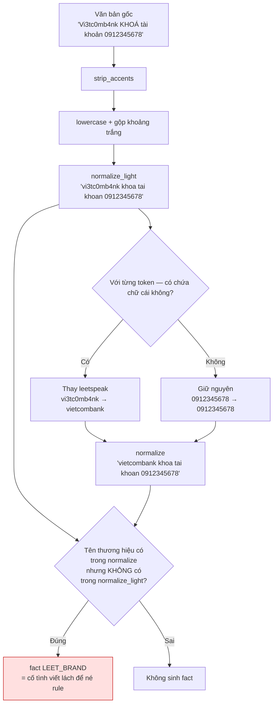

# H09 · Chuẩn hoá & tiền xử lý văn bản tiếng Việt — Báo cáo tính năng

> **VÍ DỤ MẪU ĐÃ ĐIỀN.** File này viết dựa trên code có thật đang chạy trong [`services/scan-engine/app/engine/normalizer.py`](../../../services/scan-engine/app/engine/normalizer.py), để cả nhóm thấy một báo cáo đạt chuẩn trông như thế nào.
> Đọc file này **trước** khi điền [`Template_01`](Template_01_Bao_cao_tinh_nang.md) lần đầu. Chú ý mức chi tiết ở mục 5, 6, 7 — đó là chỗ phân biệt báo cáo dùng được với báo cáo cho có.

---

## Thông tin chung

| Trường | Giá trị |
|---|---|
| **Mã nhóm tính năng** | `H09` |
| **Tên nhóm** | Chuẩn hoá & tiền xử lý văn bản tiếng Việt |
| **Người thực hiện** | Hùng |
| **Người review chéo** | Khải |
| **Thành phần** | `engine` |
| **Tuần / Sprint** | Trước W01 (đã hoàn thành ở mốc M1) |
| **Mốc kiến trúc** | M1 |
| **Pull Request** | #3 |
| **Commit chính** | `2e8544a` |
| **Trạng thái** | ☑ Đã nghiệm thu |
| **Ngày nộp báo cáo** | 2026-09-07 |

---

## 1. Tóm tắt trong 30 giây

- **Tôi đã làm gì:** Viết bước tiền xử lý đưa mọi biến thể viết của cùng một từ về một dạng chuẩn duy nhất, để rule engine chỉ cần so khớp một lần thay vì liệt kê hết mọi cách viết lách.
- **Ai dùng được ngay:** Kiên dùng cho R01 (khớp từ khoá) và R02 (trích xuất thực thể); Khải dùng cho K06 (phát hiện typosquatting sau khi gỡ leetspeak).
- **Chạy thử nhanh nhất:** `python -c "from app.engine.normalizer import normalize; print(normalize('Vi3tc0mb4nk KHOÁ tài khoản'))"` → `vietcombank khoa tai khoan`

---

## 2. Phạm vi đã làm

### 2.1. Đã hoàn thành

| Ưu tiên | Tính năng | Bằng chứng |
|---|---|---|
| `P0` | Hạ chữ thường, bỏ dấu tiếng Việt, gộp khoảng trắng | `normalize_light()`, test `test_entity_extraction` |
| `P0` | Gỡ leetspeak theo token có chứa chữ cái (`vi3tc0mb4nk` → `vietcombank`) | `_deleet_token()`, test `test_risk_level` |
| `P0` | So sánh hai mức chuẩn hoá để phát hiện cố tình né bộ lọc (fact `LEET_BRAND`) | `engine.py:168` |

### 2.2. Chưa làm — và vì sao

| Ưu tiên | Tính năng | Lý do hoãn | Dự kiến làm ở |
|---|---|---|---|
| `P1` | Chuẩn hoá ký tự Unicode đồng hình (homoglyph) | Trùng phạm vi với K06 của Khải — để tránh hai người viết hai bảng ánh xạ khác nhau, thống nhất để K06 làm | K06, hạn 20/11 |
| `P1` | Phát hiện ký tự vô hình (zero-width space) | Chưa gặp mẫu thật nào dùng kỹ thuật này trong tập dữ liệu hiện có | Xem lại sau khi có 500 mẫu gán nhãn (W11) |
| `P2` | Chuẩn hoá teencode và viết tắt | Ngoài phạm vi `P0`, đưa vào chương Hướng phát triển | Không làm |

---

## 3. Hợp đồng API

Không có endpoint công khai. H09 là thư viện nội bộ của `scan-engine`, được gọi từ `scan_text()`.

**Hợp đồng hàm** — đây mới là thứ người khác cần:

```python
normalize_light(text: str) -> str   # lowercase + bỏ dấu + gộp khoảng trắng
normalize(text: str) -> str         # normalize_light + gỡ leetspeak
strip_accents(text: str) -> str     # chỉ bỏ dấu, giữ nguyên hoa/thường
```

| Hàm | Vào | Ra | Dùng khi nào |
|---|---|---|---|
| `normalize()` | `"Vi3tc0mb4nk KHOÁ tài khoản"` | `"vietcombank khoa tai khoan"` | Khớp từ khoá và tên thương hiệu — **mặc định dùng hàm này** |
| `normalize_light()` | `"Vi3tc0mb4nk KHOÁ tài khoản"` | `"vi3tc0mb4nk khoa tai khoan"` | Chỉ dùng khi cần **so sánh** với `normalize()` để phát hiện leetspeak |

> **Điểm dễ nhầm cho người dùng lại:** hai hàm này **không** thay thế nhau. Giá trị của cặp hàm nằm ở chỗ **so sánh** kết quả. Nếu chỉ cần một hàm thì đã không tách làm hai.

---

## 4. Mô hình dữ liệu

Không áp dụng — `scan-engine` không truy cập database theo ADR-03. Toàn bộ H09 là hàm thuần, không có trạng thái.

---

## 5. Luồng xử lý



**Giải thích các bước không hiển nhiên:**

1. **Vì sao chỉ gỡ leetspeak ở token có chứa chữ cái.** Nếu áp bảng leetspeak lên toàn văn bản thì `0912345678` sẽ thành `ogiasasesta` và số điện thoại biến mất khỏi kết quả trích xuất. Kiểm tra `[a-z]` trong token trước khi thay là điều kiện tối thiểu để tách "chữ viết lách" khỏi "số thật".

2. **Vì sao giữ cả hai mức chuẩn hoá thay vì chỉ giữ mức đầy đủ.** Một tin nhắn viết `vietcombank` bình thường và một tin nhắn viết `vi3tc0mb4nk` sau khi chuẩn hoá là **giống hệt nhau**. Nhưng ý định của người gửi thì khác hẳn: người thứ hai đang cố né bộ lọc. Chênh lệch giữa `normalize()` và `normalize_light()` chính là tín hiệu đó, và nó được ghi lại thành fact `LEET_BRAND` để rule cộng điểm. Nếu chỉ giữ một mức thì mất luôn tín hiệu này.

3. **Vì sao xử lý `đ`/`Đ` riêng trước khi gọi `unicodedata.normalize("NFD")`.** Chữ `đ` không phải là `d` cộng dấu phụ trong Unicode — nó là một ký tự độc lập, nên NFD không tách được. Không xử lý riêng thì `đăng nhập` ra `đang nhap` (còn sót `đ`) và không khớp với từ khoá `dang nhap`.

---

## 6. Cấu trúc mã nguồn

| File | Trách nhiệm |
|---|---|
| [`app/engine/normalizer.py`](../../../services/scan-engine/app/engine/normalizer.py) | Toàn bộ H09. Bốn hàm công khai, không có trạng thái, không I/O |
| [`app/engine/engine.py:256-260`](../../../services/scan-engine/app/engine/engine.py) | Nơi gọi: `scan_text()` gọi cả hai mức chuẩn hoá rồi truyền vào `_collect_facts()` |
| [`app/engine/engine.py:168`](../../../services/scan-engine/app/engine/engine.py) | Nơi sinh fact `LEET_BRAND` từ chênh lệch giữa hai mức |

**Điểm vào để đọc code:** `normalizer.py` đọc từ trên xuống — file dài 60 dòng, khối comment đầu file đã giải thích ý đồ trước khi vào code.

**Quy ước:** hàm bắt đầu bằng `_` là nội bộ, không gọi từ module khác. Ba hàm không có `_` là hợp đồng công khai của H09.

---

## 7. Quyết định kỹ thuật và đánh đổi

| # | Quyết định | Phương án đã cân nhắc | Vì sao chọn | Đánh đổi chấp nhận |
|---|---|---|---|---|
| 1 | Gỡ leetspeak theo **token**, điều kiện là token chứa chữ cái | (a) áp bảng lên toàn chuỗi, (b) theo token có chữ cái, (c) chỉ áp lên token khớp gần với danh sách thương hiệu | (a) phá số điện thoại và số tài khoản; (c) chính xác hơn nhưng cần danh sách thương hiệu ngay ở bước tiền xử lý, làm bước này phụ thuộc vào dữ liệu — vi phạm nguyên tắc "hàm thuần" | Token lẫn chữ và số như `nha3` vẫn bị đổi thành `nhae`. Chấp nhận vì tiếng Việt hiếm khi có token dạng này ở ngữ cảnh cần giữ nguyên |
| 2 | Giữ **hai** mức chuẩn hoá thay vì một | (a) chỉ `normalize()`, (b) giữ cả hai | Chênh lệch giữa hai mức chính là bằng chứng "cố tình né bộ lọc" — thông tin này không tái tạo lại được nếu chỉ giữ một mức | Mọi nơi dùng H09 phải hiểu rõ nên gọi hàm nào. Đã giải thích trong khối comment đầu file và ở mục 3 báo cáo này |
| 3 | Bảng leetspeak cố định 9 ký tự, không cấu hình được | (a) hằng số trong code, (b) đọc từ file cấu hình | Bảng này gần như không đổi và nằm trong lớp hàm thuần. Đưa ra file cấu hình là thêm I/O vào chỗ ADR-03 quy định không được có I/O | Muốn thêm ký tự leet mới thì phải sửa code và deploy lại. Chấp nhận vì tần suất thay đổi rất thấp |

---

## 8. Cấu hình và biến môi trường

Không có. H09 không đọc biến môi trường nào — đây là hệ quả trực tiếp của ràng buộc "hàm thuần" trong ADR-03, và cũng là lý do module này test được mà không cần dựng hạ tầng gì.

---

## 9. Bảo mật và quyền riêng tư

| Rủi ro | Cách xử lý | Test khoá lại |
|---|---|---|
| Ghi log văn bản người dùng gửi lên (có thể chứa OTP, số tài khoản) | H09 **không ghi log gì cả**. Việc ghi log do tầng gọi quyết định, và tầng đó đã che PII theo H08 | Đọc code: không có `logging` nào trong `normalizer.py` |
| Đầu vào quá lớn gây treo | Giới hạn 5000 ký tự đã chặn ở tầng API trước khi tới H09 | `test_validation_returns_400` |

**Dữ liệu nhạy cảm được xử lý:** nội dung tin nhắn người dùng gửi lên.
**Có ghi vào log không:** Không.

---

## 10. Kiểm thử

### 10.1. Cách chạy

```bash
cd services/scan-engine
pytest tests/ -v
```

### 10.2. Các case đã phủ

| # | Tình huống | Đầu vào | Kỳ vọng | Kết quả |
|---|---|---|---|---|
| 1 | Bỏ dấu tiếng Việt | `"khoá tài khoản"` | `"khoa tai khoan"` | ✅ |
| 2 | Chữ `đ` | `"đăng nhập"` | `"dang nhap"` | ✅ |
| 3 | Leetspeak trong tên thương hiệu | `"vi3tc0mb4nk"` | `"vietcombank"` | ✅ |
| 4 | **Số điện thoại không bị đổi** | `"0912345678"` | `"0912345678"` | ✅ |
| 5 | Gộp khoảng trắng thừa | `"a    b"` | `"a b"` | ✅ |
| 6 | Kết quả tất định — chạy 2 lần ra y hệt | cùng một input | cùng một output | ✅ (`test_deterministic`) |

**Độ phủ:** 100% dòng của `normalizer.py` · **Số test liên quan:** 8 · **CI:** xanh

### 10.3. Trường hợp chưa test được

| Chưa test gì | Vì sao | Rủi ro còn lại |
|---|---|---|
| Ký tự Unicode đồng hình (chữ Cyrillic `а` trông giống `a` Latin) | Đã thống nhất để K06 xử lý, tránh hai người viết hai bảng ánh xạ khác nhau | Trung bình — tên miền dùng homoglyph hiện lọt qua H09, nhưng K06 sẽ bắt ở tầng tên miền |

---

## 11. Cách chạy thử / demo

```bash
cd services/scan-engine
pip install -r requirements.txt

# Thử trực tiếp
python -c "
from app.engine.normalizer import normalize, normalize_light
t = 'Vi3tc0mb4nk thông báo KHOÁ tài khoản, gọi 0912345678'
print('light    :', normalize_light(t))
print('full     :', normalize(t))
"

# Thử qua API
uvicorn app.main:app --reload
curl -X POST localhost:8000/v1/scan/text \
  -H 'Content-Type: application/json' \
  -d '{"text":"Vi3tc0mb4nk thong bao khoa tai khoan","source":"SMS"}'
```

**Kết quả mong đợi:**

```
light    : vi3tc0mb4nk thong bao khoa tai khoan, goi 0912345678
full     : vietcombank thong bao khoa tai khoan, goi 0912345678
```

Số điện thoại giữ nguyên ở cả hai dòng — đó là điểm cần nhìn. Response của API có evidence `LEET_BRAND` vì `vietcombank` chỉ xuất hiện ở dòng thứ hai.

---

## 12. Ảnh hưởng tới người khác

| Ảnh hưởng gì | Ai bị ảnh hưởng | Họ cần làm gì |
|---|---|---|
| Mọi từ khoá trong `rules.json` phải viết ở **dạng đã chuẩn hoá** (không dấu, chữ thường) | Kiên — R01, R07 | Viết `"chuyen khoan"` chứ không phải `"Chuyển khoản"`. Viết có dấu thì rule không bao giờ khớp |
| Bảng leetspeak dùng chung | Khải — K06 | K06 phát hiện thương hiệu lộ ra sau khi gỡ leetspeak thì gọi `normalize()`, đừng tự viết bảng thứ hai |
| Fact `LEET_BRAND` đã có sẵn | Kiên — R04 | Rule mới có thể dùng fact này trong `requiresAll`/`requiresAny` mà không cần thêm code |

**Đã báo cho những người trên chưa:** ☑ Rồi — trong buổi trình bày kiến trúc Week 3 và ghi lại trong danh sách tính năng Week 6.

---

## 13. Hạn chế đã biết và việc còn nợ

| # | Hạn chế | Ảnh hưởng thực tế | Cách xử lý về sau |
|---|---|---|---|
| 1 | Không xử lý ký tự Unicode đồng hình | Tin nhắn dùng chữ Cyrillic trông giống Latin lọt qua bước này | K06 xử lý ở tầng tên miền (hạn 20/11). Với văn bản thuần thì vẫn hở — ghi vào chương Hướng phát triển |
| 2 | Không xử lý ký tự vô hình (zero-width space) | `viet<ZWSP>combank` không được nhận ra là `vietcombank` | Chờ tập 500 mẫu gán nhãn (W11) xem có xuất hiện thực tế không rồi mới quyết định làm |
| 3 | Bảng leetspeak chỉ có 9 ký tự | Biến thể lạ như `v!etc0mbank` (dấu `!` thay `i`) lọt qua | Mở rộng bảng sau khi phân tích case sai ở H12 (W14) |

---

## 14. Nhật ký thay đổi

| Ngày | Phiên bản | Thay đổi | PR |
|---|---|---|---|
| 2026-08-xx | 1.0 | Bản đầu tiên ở mốc M1: 4 hàm, 8 test | #3 |

---

*Người viết: Hùng · Ngày: 2026-09-07 · Người review: Khải · Mẫu: BCTN v1.0*
