# Kiến trúc và công nghệ

**Người tạo:** Lê Trung Kiên  
**Ngày tạo:** 2026-09-19  

> **Architecture revision:** Input/Output Coverage Update  
> **Mục tiêu của revision:** mọi loại input được hệ thống công bố phải có **processor owner** rõ ràng; mọi output được công bố phải có **module chịu trách nhiệm tạo ra**. Không để input chỉ xuất hiện ở UI/API nhưng không có worker/module/function xử lý phía sau.

## 1. Input, output và coverage contract của hệ thống

### 1.1. Input và output chính thức

| Loại | Giá trị |
| --- | --- |
| **Input** | - URL/link đáng nghi<br />- Nội dung tin nhắn, đoạn hội thoại<br />- Bài đăng giao dịch / nội dung rao bán, tuyển dụng, hoàn tiền, giao hàng...<br />- HTML / form công khai của website<br />- Số điện thoại<br />- Số tài khoản ngân hàng / mã ngân hàng nếu có<br />- **CCCD / mã định danh cá nhân do người dùng chủ động nhập để kiểm tra tín hiệu rủi ro liên quan**<br />- QR code / VietQR<br />- Báo cáo lừa đảo do cộng đồng gửi lên |
| **Output** | - Điểm rủi ro: `0 - 100`<br />- Mức cảnh báo: `SAFE`, `CAUTION`, `DANGER`<br />- Bằng chứng theo rule / signal<br />- Giải thích lý do<br />- Khuyến nghị hành động<br />- Trạng thái xử lý: `PENDING`, `PROCESSING`, `COMPLETED`, `FAILED`<br />- Lịch sử scan của user<br />- Audit / operational log cho admin và vận hành |

Kiến trúc được lựa chọn là **Modular Monolith + Event-Driven Workers**. Spring Boot giữ vai trò business core và owner của final result; các tác vụ phân tích chuyên biệt hoặc tốn thời gian được tách thành worker chạy bất đồng bộ qua RabbitMQ. AI/ML được triển khai qua **Python AI/ML Service** riêng.

Trong MVP, hệ thống vẫn có thể chạy bằng **rule-based + heuristic + reputation/community signal**. AI là tín hiệu bổ sung và không phải nguồn duy nhất quyết định verdict.

### 1.2. Input Coverage Matrix

Bảng này là **contract kiến trúc**. Nếu thêm một `InputType` mới, phải cập nhật bảng này, `ScanTypeResolver`, queue/routing key, processor tương ứng và test coverage.

| Input | `ScanType` / `EntityType` | Processor owner | Core functions bắt buộc | Downstream |
| --- | --- | --- | --- | --- |
| **URL/link** | `URL` | **Web/URL Scanner Worker** | `normalizeUrl`, `validateUrl`, lexical analysis, DNS/domain lookup, redirect analysis, TLS/HTTPS analysis, typosquatting, reputation lookup, safe public fetch, SSRF protection | Rule Engine, optional URL ML, Risk Fusion |
| **HTML / Form công khai** | `WEB_CONTENT` | **Web/URL Scanner Worker - HTML/Form Analyzer submodule** | sanitize/size-limit input, parse HTML, extract form/input/action, detect credential/OTP/PIN/CVV/CCCD collection cues, cross-domain form action, suspicious keywords | Rule Engine, optional Web/Text ML, Risk Fusion |
| **Tin nhắn / hội thoại** | `TEXT` | **Text Analyzer Worker** | normalize text, entity extraction, scam cue/pattern detection, scenario classification, nested indicator extraction | Rule Engine, optional Text ML, nested URL/Entity scan, Risk Fusion |
| **Bài đăng giao dịch** | `TRANSACTION_POST` | **Text Analyzer Worker** | text preprocessing, amount/contact/account/link extraction, scam scenario rules, urgency/payment cues | Rule Engine, optional Text ML, nested URL/Entity scan, Risk Fusion |
| **Số điện thoại** | `ENTITY:PHONE` | **Entity/Reputation Checker Worker** | `normalizePhone`, protected lookup key, threat/community lookup, report count, verified report count, source confidence, time-decay | Reputation Signal, Rule Engine, Risk Fusion |
| **Tài khoản ngân hàng** | `ENTITY:BANK_ACCOUNT` | **Entity/Reputation Checker Worker** | normalize account/bank code, protected lookup key, threat/community lookup, report stats, source confidence, time-decay | Reputation Signal, Rule Engine, Risk Fusion |
| **CCCD** | `ENTITY:CCCD` | **Entity/Reputation Checker Worker** | validate format, normalize, HMAC/protected lookup, threat/community cross-reference, association signal; không mặc định lưu raw CCCD | Reputation Signal, Rule Engine, Risk Fusion |
| **QR / VietQR** | `QR` | **QR Parser Worker** | decode/validate, classify QR type, parse VietQR, extract URL/text/bank account/amount/content, return derived indicators | Scan Orchestrator dispatches nested URL/Text/Entity jobs |
| **Community Report** | `REPORT` | **Community Report Module** | validate report, evidence upload, moderation workflow, reporter/reputation metadata, verified report conversion to risk signal/entity | Threat/Reputation data, Risk Fusion, Admin Review |

### 1.3. Output Coverage Matrix

| Output | Module owner | Cách hình thành |
| --- | --- | --- |
| **Risk score `0-100`** | **Risk Fusion** | Kết hợp rule score, technical signal, reputation/community signal và AI probability theo policy/version |
| **`SAFE / CAUTION / DANGER`** | **Risk Fusion** | Mapping từ final score và hard-rule override nếu có |
| **Evidence** | **Rule Engine + Signal Aggregator** | Rule match, source signal, technical finding, reputation finding, model signal |
| **Explanation** | **Result Composer / Explainability** | Biến evidence kỹ thuật thành câu giải thích dễ hiểu, không để AI tự sinh verdict không kiểm soát |
| **Recommendation** | **Result Composer / Recommendation Policy** | Chọn hành động khuyến nghị theo risk level + evidence category |
| **Processing status** | **Scan Orchestrator** | Quản lý lifecycle của `ScanRequest`: pending/processing/completed/failed |
| **Scan history** | **Scan Query & History Module** | Query `ScanRequest` + `RiskResult` theo user, type, level, time |
| **Audit / operational log** | **Audit & Observability Module** | Admin action, rule change, report moderation, scan failure, worker retry/DLQ metadata |

### 1.4. Quy tắc dispatch để không bỏ sót input

Spring Boot không dùng `if/else` rải rác cho từng input. `Scan Orchestrator` sử dụng `ScanTypeResolver` + `ProcessorRegistry` để đảm bảo mỗi loại input có handler.

```text
Incoming ScanRequest
        │
        ▼
Input Validation
        │
        ▼
ScanTypeResolver
        │
        ├── URL --------------------> Web/URL Scanner Worker
        ├── WEB_CONTENT ------------> Web/URL Scanner Worker (HTML/Form mode)
        ├── TEXT -------------------> Text Analyzer Worker
        ├── TRANSACTION_POST -------> Text Analyzer Worker
        ├── ENTITY:PHONE -----------> Entity/Reputation Checker Worker
        ├── ENTITY:BANK_ACCOUNT ----> Entity/Reputation Checker Worker
        ├── ENTITY:CCCD ------------> Entity/Reputation Checker Worker
        └── QR ---------------------> QR Parser Worker
```

Mỗi processor trả về **signals**, không tự quyết định final verdict.

---

## 2. C4 Architecture

C4 được sử dụng để mô tả kiến trúc theo ba mức chính: **System Context**, **Container** và **Component**. Trong tài liệu này, “Container” là đơn vị ứng dụng/runtime theo C4, không đồng nghĩa với Docker container.

### 2.1. C4 Level 1 - System Context

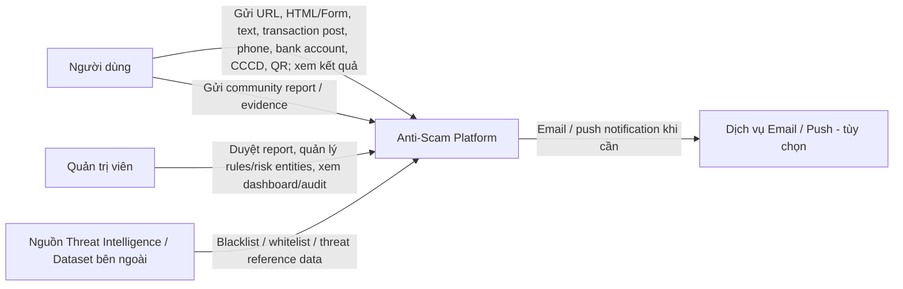

**Phạm vi hệ thống:** Anti-Scam Platform nhận nhiều loại indicator/content, phân tích bằng worker chuyên biệt, rule/heuristic, reputation/community data và AI nếu được bật, sau đó trả về một `RiskResult` thống nhất.

Đối với **CCCD**, hệ thống chỉ đánh giá **tín hiệu rủi ro liên quan đến identifier** dựa trên dữ liệu hợp lệ mà hệ thống được phép sử dụng; không suy diễn rằng chủ sở hữu CCCD là “người lừa đảo”. Raw CCCD không nên được lưu/log mặc định.

### 2.2. C4 Level 2 - Container

```mermaid
flowchart TB
    subgraph ClientLayer[Client Layer]
        UserWeb[User Web - Next.js]
        AdminWeb[Admin Dashboard - Next.js]
        Mobile[Mobile App - React Native]
    end

    subgraph EdgeLayer[Edge Layer]
        Nginx[Nginx Reverse Proxy / TLS / Routing]
    end

    subgraph ApplicationLayer[Application Layer]
        Backend[Spring Boot Modular Monolith\nREST API + Business Core]
        AI[Python AI/ML Service\nPreprocessing + Model Inference]
    end

    subgraph MessagingLayer[Messaging Layer]
        MQ[(RabbitMQ)]
    end

    subgraph WorkerLayer[Worker Layer]
        WebWorker[Web / URL Scanner Worker\nURL + HTML/Form Analyzer]
        TextWorker[Text Analyzer Worker\nMessage + Conversation + Transaction Post]
        EntityWorker[Entity / Reputation Checker Worker\nPhone + Bank Account + CCCD]
        QrWorker[QR Parser Worker]
        ExportWorker[PDF / HTML Export Worker]
    end

    subgraph ThreatPipeline[Threat Intelligence Pipeline]
        ThreatFeeds[External Threat Feeds / Dataset]
        IngestionWorker[Threat Data Ingestion Worker]
    end

    subgraph DataLayer[Data Layer]
        PG[(PostgreSQL\nSource of Truth)]
        Redis[(Redis\nCache / Rate Limit / Idempotency)]
        Storage[(MinIO / S3-compatible Storage)]
    end

    UserWeb -->|HTTPS| Nginx
    AdminWeb -->|HTTPS| Nginx
    Mobile -->|HTTPS| Nginx
    Nginx -->|REST / HTTPS| Backend

    Backend -->|SQL| PG
    Backend -->|Cache / Rate limit / Idempotency| Redis
    Backend -->|Publish jobs / consume results| MQ
    Backend -->|Store / read evidence metadata| Storage

    MQ --> WebWorker
    MQ --> TextWorker
    MQ --> EntityWorker
    MQ --> QrWorker
    MQ --> ExportWorker

    WebWorker -->|Technical + web-content signals| MQ
    TextWorker -->|Text + extracted indicator signals| MQ
    EntityWorker -->|Entity / reputation signals| MQ
    QrWorker -->|Parsed QR + derived indicators| MQ
    ExportWorker -->|Generated report| Storage

    WebWorker -->|ML inference khi enabled| AI
    TextWorker -->|ML inference khi enabled| AI
    AI -->|Probability / label / model metadata| WebWorker
    AI -->|Probability / label / model metadata| TextWorker

    WebWorker -->|Threat / reputation query| Backend
    EntityWorker -->|Threat / reputation query| Backend
    TextWorker -->|Nested indicator lookup khi cần| Backend

    ThreatFeeds --> IngestionWorker
    IngestionWorker -->|Normalize / validate / deduplicate / upsert| PG
    IngestionWorker -->|Refresh hot threat cache| Redis
```

**Các quyết định chính ở mức Container:**

- **Nginx** là edge gateway: TLS termination, reverse proxy, routing và giới hạn request cơ bản. Nginx không điều phối detection workflow.
- **Spring Boot Modular Monolith** là business core: auth, validation, input routing, scan orchestration, threat/reputation query, rule engine, signal aggregation, risk fusion, result composition, history, report, admin, notification và persistence ownership.
- **RabbitMQ** phân phối job bất đồng bộ và worker result.
- **Web/URL Scanner Worker** xử lý cả URL và web content. `HTML/Form Analyzer` là submodule của worker này, tránh việc input HTML có trong requirement nhưng không có processor.
- **Text Analyzer Worker** xử lý cả message/conversation và transaction post.
- **Entity/Reputation Checker Worker** thay cho `Phone/Bank Checker`; hỗ trợ `PHONE`, `BANK_ACCOUNT`, `CCCD` qua strategy theo `EntityType`.
- **QR Parser Worker** chỉ parse/derive indicator. `Scan Orchestrator` mới là thành phần dispatch các nested scan sang URL/Text/Entity processor.
- **Python AI/ML Service** trả prediction; Spring Boot tạo business verdict.
- **PostgreSQL** là source of truth. **Redis** là cache/coordination state, không phải nơi lưu threat data duy nhất.

#### 2.2.1. Client feature parity

**Nguyên tắc thiết kế client:** `User Web` và `Mobile App` phải cung cấp **cùng tập tính năng nghiệp vụ cốt lõi cho người dùng ở mức tối đa có thể**. Chỉ tách khác nhau khi một interaction không tự nhiên hoặc phụ thuộc capability của thiết bị. Cả hai client sử dụng cùng Spring Boot API và cùng business rules; không tạo backend riêng cho Web và Mobile.

| User feature | User Web - Next.js | Mobile App - React Native | Ghi chú |
| --- | --- | --- | --- |
| Đăng ký / đăng nhập / profile | ✅ | ✅ | Cùng Auth/User API |
| Scan URL / link | ✅ | ✅ | Cùng `ScanType=URL` |
| Scan text / hội thoại | ✅ | ✅ | Paste/nhập nội dung |
| Scan bài đăng giao dịch | ✅ | ✅ | Cùng `TRANSACTION_POST` flow |
| Scan số điện thoại | ✅ | ✅ | Cùng Entity Checker |
| Scan tài khoản ngân hàng | ✅ | ✅ | Cùng Entity Checker |
| Scan CCCD | ✅ | ✅ | Cùng protected entity lookup policy |
| Scan QR / VietQR | ✅ upload ảnh QR | ✅ camera hoặc upload ảnh | Camera trực tiếp là mobile-native; Web vẫn có cùng capability bằng upload ảnh |
| Xem processing status | ✅ | ✅ | Cùng Scan Orchestrator/status API |
| Xem RiskResult / evidence / explanation / recommendation | ✅ | ✅ | Cùng result contract |
| Xem lịch sử scan | ✅ | ✅ | Cùng History API |
| Gửi Community Report + evidence | ✅ | ✅ | Cùng Report API |
| Export / chia sẻ kết quả | ✅ | ✅ | Cùng export/result API; cách share phụ thuộc platform |
| In-app notification/status update | ✅ | ✅ | Cùng Notification domain event |
| Share URL từ app khác vào Anti-Scam app | — | ✅ | Mobile share sheet là interaction tự nhiên; không coi đây là thiếu core feature của Web |
| Scan QR trực tiếp bằng camera | — | ✅ | Web desktop dùng upload ảnh QR thay vì bắt buộc camera |

`Admin Dashboard` là client riêng cho vai trò quản trị và **không cần parity với User Web/Mobile**. Các tính năng admin gồm moderation Community Report, quản lý rules/policies, risk entities, threat sources, dashboard/statistics và audit.

```text
User Web ────────┐
Mobile App ──────┼──> Nginx ──> Same Spring Boot API ──> Same Detection Core
Admin Dashboard ─┘
```

### 2.3. C4 Level 3 - Spring Boot Backend Components

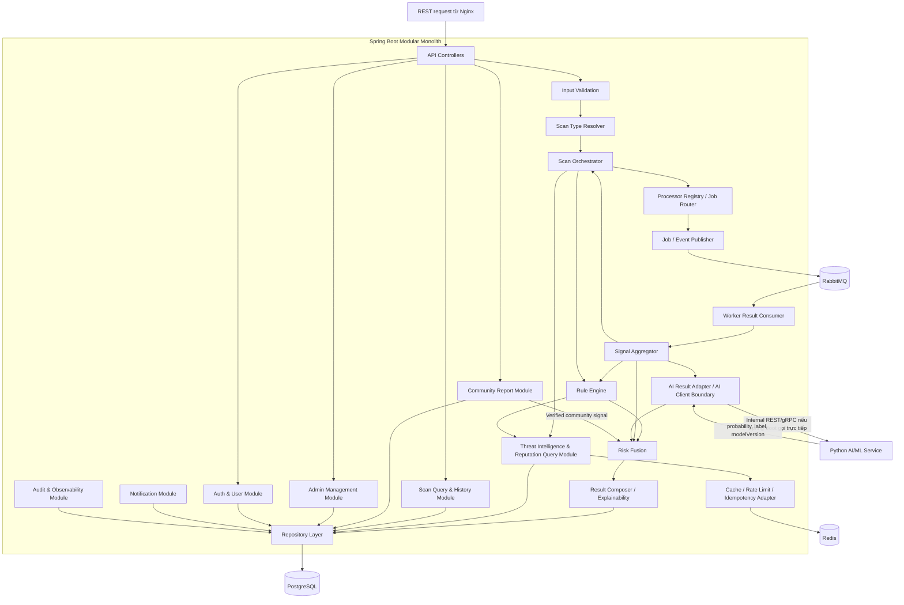

**Luồng trách nhiệm chính:**

1. `Input Validation` kiểm tra schema, kích thước, định dạng và security constraint.
2. `Scan Type Resolver` xác định `URL`, `WEB_CONTENT`, `TEXT`, `TRANSACTION_POST`, `ENTITY`, `QR`.
3. `Scan Orchestrator` tạo `ScanRequest`, quản lý status, cache check, parent/child scan và lifecycle.
4. `Processor Registry / Job Router` map `ScanType`/`EntityType` sang routing key/worker phù hợp.
5. Worker trả `AnalysisSignal[]` và `DerivedIndicator[]`.
6. `Signal Aggregator` gom technical, content, reputation, community và AI signal.
7. `Rule Engine` sinh `RuleMatch[]` và evidence có thể giải thích.
8. `Risk Fusion` tạo final `riskScore` + `riskLevel`.
9. `Result Composer` tạo explanation + recommendation + response DTO thống nhất.
10. `Scan Query & History` phục vụ status/history mà không chạy lại scan.
11. `Audit & Observability` ghi administrative/audit/worker failure/retry metadata.

### 2.4. Component view cho Python AI/ML Service

Python AI/ML Service được tách để tận dụng ecosystem Python nhưng vẫn giữ business decision ở Java.

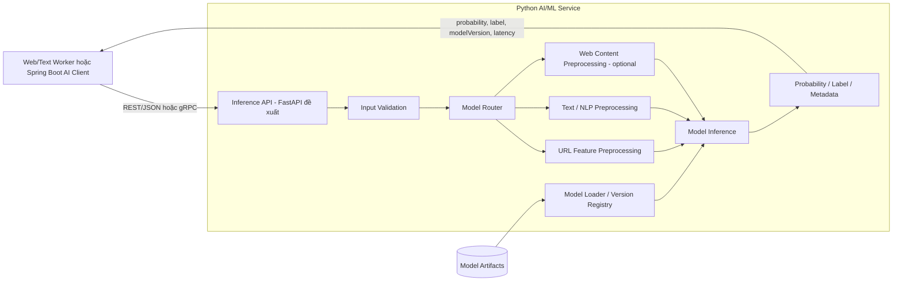

**Nguyên tắc:** Python trả **prediction**, Java trả **business verdict**.

Ví dụ inference contract:

```json
{
  "prediction": {
    "label": "PHISHING",
    "probability": 0.87,
    "modelVersion": "url-model-v1",
    "latencyMs": 42
  }
}
```

Prediction là một `AnalysisSignal`, sau đó được Risk Fusion kết hợp với rule, reputation, community và technical findings.

---

## 3. Kiến trúc hệ thống

### 3.1. Sơ đồ kiến trúc tổng thể

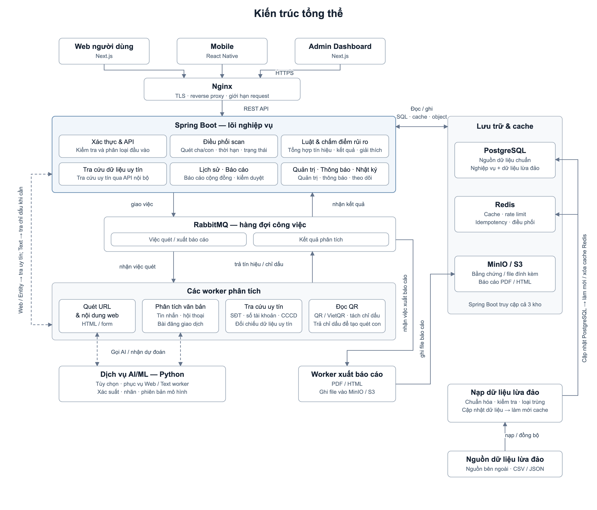

[Mở bản vector SVG](diagrams/02-tong-the-v2.svg). Ảnh tổng quan nhóm các module và kết nối theo vai trò; sơ đồ Mermaid bên dưới giữ chi tiết từng thành phần. Đây là thiết kế theo tài liệu v3, chưa xác nhận từ mã nguồn triển khai.

Ảnh hiện có đề xuất cập nhật luồng AI/LLM: Web/Text gửi job AI qua RabbitMQ, worker AI xử lý riêng và trả tín hiệu qua hàng đợi kết quả về Spring Boot. Mermaid và đặc tả AI bên dưới vẫn là bản v3 trước thay đổi này; xem [ghi chú đối chiếu](diagrams/02-tong-the-v2-check.md) về phạm vi cần đồng bộ.

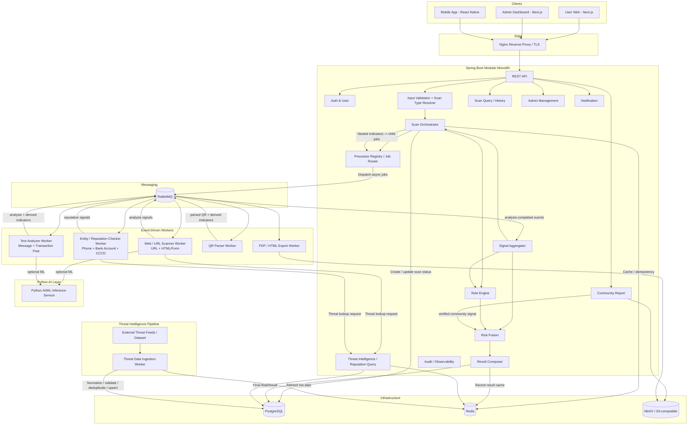

### 3.2. User scan flow tổng quát

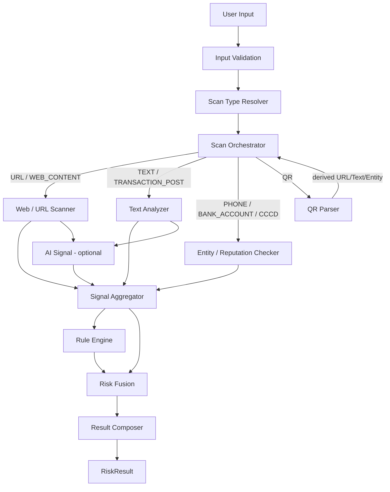

Điểm quan trọng của flow này là **QR và Text có thể tạo ra nested indicators**. Ví dụ một tin nhắn chứa URL + số điện thoại + tài khoản ngân hàng; hoặc một VietQR chứa tài khoản + nội dung chuyển khoản. `Scan Orchestrator` tạo child scan cho các indicator này và `Signal Aggregator` gom kết quả trước khi Risk Fusion quyết định.

### 3.3. Luồng scan URL điển hình

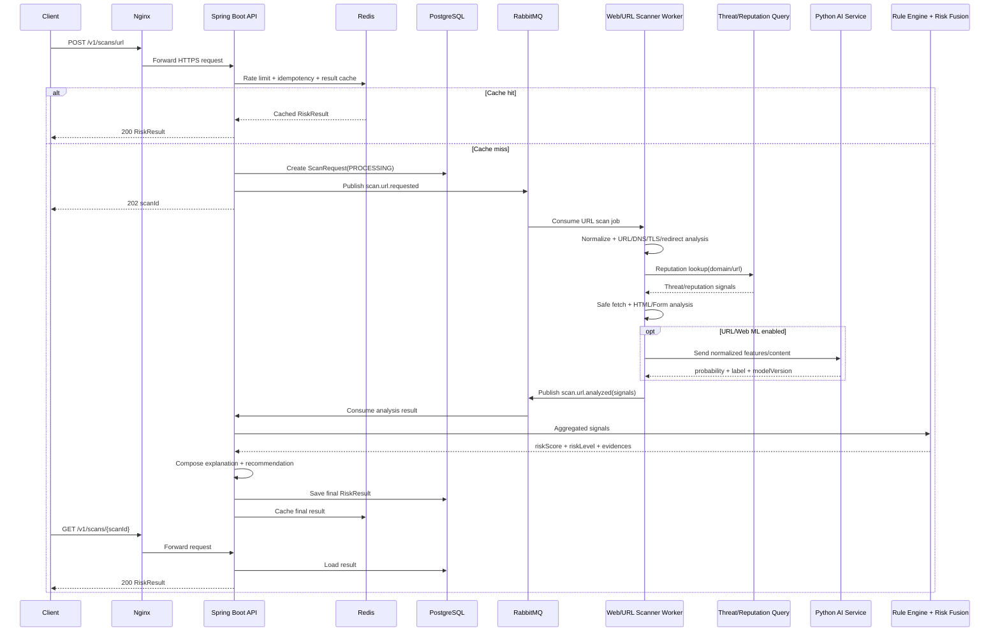

### 3.4. Luồng Text / Transaction Post với nested indicators

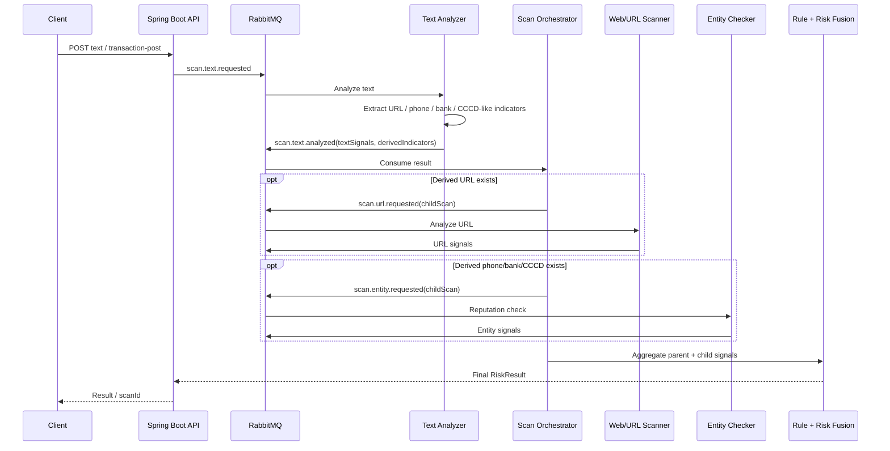

### 3.5. Luồng QR / VietQR

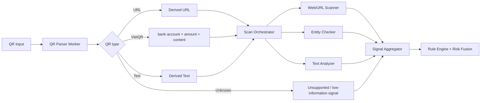

### 3.6. Kết hợp Rule Engine, Reputation và AI

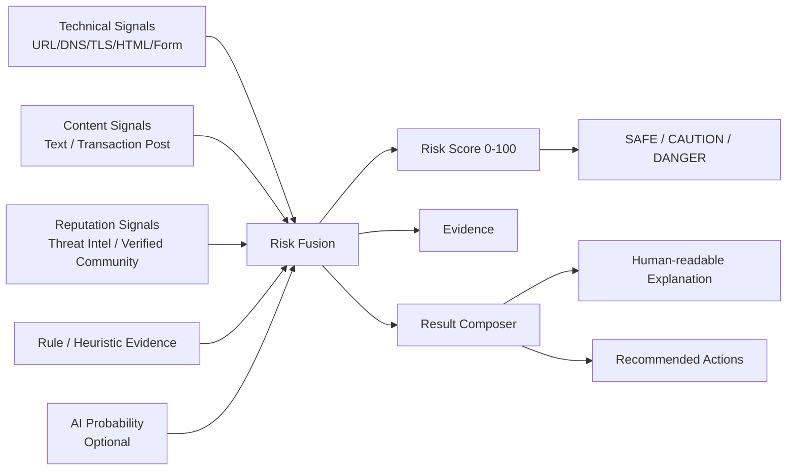

AI không thay thế Rule Engine. AI là một signal bổ sung; hệ thống vẫn hoạt động khi AI unavailable bằng rule/heuristic/reputation.

---

## 4. Đặc tả module, worker và core functions

### 4.1. Module/Container responsibilities

| Module | Trách nhiệm chính | Input | Output / giao tiếp |
| --- | --- | --- | --- |
| **User Web - Next.js** | Cung cấp toàn bộ core user features: auth/profile; scan URL, text, transaction post, phone, bank account, CCCD, QR qua upload; xem status/result/history; community report; export/share result | User interaction / supported scan inputs | HTTPS REST đến Nginx/API |
| **Mobile App - React Native** | Cùng core user features với User Web; bổ sung interaction tự nhiên trên mobile như QR camera và share URL từ app khác | User interaction / supported scan inputs / camera/share intent | HTTPS REST đến Nginx/API |
| **Admin Dashboard - Next.js** | Moderation Community Report; quản lý rules/policies, risk entities, threat sources; dashboard/statistics; audit | Admin interaction | HTTPS REST đến Nginx/API |
| **Nginx Reverse Proxy** | TLS termination, reverse proxy, routing, request-size/rate-limit cơ bản | HTTPS request | Spring Boot / Next.js |
| **Spring Boot API** | Security, DTO, validation entry point, API contract | REST request | Internal modules |
| **Input Validation** | Schema/type/length/format validation, reject unsafe/oversized input | Raw request | Validated input |
| **Scan Type Resolver** | Map request thành `ScanType` + `EntityType` | Validated input | Processor key |
| **Auth & User Module** | Register/login/token/RBAC/profile | Credentials/token | Auth context |
| **Scan Orchestrator** | Scan lifecycle, cache, parent-child scan, dispatch, timeout, status | Scan command / worker result | Jobs, status, aggregate trigger |
| **Processor Registry / Job Router** | Map scan type sang routing key/worker | `ScanType`, `EntityType` | RabbitMQ job |
| **Worker Result Consumer** | Consume result event, validate result contract | Worker event | AnalysisSignal/DerivedIndicator cho Aggregator |
| **Signal Aggregator** | Gom signal parent/child, deduplicate, source confidence, completeness | Worker/AI/community signals | Unified signal set |
| **Threat Intelligence & Reputation Query** | Cache-aside lookup threat/risk entity/source/report; một API nội bộ thống nhất cho worker | Entity/domain/url lookup | Reputation/threat signal |
| **Rule Engine** | Evaluate rule/heuristic, priority, weight, hard rule; tạo evidence | Unified signals | RuleMatch[], rule contribution |
| **Risk Fusion** | Kết hợp các signal theo policy/version | Signals + RuleMatch | score, level, fusion metadata |
| **Result Composer / Explainability** | Tạo explanation/recommendation/response contract thống nhất | Fusion + Evidence | Final `RiskResult` |
| **Scan Query & History** | Get status/detail/history/filter/pagination | userId/scanId/filter | Scan summary/full result |
| **Community Report Module** | Submit report, evidence, moderation lifecycle, verified signal/entity | User/admin report actions | Report status / verified risk signal |
| **Admin Management Module** | Rule/risk entity/source/report/dashboard/admin action | Admin command | Config/data updates |
| **Notification Module** | Email/push/in-app status notification async | Domain event | Notification status |
| **Audit & Observability Module** | Audit admin actions, failures/retries, correlation IDs, operational metadata | Domain/infra event | Audit record/log/metric |
| **RabbitMQ** | Async jobs, result events, retry/DLQ | Message | Worker/backend delivery |
| **Web/URL Scanner Worker** | URL + public web content analysis, HTML/Form analyzer, SSRF-safe fetch | URL or HTML/Form job | Technical/content signals + optional AI signal |
| **Text Analyzer Worker** | Message/conversation/transaction post analysis + indicator extraction | Text job | Text signals + derived indicators + optional AI signal |
| **Entity/Reputation Checker Worker** | Phone/bank/CCCD strategy, protected lookup, reputation/time decay | Entity job | Entity/reputation signals |
| **QR Parser Worker** | Decode/parse/classify QR and return derived indicators | QR job | URL/Text/Bank/amount/content indicators |
| **Report Export Worker** | PDF/HTML export async | Export job | Object in MinIO/S3 |
| **Threat Data Ingestion Worker** | Import/sync threat data, normalize, validate, deduplicate, source/version metadata, cache refresh | Feed/CSV/JSON/admin trigger | PostgreSQL upsert + Redis refresh |
| **Python AI/ML Service** | Model router, model-specific preprocessing, inference, metadata | URL/text/web features/content | Probability, label, modelVersion |
| **PostgreSQL** | Source of truth cho business + threat reference data | SQL | Persistent data |
| **Redis** | Scan/reputation cache, rate limit, idempotency, lightweight lock | Key/value | Cached state |
| **MinIO / S3-compatible** | Evidence attachment, screenshots (nếu có), exports | Binary | Object key/metadata |

### 4.2. Web/URL Scanner Worker - core functions

Worker này hỗ trợ **hai mode**: `URL` và `WEB_CONTENT`.

```text
analyzeUrl(url)
 ├── normalizeUrl()
 ├── validateUrl()
 ├── extractUrlParts()
 ├── analyzeLexicalFeatures()
 ├── resolveDnsAndDomainMetadata()
 ├── analyzeRedirectChain()
 ├── analyzeTlsHttps()
 ├── detectTyposquatting()
 ├── queryUrlDomainReputation()
 ├── safeFetchPublicContent()
 └── analyzeHtmlForm()

analyzeWebContent(html, baseUrl?)
 ├── enforceSizeLimit()
 ├── sanitizeForParsing()
 ├── parseHtml()
 ├── extractFormsAndInputs()
 ├── inspectFormAction()
 ├── detectSensitiveInputRequests()
 ├── extractVisibleTextAndLinks()
 └── generateWebContentSignals()
```

`analyzeHtmlForm()` cần phát hiện các pattern như yêu cầu password, OTP, PIN, CVV, CCCD, tài khoản ngân hàng; form action khác domain; action không HTTPS; keyword giả mạo/khẩn cấp.

### 4.3. Text Analyzer Worker - core functions

```text
analyzeText(text, contentType)
 ├── normalizeText()
 ├── detectLanguageOrEncoding()
 ├── extractIndicators()
 │    ├── URL
 │    ├── phone
 │    ├── bank account
 │    └── CCCD-like identifier (chỉ để route/check, không log raw)
 ├── extractAmountAndDeadline()
 ├── detectUrgencyAndImpersonationCues()
 ├── detectPaymentCredentialRequestCues()
 ├── classifyScamScenarioByRules()
 ├── callTextModelIfEnabled()
 └── return signals + derivedIndicators
```

`TRANSACTION_POST` dùng cùng worker nhưng thêm rule/profile cho mua bán, cọc, shipping, fake job, hoàn tiền, investment/payment solicitation.

### 4.4. Entity/Reputation Checker Worker - core functions

Không tạo `CCCD Worker` riêng. Dùng strategy theo `EntityType` để tránh worker proliferation.

```text
checkEntity(entityType, rawValue, context)
 ├── validateByType()
 ├── normalizeByType()
 │    ├── PHONE
 │    ├── BANK_ACCOUNT
 │    └── CCCD
 ├── protectLookupValue()
 ├── queryThreatIntelligence()
 ├── queryVerifiedCommunityReports()
 ├── calculateSourceConfidence()
 ├── calculateReportStatistics()
 ├── calculateTimeDecaySignal()
 ├── calculateAssociationSignals()
 └── return EntityReputationSignal
```

**Privacy cho CCCD:**

- Không ghi raw CCCD vào application log.
- Không đưa raw CCCD vào RabbitMQ message nếu không thật sự cần; ưu tiên token/protected representation sau validation boundary.
- Nếu cần deterministic lookup, ưu tiên **HMAC keyed digest** thay vì plain hash để giảm rủi ro brute-force trên không gian identifier hữu hạn.
- Chỉ giữ masked value nếu UI cần hiển thị, ví dụ `********8901`.
- Không gọi nguồn dữ liệu định danh chính phủ/cơ sở dữ liệu riêng nếu không có quyền truy cập hợp pháp và contract rõ ràng.
- Verdict là **risk related to the identifier**, không phải phán quyết về danh tính/chủ sở hữu.

### 4.5. QR Parser Worker - core functions

```text
parseQr(qrInput)
 ├── decodeIfImageProvided()
 ├── validatePayloadSize()
 ├── detectQrType()
 │    ├── URL
 │    ├── VIETQR
 │    ├── TEXT
 │    └── UNKNOWN
 ├── parseVietQrFields()
 ├── extractDerivedIndicators()
 └── return ParsedQrResult
```

QR Worker **không tự gọi worker khác**. Nó trả `DerivedIndicator[]`; `Scan Orchestrator` tạo child scans và dispatch đúng processor.

### 4.6. Threat Data Ingestion Worker - core functions

```text
ingestThreatSource(source)
 ├── fetchOrReadSource()
 ├── validateSourceRecord()
 ├── normalizeIndicator()
 ├── mapIndicatorType()
 ├── deduplicate()
 ├── attachSourceAndConfidence()
 ├── versionAndTimestamp()
 ├── upsertPostgreSql()
 └── refreshOrInvalidateRedisCache()
```

Data path:

```text
External Threat Source
        ↓
Threat Data Ingestion Worker
        ↓
PostgreSQL = source of truth
        ↓
Redis = hot/cache copy
```

Read path:

```text
Scanner / Entity Worker
        ↓
Threat Intelligence Query Module
        ↓
Redis HIT ───────────────> return signal
        │
       MISS
        ↓
PostgreSQL
        ↓
cache result in Redis
```

### 4.7. Scan Orchestrator - core functions

```text
createScan(command)
 ├── validateInput()
 ├── resolveScanType()
 ├── normalizeCacheKey()
 ├── checkIdempotency()
 ├── checkResultCache()
 ├── createScanRequest()
 ├── dispatchPrimaryJob()
 └── return scanId / cached result

handleWorkerResult(result)
 ├── validateWorkerResult()
 ├── persistIntermediateMetadataIfNeeded()
 ├── registerDerivedIndicators()
 ├── dispatchChildJobsIfNeeded()
 ├── checkCompletionBarrier()
 ├── aggregateSignals()
 ├── evaluateRules()
 ├── fuseRisk()
 ├── composeResult()
 ├── persistFinalResult()
 └── cacheFinalResult()
```

### 4.8. Rule Engine, Risk Fusion và Result Composer

```text
Unified Analysis Signals
          │
          ├── Technical
          ├── Content
          ├── Reputation
          ├── Community
          └── AI
          │
          ▼
     Rule Engine
          │
       RuleMatch[]
          │
          ▼
      Risk Fusion
          │
   score + level + policyVersion
          │
          ▼
    Result Composer
          │
          ├── evidence[]
          ├── explanation[]
          ├── recommendation[]
          └── final RiskResult
```

Core functions:

```text
evaluateRules(signals, activeRuleSet)
fuseRisk(signals, ruleMatches, fusionPolicy)
mapRiskLevel(score, overrides)
buildEvidence(signals, ruleMatches)
buildExplanation(evidence, level)
buildRecommendations(evidence, level)
```

### 4.9. Scan Query & History Module

Output `history/status` phải có owner riêng, không để Controller query DB tùy ý.

```text
getScanStatus(scanId, userContext)
getScanDetail(scanId, userContext)
listScanHistory(userId, filters, pagination)
getScanSummary(scanId)
```

### 4.10. Community Report flow

```text
User submits report
        ↓
Community Report Module
        ↓
Validation + evidence storage
        ↓
PENDING / UNDER_REVIEW
        ↓
Admin Review
        ↓
VERIFIED / REJECTED
        ↓
Verified only
        ↓
Risk Entity / Reputation Signal / Threat Reference
```

Không nên cho report chưa verify tạo hard blacklist trực tiếp. Community signal cần source/reporter confidence và moderation status.

---

## 5. RabbitMQ topology và contracts

### 5.1. Queue chính

```text
q.scan.url
q.scan.web-content
q.scan.text
q.scan.entity
q.scan.qr
q.scan.result
q.report.export
q.notification
q.threat.ingest
```

### 5.2. Routing keys

```text
scan.url.requested
scan.url.analyzed

scan.web_content.requested
scan.web_content.analyzed

scan.text.requested
scan.text.analyzed

scan.entity.requested
scan.entity.analyzed

scan.qr.requested
scan.qr.parsed

scan.completed
scan.failed

report.export.requested
report.reviewed
notification.requested
threat.ingest.requested
```

### 5.3. Generic worker result contract

```json
{
  "scanId": "scan_123",
  "parentScanId": null,
  "scanType": "ENTITY",
  "entityType": "CCCD",
  "status": "ANALYZED",
  "signals": [
    {
      "code": "VERIFIED_REPORT_MATCH",
      "severity": "HIGH",
      "value": 1,
      "source": "COMMUNITY_VERIFIED"
    }
  ],
  "derivedIndicators": [],
  "modelPrediction": null,
  "processorVersion": "entity-worker-v1",
  "processedAt": "2026-09-19T00:00:00Z"
}
```

Nên cấu hình acknowledgement, bounded retry, timeout và DLQ; message phải có `scanId`, correlation id và version để trace pipeline.

---

## 6. Data ownership và storage

### 6.1. Data ownership

Worker chủ yếu **phân tích và trả signal**. Spring Boot là owner của business state và final `RiskResult`.

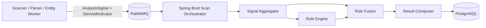

### 6.2. PostgreSQL

Các nhóm dữ liệu chính:

```text
users / roles / sessions
scan_requests
scan_results
scan_signals           (optional, nếu cần trace/debug/research)
scan_relations         (parent-child scans)
risk_entities
risk_sources
rules / rule_versions
community_reports
report_reviews
admin_actions / audit_records
notification_jobs
model_versions         (metadata only)
```

`scan_results.analysis_json` có thể dùng `JSONB` cho result riêng theo scan type, nhưng các field chung như score/level/status/timestamps nên là column rõ ràng để query/filter.

### 6.3. Redis

Redis là **server-side cache**, không phải source of truth:

- recent scan result cache;
- threat/reputation hot cache;
- rate limiting;
- idempotency key;
- lightweight distributed lock;
- temporary job/scan coordination nếu cần.

Threat ingestion có thể refresh/invalidate Redis sau khi PostgreSQL upsert thành công.

### 6.4. MinIO / S3-compatible

Lưu binary/artifact:

- evidence upload từ community report;
- screenshot/file evidence nếu feature cho phép;
- generated PDF/HTML report;
- artifact khác không phù hợp lưu trong PostgreSQL.

PostgreSQL chỉ lưu metadata/object key/hash/MIME/size/owner relation.

---

## 7. URL Scanner và SSRF protection

Vì Web/URL Scanner có thể fetch URL do người dùng cung cấp, bắt buộc:

- Chỉ cho phép `http` và `https`.
- Resolve DNS rồi chặn loopback/private/link-local/metadata ranges.
- Kiểm tra lại resolved destination sau mỗi redirect.
- Giới hạn redirect count.
- Timeout connect/read.
- Giới hạn response size.
- Chặn hostname nội bộ như `localhost`, `.local`, internal DNS suffix được cấu hình.
- Giới hạn port được phép.
- Không gửi credential/header nội bộ khi fetch.
- Network-isolate worker khỏi management plane/database nếu có thể.

---

## 8. API-facing scan types cần đồng bộ

Architecture hỗ trợ các entry point sau. Tên endpoint cụ thể có thể thay đổi, nhưng API specification phải cover đủ chúng.

```text
POST /v1/scans/url
POST /v1/scans/web-content
POST /v1/scans/text
POST /v1/scans/transaction-post      (hoặc dùng /text + contentType)
POST /v1/scans/phone
POST /v1/scans/bank-account
POST /v1/scans/cccd                  (hoặc generic /entity)
POST /v1/scans/qr

GET  /v1/scans/{scanId}
GET  /v1/scans/history

POST /v1/reports
```

Nếu dùng generic entity endpoint:

```json
POST /v1/scans/entity
{
  "entityType": "CCCD",
  "value": "<user-input>"
}
```

API layer phải mask sensitive values trong response/log theo policy.

---

## 9. Công nghệ sử dụng

| Vai trò | Công nghệ |
| --- | --- |
| Front-end | **Next.js** - `User Web` và `Admin Dashboard` là hai client role/boundary riêng; User Web có cùng core user features với Mobile |
| Back-end | **Java Spring Boot** - REST API, Modular Monolith, input routing, Scan Orchestrator, Threat/Reputation Query, Rule Engine, Risk Fusion, Result Composer, History, Report, Admin, Notification |
| AI / ML | **Python** - service riêng cho preprocessing/model inference; **FastAPI** đề xuất cho REST inference trong MVP; gRPC khi cần typed contract/throughput cao hơn |
| Mobile | **React Native** - cùng core user features với User Web; thêm QR camera, share intent và interaction native khi phù hợp |
| Database | **PostgreSQL** - source of truth, `JSONB` cho analysis/result đa dạng<br />**Redis** - cache, rate limiting, idempotency, lock |
| Messaging | **RabbitMQ** - async worker jobs, nested scan jobs, result events, retry/DLQ |
| Storage | **MinIO** local/self-host hoặc **S3-compatible storage** khi deploy |
| Gateway | **Nginx** - reverse proxy, TLS termination, routing, request limit cơ bản |
| Container / Local Dev | **Docker Compose** - PostgreSQL, Redis, RabbitMQ, MinIO, Spring Boot, workers, Python AI service, Next.js, Nginx |
| CI/CD | **GitHub Actions** - build, test, image build/deploy |
| Deployment | **AWS EC2 hoặc VPS** chạy Docker Compose production cho scope khóa luận/MVP |
| Edge / Public Access | **Cloudflare DNS / Tunnel / WAF** có thể sử dụng khi cần |

---

## 10. Architecture completeness checklist

Trước khi thêm một input mới, phải trả lời được toàn bộ các câu sau:

- [ ] Input có `ScanType` / `EntityType` rõ ràng chưa?
- [ ] API validation/schema đã có chưa?
- [ ] `ScanTypeResolver` nhận diện được chưa?
- [ ] `ProcessorRegistry` map sang processor nào?
- [ ] Có queue/routing key nếu async chưa?
- [ ] Worker/module có function xử lý cụ thể chưa?
- [ ] Worker trả `AnalysisSignal` theo contract chưa?
- [ ] Nếu input sinh nested indicator, Orchestrator có child-scan flow chưa?
- [ ] Rule Engine biết consume signal mới chưa?
- [ ] Risk Fusion policy xử lý signal mới chưa?
- [ ] Result Composer giải thích/khuyến nghị được chưa?
- [ ] History/status lưu và query được chưa?
- [ ] Logging có tránh lộ dữ liệu nhạy cảm chưa?
- [ ] Unit/integration/E2E test đã cover input này chưa?
- [ ] Feature user mới có được expose trên cả User Web và Mobile chưa? Nếu không, lý do có phải do platform capability/UX không tự nhiên không?
- [ ] User Web và Mobile có dùng cùng API contract/business rule thay vì tạo logic nghiệp vụ riêng theo client không?

Với revision này, các input chính thức hiện tại đều có processor owner:

```text
URL + HTML/Form         -> Web/URL Scanner Worker
Text + Transaction Post -> Text Analyzer Worker
Phone + Bank + CCCD     -> Entity/Reputation Checker Worker
QR/VietQR               -> QR Parser Worker -> nested scan routing
Community Report        -> Community Report Module
```

và tất cả output đều có owner rõ ràng:

```text
score + level            -> Risk Fusion
evidence                 -> Signal Aggregator + Rule Engine
explanation/recommendation -> Result Composer
status                   -> Scan Orchestrator
history                  -> Scan Query & History
audit/log                -> Audit & Observability
```
