# Kiến trúc và công nghệ

> **Architecture revision:** V3.3 — Identity & Notification Extensibility Alignment  
> **Nguyên tắc:** giữ nguyên Modular Monolith + Event-Driven Workers và toàn bộ scan/AI pipeline của V3.2; V3.3 mở rộng boundary Account/Identity và Notification để hỗ trợ Local + Google OIDC, OTP/password recovery, **JWT access token ngắn hạn + opaque refresh token xoay vòng + server-side auth session**, và notification channel/provider-agnostic.

**Nguồn sự thật V3.3:** tài liệu này là architecture contract hiện hành và phải khớp với `modules_specification_v1.3.md` + schema V1.0 (draft). Các sơ đồ trình bày V3.2 cũ chỉ được dùng sau khi đã đồng bộ theo các C4/Mermaid trong tài liệu này.

### Thay đổi của V3.3 so với V3.2

V3.3 không thay đổi owner của scan lifecycle, Risk Fusion, worker isolation hay async AI. Revision này làm rõ hai capability vốn đã nằm trong Spring Boot business core nhưng trước đây còn mô tả quá cụ thể theo implementation hiện tại.

| # | Thay đổi | Mục bị ảnh hưởng |
| --- | --- | --- |
| 1 | **Account & Identity trở thành auth-method agnostic.** Guest vẫn được scan; authenticated account có thể dùng Local email/password hoặc external identity qua OAuth 2.0 / OpenID Connect. Google là external provider đầu tiên; provider khác phải thêm bằng adapter/config mà không đổi `AccessContext` downstream | 2.1, 2.2, 2.2.1, 2.3, 3.1, 4.1, 9 |
| 2 | **Email verification / password recovery / password change challenge thuộc M01.** M01 sở hữu challenge, hash/expiry/attempt policy; việc gửi OTP/security message được giao cho M10 qua notification contract. Notification module không tự xác thực OTP | 2.3, 4.1 |
| 3 | **Notification trở thành channel/provider-agnostic.** `IN_APP`, `EMAIL`, `PUSH` là các channel hiện tại; `SMS`, `TELEGRAM`, `WHATSAPP`, `ZALO`, ... là extension qua `channelKey` + provider adapter registry, không làm thay đổi business module phát event | 2.1, 2.2, 2.3, 3.1, 4.1, 5, 9 |
| 4 | **Persistence boundary cho identity/notification được mở rộng** nhưng PostgreSQL vẫn là source of truth; provider credential vẫn nằm trong secret/config management, không lưu raw secret trong business tables | 2.2, 4.1, 8, 9 |
| 5 | **Chốt auth-session model cho MVP.** Access token là JWT ngắn hạn; refresh token là opaque random token, chỉ lưu hash và rotate mỗi lần refresh; mỗi login/device có `auth_sessions` server-side. Reuse refresh token làm revoke toàn bộ token family + session và phát security notification; logout/password reset có thể thu hồi phiên ngay qua `sid` + session state | 2.2, 2.2.2, 2.3, 4.1, 6, 7.1 |

**Bất biến V3.3:** scanner/AI worker vẫn bị cô lập; Spring Boot vẫn sở hữu business state/final verdict; RabbitMQ topology scan/AI không đổi; M01/M10 extension không được làm thay đổi worker contract hay Risk Fusion.

### Lịch sử thay đổi V3.2 so với V3.1

Đồng bộ tài liệu theo sơ đồ [`02-tong-the-v2.svg`](diagrams/02-tong-the-v2.svg) và các điểm còn treo trong [`02-tong-the-v2-check.md`](diagrams/02-tong-the-v2-check.md).

| # | Thay đổi | Mục bị ảnh hưởng |
| --- | --- | --- |
| 1 | **AI/ML chuyển từ đồng bộ sang bất đồng bộ.** Web/Text Worker không còn gọi REST/gRPC sang Python service rồi chờ. Worker publish một **AI task** vào `q.ai.analyze`; **Python AI/ML Worker** xử lý và publish kết quả vào `q.scan.result`; Spring Boot consume rồi ghép theo `scanId` + `taskId` | 2.2, 2.3, 2.4, 3.1, 3.2, 3.3, 3.6, 4.1, 4.2, 4.3, 4.11 |
| 2 | **Scan Orchestrator sở hữu việc chờ AI.** Completion barrier đếm cả child scan lẫn AI task đang chờ; không đóng scan chỉ vì Web/Text Worker đã xong | 4.7, 4.7.1 |
| 3 | **Thêm topology cho AI:** queue `q.ai.analyze` + `q.ai.analyze.dlq`, routing key `ai.analysis.requested` / `ai.analysis.completed` / `ai.analysis.failed` | 5.0, 5.1, 5.2 |
| 4 | **Contract mở rộng:** worker result mang `pendingAiTasks[]`; AI task và AI result có envelope riêng mang `taskId` | 5.3, 5.4 |
| 5 | **Tách đôi operational default của AI:** timeout gọi model nằm trong AI Worker, khác deadline Orchestrator chờ AI task | 7.1 |
| 6 | **Cô lập worker — bỏ hoàn toàn đường gọi đồng bộ ngược từ worker về core.** Worker chỉ nói chuyện với RabbitMQ. Chỉ dấu phát hiện giữa chừng được trả về trong `derivedIndicators[]`; lõi tra uy tín rồi gắn signal hoặc tạo scan con. Đây là quyết định của nhóm, chốt lại điểm treo B2.2 trong `architecture_v3_review.md` | 2.2, 3.1, 3.3, 4.1, 4.2, 4.6.1, 4.7, 5.3, 7 |

Các phần còn lại của V3.1 giữ nguyên.

### Thuật ngữ dùng thống nhất

| Thuật ngữ | Nghĩa trong tài liệu |
| --- | --- |
| **Signal / tín hiệu** | Kết quả quan sát từ worker, reputation, community hoặc AI; chưa phải verdict cuối |
| **Rule Engine / bộ luật** | Áp rule/heuristic lên tập signal và sinh `RuleMatch`/evidence |
| **Risk Fusion / tổng hợp rủi ro** | Kết hợp các nhóm signal và rule contribution để tạo `riskScore`/`riskLevel` |
| **Threat Intelligence / dữ liệu uy tín** | Dữ liệu blacklist/whitelist/reputation/threat reference có nguồn và độ tin cậy |
| **Nested scan / scan con** | Scan được tạo từ indicator phát sinh trong một scan cha |
| **AI task** | Một đơn vị việc AI do Web/Text Worker gửi vào `q.ai.analyze`, định danh bằng `taskId` và gắn với một `scanId` |
| **Completion barrier** | Điều kiện để Orchestrator đóng một scan: mọi child scan và mọi AI task đang chờ đều đã xong, hoặc đã hết deadline |
| **Degraded result** | `RiskResult` được finalize khi còn thiếu tín hiệu (child fail, AI fail hoặc AI quá hạn); đánh dấu `degraded=true` |
| **External identity provider** | Nhà cung cấp danh tính ngoài hệ thống qua OAuth 2.0 / OIDC; MVP external provider đầu tiên là Google, nhưng core contract dùng `providerKey` mở |
| **Notification channel** | Kênh giao tiếp logic như `IN_APP`, `EMAIL`, `PUSH`, `SMS`, `TELEGRAM`; không đồng nghĩa vendor/provider |
| **Notification provider** | Adapter/vendor thực hiện delivery cho một channel; thay provider không được làm thay đổi business event phát notification |
| **Auth session** | Server-side login session theo user/device, định danh bằng `sid`; là source of truth để revoke phiên và liên kết refresh-token family |
| **Access token** | JWT ngắn hạn do Anti-Scam phát hành sau Local/Google authentication; mang `sub`, `sid`, `roles`, `iss`, `aud`, `iat`, `exp`; không lưu raw token trong DB |
| **Refresh token** | Opaque random credential sống dài hơn access token; DB chỉ lưu hash, rotate mỗi lần refresh và phát hiện reuse để revoke token family/session |

## 1. Input, output và coverage contract của hệ thống

### 1.1. Input và output chính thức

| Loại | Giá trị |
| --- | --- |
| **Input** | - URL/link đáng nghi<br />- Nội dung tin nhắn, đoạn hội thoại<br />- Bài đăng giao dịch / nội dung rao bán, tuyển dụng, hoàn tiền, giao hàng... (`TEXT` + `contentType`)<br />- Số điện thoại<br />- Số tài khoản ngân hàng / mã ngân hàng nếu có<br />- QR code / VietQR<br />- Báo cáo lừa đảo do cộng đồng gửi lên<br />- **HTML/Form** được phân tích như bước nội bộ của URL scan; không bắt buộc là public input<br />- **CCCD** trong MVP được phát hiện như tín hiệu yêu cầu/thu thập dữ liệu nhạy cảm trong Text/Web; standalone CCCD lookup chuyển sang Future Scope |
| **Output** | - Điểm rủi ro: `0 - 100`<br />- Mức cảnh báo: `SAFE`, `CAUTION`, `DANGER`<br />- Bằng chứng theo rule / signal<br />- Giải thích lý do<br />- Khuyến nghị hành động<br />- Trạng thái xử lý: `PENDING`, `PROCESSING`, `COMPLETED`, `FAILED`<br />- Lịch sử scan của user<br />- Audit / operational log cho admin và vận hành |

Kiến trúc được lựa chọn là **Modular Monolith + Event-Driven Workers**. Spring Boot giữ vai trò business core và owner của final result; các tác vụ phân tích chuyên biệt hoặc tốn thời gian được tách thành worker chạy bất đồng bộ qua RabbitMQ. AI/ML được triển khai qua **Python AI/ML Worker** riêng: worker này cũng nhận việc và trả tín hiệu **qua RabbitMQ**, không phải qua lời gọi đồng bộ từ worker phân tích.

Trong MVP, hệ thống vẫn có thể chạy bằng **rule-based + heuristic + reputation/community signal**. AI là tín hiệu bổ sung và không phải nguồn duy nhất quyết định verdict.

### 1.2. Input Coverage Matrix

Bảng này là **contract kiến trúc**. Nếu thêm một `InputType` mới, phải cập nhật bảng này, `ScanTypeResolver`, queue/routing key, processor tương ứng và test coverage.

| Input | `ScanType` / `EntityType` | Processor owner | Core functions bắt buộc | Downstream |
| --- | --- | --- | --- | --- |
| **URL/link** | `URL` | **Web/URL Scanner Worker** | `normalizeUrl`, `validateUrl`, lexical analysis, DNS/domain lookup, redirect analysis, TLS/HTTPS analysis, typosquatting, dùng `reputationContext` kèm job, gom host mới thành `derivedIndicators`, safe public fetch, SSRF protection | Rule Engine, optional AI task (bất đồng bộ), Risk Fusion |
| **HTML / Form công khai (internal/derived)** | `URL:WEB_CONTENT` internal mode | **Web/URL Scanner Worker - HTML/Form Analyzer submodule** | parse HTML, extract form/input/action, detect credential/OTP/PIN/CVV/CCCD collection cues, cross-domain form action, suspicious keywords | Rule Engine, optional AI task (bất đồng bộ), Risk Fusion |
| **Tin nhắn / hội thoại** | `TEXT` | **Text Analyzer Worker** | normalize text, entity extraction, scam cue/pattern detection, scenario classification, nested indicator extraction | Rule Engine, optional AI task (bất đồng bộ), nested URL/Entity scan, Risk Fusion |
| **Bài đăng giao dịch** | `TEXT` + `contentType=TRANSACTION_POST` | **Text Analyzer Worker** | text preprocessing, amount/contact/account/link extraction, scam scenario rules, urgency/payment cues | Rule Engine, optional AI task (bất đồng bộ), nested URL/Entity scan, Risk Fusion |
| **Số điện thoại** | `ENTITY:PHONE` | **Entity/Reputation Checker Worker** | `normalizePhone`, protected lookup key, dùng `reputationContext` kèm job, report count, verified report count, source confidence, time-decay | Reputation Signal, Rule Engine, Risk Fusion |
| **Tài khoản ngân hàng** | `ENTITY:BANK_ACCOUNT` | **Entity/Reputation Checker Worker** | normalize account/bank code, protected lookup key, dùng `reputationContext` kèm job, report stats, source confidence, time-decay | Reputation Signal, Rule Engine, Risk Fusion |
| **Yêu cầu/thu thập CCCD trong nội dung** | derived signal, không phải standalone `ENTITY` trong MVP | **Text Analyzer Worker / HTML-Form Analyzer** | detect sensitive identity request, mask/redact value, không log/persist raw CCCD | Rule Engine, Risk Fusion |
| **QR / VietQR** | `QR` | **QR Parser Worker** | decode/validate, classify QR type, parse VietQR, extract URL/text/bank account/amount/content, return derived indicators | Scan Orchestrator dispatches nested URL/Text/Entity jobs |
| **Community Report** | `REPORT` | **Community Report Module** | validate report, evidence upload, moderation workflow, reporter/reputation metadata, verified report conversion to risk signal/entity | Threat/Reputation data, Risk Fusion, Admin Review |

### 1.3. Output Coverage Matrix

| Output | Module owner | Cách hình thành |
| --- | --- | --- |
| **Risk score `0-100`** | **Risk Fusion** | Kết hợp rule score, technical signal, reputation/community signal và AI probability theo policy/version |
| **`SAFE / CAUTION / DANGER`** | **Risk Fusion** | Mapping từ final score và hard-rule override nếu có |
| **Evidence** | **Rule Engine + Signal Aggregator** | Rule match, source signal, technical finding, reputation finding, model signal |
| **Explanation** | **Result Composer / Explainability** | Biến evidence kỹ thuật thành câu giải thích dễ hiểu, không để AI tự sinh verdict không kiểm soát |
| **Recommendation** | **Result Composer / Recommendation Policy** | Chọn hành động khuyến nghị theo risk level + evidence category |
| **Processing status** | **Scan Orchestrator** | Quản lý lifecycle của `ScanRequest`: pending/processing/completed/failed |
| **Scan history** | **Scan Query & History Module** | Query `ScanRequest` + `RiskResult` theo user, type, level, time |
| **Audit / operational log** | **Audit & Observability Module** | Admin action, rule change, report moderation, scan failure, worker retry/DLQ metadata |

### 1.4. Quy tắc dispatch để không bỏ sót input

Spring Boot không dùng `if/else` rải rác cho từng input. `Scan Orchestrator` sử dụng `ScanTypeResolver` + `ProcessorRegistry` để đảm bảo mỗi loại input có handler.

```text
Incoming ScanRequest
        │
        ▼
Input Validation
        │
        ▼
ScanTypeResolver
        │
        ├── URL --------------------> Web/URL Scanner Worker
        │                               └── HTML/Form = internal analysis mode
        ├── TEXT -------------------> Text Analyzer Worker
        │                               └── contentType=MESSAGE | TRANSACTION_POST
        ├── ENTITY:PHONE -----------> Entity/Reputation Checker Worker
        ├── ENTITY:BANK_ACCOUNT ----> Entity/Reputation Checker Worker
        └── QR ---------------------> QR Parser Worker
```

Mỗi processor trả về **signals**, không tự quyết định final verdict.

---

## 2. C4 Architecture

C4 được sử dụng để mô tả kiến trúc theo ba mức chính: **System Context**, **Container** và **Component**. Trong tài liệu này, “Container” là đơn vị ứng dụng/runtime theo C4, không đồng nghĩa với Docker container.

### 2.1. C4 Level 1 - System Context

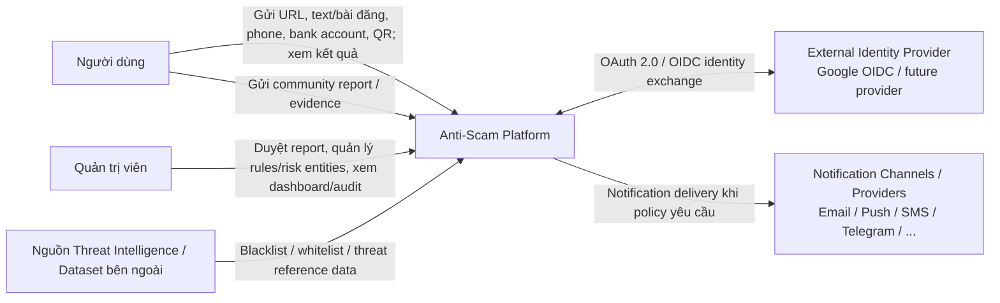

**Phạm vi hệ thống:** Anti-Scam Platform nhận nhiều loại indicator/content, phân tích bằng worker chuyên biệt, rule/heuristic, reputation/community data và AI nếu được bật, sau đó trả về một `RiskResult` thống nhất.

Trong MVP, **CCCD không phải standalone lookup input**. Hệ thống chỉ phát hiện việc yêu cầu/thu thập CCCD trong Text/Web như một tín hiệu dữ liệu nhạy cảm; raw CCCD không được lưu/log mặc định. Nếu sau này có nguồn dữ liệu hợp pháp, CCCD lookup có thể được mở lại như Future Scope.

### 2.2. C4 Level 2 - Container

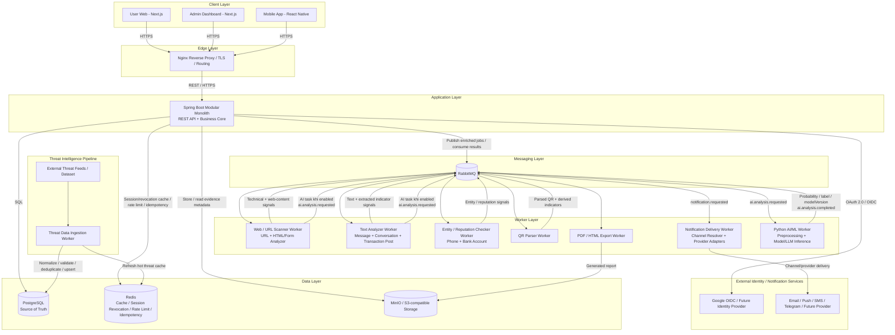

**Các quyết định chính ở mức Container:**

- **Nginx** là edge gateway: TLS termination, reverse proxy, routing và coarse rate limit/flood protection theo IP. Nginx không điều phối detection workflow.
- **Spring Boot Modular Monolith** là business core: auth, validation, input routing, scan orchestration, threat/reputation query, rule engine, signal aggregation, risk fusion, result composition, history, report, admin, notification và persistence ownership. Auth downstream chỉ expose `AccessContext`; Local/Google/future external provider là implementation phía trong M01.
- **External Identity Provider** được tích hợp qua OAuth 2.0 / OpenID Connect adapter registry; Google là provider đầu tiên. `providerKey` là extensible string/config key, không hard-code Google vào business module khác.
- **Auth session model là hybrid stateful/stateless.** Local hoặc Google OIDC chỉ là cách xác thực ban đầu; sau thành công, M01 tạo `auth_sessions`, phát **JWT access token ngắn hạn** và **opaque refresh token**. Access JWT được verify bằng signature/issuer/audience/expiry rồi resolve `sid` qua session state (Redis cache, PostgreSQL source of truth) để hỗ trợ revoke ngay; refresh token được hash + rotate + reuse-detect.
- **Notification Delivery Worker / Provider Adapter Registry** consume `q.notification`; channel và provider được tách riêng để có thể thêm SMS/Telegram/WhatsApp/Zalo mà không sửa module phát business event.
- **RabbitMQ** phân phối job phân tích, **AI task** và mọi result event, gồm cả worker result lẫn AI result.
- **Web/URL Scanner Worker** xử lý cả URL và web content. `HTML/Form Analyzer` là submodule của worker này, tránh việc input HTML có trong requirement nhưng không có processor.
- **Text Analyzer Worker** xử lý cả message/conversation và transaction post.
- **Entity/Reputation Checker Worker** xử lý `PHONE` và `BANK_ACCOUNT` qua strategy theo `EntityType`; standalone CCCD lookup không nằm trong MVP.
- **QR Parser Worker** chỉ parse/derive indicator. `Scan Orchestrator` mới là thành phần dispatch các nested scan sang URL/Text/Entity processor.
- **Python AI/ML Worker** là một consumer RabbitMQ như các worker khác, **không phải service được gọi đồng bộ**. Web/Text Worker publish AI task rồi kết thúc job của mình ngay; AI Worker trả prediction vào queue result và Spring Boot mới tạo business verdict. Nhờ vậy độ trễ của model/LLM không giữ chỗ một Web/Text Worker thread.
- **Worker bị cô lập.** Không có mũi tên nào đi từ Worker Layer ngược về Spring Boot. Worker chỉ nói chuyện với RabbitMQ, không gọi API của core, không đọc PostgreSQL/Redis. Mọi dữ liệu uy tín worker cần đều đã nằm sẵn trong job; chỉ dấu phát hiện giữa chừng thì trả về qua `derivedIndicators[]` để lõi tra. Xem mục 4.6.1.
- **PostgreSQL** là source of truth. **Redis** là cache/coordination state, không phải nơi lưu threat data duy nhất.

#### 2.2.1. Client feature parity

**Nguyên tắc thiết kế client:** `User Web` và `Mobile App` phải cung cấp **cùng tập tính năng nghiệp vụ cốt lõi cho người dùng ở mức tối đa có thể**. Chỉ tách khác nhau khi một interaction không tự nhiên hoặc phụ thuộc capability của thiết bị. Cả hai client sử dụng cùng Spring Boot API và cùng business rules; không tạo backend riêng cho Web và Mobile.

| User feature | User Web - Next.js | Mobile App - React Native | Ghi chú |
| --- | --- | --- | --- |
| Guest / đăng ký / đăng nhập Local / Google OIDC / password recovery / profile | ✅ | ✅ | Cùng Auth/User API và cùng `AccessContext`; external provider không làm thay đổi downstream contract |
| Scan URL / link | ✅ | ✅ | Cùng `ScanType=URL` |
| Scan text / hội thoại | ✅ | ✅ | Paste/nhập nội dung |
| Scan bài đăng giao dịch | ✅ | ✅ | Dùng `/text` với `contentType=TRANSACTION_POST` |
| Scan số điện thoại | ✅ | ✅ | Cùng Entity Checker |
| Scan tài khoản ngân hàng | ✅ | ✅ | Cùng Entity Checker |
| Cảnh báo yêu cầu/thu thập CCCD trong nội dung | ✅ | ✅ | Derived signal trong Text/Web; không có standalone CCCD lookup ở MVP |
| Scan QR / VietQR | ✅ upload ảnh QR | ✅ camera hoặc upload ảnh | Camera trực tiếp là mobile-native; Web vẫn có cùng capability bằng upload ảnh |
| Xem processing status | ✅ | ✅ | Cùng Scan Orchestrator/status API |
| Xem RiskResult / evidence / explanation / recommendation | ✅ | ✅ | Cùng result contract |
| Xem lịch sử scan | ✅ | ✅ | Cùng History API |
| Gửi Community Report + evidence | ✅ | ✅ | Cùng Report API |
| Export / chia sẻ kết quả | ✅ | ✅ | Cùng export/result API; cách share phụ thuộc platform |
| In-app notification/status update | ✅ | ✅ | Cùng Notification domain event |
| Share URL từ app khác vào Anti-Scam app | — | ✅ | Mobile share sheet là interaction tự nhiên; không coi đây là thiếu core feature của Web |
| Scan QR trực tiếp bằng camera | — | ✅ | Web desktop dùng upload ảnh QR thay vì bắt buộc camera |

`Admin Dashboard` là client riêng cho vai trò quản trị và **không cần parity với User Web/Mobile**. Các tính năng admin gồm moderation Community Report, quản lý rules/policies, risk entities, threat sources, dashboard/statistics và audit.

```text
User Web ────────┐
Mobile App ──────┼──> Nginx ──> Same Spring Boot API ──> Same Detection Core
Admin Dashboard ─┘
```

#### 2.2.2. Authentication / session model

MVP chốt **hybrid token + server-side session**, không dùng pure stateless JWT và cũng không dùng classic session-only làm contract chính.

```text
Local email/password hoặc Google OIDC
        ↓
M01 xác thực identity
        ↓
create auth_sessions row (mỗi login/device = một session)
        ↓
issue credentials
├── Access Token  = JWT ngắn hạn
└── Refresh Token = opaque random token, sống dài hơn và rotate mỗi lần dùng
```

**Access token**:
- là JWT do Anti-Scam ký; tối thiểu mang `sub=userId`, `sid=sessionId`, `roles[]`, `iss`, `aud`, `iat`, `exp`;
- không có bảng `access_tokens`; raw access token không persist;
- request authenticated phải verify signature + issuer + audience + expiry, sau đó resolve `sid` qua session state để chặn session đã revoke; Redis cache session/revocation state, PostgreSQL vẫn là source of truth;
- role/permission change cần có hiệu lực ngay phải revoke session liên quan để client nhận token mới.

**Refresh token**:
- là opaque high-entropy random token, không phải JWT; DB chỉ lưu `token_hash`;
- mỗi refresh thành công **rotate** token: token cũ được mark used/replaced, token mới cùng `token_family_id` được phát hành;
- nếu token đã used/replaced xuất hiện lại → **refresh-token reuse detected** → revoke toàn bộ family + `auth_session`, từ chối refresh và yêu cầu M10 gửi security notification;
- logout revoke session + refresh family; password reset revoke toàn bộ session của account; authenticated password change mặc định revoke các session khác và rotate credential của session hiện tại.

**Client storage**:
- Web: access token giữ ngắn hạn trong memory; refresh credential dùng `HttpOnly + Secure + SameSite` cookie theo deployment policy, không lưu refresh token trong `localStorage`;
- Mobile: refresh credential nằm trong Keychain/Keystore/secure storage; access token ưu tiên giữ trong memory;
- Google token/provider assertion chỉ dùng để establish identity, **không** được dùng như access token của Anti-Scam API.

```text
Authenticated API request
→ verify JWT
→ read sid
→ Redis auth-session cache
→ cache miss thì PostgreSQL auth_sessions
→ ACTIVE: build AccessContext
→ REVOKED/EXPIRED: 401
```

### 2.3. C4 Level 3 - Spring Boot Backend Components

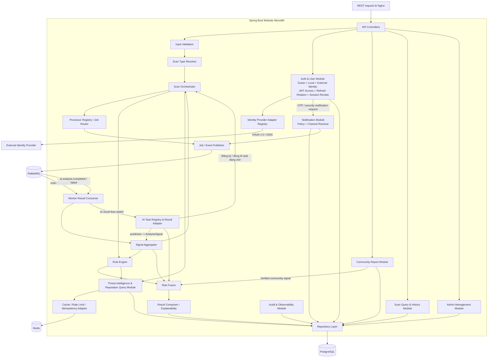

**Luồng trách nhiệm chính:**

1. `Input Validation` kiểm tra schema, kích thước, định dạng và security constraint.
2. `Scan Type Resolver` xác định public scan type `URL`, `TEXT`, `ENTITY`, `QR`; `WEB_CONTENT` là internal mode của URL worker và transaction post là `TEXT` với `contentType`.
3. `Scan Orchestrator` tạo `ScanRequest`, quản lý status, cache check, parent/child scan và lifecycle.
4. `Processor Registry / Job Router` map `ScanType`/`EntityType` sang routing key/worker phù hợp.
5. Worker trả `AnalysisSignal[]` và `DerivedIndicator[]`.
6. `Signal Aggregator` gom technical, content, reputation, community và AI signal.
7. `Rule Engine` sinh `RuleMatch[]` và evidence có thể giải thích.
8. `Risk Fusion` tạo final `riskScore` + `riskLevel`.
9. `Result Composer` tạo explanation + recommendation + response DTO thống nhất.
10. `Scan Query & History` phục vụ status/history mà không chạy lại scan.
11. `Audit & Observability` ghi administrative/audit/worker failure/retry metadata.

### 2.4. Component view cho Python AI/ML Worker

Python được tách riêng để tận dụng ecosystem ML/LLM nhưng vẫn giữ business decision ở Java. Từ V3.2, thành phần này là **worker tiêu thụ hàng đợi**, không còn là service nhận REST đồng bộ trong luồng scan.

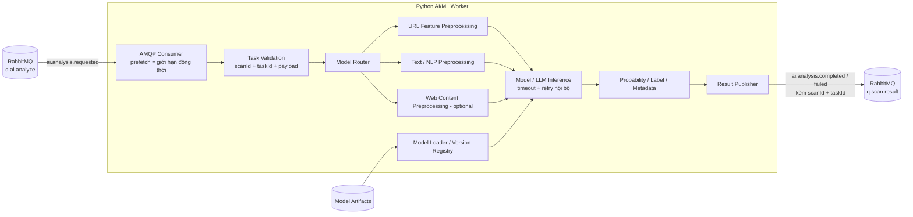

**Ba nguyên tắc của thành phần này:**

1. **Python trả prediction, Java trả business verdict.** AI Worker không bao giờ phát ra `SAFE`/`CAUTION`/`DANGER`.
2. **Mọi kết quả phải mang `scanId` + `taskId`.** Đây là khóa để Orchestrator ghép kết quả về đúng scan và đóng đúng barrier; thiếu khóa này thì kết quả không dùng được.
3. **Thất bại vẫn phải trả lời.** Timeout, model lỗi hay payload hỏng đều publish `ai.analysis.failed`, không im lặng. Nếu im lặng thì Orchestrator chỉ còn cách chờ hết deadline rồi finalize degraded, tức là mọi scan có AI đều chậm đi khi AI hỏng.

Worker tự quản lý **giới hạn đồng thời** qua `prefetch_count` và **timeout gọi model/LLM**. Đây là điểm mấu chốt của V3.2: việc chờ model nằm bên trong AI Worker, không chiếm thread của Web/Text Worker và không chiếm HTTP thread của Spring Boot.

Endpoint HTTP của Python chỉ còn phục vụ vận hành, không nằm trong luồng scan:

```text
GET /health
GET /ready
GET /internal/models        (metadata / diagnostics)
```

Prediction sau khi về core được chuyển thành một `AnalysisSignal`, rồi Risk Fusion kết hợp nó với rule, reputation, community và technical findings.

---

## 3. Kiến trúc hệ thống

### 3.1. Sơ đồ kiến trúc tổng thể (high-level runtime view)

> Sơ đồ này dùng để trình bày luồng vận hành tổng thể. C4 Level 2 ở mục 2.2 vẫn là mô hình container chính thức; hai sơ đồ không đại diện cho hai kiến trúc khác nhau.

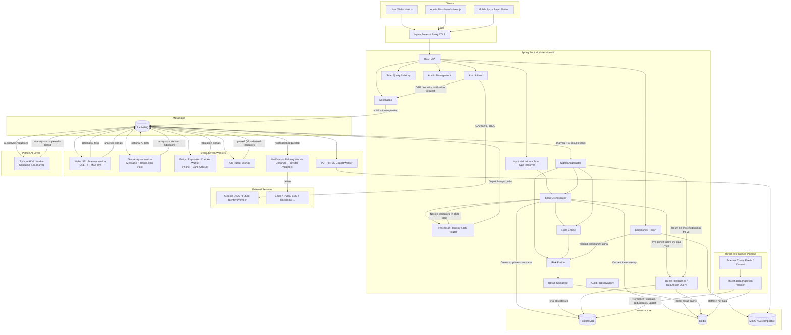

### 3.2. User scan flow tổng quát

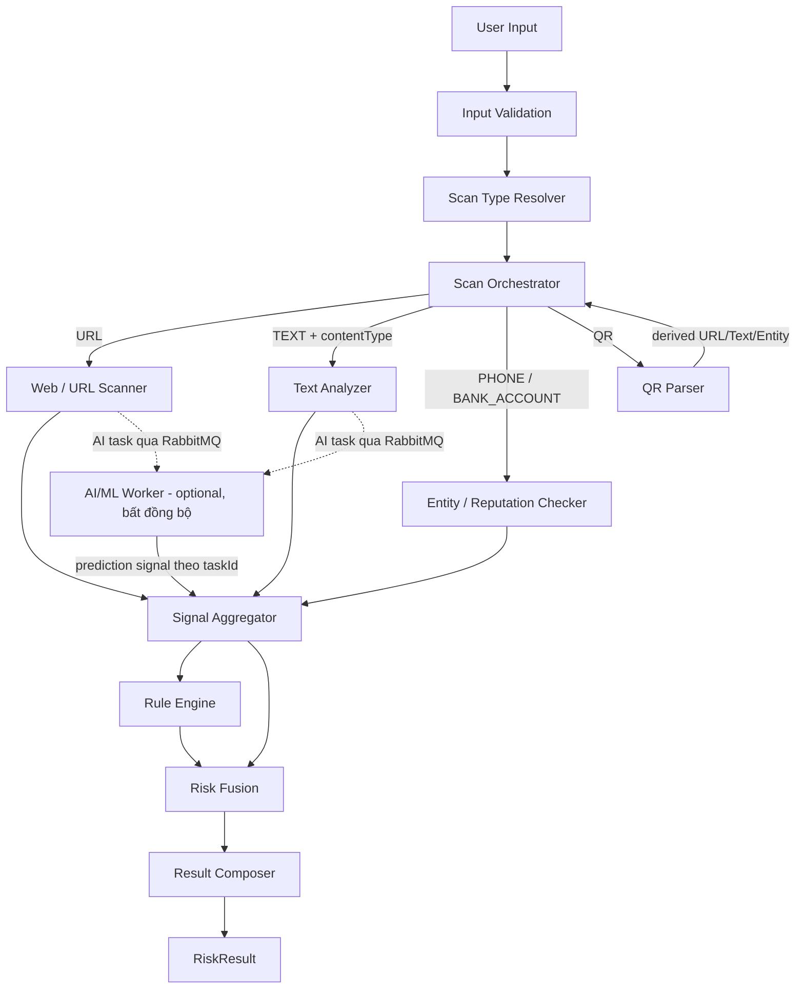

Điểm quan trọng của flow này là **QR và Text có thể tạo ra nested indicators**. Ví dụ một tin nhắn chứa URL + số điện thoại + tài khoản ngân hàng; hoặc một VietQR chứa tài khoản + nội dung chuyển khoản. `Scan Orchestrator` tạo child scan cho các indicator này và `Signal Aggregator` gom kết quả trước khi Risk Fusion quyết định.

### 3.3. Luồng scan URL điển hình

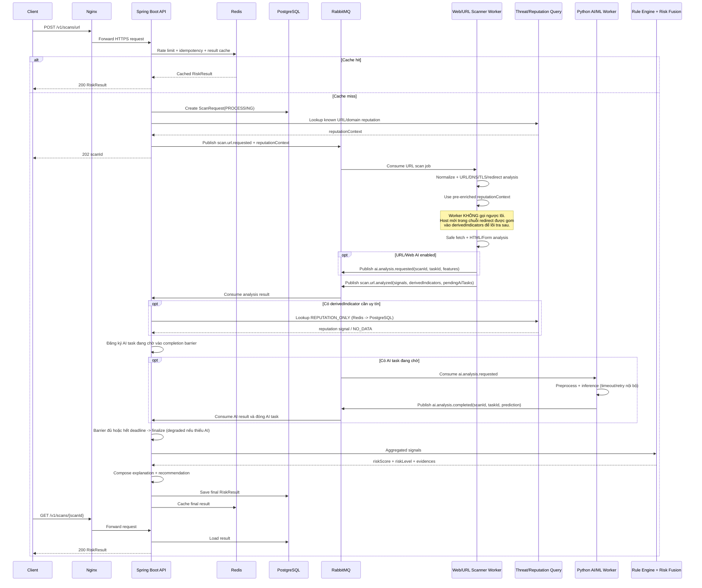

### 3.4. Luồng Text / Transaction Post với nested indicators

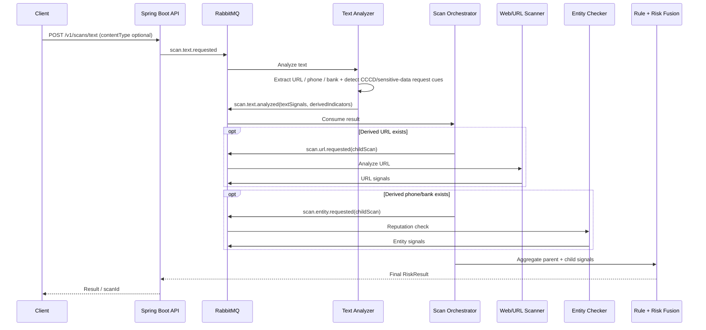

### 3.5. Luồng QR / VietQR

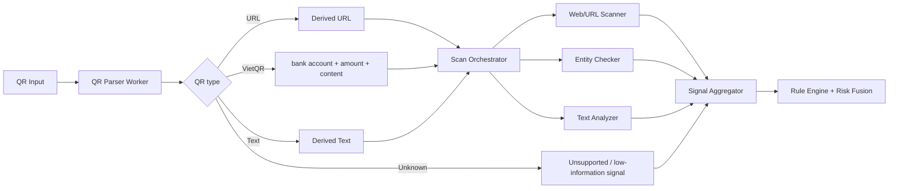

### 3.6. Kết hợp Rule Engine, Reputation và AI

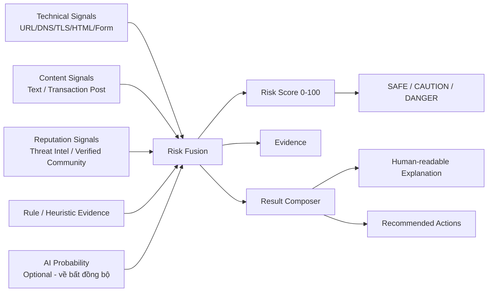

AI không thay thế Rule Engine. AI là một signal bổ sung; hệ thống vẫn hoạt động khi AI unavailable bằng rule/heuristic/reputation.

Từ V3.2, AI signal **về muộn hơn các signal khác** vì đi qua hàng đợi riêng. Điều đó không đổi vai trò của nó trong Risk Fusion, nhưng đổi cách Orchestrator kết thúc scan:

- AI task đang chờ được tính vào completion barrier giống child scan, xem mục 4.7.1;
- hết `aiTaskDeadline` mà chưa có kết quả thì finalize với `degraded=true` và renormalize trọng số, **không** coi AI = 0, xem mục 4.8;
- AI result về sau khi scan đã đóng được ghi nhận như late signal để phân tích và hiệu chỉnh policy, không sửa `RiskResult` đã trả cho người dùng.

---

## 4. Đặc tả module, worker và core functions

### 4.1. Module/Container responsibilities

| Module | Trách nhiệm chính | Input | Output / giao tiếp |
| --- | --- | --- | --- |
| **User Web - Next.js** | Cung cấp toàn bộ core user features: auth/profile; scan URL, text/transaction post, phone, bank account, QR qua upload; xem status/result/history; community report; export/share result | User interaction / supported scan inputs | HTTPS REST đến Nginx/API |
| **Mobile App - React Native** | Cùng core user features với User Web; bổ sung interaction tự nhiên trên mobile như QR camera và share URL từ app khác | User interaction / supported scan inputs / camera/share intent | HTTPS REST đến Nginx/API |
| **Admin Dashboard - Next.js** | Moderation Community Report; quản lý rules/policies, risk entities, threat sources; dashboard/statistics; audit | Admin interaction | HTTPS REST đến Nginx/API |
| **Nginx Reverse Proxy** | TLS termination, reverse proxy, routing; coarse rate limit theo IP/flood trước khi vào application | HTTPS request | Spring Boot / Next.js |
| **Spring Boot API** | Security, DTO, validation entry point, API contract | REST request | Internal modules |
| **Input Validation** | Schema/type/length/format validation, reject unsafe/oversized input | Raw request | Validated input |
| **Scan Type Resolver** | Map request thành `ScanType` + `EntityType` | Validated input | Processor key |
| **Auth & User Module** | Guest context; Local email/password; Google OIDC/external identity adapters; email verification/password challenge; JWT access token; opaque rotating refresh token; server-side auth session/revocation; RBAC/profile | Credential / provider assertion / access/refresh credential / profile command | `AccessContext`, `UserProfile`, auth/session result |
| **Scan Orchestrator** | Scan lifecycle, cache, parent-child scan, dispatch, timeout, status | Scan command / worker result | Jobs, status, aggregate trigger |
| **Processor Registry / Job Router** | Map scan type sang routing key/worker | `ScanType`, `EntityType` | RabbitMQ job |
| **Worker Result Consumer** | Consume result event, validate result contract | Worker event | AnalysisSignal/DerivedIndicator cho Aggregator |
| **Signal Aggregator** | Gom signal parent/child, deduplicate, source confidence, completeness | Worker/AI/community signals | Unified signal set |
| **Threat Intelligence & Reputation Query** | Cache-aside lookup threat/risk entity/source/report. **Chỉ module này chạm vào dữ liệu uy tín.** Chạy ở hai thời điểm: pre-enrich trước khi publish job, và tra cho `derivedIndicators` khi consume worker result. Không expose endpoint nào cho worker | Entity/domain/url lookup | Reputation/threat signal / `NO_DATA` / `REPUTATION_UNAVAILABLE` |
| **Rule Engine** | Evaluate rule/heuristic, priority, weight, hard rule; tạo evidence | Unified signals | RuleMatch[], rule contribution |
| **Risk Fusion** | Kết hợp các signal theo policy/version | Signals + RuleMatch | score, level, fusion metadata |
| **Result Composer / Explainability** | Tạo explanation/recommendation/response contract thống nhất | Fusion + Evidence | Final `RiskResult` |
| **Scan Query & History** | Get status/detail/history/filter/pagination | userId/scanId/filter | Scan summary/full result |
| **Community Report Module** | Submit report, evidence, moderation lifecycle, verified signal/entity | User/admin report actions | Report status / verified risk signal |
| **Admin Management Module** | Rule/risk entity/source/report/dashboard/admin action | Admin command | Config/data updates |
| **Notification Module** | Channel/provider-agnostic notification policy + dispatch. Current: in-app/email/push; extensible: SMS/Telegram/WhatsApp/Zalo/... | Domain event / `NotificationRequest` | Notification job + delivery status |
| **Audit & Observability Module** | Audit admin actions, failures/retries, correlation IDs, operational metadata | Domain/infra event | Audit record/log/metric |
| **RabbitMQ** | Async scan jobs, **AI task**, result events (worker + AI), retry/DLQ | Message | Worker/backend delivery |
| **Web/URL Scanner Worker** | URL + public web content analysis, HTML/Form analyzer, SSRF-safe fetch | URL or HTML/Form job | Technical/content signals + optional AI signal |
| **Text Analyzer Worker** | Message/conversation/transaction post analysis + indicator extraction | Text job | Text signals + derived indicators + optional AI signal |
| **Entity/Reputation Checker Worker** | Phone/bank strategy, validation/normalization, xử lý reputation context và association/time-decay signals | Entity job | Entity/reputation signals |
| **QR Parser Worker** | Decode/parse/classify QR and return derived indicators | QR job | URL/Text/Bank/amount/content indicators |
| **Report Export Worker** | PDF/HTML export async | Export job | Object in MinIO/S3 |
| **Threat Data Ingestion Worker** | Import/sync threat data, normalize, validate, deduplicate, source/version metadata, cache refresh | Feed/CSV/JSON/admin trigger | PostgreSQL upsert + Redis refresh |
| **Python AI/ML Worker** | Consume AI task từ `q.ai.analyze`; model router, preprocessing, model/LLM inference, giới hạn đồng thời, timeout và retry nội bộ | AI task: `scanId`, `taskId`, features/content | `ai.analysis.completed` / `ai.analysis.failed` vào `q.scan.result`, kèm probability, label, modelVersion |
| **PostgreSQL** | Source of truth cho business + threat reference data | SQL | Persistent data |
| **Redis** | Scan/reputation cache, business quota/rate limit theo user/account, idempotency, lightweight lock và nested-scan coordination | Key/value | Cached state |
| **MinIO / S3-compatible** | Evidence attachment, screenshots (nếu có), exports | Binary | Object key/metadata |

### 4.2. Web/URL Scanner Worker - core functions

Worker này hỗ trợ **hai mode**: `URL` và `WEB_CONTENT`.

```text
analyzeUrl(url)
 ├── normalizeUrl()
 ├── validateUrl()
 ├── extractUrlParts()
 ├── analyzeLexicalFeatures()
 ├── resolveDnsAndDomainMetadata()
 ├── analyzeRedirectChain()
 ├── analyzeTlsHttps()
 ├── detectTyposquatting()
 ├── usePreEnrichedReputationContext()
 ├── collectNewHostsAsIndicators()    // host mới trong chuỗi redirect -> derivedIndicators, KHÔNG tự tra
 ├── safeFetchPublicContent()
 ├── analyzeHtmlForm()
 └── publishAiTaskIfEnabled()     // publish ai.analysis.requested rồi kết thúc job, KHÔNG chờ kết quả

analyzeWebContent(html, baseUrl?)
 ├── enforceSizeLimit()
 ├── sanitizeForParsing()
 ├── parseHtml()
 ├── extractFormsAndInputs()
 ├── inspectFormAction()
 ├── detectSensitiveInputRequests()
 ├── extractVisibleTextAndLinks()
 └── generateWebContentSignals()
```

`analyzeHtmlForm()` cần phát hiện các pattern như yêu cầu password, OTP, PIN, CVV, CCCD, tài khoản ngân hàng; form action khác domain; action không HTTPS; keyword giả mạo/khẩn cấp.

### 4.3. Text Analyzer Worker - core functions

```text
analyzeText(text, contentType)
 ├── normalizeText()
 ├── detectLanguageOrEncoding()
 ├── extractIndicators()
 │    ├── URL
 │    ├── phone
 │    ├── bank account
 │    └── CCCD-like value/request cue (chỉ tạo sensitive-data signal; không route standalone scan, không log raw)
 ├── extractAmountAndDeadline()
 ├── detectUrgencyAndImpersonationCues()
 ├── detectPaymentCredentialRequestCues()
 ├── classifyScamScenarioByRules()
 ├── publishAiTaskIfEnabled()     // publish ai.analysis.requested rồi kết thúc job, KHÔNG chờ kết quả
 └── return signals + derivedIndicators + pendingAiTasks
```

`TRANSACTION_POST` không phải scan type/public endpoint riêng; dùng cùng `TEXT` worker qua `contentType=TRANSACTION_POST` và thêm rule/profile cho mua bán, cọc, shipping, fake job, hoàn tiền, investment/payment solicitation.

**Về `publishAiTaskIfEnabled()` ở cả 4.2 và 4.3:** hàm này chỉ sinh `taskId`, publish `ai.analysis.requested` và ghi `taskId` vào `pendingAiTasks[]` của result event. Worker **không** chờ, không giữ connection và không cần biết AI trả lời khi nào. Nếu publish thất bại, worker không được khai `taskId` đó trong `pendingAiTasks[]`, nếu không Orchestrator sẽ chờ một task không bao giờ tới.

### 4.4. Entity/Reputation Checker Worker - core functions

Dùng strategy theo `EntityType` để tránh worker proliferation. Trong MVP, public entity lookup chỉ gồm `PHONE` và `BANK_ACCOUNT`.

```text
checkEntity(entityType, rawValue, context)
 ├── validateByType()
 ├── normalizeByType()
 │    ├── PHONE
 │    └── BANK_ACCOUNT
 ├── usePreEnrichedReputationContext()
 ├── calculateSourceConfidence()
 ├── calculateReportStatistics()
 ├── calculateTimeDecaySignal()
 ├── calculateAssociationSignals()
 └── return EntityReputationSignal
```

**CCCD trong MVP:** không cung cấp standalone lookup vì chưa có nguồn dữ liệu định danh/reputation đủ giá trị và hợp pháp để kết luận. Thay vào đó, Text/Web analyzer phát hiện việc yêu cầu hoặc thu thập CCCD và sinh signal như `SENSITIVE_IDENTITY_REQUEST`. Raw CCCD không được log/persist mặc định. Standalone CCCD lookup chỉ được mở ở Future Scope khi có data source và legal basis rõ ràng.

### 4.5. QR Parser Worker - core functions

```text
parseQr(qrInput)
 ├── decodeIfImageProvided()
 ├── validatePayloadSize()
 ├── detectQrType()
 │    ├── URL
 │    ├── VIETQR
 │    ├── TEXT
 │    └── UNKNOWN
 ├── parseVietQrFields()
 ├── extractDerivedIndicators()
 └── return ParsedQrResult
```

QR Worker **không tự gọi worker khác**. Nó trả `DerivedIndicator[]`; `Scan Orchestrator` tạo child scans và dispatch đúng processor.

### 4.6. Threat Data Ingestion Worker - core functions

```text
ingestThreatSource(source)
 ├── fetchOrReadSource()
 ├── validateSourceRecord()
 ├── normalizeIndicator()
 ├── mapIndicatorType()
 ├── deduplicate()
 ├── attachSourceAndConfidence()
 ├── versionAndTimestamp()
 ├── upsertPostgreSql()
 └── refreshOrInvalidateRedisCache()
```

Data path:

```text
External Threat Source
        ↓
Threat Data Ingestion Worker
        ↓
PostgreSQL = source of truth
        ↓
Redis = hot/cache copy
```

Read path — **chỉ lõi được đọc dữ liệu uy tín**:

```text
Indicator cần tra
        ↓
Spring Boot Threat Intelligence Query
        ↓
Redis HIT ───────────────> reputationContext
        │
       MISS
        ↓
PostgreSQL
        ↓
cache result in Redis
        ↓
reputationContext
        ├── kèm vào RabbitMQ job  (chỉ dấu đã biết trước khi giao việc)
        └── gắn thẳng vào signal set của scan  (chỉ dấu worker trả về)
```

#### 4.6.1. Cô lập worker và deferred reputation

Nhóm chốt phương án **cô lập worker**, đóng lại điểm treo B2.2 trong `architecture_v3_review.md`. Hệ quả: **không có bất kỳ lời gọi đồng bộ nào đi từ worker ngược về core.** Worker không gọi API của core, không đọc PostgreSQL/Redis, không giữ bản sao dữ liệu uy tín. Bề mặt giao tiếp duy nhất của một worker là RabbitMQ.

Vấn đề phải giải: worker vẫn có thể phát hiện chỉ dấu mới **giữa chừng** một lần quét — ví dụ chuỗi redirect dẫn tới một host chưa từng thấy, hoặc Text Worker vừa trích ra một số tài khoản. Trước đây worker tự gọi ngược để tra. Nay nó không được phép.

**Cách giải: lõi làm giàu ở cả hai đầu.**

| Hướng | Thời điểm | Ai tra | Kết quả đi đâu |
| --- | --- | --- | --- |
| **Pre-enrichment** — đường đi | Trước khi publish job | Scan Orchestrator | `reputationContext` nằm sẵn trong job |
| **Deferred enrichment** — đường về | Khi consume worker result | Signal Aggregator | Signal gắn thẳng vào scan, hoặc job con đã enrich |

Worker chỉ làm một việc: **trả chỉ dấu về, không tra**. Mỗi `DerivedIndicator` mang thêm trường `handling` để nói nó cần gì:

```text
DerivedIndicator.handling
 ├── REPUTATION_ONLY   chỉ cần tra uy tín (host mới, số tài khoản trong QR...)
 └── CHILD_SCAN        cần phân tích đầy đủ (URL cần fetch/DNS/TLS, phone cần report stats)
```

`handling` là **gợi ý của worker, không phải lệnh**. Orchestrator có quyền quyết định cuối: nó có thể nâng `REPUTATION_ONLY` thành `CHILD_SCAN` khi chỉ dấu đáng phân tích sâu, hoặc hạ `CHILD_SCAN` xuống `REPUTATION_ONLY` khi đã chạm `maxDepth`.

**Vì sao tách hai mức:**

```text
REPUTATION_ONLY  -> lõi tra ngay trong lúc xử lý result event
                    (Redis, miss thì PostgreSQL) rồi gắn signal vào scan cha.
                    KHÔNG tạo scan con, KHÔNG thêm vòng qua hàng đợi.
                    Chi phí gần bằng đường gọi ngược cũ.

CHILD_SCAN       -> lõi tra uy tín, tạo scan con kèm reputationContext,
                    publish job như mọi scan con khác.
                    Thêm một vòng hàng đợi, nằm trong parent deadline 30 s.
```

Nhờ `REPUTATION_ONLY`, trường hợp phổ biến nhất — host mới trong chuỗi redirect — **không tốn thêm vòng hàng đợi nào**. Lõi đang xử lý result event, nó tra luôn tại chỗ. Đây là lý do việc bỏ đường gọi ngược không làm scan chậm đi đáng kể.

**Đổi lại, có một thứ mất đi và cần nói thẳng:** worker không còn biết uy tín của host mới **trong lúc** nó đang chạy, nên không thể dựa vào uy tín để rẽ nhánh giữa chừng, ví dụ "domain này đã blacklist thì thôi khỏi fetch". Chấp nhận được, vì:

- an toàn khi fetch do **SSRF protection** ở mục 7 bảo đảm, không phải do reputation;
- reputation chỉ là **một nhóm signal** trong Risk Fusion, và việc chấm điểm diễn ra ở lõi sau khi đã gom đủ signal;
- phần lớn chỉ dấu đã biết trước vẫn được pre-enrich như cũ, nên worker vẫn có context cho đường thường gặp.

**Những gì biến mất khỏi thiết kế:**

- internal threat-lookup endpoint cho worker;
- circuit breaker và timeout của đường gọi ngược;
- signal `REPUTATION_UNAVAILABLE` phát ra **từ worker**. Signal này vẫn tồn tại nhưng nay chỉ do lõi phát ra khi chính lõi không đọc được Redis lẫn PostgreSQL.

### 4.7. Scan Orchestrator - core functions

```text
createScan(command)
 ├── validateInput()
 ├── resolveScanType()
 ├── normalizeCacheKey()
 ├── checkIdempotency()
 ├── checkResultCache()
 ├── createScanRequest()
 ├── dispatchPrimaryJob()
 └── return scanId / cached result

handleWorkerResult(result)
 ├── validateWorkerResult()
 ├── deduplicateByEventId()
 ├── persistIntermediateMetadataIfNeeded()
 ├── registerDerivedIndicators()
 ├── resolveReputationOnlyIndicators() // lõi tra tại chỗ, gắn signal vào scan cha
 ├── registerPendingAiTasks()          // từ result.pendingAiTasks[]
 ├── matchParkedAiResults()            // AI result về trước worker result
 ├── dispatchChildJobsIfNeeded()      // kèm reputationContext đã enrich
 ├── checkCompletionBarrier()
 ├── aggregateSignals()
 ├── evaluateRules()
 ├── fuseRisk()
 ├── composeResult()
 ├── persistFinalResult()
 └── cacheFinalResult()

handleAiResult(aiResult)
 ├── validateAiResult()                // bắt buộc có scanId + taskId
 ├── deduplicateByEventId()
 ├── resolveAiTask()
 │    ├── task đã biết      -> đóng task, giữ prediction làm AnalysisSignal
 │    ├── task chưa biết    -> park theo scanId, chờ worker result khai pendingAiTasks
 │    └── scan đã finalize  -> ghi nhận late signal, KHÔNG sửa RiskResult đã trả
 ├── checkCompletionBarrier()
 └── finalizeIfReady()
```

#### 4.7.1. Nested scan coordination / completion barrier

Nested scan phải có cơ chế kết thúc rõ ràng để parent scan không treo `PROCESSING` vĩnh viễn.

Barrier đếm **hai loại việc đang chờ**: child scan và AI task. Cả hai đều có thể không bao giờ về, nên cả hai đều cần deadline.

- **PostgreSQL `scan_relations`** là source of truth cho quan hệ parent-child và trạng thái child scan. **`scan_ai_tasks`** là source of truth cho AI task đang chờ (`scanId`, `taskId`, `kind`, `status`, `requestedAt`).
- **Redis** có thể giữ counter/barrier tạm thời (`expectedChildren`, `completedChildren`, `failedChildren`, `expectedAiTasks`, `completedAiTasks`) để kiểm tra nhanh; mất Redis không làm mất quan hệ nghiệp vụ vì dựng lại được từ PostgreSQL.
- **Parent deadline mặc định: 30 giây.** Hết deadline thì finalize bằng các signal đã có và đặt `degraded=true`, thay vì chờ vô hạn.
- **AI task deadline mặc định: 20 giây**, luôn nhỏ hơn parent deadline để AI chậm không tự đẩy scan tới hạn chót của nó.
- **Child failure không làm parent fail toàn bộ** nếu vẫn có đủ tín hiệu để đánh giá; failure được ghi vào evidence/metadata. **AI failure cũng vậy**: `ai.analysis.failed` đóng task ngay và finalize sớm, không phải chờ hết deadline.
- **Giới hạn độ sâu nested scan: `maxDepth=2`** cho MVP.
- Dùng normalized indicator hash/visited set theo scan tree để chặn cycle như `URL -> QR -> URL -> ...`.

```text
Parent Scan
 ├── expectedChildren = N
 ├── completedChildren
 ├── failedChildren
 ├── expectedAiTasks = K          (khai bởi worker qua pendingAiTasks[])
 ├── completedAiTasks             (gồm cả ai.analysis.failed)
 ├── deadline   = createdAt + 30s
 ├── aiTaskDeadline = createdAt + 20s
 └── depth <= 2

Finalize khi:
1) completed + failed == expected VÀ completedAiTasks == expectedAiTasks, hoặc
2) aiTaskDeadline hết -> bỏ AI task còn treo, degraded=true, renormalize trọng số, hoặc
3) deadline hết    -> partial/degraded result
```

**Hai tình huống race phải xử lý được:**

| Tình huống | Xử lý |
| --- | --- |
| AI result về **trước** worker result (AI nhanh, worker còn đang fetch) | Park AI result theo `scanId`; khi worker result tới và khai `pendingAiTasks[]` thì ghép lại qua `matchParkedAiResults()` |
| AI result về **sau** khi scan đã `COMPLETED` | Ghi nhận như late signal vào metadata/audit để hiệu chỉnh policy; **không** sửa `RiskResult` đã trả cho người dùng |

### 4.8. Rule Engine, Risk Fusion và Result Composer

```text
Unified Analysis Signals
          │
          ├── Technical
          ├── Content
          ├── Reputation
          ├── Community
          └── AI
          │
          ▼
     Rule Engine
          │
       RuleMatch[]
          │
          ▼
      Risk Fusion
          │
   score + level + policyVersion
          │
          ▼
    Result Composer
          │
          ├── evidence[]
          ├── explanation[]
          ├── recommendation[]
          └── final RiskResult
```

Core functions:

```text
evaluateRules(signals, activeRuleSet)
fuseRisk(signals, ruleMatches, fusionPolicy)
mapRiskLevel(score, overrides)
buildEvidence(signals, ruleMatches)
buildExplanation(evidence, level)
buildRecommendations(evidence, level)
```

**Fusion policy phải versioned/configurable**, không hard-code rải rác trong service. Các số dưới đây là **MVP initial defaults để triển khai/test**, cần được hiệu chỉnh bằng dữ liệu đánh giá thực tế.

| Scan profile | Technical | Content | Reputation / Community | AI |
| --- | ---: | ---: | ---: | ---: |
| `URL` | 35% | 15% | 35% | 15% |
| `TEXT` | 10% | 45% | 25% | 20% |
| `ENTITY` | 0% | 0% | 100% | 0% |
| `QR` | dùng score của child scans + QR-specific rules, không có weight cố định riêng | | | |

Mỗi nhóm signal được chuẩn hóa về `0..100`. Với tập nhóm khả dụng `A`:

```text
finalScore = sum(weight[g] * groupScore[g] for g in A) / sum(weight[g] for g in A)
```

Nếu AI hoặc một nguồn signal không khả dụng, **renormalize trọng số các nhóm còn lại**; không coi missing signal là `0`.

MVP threshold ban đầu:

```text
0  - 34  -> SAFE
35 - 69  -> CAUTION
70 - 100 -> DANGER
```

Hard override ví dụ: indicator khớp `VERIFIED_BLACKLIST` từ nguồn có trust level đủ cao -> mức tối thiểu `DANGER` bất kể weighted score. Tất cả override phải nằm trong `fusionPolicy`/rule version và có evidence giải thích được.

### 4.9. Scan Query & History Module

Output `history/status` phải có owner riêng, không để Controller query DB tùy ý.

```text
getScanStatus(scanId, userContext)
getScanDetail(scanId, userContext)
listScanHistory(userId, filters, pagination)
getScanSummary(scanId)
```

### 4.10. Community Report flow

```text
User submits report
        ↓
Community Report Module
        ↓
Validation + evidence storage
        ↓
PENDING / UNDER_REVIEW
        ↓
Admin Review
        ↓
VERIFIED / REJECTED
        ↓
Verified only
        ↓
Risk Entity / Reputation Signal / Threat Reference
```

Không nên cho report chưa verify tạo hard blacklist trực tiếp. Community signal cần source/reporter confidence và moderation status.

### 4.11. AI/ML Worker (Python) - core functions

```text
handleAiTask(task)
 ├── validateTask()                    // scanId, taskId, kind, payload size
 ├── deduplicateByTaskId()             // at-least-once: task lặp không chạy inference lần hai
 ├── routeModel(kind)
 │    ├── URL_FEATURES
 │    ├── TEXT_CONTENT
 │    └── WEB_CONTENT
 ├── preprocess()
 ├── runInferenceWithTimeout()         // timeout + retry nội bộ, không vượt aiTaskDeadline
 ├── postprocess()                     // probability, label, modelVersion, latencyMs
 └── publishResult()
      ├── thành công -> ai.analysis.completed(scanId, taskId, prediction)
      └── thất bại   -> ai.analysis.failed(scanId, taskId, reason)
```

**Ràng buộc bắt buộc:**

- Worker **luôn** publish một kết quả cho mỗi task nhận được, kể cả khi fail. Im lặng là lỗi thiết kế, không phải degraded hợp lệ.
- Tổng thời gian xử lý một task, gồm cả retry nội bộ, phải **nhỏ hơn `aiTaskDeadline`**. Quá hạn thì trả `ai.analysis.failed` với `reason=TIMEOUT` thay vì tiếp tục chạy vô ích.
- Giới hạn đồng thời đặt bằng `prefetch_count`; đây là cách duy nhất khống chế chi phí và tải model/LLM ở tầng MVP.
- Worker không đọc/ghi PostgreSQL, Redis hay business table; mọi thứ nó cần nằm trong payload của task.
- Không log raw nội dung nhạy cảm (CCCD, thông tin tài khoản) quá mức cần thiết cho debug.

---

## 5. RabbitMQ topology và contracts

### 5.0. Exchange và delivery policy

MVP dùng **topic exchange** để route theo domain event:

```text
Exchange: antiscan.topic
Type: topic
DLX: antiscan.dlx
```

Worker queue bind theo routing key tương ứng. Khi retry vượt giới hạn, message đi qua DLX vào queue DLQ tương ứng. RabbitMQ được xem là **at-least-once delivery**, vì vậy consumer phải idempotent.

DLQ dùng cùng naming convention, ví dụ `q.scan.url.dlq`, `q.scan.text.dlq`, `q.scan.entity.dlq`, `q.scan.qr.dlq`, `q.ai.analyze.dlq`; DLQ không được auto-retry vô hạn và phải có metric/alert để vận hành xử lý.

Riêng `q.ai.analyze.dlq` cần alert riêng: một AI task rơi vào DLQ nghĩa là có một scan đang chờ một `taskId` sẽ không bao giờ được đóng bằng result, và chỉ thoát treo nhờ `aiTaskDeadline`. Số message trong DLQ này là chỉ báo trực tiếp của số scan bị degraded vì AI.

### 5.1. Queue chính

```text
q.scan.url
q.scan.text
q.scan.entity
q.scan.qr
q.ai.analyze
q.scan.result
q.report.export
q.notification
q.threat.ingest
```

### 5.2. Routing keys

```text
scan.url.requested
scan.url.analyzed

scan.text.requested
scan.text.analyzed

scan.entity.requested
scan.entity.analyzed

scan.qr.requested
scan.qr.parsed

ai.analysis.requested
ai.analysis.completed
ai.analysis.failed

scan.completed
scan.failed

report.export.requested
report.reviewed
notification.requested
threat.ingest.requested
```

### 5.3. Generic worker result contract

```json
{
  "eventId": "evt_123",
  "jobId": "job_123",
  "attempt": 1,
  "scanId": "scan_123",
  "parentScanId": null,
  "scanType": "ENTITY",
  "entityType": "PHONE",
  "status": "ANALYZED",
  "signals": [
    {
      "code": "VERIFIED_REPORT_MATCH",
      "severity": "HIGH",
      "value": 1,
      "source": "COMMUNITY_VERIFIED"
    }
  ],
  "derivedIndicators": [],
  "pendingAiTasks": [],
  "processorVersion": "entity-worker-v1",
  "processedAt": "2026-09-19T00:00:00Z"
}
```

`pendingAiTasks[]` thay cho field `modelPrediction` của V3.1. Worker không còn cầm prediction trong tay lúc trả result, nên nó **khai báo những AI task nó vừa gửi đi** để Orchestrator biết phải chờ thêm:

```json
"pendingAiTasks": [
  { "taskId": "aitask_abc", "kind": "URL_FEATURES" }
]
```

Worker nào không dùng AI thì để mảng rỗng. Chỉ khai `taskId` **sau khi publish AI task thành công**; khai một task chưa publish được sẽ khiến scan chờ vô ích tới hết `aiTaskDeadline`.

`derivedIndicators[]` mang thêm `handling` để lõi biết chỉ dấu đó cần tra uy tín hay cần scan con (mục 4.6.1):

```json
"derivedIndicators": [
  { "type": "DOMAIN", "normalizedValue": "login-vcb.example", "handling": "REPUTATION_ONLY" },
  { "type": "PHONE",  "normalizedValue": "+84901234567",      "handling": "CHILD_SCAN" }
]
```

`DOMAIN` là indicator type **chỉ sinh từ nội bộ**, không có public endpoint; nó tồn tại để worker trả host mới về cho lõi tra mà không phải tạo một `URL` scan đầy đủ.

Mặc định MVP: manual acknowledgement, tối đa **2 retry** sau lần chạy đầu, sau đó đưa vào DLQ. Message phải có `eventId`, `jobId`, `scanId`, correlation id và version để trace pipeline. Consumer lưu/check `eventId` đã xử lý để ACK duplicate mà không cộng signal lần hai.

`WEB_CONTENT` không có queue riêng; nó là mode nội bộ của `q.scan.url`. `TRANSACTION_POST` dùng `q.scan.text`; Phone/Bank dùng chung `q.scan.entity`.

### 5.4. AI task và AI result contract

Đây là phần contract mới của V3.2. Hai message này là toàn bộ giao diện giữa worker phân tích, AI Worker và core.

**AI task** — Web/Text Worker publish, routing key `ai.analysis.requested`, vào `q.ai.analyze`:

```json
{
  "eventId": "evt_ai_req_1",
  "taskId": "aitask_abc",
  "scanId": "scan_123",
  "parentScanId": null,
  "kind": "URL_FEATURES",
  "attempt": 1,
  "payload": {
    "normalizedUrl": "https://example.com/login",
    "features": {},
    "contentExcerpt": null
  },
  "requestedBy": "url-worker-v1",
  "requestedAt": "2026-09-19T00:00:00Z",
  "deadlineAt": "2026-09-19T00:00:20Z"
}
```

**AI result** — AI Worker publish, routing key `ai.analysis.completed` hoặc `ai.analysis.failed`, vào `q.scan.result`:

```json
{
  "eventId": "evt_ai_res_1",
  "taskId": "aitask_abc",
  "scanId": "scan_123",
  "status": "COMPLETED",
  "prediction": {
    "label": "PHISHING",
    "probability": 0.87,
    "modelVersion": "url-model-v1",
    "latencyMs": 420
  },
  "failureReason": null,
  "processorVersion": "ai-worker-v1",
  "processedAt": "2026-09-19T00:00:00Z"
}
```

Khi thất bại: `status = "FAILED"`, `prediction = null`, `failureReason` thuộc `TIMEOUT | MODEL_UNAVAILABLE | INVALID_PAYLOAD | INTERNAL_ERROR`.

**Quy tắc bắt buộc của cặp contract này:**

| Quy tắc | Lý do |
| --- | --- |
| `scanId` + `taskId` có mặt ở **cả task lẫn result** | Là khóa duy nhất để Orchestrator ghép kết quả và đóng đúng barrier |
| Mỗi task nhận được phải sinh **đúng một** result, kể cả khi fail | Không có result thì scan chỉ thoát treo nhờ deadline, làm chậm mọi scan có AI |
| AI result **không** chứa `riskScore`, `riskLevel` hay verdict | Business verdict thuộc Risk Fusion, xem mục 4.8 |
| Consumer hai phía idempotent theo `eventId` và `taskId` | Delivery là at-least-once; task lặp không được chạy inference lần hai, result lặp không được cộng signal lần hai |
| `deadlineAt` đi kèm trong task | AI Worker tự biết khi nào chạy tiếp là vô nghĩa và nên trả `TIMEOUT` sớm |

---

## 6. Data ownership và storage

### 6.1. Data ownership

Worker chủ yếu **phân tích và trả signal**. Spring Boot là owner của business state và final `RiskResult`.

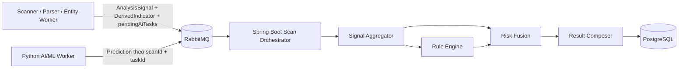

### 6.2. PostgreSQL

Các nhóm dữ liệu chính:

```text
users / roles / auth_sessions / refresh_tokens
scan_requests
scan_results
scan_signals           (optional, nếu cần trace/debug/research)
scan_relations         (parent-child scans)
scan_ai_tasks          (AI task đang chờ: scanId, taskId, kind, status)
risk_entities
risk_sources
rules / rule_versions
community_reports
report_reviews
admin_actions / audit_records
notification_jobs
model_versions         (metadata only)
```

`scan_results.analysis_json` có thể dùng `JSONB` cho result riêng theo scan type, nhưng các field chung như score/level/status/timestamps nên là column rõ ràng để query/filter.

### 6.3. Redis

Redis là **server-side cache**, không phải source of truth:

- recent scan result cache;
- auth-session/revocation cache theo `sid` (PostgreSQL vẫn là source of truth);
- threat/reputation hot cache;
- rate limiting;
- idempotency key;
- lightweight distributed lock;
- temporary job/scan coordination nếu cần.

Threat ingestion có thể refresh/invalidate Redis sau khi PostgreSQL upsert thành công.

### 6.4. MinIO / S3-compatible

Lưu binary/artifact:

- evidence upload từ community report;
- screenshot/file evidence nếu feature cho phép;
- generated PDF/HTML report;
- artifact khác không phù hợp lưu trong PostgreSQL.

PostgreSQL chỉ lưu metadata/object key/hash/MIME/size/owner relation.

---

## 7. URL Scanner và SSRF protection

Vì Web/URL Scanner có thể fetch URL do người dùng cung cấp, bắt buộc:

- Chỉ cho phép `http` và `https`.
- Resolve DNS rồi chặn loopback/private/link-local/metadata ranges.
- Kiểm tra lại resolved destination sau mỗi redirect.
- Giới hạn redirect count.
- Timeout connect/read.
- Giới hạn response size.
- Chặn hostname nội bộ như `localhost`, `.local`, internal DNS suffix được cấu hình.
- Giới hạn port được phép.
- Không gửi credential/header nội bộ khi fetch.
- Network-isolate worker khỏi management plane/database. Worker **không** truy cập PostgreSQL/Redis và **không** gọi bất kỳ API nào của Spring Boot. Kết nối ra ngoài duy nhất được phép, ngoài RabbitMQ, là việc fetch public content của URL Scanner — chính vì vậy SSRF protection ở trên mới là biên phòng thủ chính.

Quy tắc cô lập này kiểm chứng được ở tầng hạ tầng: trong network policy, worker chỉ cần route tới RabbitMQ (và Internet công cộng với URL Scanner). Nếu một worker cần mở thêm kết nối tới core hay database thì đó là dấu hiệu thiết kế đã lệch, không phải nhu cầu hợp lệ.

### 7.1. Operational defaults cho MVP

Các giá trị này là **initial engineering defaults**, chưa phải benchmark/SLA cuối cùng và phải được đo lại khi có load test.

| Hạng mục | Giá trị ban đầu |
| --- | --- |
| JWT access token TTL | 15 phút mặc định; cấu hình được |
| Refresh token TTL | 30 ngày mặc định; rotate mỗi lần refresh |
| Auth session TTL | không vượt quá refresh-token policy; revoke được độc lập theo device/session |
| Parent/nested scan deadline | 30 s |
| Max nested depth | 2 |
| Reputation lookup timeout (trong lõi, Redis -> PostgreSQL) | 500 ms |
| AI task deadline - Orchestrator chờ | 20 s, luôn nhỏ hơn parent deadline |
| AI model/LLM call timeout - trong AI Worker | 10 s, đã tính cả retry nội bộ |
| AI Worker concurrency (`prefetch_count`) | 4 task đồng thời |
| Worker retry | 2 lần sau attempt đầu, rồi DLQ |
| URL redirect limit | 5 |
| URL fetched response size | 5 MB |
| Text input size | 20.000 ký tự |
| Recent scan result cache TTL | 10 phút |
| Threat cache TTL | theo freshness của source; mặc định 1 giờ nếu source không khai báo |

### 7.2. Phân vai rate limit

- **Nginx:** coarse rate limit/flood protection theo IP và connection ở edge.
- **Spring Boot + Redis:** business quota theo `userId`/account/API identity, có thể khác nhau theo role/gói/quyền.

---

## 8. API-facing scan types cần đồng bộ

Public scan API của MVP được giữ ở **4 processor-facing entry point**; các biến thể dùng chung processor được biểu diễn bằng field thay vì thêm endpoint.

```text
POST /v1/scans/url
POST /v1/scans/text
POST /v1/scans/entity
POST /v1/scans/qr

GET  /v1/scans/{scanId}
GET  /v1/scans/history

POST /v1/reports
```

`TEXT` phân biệt message và bài đăng giao dịch bằng `contentType`:

```json
POST /v1/scans/text
{
  "contentType": "MESSAGE | TRANSACTION_POST",
  "text": "<user-input>"
}
```

`ENTITY` dùng chung cho Phone/Bank:

```json
POST /v1/scans/entity
{
  "entityType": "PHONE | BANK_ACCOUNT",
  "value": "<user-input>"
}
```

`WEB_CONTENT` vẫn tồn tại như **internal mode** của URL worker sau khi hệ thống fetch HTML/Form, không cần public endpoint cho user. Tương tự, `DOMAIN` là **derived indicator type nội bộ** dùng cho deferred reputation (mục 4.6.1), không phải `entityType` hợp lệ của `POST /v1/scans/entity`. Standalone CCCD lookup là **Future Scope**; MVP chỉ tạo sensitive-data signal khi CCCD xuất hiện hoặc được yêu cầu trong Text/Web.

API layer phải mask sensitive values trong response/log theo policy.

---

## 9. Công nghệ sử dụng

| Vai trò | Công nghệ |
| --- | --- |
| Front-end | **Next.js** - `User Web` và `Admin Dashboard` là hai client role/boundary riêng; User Web có cùng core user features với Mobile |
| Back-end | **Java Spring Boot** - REST API, Modular Monolith, input routing, Scan Orchestrator, Threat/Reputation Query, Rule Engine, Risk Fusion, Result Composer, History, Report, Admin, Notification |
| Identity integration | **OAuth 2.0 / OpenID Connect adapter registry** trong M01; Google là external provider đầu tiên, Local email/password vẫn được hỗ trợ; provider secret/config không nằm trong business DB |
| Notification delivery | **Channel Resolver + Provider Adapter Registry**; `IN_APP`/`EMAIL`/`PUSH` hiện tại, có thể thêm `SMS`/`TELEGRAM`/`WHATSAPP`/`ZALO` bằng adapter/config mà không đổi business event contract |
| AI / ML | **Python** - **worker riêng** consume `q.ai.analyze` qua AMQP (`pika`/`aio-pika`) và publish kết quả vào `q.scan.result`. Luồng scan **không** gọi REST/gRPC inference. **FastAPI** chỉ giữ cho `/health`, `/ready` và diagnostics nội bộ |
| Mobile | **React Native** - cùng core user features với User Web; thêm QR camera, share intent và interaction native khi phù hợp |
| Database | **PostgreSQL** - source of truth, `JSONB` cho analysis/result đa dạng<br />**Redis** - cache, rate limiting, idempotency, lock |
| Messaging | **RabbitMQ** - `topic exchange`, async worker jobs, nested scan jobs, **AI task**, result events (worker + AI), retry/DLQ |
| Storage | **MinIO** local/self-host hoặc **S3-compatible storage** khi deploy |
| Gateway | **Nginx** - reverse proxy, TLS termination, routing, coarse IP/flood rate limit |
| Container / Local Dev | **Docker Compose** - PostgreSQL, Redis, RabbitMQ, MinIO, Spring Boot, workers, Python AI worker, Next.js, Nginx |
| CI/CD | **GitHub Actions** - build, test, image build/deploy |
| Deployment | **AWS EC2 hoặc VPS** chạy Docker Compose production cho scope khóa luận/MVP |
| Edge / Public Access | **Cloudflare DNS / Tunnel / WAF** có thể sử dụng khi cần |

---

## 10. Architecture completeness checklist

Checklist này phục vụ team triển khai; khi đưa vào báo cáo/thesis có thể rút gọn còn các tiêu chí cốt lõi. Trước khi thêm một input mới, phải trả lời được toàn bộ các câu sau:

- [ ] Input có `ScanType` / `EntityType` rõ ràng chưa?
- [ ] API validation/schema đã có chưa?
- [ ] `ScanTypeResolver` nhận diện được chưa?
- [ ] `ProcessorRegistry` map sang processor nào?
- [ ] Có queue/routing key nếu async chưa?
- [ ] Worker/module có function xử lý cụ thể chưa?
- [ ] Worker trả `AnalysisSignal` theo contract chưa?
- [ ] Worker có giữ được tính cô lập không? Nghĩa là **không** gọi API core, **không** chạm PostgreSQL/Redis?
- [ ] Chỉ dấu phát hiện giữa chừng có được trả về qua `derivedIndicators[]` kèm `handling` đúng chưa?
- [ ] Nếu input sinh nested indicator, Orchestrator có child-scan flow chưa?
- [ ] Nếu input dùng AI, worker có publish AI task và khai `pendingAiTasks[]` chưa?
- [ ] AI Worker có đảm bảo luôn trả `completed` hoặc `failed` cho task đó chưa?
- [ ] Completion barrier có đếm AI task và có `aiTaskDeadline` chưa?
- [ ] Rule Engine biết consume signal mới chưa?
- [ ] Risk Fusion policy xử lý signal mới chưa? Nếu AI thiếu, có renormalize thay vì coi = 0 chưa?
- [ ] Result Composer giải thích/khuyến nghị được chưa?
- [ ] History/status lưu và query được chưa?
- [ ] Logging có tránh lộ dữ liệu nhạy cảm chưa?
- [ ] Unit/integration/E2E test đã cover input này chưa?
- [ ] Feature user mới có được expose trên cả User Web và Mobile chưa? Nếu không, lý do có phải do platform capability/UX không tự nhiên không?
- [ ] User Web và Mobile có dùng cùng API contract/business rule thay vì tạo logic nghiệp vụ riêng theo client không?

Với revision này, các input chính thức hiện tại đều có processor owner:

```text
URL (+ internal HTML/Form) -> Web/URL Scanner Worker (+ AI task tùy chọn)
Text + Transaction Post      -> Text Analyzer Worker (`contentType`) (+ AI task tùy chọn)
Phone + Bank                 -> Entity/Reputation Checker Worker
CCCD request cue             -> Text/Web sensitive-data signal (không standalone lookup ở MVP)
QR/VietQR                    -> QR Parser Worker -> nested scan routing
Community Report             -> Community Report Module
```

và tất cả output đều có owner rõ ràng:

```text
score + level            -> Risk Fusion
evidence                 -> Signal Aggregator + Rule Engine
explanation/recommendation -> Result Composer
status                   -> Scan Orchestrator
history                  -> Scan Query & History
audit/log                -> Audit & Observability
```
