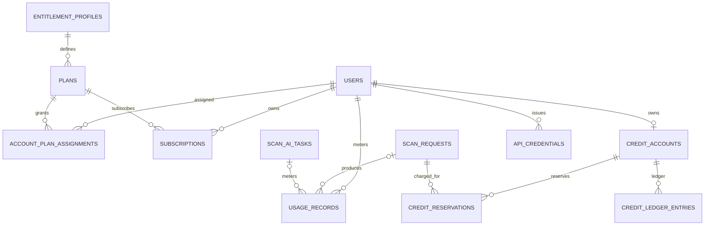

# Anti-Scam Platform — Tổng thể Database & Persistence Schema

> **Schema version:** V1.0 — Draft schema aligned with Architecture V3.3 + Modules Specification V1.3; chưa chốt với team  
> **Basis:** Architecture V3.3 + `modules_specification_v1.3.md` hiện hành.  
> **Mục tiêu:** schema persistence tổng thể **đối chiếu đầy đủ với Architecture V3.3 và `modules_specification_v1.3.md`**, trace được scan async/nested/AI, hỗ trợ Guest + Local/Google Account + OTP/password recovery + **JWT access token ngắn hạn + rotating opaque refresh token + server-side auth session** + notification channel/provider-agnostic, và để sẵn extension seam cho Premium/Credit/API Client **nhưng không đưa billing/credit vào release đầu tiên**.
>
> **Phân loại:** `MVP-CANONICAL` = cần migration cho release đầu; `MVP-OPTIONAL` = chỉ tạo khi bật feature tương ứng; `FUTURE` = blueprint, chưa migration ở release đầu.

---

## 0. Quy ước thiết kế

### 0.1. Data store ownership

- **PostgreSQL**: source of truth cho business state, scan lifecycle/result, rules/policies, reports, threat intelligence, auth, audit.
- **Redis**: cache + rate limit/quota counters + idempotency + temporary coordination. Không là source of truth.
- **RabbitMQ**: transport cho scan/AI/result/export/notification/ingestion. Không lưu canonical business state.
- **MinIO/S3**: evidence, screenshot, export, binary artifact. PostgreSQL chỉ lưu metadata/object key/hash.

### 0.2. Kiểu dữ liệu chung

- Primary key: `UUID` tạo ở application; có thể dùng UUIDv7 để locality/index tốt hơn.
- Thời gian: `TIMESTAMPTZ`.
- Tất cả bảng mutable: `created_at`, `updated_at`.
- Bảng append-only/ledger: chỉ `created_at`, không update business payload sau khi commit.
- Dữ liệu biến thiên theo processor/policy: `JSONB`.
- Field cần filter/join thường xuyên phải là **column thật**, không nhét vào JSONB.
- Secret/token/API key: **chỉ lưu hash**, không lưu raw.
- Phone/bank/CCCD-like data: lookup bằng HMAC/hash; UI/log dùng masked value; raw value nếu thực sự cần retention phải mã hóa ở application layer.

### 0.3. Closed lifecycle vs extensible taxonomy

Các lifecycle ổn định có thể dùng PostgreSQL ENUM hoặc `VARCHAR + CHECK`:

- `scan_status`: `PENDING | PROCESSING | COMPLETED | FAILED`
- `risk_level`: `SAFE | CAUTION | DANGER`
- `ai_task_status`: `PENDING | COMPLETED | FAILED | TIMED_OUT`
- `report_status`: `PENDING | UNDER_REVIEW | VERIFIED | REJECTED`

Các taxonomy cần mở rộng nên dùng string key / lookup table thay vì closed enum:

- threat `entity_type`
- auth/AI/notification `provider_key`
- notification `channel_key`
- `inference_profile`
- `plan_key`
- feature flags
- external source/provider types

---

# 0.4. Coverage Matrix — Architecture / Module → Persistence

Bảng này là checklist để bảo đảm schema không bỏ sót module nào trong M01–M14.

| Module / capability | Persistence chính | Phân loại / ghi chú |
| --- | --- | --- |
| **M01 Account & Identity** | `users`, `auth_identities`, `local_credentials`, `auth_verification_challenges`, `roles`, `user_roles`, `auth_sessions`, `refresh_tokens` | Guest + Local + Google OIDC; external provider qua `provider_key` mở |
| **M02 URL Scan** | dùng `scan_requests`, `scan_results`, `scan_signals`, `scan_relations`, `scan_ai_tasks` | không tạo bảng URL riêng |
| **M03 Text / Transaction** | dùng shared scan tables | không tạo bảng Text riêng |
| **M04 Phone / Bank Reputation** | shared scan + M08 `risk_*` | worker không đọc DB trực tiếp |
| **M05 QR / VietQR** | shared scan + `scan_artifacts` nếu lưu ảnh/evidence | không tạo bảng QR riêng |
| **M06 Result / History / Export** | `scan_requests`, `scan_results`, `stored_objects`, `scan_exports`, `scan_artifacts` | export/artifact có thể MVP-OPTIONAL theo scope |
| **M07 Community Report** | `community_reports`, `report_reviews`, `report_evidence`, `stored_objects` | MVP-CANONICAL |
| **M08 Threat Intelligence** | `risk_entity_types`, `risk_sources`, `risk_source_sync_runs`, `risk_entities`, `risk_entity_observations` | source version/import batch được lưu trong sync run metadata |
| **M09 Rule / Risk Policy** | `rules`, `rule_versions`, `fusion_policies`, `fusion_policy_versions` | admin changes đi qua M14 audit |
| **M10 Notification** | `notification_preferences`, `notification_endpoints`, `notification_jobs`, `notification_deliveries` | channel/provider-agnostic; current in-app/email/push, future SMS/Telegram/... không đổi producer contract |
| **M11 AI/ML Inference** | `ai_models`, `ai_model_versions`, `ai_inference_routes`; artifact qua `stored_objects` | provider credentials không nằm DB |
| **M12 Shared Scan Platform** | scan lifecycle tables + `processed_events`, `outbox_events` | PostgreSQL source of truth; Redis chỉ coordination/cache |
| **M13 Platform Infrastructure** | không sở hữu business table riêng; host PostgreSQL/Redis/RabbitMQ/MinIO | schema phi quan hệ được mô tả ở các mục Redis/MQ/Object Storage |
| **M14 Audit & Observability** | `audit_records`, `admin_actions` | operational logs/metrics backend cụ thể không bị ép bởi V3.3 |
| **Future Commercialization** | `entitlement_profiles`, `plans`, `account_plan_assignments`, `subscriptions`, `usage_records`, `credit_accounts`, `credit_ledger_entries`, `credit_reservations`, `api_credentials` | FUTURE — không migration trong release đầu |

## 0.5. Inventory chuẩn

**MVP-CANONICAL / MVP-OPTIONAL tables (39):**

```text
users
auth_identities
local_credentials
auth_verification_challenges
roles
user_roles
auth_sessions
refresh_tokens
scan_requests
scan_relations
scan_ai_tasks
scan_results
scan_signals
processed_events
outbox_events
stored_objects
scan_exports
scan_artifacts
community_reports
report_reviews
report_evidence
risk_entity_types
risk_sources
risk_source_sync_runs
risk_entities
risk_entity_observations
rules
rule_versions
fusion_policies
fusion_policy_versions
notification_preferences
notification_endpoints
notification_jobs
notification_deliveries
ai_models
ai_model_versions
ai_inference_routes
audit_records
admin_actions
```

`scan_signals`, `scan_artifacts`, export/notification preferences hoặc provider delivery detail có thể bật/tắt theo scope triển khai, nhưng schema đã định nghĩa trước để không phải thiết kế lại boundary.

**Future tables (9, chưa thuộc MVP):**

```text
entitlement_profiles
plans
account_plan_assignments
subscriptions
usage_records
credit_accounts
credit_ledger_entries
credit_reservations
api_credentials
```

## 0.6. Những thứ cố ý **không có bảng riêng**

- Không có `url_scan_results`, `text_scan_results`, `entity_scan_results`, `qr_scan_results`: dùng `scan_results` + `analysis_json` + `scan_signals`.
- Không có `html_scan`: HTML/Form là internal mode của URL worker.
- Không có standalone `cccd_entities` trong MVP: CCCD chỉ là sensitive-data signal trong Text/Web và phải mask/redact.
- Không có bảng `guest_users`: Guest là ephemeral access context.
- Không có `username` trong MVP: `display_name` là non-unique presentation field; chỉ thêm username khi có public-handle use case.
- Không tạo bảng provider-specific kiểu `google_users`: external identity dùng `auth_identities(provider_key, provider_subject)`.
- Không có bảng provider-specific kiểu `openai_models`, `gemini_models`: M11 dùng registry/provider key mở.
- Không có `users.credit_balance`: future credit dùng ledger riêng.

---

# 1. Nhóm M01 — Account, Identity & Access

## 1.1. `users`

Account/profile canonical record. Authentication method được tách khỏi bảng này.

```text
users
-----
id                       uuid PK
email                    varchar(320) NOT NULL
full_name                varchar(160) NULL
display_name             varchar(120) NULL
date_of_birth            date NULL
avatar_url               text NULL
status                   varchar(30) NOT NULL DEFAULT 'PENDING_VERIFICATION'
email_verified_at        timestamptz NULL
last_login_at            timestamptz NULL
created_at               timestamptz NOT NULL
updated_at               timestamptz NOT NULL
deleted_at               timestamptz NULL
```

Ràng buộc:

```text
UNIQUE(lower(email))
status IN ('PENDING_VERIFICATION', 'ACTIVE', 'SUSPENDED', 'DELETED')
```

- email được application canonicalize (`trim` + lowercase policy) trước persistence/lookup;
- `display_name` không unique và **không phải username**;
- chưa tạo `username` vì Architecture/Module Spec chưa có public-handle use case;
- `date_of_birth` là profile data nhạy cảm, không truyền sang scanner/AI/log;
- password hash **không nằm trong `users`**;
- Guest không tạo row trong `users`.

## 1.2. `auth_identities`

External identity mapping. Google là provider đầu tiên, nhưng schema không hard-code danh sách provider.

```text
auth_identities
---------------
id                       uuid PK
user_id                  uuid NOT NULL FK -> users.id
provider_key             varchar(80) NOT NULL
provider_subject         varchar(255) NOT NULL
provider_email           varchar(320) NULL
provider_email_verified  boolean NULL
metadata_json            jsonb NOT NULL DEFAULT '{}'
last_used_at             timestamptz NULL
created_at               timestamptz NOT NULL
updated_at               timestamptz NOT NULL

UNIQUE(provider_key, provider_subject)
```

- Google: `provider_key='google'`, `provider_subject=<OIDC sub>`;
- không dùng provider email thay cho stable subject;
- token/code/assertion của provider không persist vào bảng này;
- account linking không được silent merge chỉ vì email trùng.

## 1.3. `local_credentials`

Chỉ tồn tại nếu account hỗ trợ Local email/password.

```text
local_credentials
-----------------
user_id                  uuid PK FK -> users.id
password_hash            varchar NOT NULL
password_changed_at      timestamptz NULL
created_at               timestamptz NOT NULL
updated_at               timestamptz NOT NULL
```

Google-only account có thể không có row trong bảng này.

## 1.4. `auth_verification_challenges`

Source of truth cho email verification / password reset / password change OTP challenge.

```text
auth_verification_challenges
----------------------------
id                       uuid PK
user_id                  uuid NOT NULL FK -> users.id
purpose                  varchar(40) NOT NULL
target_email             varchar(320) NOT NULL
code_hash                varchar NOT NULL
attempt_count            integer NOT NULL DEFAULT 0
max_attempts             integer NOT NULL DEFAULT 5
expires_at               timestamptz NOT NULL
verified_at              timestamptz NULL
consumed_at              timestamptz NULL
created_at               timestamptz NOT NULL
```

Ràng buộc:

```text
purpose IN ('EMAIL_VERIFICATION', 'PASSWORD_RESET', 'PASSWORD_CHANGE')
max_attempts > 0
attempt_count >= 0
```

- raw OTP không persist; chỉ `code_hash`;
- challenge có expiry + max attempts + single-use semantics;
- resend phải invalidate/supersede challenge cũ theo application policy;
- forgot-password cho email không tồn tại không tạo challenge nhưng response vẫn phải trung tính.

## 1.5. `roles`

```text
roles
-----
id                       uuid PK
code                     varchar(50) UNIQUE NOT NULL
name                     varchar(100) NOT NULL
description              text
created_at               timestamptz NOT NULL
```

Ví dụ MVP: `USER`, `MODERATOR`, `ADMIN`.

## 1.6. `user_roles`

```text
user_roles
----------
user_id                  uuid FK -> users.id
role_id                  uuid FK -> roles.id
assigned_by_user_id      uuid NULL FK -> users.id
assigned_at              timestamptz NOT NULL

PK(user_id, role_id)
```

## 1.7. `auth_sessions`

```text
auth_sessions
-------------
id                       uuid PK
user_id                  uuid NOT NULL FK -> users.id
status                   varchar(20) NOT NULL
user_agent_hash          bytea NULL
ip_hash                  bytea NULL
created_at               timestamptz NOT NULL
last_seen_at             timestamptz NULL
expires_at               timestamptz NOT NULL
revoked_at               timestamptz NULL
revocation_reason        varchar(100) NULL
```

Quy ước MVP:
- mỗi login/device tạo một `auth_sessions` row; JWT access token mang `sid = auth_sessions.id`;
- `status` tối thiểu hỗ trợ `ACTIVE | REVOKED | EXPIRED`;
- PostgreSQL là source of truth; Redis có thể cache `auth:session:{sid}` để kiểm tra revoke nhanh;
- không có bảng `access_tokens`: access token là JWT ngắn hạn và raw token không persist.


## 1.8. `refresh_tokens`

Để hỗ trợ rotation và phát hiện token reuse.

```text
refresh_tokens
--------------
id                       uuid PK
session_id               uuid NOT NULL FK -> auth_sessions.id
token_hash               bytea UNIQUE NOT NULL
token_family_id          uuid NOT NULL
expires_at               timestamptz NOT NULL
used_at                  timestamptz NULL
rotated_from_id          uuid NULL FK -> refresh_tokens.id
replaced_by_id           uuid NULL FK -> refresh_tokens.id
revoked_at               timestamptz NULL
created_at               timestamptz NOT NULL
```

Quy tắc rotation/reuse:
- refresh credential là opaque high-entropy token; chỉ `token_hash` được persist;
- `token_family_id` được tạo khi login/session phát hành refresh token đầu tiên và giữ nguyên qua các lần rotate;
- refresh thành công phải atomic: set `used_at`, tạo token mới, nối `replaced_by_id` / `rotated_from_id`;
- token đã có `used_at` hoặc `replaced_by_id` mà được trình lại ⇒ reuse detected; application revoke toàn bộ rows cùng `token_family_id` và revoke `auth_sessions`;
- logout/password reset/security incident revoke session/family theo policy; không cần lưu raw access JWT trong DB.

---

# 2. Nhóm M12/M02–M05 — Scan Core

## 2.1. `scan_requests`

Đây là bảng trung tâm của toàn bộ scan lifecycle.

```text
scan_requests
-------------
id                       uuid PK

-- ownership
actor_type               varchar(30) NOT NULL
owner_user_id            uuid NULL FK -> users.id
guest_access_hash        bytea NULL

-- scan classification
scan_type                varchar(20) NOT NULL
content_type             varchar(30) NULL
entity_type              varchar(40) NULL

-- lifecycle
status                   varchar(20) NOT NULL
failure_code             varchar(80) NULL
requested_at             timestamptz NOT NULL
started_at               timestamptz NULL
deadline_at              timestamptz NOT NULL
completed_at             timestamptz NULL

-- input snapshot / privacy
input_fingerprint        bytea NOT NULL
input_display_masked     text NULL
input_payload_ciphertext bytea NULL
input_metadata           jsonb NOT NULL DEFAULT '{}'

-- execution-policy snapshot
quota_profile            varchar(80) NOT NULL
inference_profile        varchar(80) NOT NULL
feature_flags_snapshot   jsonb NOT NULL DEFAULT '[]'
history_policy           varchar(50) NOT NULL

-- tracing
correlation_id           varchar(100) NOT NULL
request_id               varchar(100) NULL
processor_route_version  varchar(80) NULL

-- retention
retention_expires_at     timestamptz NULL

created_at               timestamptz NOT NULL
updated_at               timestamptz NOT NULL
```

### Ràng buộc ownership

MVP:

```text
actor_type = 'GUEST'
    -> owner_user_id IS NULL
    -> guest_access_hash IS NOT NULL

actor_type IN ('AUTHENTICATED_USER', 'ADMIN')
    -> owner_user_id IS NOT NULL
    -> guest_access_hash IS NULL
```

Future `API_CLIENT` có thể vẫn gắn `owner_user_id` của account owner và thêm reference API credential bằng migration tương lai mà không đổi public scan contract.

### Ràng buộc scan type

```text
scan_type IN ('URL', 'TEXT', 'ENTITY', 'QR')

scan_type = 'TEXT'
    -> content_type IN ('MESSAGE', 'TRANSACTION_POST')

scan_type = 'ENTITY'
    -> entity_type IN ('PHONE', 'BANK_ACCOUNT')

URL / QR
    -> content_type, entity_type = NULL
```

### Input retention

- Guest: `input_payload_ciphertext` thường `NULL`, chỉ giữ fingerprint + masked summary; `retention_expires_at` ngắn.
- Authenticated User: retention theo policy; chỉ mã hóa raw content nếu thực sự cần history/rescan.
- Không lưu raw CCCD/token/password trong input snapshot.

## 2.2. `scan_relations`

Canonical source of truth cho parent-child scan.

```text
scan_relations
--------------
id                       uuid PK
parent_scan_id           uuid NOT NULL FK -> scan_requests.id
child_scan_id            uuid NOT NULL FK -> scan_requests.id
relation_type            varchar(40) NOT NULL
indicator_type           varchar(40) NULL
indicator_fingerprint    bytea NULL
depth                    smallint NOT NULL
created_at               timestamptz NOT NULL

UNIQUE(parent_scan_id, child_scan_id)
UNIQUE(child_scan_id)
CHECK(parent_scan_id <> child_scan_id)
CHECK(depth BETWEEN 1 AND 2)   -- MVP maxDepth = 2
```

Cycle detection vẫn enforce ở M12 transaction/application vì CHECK không nhìn được toàn graph.

## 2.3. `scan_ai_tasks`

Canonical source of truth cho AI completion barrier.

```text
scan_ai_tasks
-------------
task_id                  varchar(120) PK
scan_id                  uuid NOT NULL FK -> scan_requests.id
kind                     varchar(40) NOT NULL
status                   varchar(20) NOT NULL

inference_profile        varchar(80) NOT NULL
requested_at             timestamptz NOT NULL
deadline_at              timestamptz NOT NULL
completed_at             timestamptz NULL

failure_reason           varchar(80) NULL

-- trace metadata, chỉ có sau khi inference thực thi
provider_key             varchar(120) NULL
model_id                 varchar(200) NULL
model_version            varchar(120) NULL
probability              numeric(6,5) NULL
label                    varchar(100) NULL
latency_ms               integer NULL

request_event_id         varchar(120) NULL
result_event_id          varchar(120) NULL
processor_version        varchar(120) NULL

created_at               timestamptz NOT NULL
updated_at               timestamptz NOT NULL
```

Ràng buộc:

```text
kind IN ('URL_FEATURES', 'TEXT_CONTENT', 'WEB_CONTENT')
deadline_at > requested_at
probability IS NULL OR probability BETWEEN 0 AND 1

status = COMPLETED
    -> completed_at IS NOT NULL
    -> label IS NOT NULL

status IN (FAILED, TIMED_OUT)
    -> failure_reason IS NOT NULL
```

`provider_key` là extensible string, không phải enum đóng.

## 2.4. `scan_results`

1:1 với scan.

```text
scan_results
------------
scan_id                  uuid PK FK -> scan_requests.id
risk_score               smallint NOT NULL
risk_level               varchar(20) NOT NULL
degraded                 boolean NOT NULL DEFAULT false

fusion_policy_version_id uuid NULL FK -> fusion_policy_versions.id
rule_set_fingerprint     bytea NULL

evidence_json            jsonb NOT NULL DEFAULT '[]'
explanations_json        jsonb NOT NULL DEFAULT '[]'
recommendations_json     jsonb NOT NULL DEFAULT '[]'
analysis_json            jsonb NOT NULL DEFAULT '{}'
fusion_metadata          jsonb NOT NULL DEFAULT '{}'

completed_at             timestamptz NOT NULL
created_at               timestamptz NOT NULL

CHECK(risk_score BETWEEN 0 AND 100)
CHECK(risk_level IN ('SAFE','CAUTION','DANGER'))
```

`analysis_json` chứa phần result đặc thù processor; các field query/filter chính vẫn là column.

## 2.5. `scan_signals` — khuyến nghị bật cho đồ án

Architecture cho phép optional. Với khóa luận nên lưu vì giúp debug, explainability, evaluation và so sánh model.

```text
scan_signals
------------
id                       uuid PK
scan_id                  uuid NOT NULL FK -> scan_requests.id

source_type              varchar(40) NOT NULL
source_ref               varchar(160) NULL
category                 varchar(40) NOT NULL
code                     varchar(120) NOT NULL
severity                 varchar(20) NULL
confidence               numeric(6,5) NULL
value_json               jsonb NOT NULL
metadata                 jsonb NOT NULL DEFAULT '{}'

event_id                 varchar(120) NULL
task_id                  varchar(120) NULL
signal_key               varchar(200) NOT NULL

created_at               timestamptz NOT NULL

UNIQUE(scan_id, signal_key)
CHECK(confidence IS NULL OR confidence BETWEEN 0 AND 1)
```

`signal_key` được tạo deterministically để duplicate RabbitMQ result không tạo signal lần hai.

---

# 3. Reliable Messaging / Idempotency

## 3.1. `processed_events`

Inbox/idempotency store cho at-least-once delivery.

```text
processed_events
----------------
consumer_key             varchar(120) NOT NULL
event_id                 varchar(120) NOT NULL
event_type               varchar(120) NOT NULL
payload_hash             bytea NULL
processed_at             timestamptz NOT NULL
expires_at               timestamptz NULL

PK(consumer_key, event_id)
```

Một `eventId` có thể hợp lệ với nhiều consumer, vì vậy không dùng `event_id` đơn lẻ làm PK.

## 3.2. `outbox_events` — khuyến nghị mạnh

Đảm bảo transaction tạo `ScanRequest` và publish job không bị split-brain.

```text
outbox_events
-------------
id                       uuid PK
aggregate_type           varchar(80) NOT NULL
aggregate_id             uuid NOT NULL
event_type               varchar(120) NOT NULL
routing_key              varchar(160) NOT NULL
payload                  jsonb NOT NULL
status                   varchar(20) NOT NULL DEFAULT 'PENDING'
attempt_count            integer NOT NULL DEFAULT 0
available_at             timestamptz NOT NULL
published_at             timestamptz NULL
last_error               text NULL
created_at               timestamptz NOT NULL
```

Spring Boot commit business row + outbox row cùng transaction; publisher riêng gửi RabbitMQ với publisher confirm.

---

# 4. M06 — History, Export & Artifact

## 4.1. `stored_objects`

Metadata chung cho MinIO/S3.

```text
stored_objects
--------------
id                       uuid PK
bucket_name              varchar(120) NOT NULL
object_key               varchar(512) NOT NULL
mime_type                varchar(160) NOT NULL
size_bytes               bigint NOT NULL
sha256                   bytea NOT NULL
classification           varchar(50) NOT NULL
created_by_user_id       uuid NULL FK -> users.id
created_at               timestamptz NOT NULL
deleted_at               timestamptz NULL

UNIQUE(bucket_name, object_key)
CHECK(size_bytes >= 0)
```

Không lưu signed URL lâu dài trong DB.

## 4.2. `scan_exports`

```text
scan_exports
------------
id                       uuid PK
scan_id                  uuid NOT NULL FK -> scan_requests.id

-- requester snapshot; Guest export is allowed only if M06 policy allows
requester_actor_type     varchar(30) NOT NULL
requested_by_user_id     uuid NULL FK -> users.id
requester_guest_hash     bytea NULL

format                   varchar(20) NOT NULL
status                   varchar(20) NOT NULL
object_id                uuid NULL FK -> stored_objects.id
error_code               varchar(80) NULL
requested_at             timestamptz NOT NULL
completed_at             timestamptz NULL
retention_expires_at     timestamptz NULL

CHECK(format IN ('PDF','HTML'))
CHECK(
  (requester_actor_type = 'GUEST' AND requested_by_user_id IS NULL AND requester_guest_hash IS NOT NULL)
  OR
  (requester_actor_type IN ('AUTHENTICATED_USER','ADMIN') AND requested_by_user_id IS NOT NULL AND requester_guest_hash IS NULL)
)
```

Export authorization luôn dựa trên `AccessContext` + ownership của `scan_requests`; `exportId` hoặc `object_id` không phải authorization token. Guest export (nếu bật) phải có retention ngắn và không tạo persistent history.

## 4.3. `scan_artifacts` — optional

Dùng nếu về sau lưu screenshot/web evidence.

```text
scan_artifacts
--------------
id                       uuid PK
scan_id                  uuid NOT NULL FK -> scan_requests.id
artifact_type            varchar(50) NOT NULL
object_id                uuid NOT NULL FK -> stored_objects.id
metadata                 jsonb NOT NULL DEFAULT '{}'
created_at               timestamptz NOT NULL
```

---

# 5. M07 — Community Report & Moderation

## 5.1. `community_reports`

M07 hiện là authenticated User + moderator/admin; do đó MVP bắt reporter có account.

```text
community_reports
-----------------
id                       uuid PK
reporter_user_id         uuid NOT NULL FK -> users.id

reported_type            varchar(50) NOT NULL
reported_value_hash      bytea NULL
reported_value_masked    text NULL
reported_value_ciphertext bytea NULL
description              text NOT NULL

status                   varchar(30) NOT NULL
duplicate_fingerprint    bytea NULL

submitted_at             timestamptz NOT NULL
updated_at               timestamptz NOT NULL
closed_at                timestamptz NULL

CHECK(status IN ('PENDING','UNDER_REVIEW','VERIFIED','REJECTED'))
```

Unverified report không bao giờ trực tiếp tạo hard blacklist.

## 5.2. `report_reviews`

Append-oriented review history.

```text
report_reviews
--------------
id                       uuid PK
report_id                uuid NOT NULL FK -> community_reports.id
reviewer_user_id         uuid NOT NULL FK -> users.id
decision                 varchar(30) NOT NULL
reason_code              varchar(80) NULL
moderation_note          text NULL
created_at               timestamptz NOT NULL
```

Current status ở `community_reports`; lịch sử review ở `report_reviews`.

## 5.3. `report_evidence`

```text
report_evidence
---------------
id                       uuid PK
report_id                uuid NOT NULL FK -> community_reports.id
object_id                uuid NOT NULL FK -> stored_objects.id
evidence_type            varchar(50) NOT NULL
description              text NULL
created_at               timestamptz NOT NULL
```

---

# 6. M08 — Threat Intelligence / Reputation

## 6.1. `risk_entity_types`

Extensible lookup table, tránh closed enum.

```text
risk_entity_types
-----------------
code                     varchar(50) PK
is_sensitive             boolean NOT NULL
normalizer_key           varchar(80) NOT NULL
enabled                  boolean NOT NULL DEFAULT true
created_at               timestamptz NOT NULL
```

Seed ban đầu:

```text
DOMAIN
URL
PHONE
BANK_ACCOUNT
```

## 6.2. `risk_sources`

```text
risk_sources
------------
id                       uuid PK
source_key               varchar(100) UNIQUE NOT NULL
name                     varchar(200) NOT NULL
source_type              varchar(50) NOT NULL
trust_score              numeric(6,5) NOT NULL
enabled                  boolean NOT NULL DEFAULT true
freshness_ttl_seconds    integer NULL
config_metadata          jsonb NOT NULL DEFAULT '{}'
last_success_sync_at     timestamptz NULL
created_at               timestamptz NOT NULL
updated_at               timestamptz NOT NULL

CHECK(trust_score BETWEEN 0 AND 1)
```

Không lưu provider secret trong `config_metadata`.

## 6.3. `risk_source_sync_runs`

```text
risk_source_sync_runs
---------------------
id                       uuid PK
source_id                uuid NOT NULL FK -> risk_sources.id
source_version           varchar(160) NULL
status                   varchar(30) NOT NULL
started_at               timestamptz NOT NULL
finished_at              timestamptz NULL
records_received         integer NOT NULL DEFAULT 0
records_inserted         integer NOT NULL DEFAULT 0
records_updated          integer NOT NULL DEFAULT 0
records_rejected         integer NOT NULL DEFAULT 0
content_checksum         bytea NULL
error_summary            text NULL
```

## 6.4. `risk_entities`

Canonical normalized entity.

```text
risk_entities
-------------
id                       uuid PK
entity_type              varchar(50) NOT NULL FK -> risk_entity_types.code
lookup_hash              bytea NOT NULL
canonical_value          text NULL
canonical_value_ciphertext bytea NULL
display_value_masked     text NOT NULL

status                   varchar(30) NOT NULL
risk_level               varchar(20) NULL
confidence               numeric(6,5) NULL

report_count             integer NOT NULL DEFAULT 0
verified_report_count    integer NOT NULL DEFAULT 0

first_seen_at            timestamptz NOT NULL
last_seen_at             timestamptz NOT NULL
last_verified_at         timestamptz NULL

metadata                 jsonb NOT NULL DEFAULT '{}'
created_at               timestamptz NOT NULL
updated_at               timestamptz NOT NULL

UNIQUE(entity_type, lookup_hash)
CHECK(confidence IS NULL OR confidence BETWEEN 0 AND 1)
```

- Public DOMAIN/URL có thể dùng `canonical_value`.
- PHONE/BANK_ACCOUNT ưu tiên encrypted value + lookup hash + masked display.

## 6.5. `risk_entity_observations`

Một entity có nhiều nguồn; không nhét `source_id` trực tiếp vào `risk_entities`.

```text
risk_entity_observations
------------------------
id                       uuid PK
risk_entity_id           uuid NOT NULL FK -> risk_entities.id
source_id                uuid NOT NULL FK -> risk_sources.id
source_record_key        varchar(200) NULL
source_report_id         uuid NULL FK -> community_reports.id

observed_risk_level      varchar(20) NULL
confidence               numeric(6,5) NOT NULL
observed_at              timestamptz NOT NULL
expires_at               timestamptz NULL
evidence_metadata        jsonb NOT NULL DEFAULT '{}'

created_at               timestamptz NOT NULL

UNIQUE(source_id, source_record_key) WHERE source_record_key IS NOT NULL
UNIQUE(source_report_id) WHERE source_report_id IS NOT NULL
```

Verified community report tạo observation idempotently; không sửa entity thành blacklist bằng side effect không traceable.

---

# 7. M09 — Rule Engine & Risk Policy

## 7.1. `rules`

```text
rules
-----
id                       uuid PK
code                     varchar(120) UNIQUE NOT NULL
category                 varchar(60) NOT NULL
name                     varchar(200) NOT NULL
description              text NULL
enabled                  boolean NOT NULL DEFAULT true
active_version_id        uuid NULL FK -> rule_versions.id FK -> rule_versions.id
created_at               timestamptz NOT NULL
updated_at               timestamptz NOT NULL
```

FK `active_version_id -> rule_versions.id` có thể add sau khi hai bảng được tạo.

## 7.2. `rule_versions`

Immutable sau khi publish.

```text
rule_versions
-------------
id                       uuid PK
rule_id                  uuid NOT NULL FK -> rules.id
version_no               integer NOT NULL
status                   varchar(20) NOT NULL
priority                 integer NOT NULL DEFAULT 0
weight                   numeric(10,4) NULL
severity                 varchar(20) NULL

condition_json           jsonb NOT NULL
explanation_template     text NULL
recommendation_template  text NULL

created_by_user_id       uuid NOT NULL FK -> users.id
created_at               timestamptz NOT NULL
published_at             timestamptz NULL

UNIQUE(rule_id, version_no)
```

Không edit version đã ACTIVE; tạo version mới.

## 7.3. `fusion_policies`

```text
fusion_policies
---------------
id                       uuid PK
policy_key               varchar(100) UNIQUE NOT NULL
name                     varchar(200) NOT NULL
active_version_id        uuid NULL FK -> fusion_policy_versions.id FK -> fusion_policy_versions.id
created_at               timestamptz NOT NULL
updated_at               timestamptz NOT NULL
```

> FK `active_version_id -> fusion_policy_versions.id` được add sau khi cả hai bảng đã tồn tại. Application/trigger phải bảo đảm active version thuộc đúng `fusion_policies.id`.

## 7.4. `fusion_policy_versions`

```text
fusion_policy_versions
----------------------
id                       uuid PK
policy_id                uuid NOT NULL FK -> fusion_policies.id
version_no               integer NOT NULL
status                   varchar(20) NOT NULL

config_json              jsonb NOT NULL
config_hash              bytea NOT NULL

created_by_user_id       uuid NOT NULL FK -> users.id
created_at               timestamptz NOT NULL
published_at             timestamptz NULL

UNIQUE(policy_id, version_no)
UNIQUE(policy_id, config_hash)
```

`config_json` chứa versioned:

- weights theo `URL/TEXT/ENTITY/QR`;
- thresholds `0–34 / 35–69 / 70–100`;
- missing-signal renormalization;
- trusted hard override policy.

`scan_results.fusion_policy_version_id` phải chỉ đúng version đã dùng.

---

# 8. M10 — Notification

M10 tách `notificationType` (business reason), `channel_key` (IN_APP/EMAIL/PUSH/SMS/TELEGRAM/...) và `provider_key` (vendor/adapter). Các key này là extensible string/config key, không dùng closed enum khiến thêm channel/provider phải migration taxonomy.

## 8.1. `notification_preferences`

```text
notification_preferences
------------------------
user_id                  uuid NOT NULL FK -> users.id
channel_key              varchar(50) NOT NULL
enabled                  boolean NOT NULL
event_filter             jsonb NOT NULL DEFAULT '[]'
updated_at               timestamptz NOT NULL

PK(user_id, channel_key)
```

Mandatory security notification có thể override user preference theo policy; preference không phải authorization control.

## 8.2. `notification_endpoints`

Generic destination registry cho channel cần external address/token.

```text
notification_endpoints
----------------------
id                       uuid PK
user_id                  uuid NOT NULL FK -> users.id
channel_key              varchar(50) NOT NULL
provider_key             varchar(80) NULL
address_type             varchar(50) NOT NULL
address_ciphertext       bytea NOT NULL
address_fingerprint      bytea NOT NULL
verified_at              timestamptz NULL
enabled                  boolean NOT NULL DEFAULT true
metadata_json            jsonb NOT NULL DEFAULT '{}'
last_used_at             timestamptz NULL
created_at               timestamptz NOT NULL
updated_at               timestamptz NOT NULL

UNIQUE(user_id, channel_key, address_fingerprint)
```

Ví dụ logical:

```text
EMAIL     -> address_type=email
SMS       -> address_type=phone
PUSH      -> address_type=fcm_token | apns_token | webpush_subscription
TELEGRAM  -> address_type=chat_id
```

- address/token phải encrypt/protect at rest khi phù hợp;
- log chỉ dùng masked value/fingerprint;
- provider credential/API token không nằm bảng này;
- primary email endpoint có thể được đồng bộ từ `users.email`; `verified_at` được cập nhật khi M01 xác minh email hoặc tin provider OIDC theo policy.

## 8.3. `notification_jobs`

Một row là một notification job theo recipient + channel; producer không biết provider vendor cụ thể.

```text
notification_jobs
-----------------
id                       uuid PK
user_id                  uuid NOT NULL FK -> users.id
notification_type        varchar(100) NOT NULL
resource_type            varchar(60) NULL
resource_id              uuid NULL
channel_key              varchar(50) NOT NULL
template_key             varchar(120) NOT NULL
status                   varchar(20) NOT NULL
priority                  smallint NOT NULL DEFAULT 0
idempotency_key          varchar(160) UNIQUE NOT NULL

-- canonical NON-SENSITIVE presentation/deep-link/template context
payload_json             jsonb NOT NULL DEFAULT '{}'
deep_link_path           varchar(500) NULL
read_at                  timestamptz NULL

scheduled_at             timestamptz NOT NULL
expires_at               timestamptz NULL
created_at               timestamptz NOT NULL
completed_at             timestamptz NULL
```

- `read_at` chỉ có nghĩa với `channel_key='IN_APP'`;
- raw OTP/password reset code/provider secret **không được persist trong `payload_json`**;
- transactional job có `expires_at`; worker không gửi sau khi hết hạn.

## 8.4. `notification_deliveries`

```text
notification_deliveries
-----------------------
id                       uuid PK
job_id                   uuid NOT NULL FK -> notification_jobs.id
endpoint_id              uuid NULL FK -> notification_endpoints.id
channel_key              varchar(50) NOT NULL
provider_key             varchar(80) NULL
attempt_no               integer NOT NULL
status                   varchar(20) NOT NULL
external_message_id      varchar(200) NULL
error_code               varchar(80) NULL
error_detail_sanitized   varchar(500) NULL
sent_at                  timestamptz NULL
delivered_at             timestamptz NULL
created_at               timestamptz NOT NULL

UNIQUE(job_id, attempt_no)
```

`endpoint_id` có thể NULL cho `IN_APP`. Provider callback/update phải idempotent và không được ghi raw payload/secret.

---

# 9. M11 — AI Model / Provider Registry

Provider credential nằm trong secret manager/environment, không nằm ở DB.

## 9.1. `ai_models`

Logical model registry.

```text
ai_models
---------
id                       uuid PK
model_key                varchar(120) UNIQUE NOT NULL
display_name             varchar(200) NOT NULL
task_kind                varchar(40) NOT NULL
enabled                  boolean NOT NULL DEFAULT true
created_at               timestamptz NOT NULL
updated_at               timestamptz NOT NULL
```

## 9.2. `ai_model_versions`

```text
ai_model_versions
-----------------
id                       uuid PK
model_id                 uuid NOT NULL FK -> ai_models.id
provider_key             varchar(120) NOT NULL
provider_model_id        varchar(240) NOT NULL
model_version            varchar(160) NOT NULL

artifact_object_id       uuid NULL FK -> stored_objects.id
artifact_uri             text NULL
non_secret_config        jsonb NOT NULL DEFAULT '{}'
status                   varchar(20) NOT NULL
created_at               timestamptz NOT NULL
activated_at             timestamptz NULL

UNIQUE(model_id, model_version)
```

`provider_key` ví dụ:

```text
openai-direct
gemini-direct
openrouter
hf-local
custom-local
```

Không phải closed enum. Với local/fine-tuned model, ưu tiên `artifact_object_id` nếu artifact nằm trong MinIO/S3 do hệ thống quản lý; `artifact_uri` dành cho registry/location bên ngoài. Provider credential vẫn nằm trong secret management, không ở DB.

## 9.3. `ai_inference_routes`

Map logical `inferenceProfile + task kind` -> model version.

```text
ai_inference_routes
-------------------
id                       uuid PK
inference_profile        varchar(80) NOT NULL
task_kind                varchar(40) NOT NULL
model_version_id         uuid NOT NULL FK -> ai_model_versions.id
priority                 integer NOT NULL DEFAULT 0
enabled                  boolean NOT NULL DEFAULT true
created_at               timestamptz NOT NULL
updated_at               timestamptz NOT NULL

UNIQUE(inference_profile, task_kind, priority)
```

MVP seed:

```text
inference_profile = standard
```

Future premium profile chỉ thêm data/config; M12 vẫn chỉ truyền logical profile.

---

# 10. M14 — Audit & Observability

## 10.1. `audit_records`

Append-only.

```text
audit_records
-------------
id                       uuid PK

actor_type               varchar(40) NULL
actor_user_id            uuid NULL FK -> users.id
action                   varchar(120) NOT NULL

resource_type            varchar(80) NULL
resource_id              varchar(160) NULL

scan_id                  uuid NULL FK -> scan_requests.id
correlation_id           varchar(120) NULL
event_id                 varchar(120) NULL
job_id                   varchar(120) NULL
task_id                  varchar(120) NULL

outcome                  varchar(30) NOT NULL
metadata                 jsonb NOT NULL DEFAULT '{}'

created_at               timestamptz NOT NULL
```

Không được chứa raw password/token/CCCD/credit secret.

## 10.2. `admin_actions`

Business-specific admin audit detail.

```text
admin_actions
-------------
id                       uuid PK
audit_record_id          uuid UNIQUE NOT NULL FK -> audit_records.id
admin_user_id            uuid NOT NULL FK -> users.id
action_type              varchar(120) NOT NULL
before_json              jsonb NULL
after_json               jsonb NULL
reason                   text NULL
created_at               timestamptz NOT NULL
```

---

# 11. Quan hệ tổng thể MVP

```mermaid
erDiagram
    USERS ||--o{ AUTH_IDENTITIES : authenticates_via
    USERS ||--o| LOCAL_CREDENTIALS : local_credential
    USERS ||--o{ AUTH_VERIFICATION_CHALLENGES : verifies
    USERS ||--o{ USER_ROLES : has
    ROLES ||--o{ USER_ROLES : grants
    USERS ||--o{ AUTH_SESSIONS : opens
    AUTH_SESSIONS ||--o{ REFRESH_TOKENS : rotates

    USERS o|--o{ SCAN_REQUESTS : owns
    SCAN_REQUESTS ||--o| SCAN_RESULTS : finalizes
    SCAN_REQUESTS ||--o{ SCAN_SIGNALS : produces
    SCAN_REQUESTS ||--o{ SCAN_AI_TASKS : waits_for

    SCAN_REQUESTS ||--o{ SCAN_RELATIONS : parent
    SCAN_REQUESTS ||--o| SCAN_RELATIONS : child

    USERS ||--o{ COMMUNITY_REPORTS : submits
    COMMUNITY_REPORTS ||--o{ REPORT_REVIEWS : reviewed_by
    USERS ||--o{ REPORT_REVIEWS : reviews
    COMMUNITY_REPORTS ||--o{ REPORT_EVIDENCE : contains
    STORED_OBJECTS ||--o{ REPORT_EVIDENCE : backs

    RISK_ENTITY_TYPES ||--o{ RISK_ENTITIES : types
    RISK_ENTITIES ||--o{ RISK_ENTITY_OBSERVATIONS : observed_as
    RISK_SOURCES ||--o{ RISK_ENTITY_OBSERVATIONS : supplies
    COMMUNITY_REPORTS o|--o| RISK_ENTITY_OBSERVATIONS : verified_into

    RULES ||--o{ RULE_VERSIONS : versions
    FUSION_POLICIES ||--o{ FUSION_POLICY_VERSIONS : versions
    FUSION_POLICY_VERSIONS o|--o{ SCAN_RESULTS : used_by

    AI_MODELS ||--o{ AI_MODEL_VERSIONS : versions
    AI_MODEL_VERSIONS ||--o{ AI_INFERENCE_ROUTES : routed_by

    SCAN_REQUESTS ||--o{ SCAN_EXPORTS : exports
    STORED_OBJECTS o|--o{ SCAN_EXPORTS : stores

    USERS ||--o{ NOTIFICATION_PREFERENCES : configures
    USERS ||--o{ NOTIFICATION_ENDPOINTS : owns
    USERS ||--o{ NOTIFICATION_JOBS : receives
    NOTIFICATION_ENDPOINTS o|--o{ NOTIFICATION_DELIVERIES : targets
    NOTIFICATION_JOBS ||--o{ NOTIFICATION_DELIVERIES : attempts

    USERS o|--o{ AUDIT_RECORDS : actor
    SCAN_REQUESTS o|--o{ AUDIT_RECORDS : traces
    AUDIT_RECORDS ||--o| ADMIN_ACTIONS : details
```



---

# 12. Index bắt buộc / khuyến nghị

## Auth

```text
users(lower(email)) UNIQUE
auth_identities(provider_key, provider_subject) UNIQUE
auth_identities(user_id, provider_key)
auth_verification_challenges(user_id, purpose, expires_at DESC)
auth_verification_challenges(expires_at) WHERE consumed_at IS NULL
auth_sessions(user_id, status, expires_at)
refresh_tokens(token_hash) UNIQUE
refresh_tokens(token_family_id)
refresh_tokens(session_id, expires_at)
```

## Scan

```text
scan_requests(owner_user_id, requested_at DESC, id DESC)
    WHERE owner_user_id IS NOT NULL

scan_requests(status, deadline_at)
    WHERE status IN ('PENDING','PROCESSING')

scan_requests(scan_type, requested_at DESC)

scan_requests(input_fingerprint)
    -- dùng khi cache/dedup policy cần

scan_relations(parent_scan_id)
scan_relations(child_scan_id) UNIQUE

scan_ai_tasks(scan_id, status, deadline_at)
scan_ai_tasks(task_id) PK

scan_results(risk_level, completed_at DESC)
scan_results(completed_at DESC)
scan_signals(scan_id, category, created_at)
scan_signals(task_id) WHERE task_id IS NOT NULL
scan_exports(scan_id, requested_at DESC)
scan_exports(status, requested_at)
scan_artifacts(scan_id, artifact_type)
```

Không tạo GIN index cho mọi JSONB ngay từ đầu. Chỉ tạo khi có query thật.

## Threat

```text
risk_entities(entity_type, lookup_hash) UNIQUE
risk_entities(risk_level, status)
risk_entities(last_seen_at DESC)

risk_entity_observations(risk_entity_id, observed_at DESC)
risk_entity_observations(source_id, source_record_key) UNIQUE WHERE source_record_key IS NOT NULL

risk_source_sync_runs(source_id, started_at DESC)
```

## Reports

```text
community_reports(status, submitted_at)
community_reports(reporter_user_id, submitted_at DESC)
community_reports(reported_type, reported_value_hash)

report_reviews(report_id, created_at DESC)
```

## Operations

```text
outbox_events(status, available_at)
processed_events(expires_at)

notification_endpoints(user_id, channel_key, enabled)
notification_endpoints(user_id, channel_key, address_fingerprint) UNIQUE
notification_jobs(status, scheduled_at)
notification_jobs(user_id, channel_key, read_at, created_at DESC)
notification_jobs(notification_type, created_at DESC)
notification_deliveries(job_id, attempt_no) UNIQUE
notification_deliveries(endpoint_id, created_at DESC) WHERE endpoint_id IS NOT NULL
ai_inference_routes(inference_profile, task_kind, priority) UNIQUE
audit_records(created_at DESC)
audit_records(correlation_id)
audit_records(scan_id)
audit_records(task_id) WHERE task_id IS NOT NULL
audit_records(resource_type, resource_id)
```

---

# 13. Redis key schema

Redis không giữ canonical business data.

```text
rate:ip:{ipHash}
rate:auth:{purpose}:{emailHash}:{window}
rate:auth:ip:{purpose}:{ipHash}:{window}
quota:guest:{guestSessionHash}:{window}
quota:user:{userId}:{window}

idem:{actorKey}:{idempotencyKeyHash}

cache:scan:{scanType}:{inputFingerprint}:{policyFingerprint}
cache:result:{scanId}

cache:threat:{entityType}:{lookupHash}

barrier:scan:{scanId}:children
barrier:scan:{scanId}:ai

lock:scan-finalize:{scanId}

parked:ai:{scanId}:{taskId}
```

TTL:

- quota/rate: theo window;
- idempotency: bounded;
- result cache: MVP default 10 phút;
- threat cache: theo source/default;
- parked/barrier: không vượt parent deadline + safety margin.

Nếu Redis mất, M12 rebuild barrier từ `scan_relations` + `scan_ai_tasks`.

---

# 13.1. RabbitMQ topology / message persistence boundary

RabbitMQ là transport, **không phải canonical business store**. Topology phải đồng bộ với Architecture V3.3 / Module Spec V1.3:

```text
Exchange: antiscan.topic      (topic)
DLX:      antiscan.dlx

q.scan.url
q.scan.text
q.scan.entity
q.scan.qr
q.ai.analyze
q.scan.result
q.report.export
q.notification
q.threat.ingest
```

Core routing keys:

```text
scan.url.requested
scan.url.analyzed
scan.text.requested
scan.text.analyzed
scan.entity.requested
scan.entity.analyzed
scan.qr.requested
scan.qr.parsed
ai.analysis.requested
ai.analysis.completed
ai.analysis.failed
scan.completed
scan.failed
report.export.requested
report.reviewed
notification.requested
threat.ingest.requested
```

Delivery là at-least-once. `processed_events`/deterministic `signal_key`/`task_id` cung cấp idempotency ở business core. `outbox_events` được khuyến nghị để tránh DB commit thành công nhưng publish job thất bại.

## 13.2. Referential action / retention policy

Các `FK -> scan_requests` của dữ liệu phụ thuộc scan (`scan_results`, `scan_signals`, `scan_ai_tasks`, `scan_relations`, `scan_exports`, `scan_artifacts`) nên được triển khai với **cascade cleanup có kiểm soát** khi scan thực sự bị purge theo retention policy. Audit record nên dùng `ON DELETE SET NULL` cho `scan_id` để giữ audit trail đã mask.

Auth-owned child data (`auth_identities`, `local_credentials`, `auth_verification_challenges`, `auth_sessions`, `refresh_tokens`) và notification endpoint/preference có thể cascade theo account **physical deletion**, nhưng MVP ưu tiên **soft delete** `users.deleted_at`; scan/report/audit business history không được mất chỉ vì user bị soft-delete. Notification job/delivery retention đi theo operational/audit policy và phải redact endpoint/secret trước retention dài hạn.

Object Storage dùng two-phase cleanup:

```text
1. revoke/delete business association hoặc mark object deleted_at
2. background cleanup xóa blob MinIO/S3
3. chỉ purge metadata khi không còn FK/reference cần giữ
```

Guest scan/export phải có `retention_expires_at`; authenticated history retention theo policy. Verified threat/reputation provenance và immutable rule/policy versions phải giữ lâu hơn scan cache.

## 13.3. Race / durability note cho early AI result

Module Spec cho phép AI result về trước worker result và được **park theo `scanId`**. MVP có thể park tạm ở Redis, nhưng nếu cần durability mạnh hơn có thể bổ sung bảng `parked_ai_results`/message inbox payload store. Đây là **implementation hardening optional**, không phải canonical table bắt buộc của Architecture V3.3. Nếu không bật bảng durable park, Redis loss có thể làm mất một early result và scan sẽ degrade theo deadline thay vì tạo verdict sai.

---

# 14. Object Storage layout

Ví dụ logical path; object key thực tế nên random/UUID, không dùng PII.

```text
community-evidence/{reportId}/{objectId}
scan-artifacts/{scanId}/{objectId}
exports/{scanId}/{exportId}
models/{modelKey}/{version}/...         -- nếu nhóm chọn lưu local artifact ở S3/MinIO
```

Metadata canonical nằm ở PostgreSQL (`stored_objects`).

---

# 15. Future Scope — Commercialization Schema

> **Không thuộc MVP / release đầu tiên.**  
> Không cần tạo migration các bảng này ngay. Chỉ giữ naming/boundary để về sau thêm mà không phá scan/worker contract.

## 15.1. `entitlement_profiles`

```text
entitlement_profiles
--------------------
id                       uuid PK
profile_key              varchar(80) UNIQUE NOT NULL
quota_profile            varchar(80) NOT NULL
inference_profile        varchar(80) NOT NULL
history_policy           varchar(80) NOT NULL
feature_flags            jsonb NOT NULL DEFAULT '[]'
created_at               timestamptz NOT NULL
updated_at               timestamptz NOT NULL
```

## 15.2. `plans`

```text
plans
-----
id                       uuid PK
plan_key                 varchar(80) UNIQUE NOT NULL
name                     varchar(160) NOT NULL
entitlement_profile_id   uuid NOT NULL FK -> entitlement_profiles.id
status                   varchar(20) NOT NULL
metadata                 jsonb NOT NULL DEFAULT '{}'
```

## 15.3. `account_plan_assignments`

Dùng được trước cả khi có recurring subscription.

```text
account_plan_assignments
------------------------
id                       uuid PK
user_id                  uuid NOT NULL FK -> users.id
plan_id                  uuid NOT NULL FK -> plans.id
source                   varchar(40) NOT NULL
valid_from               timestamptz NOT NULL
valid_until              timestamptz NULL
created_at               timestamptz NOT NULL
```

## 15.4. `subscriptions` — future

Chỉ tạo khi thật sự tích hợp recurring billing.

```text
subscriptions
-------------
id                       uuid PK
user_id                  uuid NOT NULL FK -> users.id
plan_id                  uuid NOT NULL FK -> plans.id
provider_key             varchar(80) NOT NULL
provider_subscription_ref varchar(200) UNIQUE
status                   varchar(30) NOT NULL
current_period_start     timestamptz
current_period_end       timestamptz
created_at               timestamptz NOT NULL
updated_at               timestamptz NOT NULL
```

## 15.5. `usage_records`

Append-only usage metering.

```text
usage_records
-------------
id                       uuid PK
user_id                  uuid NULL FK -> users.id
api_credential_id        uuid NULL FK -> api_credentials.id
scan_id                  uuid NULL FK -> scan_requests.id
ai_task_id               varchar(120) NULL FK -> scan_ai_tasks.task_id

inference_profile        varchar(80) NULL
provider_key             varchar(120) NULL
model_id                 varchar(200) NULL

input_units              bigint NULL
output_units             bigint NULL
provider_cost_micros     bigint NULL
credit_units             numeric(18,6) NULL

idempotency_key          varchar(200) UNIQUE NOT NULL
created_at               timestamptz NOT NULL
```

## 15.6. `credit_accounts`

```text
credit_accounts
---------------
id                       uuid PK
user_id                  uuid UNIQUE NOT NULL FK -> users.id
unit_code                varchar(30) NOT NULL DEFAULT 'CREDIT'
status                   varchar(20) NOT NULL
created_at               timestamptz NOT NULL
```

Không đặt `credit_balance` trong `users`.

## 15.7. `credit_ledger_entries`

Canonical ledger append-only.

```text
credit_ledger_entries
---------------------
id                       uuid PK
credit_account_id        uuid NOT NULL FK -> credit_accounts.id
entry_type               varchar(40) NOT NULL
amount                   numeric(18,6) NOT NULL
reference_type           varchar(60) NULL
reference_id             varchar(160) NULL
idempotency_key          varchar(200) UNIQUE NOT NULL
metadata                 jsonb NOT NULL DEFAULT '{}'
created_at               timestamptz NOT NULL
```

Balance = tổng ledger; có thể có cached/materialized balance nhưng không là source of truth.

## 15.8. `credit_reservations` — future khi paid scan async

Rất hữu ích vì scan/AI chạy async: reserve trước dispatch, capture/release sau khi biết usage thật.

```text
credit_reservations
-------------------
id                       uuid PK
credit_account_id        uuid NOT NULL FK -> credit_accounts.id
scan_id                  uuid NOT NULL FK -> scan_requests.id
reserved_amount          numeric(18,6) NOT NULL
status                   varchar(20) NOT NULL
expires_at               timestamptz NOT NULL
created_at               timestamptz NOT NULL
finalized_at             timestamptz NULL
```

## 15.9. `api_credentials`

User-facing API key, Future Scope.

```text
api_credentials
---------------
id                       uuid PK
user_id                  uuid NOT NULL FK -> users.id
name                     varchar(120) NOT NULL
key_prefix               varchar(20) NOT NULL
secret_hash              bytea UNIQUE NOT NULL
scopes                   jsonb NOT NULL DEFAULT '[]'
status                   varchar(20) NOT NULL
expires_at               timestamptz NULL
last_used_at             timestamptz NULL
created_at               timestamptz NOT NULL
revoked_at               timestamptz NULL
```

Raw API key chỉ hiển thị một lần lúc tạo.

---

# 16. Future ERD boundary



Quan trọng:

```text
Plan/Credit/Billing
        |
        v
EntitlementContext / ScanExecutionPolicy
        |
        v
M12
        |
        v
logical inferenceProfile
        |
        v
M11 Model Router / Provider Adapter
```

Không truyền `creditBalance`, payment data hay raw plan state vào worker.

---

# 16.1. Optional persistence extensions — không bắt buộc để đạt alignment

Hai extension sau **không phải canonical table bắt buộc** trong Architecture/Module Spec, nhưng có thể thêm nếu implementation cần:

- `scan_rule_matches`: materialize từng `RuleMatch` để query rule-hit statistics nhanh thay vì đọc `scan_results.evidence_json`. Chỉ nên tạo khi admin analytics thực sự cần.
- `parked_ai_results`: durable parking cho early AI result nếu không chấp nhận Redis-only parking.

Không đưa hai bảng này vào inventory 39 bảng MVP ở trên để phân biệt rõ **source-required schema** và **implementation hardening**.

---

# 17. Ràng buộc xuyên module quan trọng

1. **Spring Boot là owner business state.** Scanner/AI worker không có DB credential.
2. `scan_results` chỉ có một row/scan; final verdict do M09/M12 persist.
3. `scan_relations` là source of truth cho child scan.
4. `scan_ai_tasks` là source of truth cho AI barrier.
5. AI result duplicate không tạo signal/result lần hai.
6. AI late result không sửa `scan_results` đã finalize; chỉ audit/late metadata.
7. Verified community report mới được tạo observation threat/reputation.
8. Một report -> tối đa một community observation (`UNIQUE(source_report_id)`).
9. Threat entity uniqueness theo `(entity_type, lookup_hash)`.
10. Rule/policy version đã publish là immutable.
11. Mọi final result lưu policy version/fingerprint đủ để trace.
12. Guest scan không tạo `users` row.
13. `users` không giữ password hash; Local password chỉ nằm `local_credentials`; external identity nằm `auth_identities`.
14. External identity unique theo `(provider_key, provider_subject)`; Google dùng OIDC `sub`, không dùng email làm subject.
15. OTP/challenge source of truth là `auth_verification_challenges`; chỉ lưu hash/expiry/attempt/single-use, không raw OTP.
16. `display_name` không phải username; schema không tạo username nếu chưa có public-handle use case.
17. `date_of_birth` không được propagate vào scan/worker/AI/log.
18. Guest history không phải persistent account history; cleanup theo `retention_expires_at`.
19. Redis mất không làm mất canonical business data.
20. Raw password/token/API key/CCCD/OTP/provider assertion không được vào audit/event/result metadata hoặc notification canonical payload.
21. Provider/model name chỉ là inference trace metadata; Risk Fusion không branch theo OpenAI/Gemini/OpenRouter.
22. Notification channel và provider là independent extensible keys; producer business module không branch theo provider vendor.
23. `notification_jobs.read_at` là canonical read/unread state chỉ cho `IN_APP`; external channel dùng delivery status.
24. `notification_endpoints` lưu protected/encrypted address + fingerprint; provider credential nằm ngoài DB.
25. Future credit canonical state là ledger ở PostgreSQL, không phải Redis/cột `users.credit_balance`.
26. Quota/entitlement check phải xảy ra trước khi dispatch công việc tốn tài nguyên.
27. File binary nằm MinIO/S3; DB chỉ lưu object metadata/ref.
28. External request -> DB state + broker job nên dùng transactional outbox hoặc cơ chế tương đương có publisher confirm.
29. `scan_exports` phải support Guest/User ownership semantics giống M06; export/object ID không phải auth token.
30. `ai_model_versions.artifact_object_id` chỉ dùng cho artifact do hệ thống quản lý; external provider model không bắt buộc có object.
31. `risk_entity_observations.source_report_id` chỉ được set khi report đã VERIFIED theo policy; một report tối đa một observation community.
32. QR/HTML/Form/CCCD không tạo bảng domain riêng trái với input coverage contract hiện hành.

---

# 18. Thứ tự migration MVP

```text
01_auth
   users, auth_identities, local_credentials, auth_verification_challenges,
   roles, user_roles, auth_sessions, refresh_tokens

02_storage_metadata
   stored_objects

03_rules_policy
   rules, rule_versions, fusion_policies, fusion_policy_versions

04_scan_core
   scan_requests, scan_relations, scan_ai_tasks, scan_results, scan_signals
   -- scan_results.fusion_policy_version_id có thể FK ngay vì policy tables đã tồn tại

05_reliable_messaging
   processed_events, outbox_events

06_reports
   community_reports, report_reviews, report_evidence

07_threat_intelligence
   risk_entity_types, risk_sources, risk_source_sync_runs,
   risk_entities, risk_entity_observations

08_ai_registry
   ai_models, ai_model_versions, ai_inference_routes

09_export_notification
   scan_exports, scan_artifacts,
   notification_preferences, notification_endpoints, notification_jobs, notification_deliveries

10_audit
   audit_records, admin_actions
```

Future commercialization migrations chỉ thêm sau:

```text
20_entitlements_future
21_usage_future
22_credits_future
23_api_credentials_future
24_subscription_payment_future
```

---

# 19. Những thứ không nên làm

- Không tạo `users.credit_balance`.
- Không tạo một bảng riêng cho `URLScanResult`, `TextScanResult`, `QrScanResult` nếu chỉ khác payload nhỏ; dùng `scan_results` + JSONB cho phần đặc thù.
- Không cho Worker ghi `scan_results`.
- Không cho Worker query `risk_entities`.
- `auth:session:{sid}` có thể cache trạng thái/expiry/revocation của `auth_sessions`; cache miss phải về PostgreSQL, không coi Redis là source of truth.
- Không lưu raw guest token / refresh token / API key.
- Không dùng Redis làm authoritative AI-task barrier hoặc credit ledger.
- Không hard-code `provider = GPT/Gemini` vào `scan_requests`.
- Không để unverified report update `risk_entities.risk_level` trực tiếp.
- Không update rule version đã active/published.
- Không dùng `scanId` như authorization token.
- Không lưu binary file trực tiếp trong PostgreSQL.
