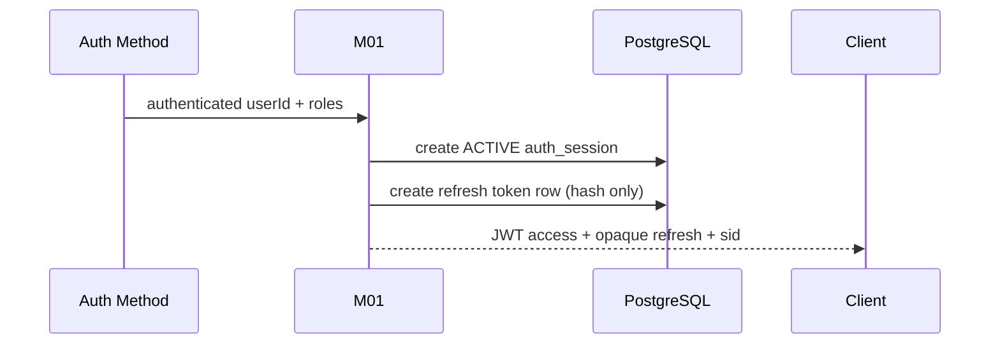

# H-WP03 — Session & Token Security

**Owner:** Hùng  
**Module:** M01 Account & Identity  
**Cycle:** B0 · 27/09/2026 → 05/10/2026  
**Feature IDs:** M01-F008, F009, F010, F011, F012, F013, F014, F041  
**Release target:** MVP v0.1.0


> **Nguồn chuẩn:** Architecture V3.3 · Modules Specification V1.3 · Schema V1.0 Draft · Feature Backlog V2.  
> Nếu tài liệu task này mâu thuẫn với các tài liệu chuẩn trên, **tài liệu chuẩn thắng**. Các mục ghi “Working decision” là quyết định triển khai tạm thời cho sprint và phải được review nếu muốn đưa vào contract chuẩn.


## 1. Outcome cần đạt

Sau khi Local/Google authentication thành công, hệ thống tạo một **server-side auth session**, cấp **JWT access token ngắn hạn** và **opaque rotating refresh token**. Hệ thống phải thu hồi được session, phát hiện refresh-token reuse và không lưu raw refresh token.

## 2. Scope / Non-scope

**IN:** issue token sau auth success; `auth_sessions`; `refresh_tokens`; refresh rotation; reuse detection; logout current/all; session lookup/revoke; Web/Mobile token-storage contract.  
**OUT:** Local register/email verification (H-WP01); Google OIDC verification/account linking (H-WP02); RBAC admin UI (H-WP05); notification delivery thật (dùng `MockNotificationPort`).

## 3. Input

### 3.1 Authentication success input

```text
Authenticated userId
roles[]
AuthMethod metadata (LOCAL hoặc EXTERNAL) — không đưa provider token vào session DB
request metadata: user-agent / IP (chỉ lưu hash nếu dùng)
```

### 3.2 Refresh input

```text
opaque refresh credential
current client/session context
```

### 3.3 Revoke input

```text
logout current: current sid
logout all: userId
manual revoke: sessionId + reason
```

## 4. Output

```text
AuthResult
- accessToken: JWT
- accessTokenExpiresAt / expiresIn
- refreshCredential: opaque rotating token
- sessionId = sid
- user / roles / AccessContext
```

JWT tối thiểu:

```text
iss, aud, sub=userId, sid=authSessionId, roles[], iat, exp
```

Mặc định hiện tại: access token ~15 phút; refresh ~30 ngày, cấu hình được.

## 5. Data ownership

### `auth_sessions`

```text
id, user_id, status,
user_agent_hash?, ip_hash?,
created_at, last_seen_at?, expires_at,
revoked_at?, revocation_reason?
```

Status tối thiểu: `ACTIVE | REVOKED | EXPIRED`.

### `refresh_tokens`

```text
id, session_id, token_hash, token_family_id,
expires_at, used_at?, rotated_from_id?, replaced_by_id?,
revoked_at?, created_at
```

**Không có bảng `access_tokens`. Raw access JWT và raw refresh token không persist.**

## 6. Business flow

### Login success



### Refresh rotation

```text
Client gửi refresh token
→ hash credential để lookup
→ tìm refresh_tokens + auth_session
→ validate: token/session active, chưa expire/revoke, chưa used/replaced
→ atomic transaction:
   1. mark old token used_at
   2. create new opaque token cùng token_family_id
   3. set replaced_by_id / rotated_from_id
→ cấp access JWT mới + refresh token mới
```

### Reuse attack

```text
refresh token cũ đã used/replaced xuất hiện lại
→ REUSE DETECTED
→ revoke toàn bộ token family
→ revoke auth_session
→ trả 401
→ gọi MockNotificationPort / security-notification contract
```

## 7. Logic flow / invariants

1. Access JWT luôn mang `sid`.
2. Authenticated API phải resolve session state theo `sid`; `REVOKED/EXPIRED` → 401 dù JWT còn `exp`.
3. Refresh rotation phải **atomic**; concurrent double-refresh không được tạo hai token active hợp lệ.
4. `token_family_id` giữ nguyên qua một lineage.
5. Logout current revoke session + family hiện tại.
6. Logout all revoke mọi session/family của user.
7. PostgreSQL là source of truth; Redis chỉ cache trạng thái session/revocation.
8. Raw token không log/audit/DLQ.

## 8. Working decisions cho cycle này

- **Hash refresh token:** canonical docs chỉ yêu cầu hash, chưa chốt thuật toán. Working recommendation: deterministic cryptographic hash/HMAC để lookup được theo credential; secret/pepper nằm trong secret config nếu dùng HMAC.
- **Session cache key:** có thể dùng `auth:session:{sid}`; đây là implementation detail, không phải public contract.
- **Refresh concurrency:** dùng DB transaction + row lock/unique constraint phù hợp; không dựa riêng vào Redis lock.

## 9. Client storage contract

**Web:** access token ưu tiên memory; refresh credential qua `HttpOnly + Secure + SameSite` cookie; không `localStorage`.  
**Mobile:** refresh credential trong Keychain/Keystore/secure storage; access token ưu tiên memory.

Task này chỉ cần cung cấp contract/helper; UI hoàn chỉnh không nằm trong scope.

## 10. Failure behavior

| Case | Expected |
|---|---|
| JWT expired | 401/token-expired; client dùng refresh flow |
| session revoked/expired | 401 dù JWT signature còn valid |
| refresh expired/revoked | 401, yêu cầu login lại |
| refresh reused | revoke family + session + 401 |
| DB transaction fail khi rotate | không được consume token cũ nửa vời / không issue token mới |
| Redis unavailable | fallback PostgreSQL theo policy, không tự nâng quyền |

## 11. Mock / dependency boundary

Dùng được độc lập với:

```text
MockNotificationPort
FakeAccessContext / FakeEntitlementContext
FakeClock (khuyến nghị cho expiry tests)
```

Không cần Google OIDC thật, SMTP thật, M12 thật.

## 12. Test matrix tối thiểu

- login success → 1 session + 1 refresh family.
- DB không chứa raw refresh token.
- access JWT có `sub/sid/roles/iss/aud/iat/exp`.
- refresh success → token cũ used, token mới active, family giữ nguyên.
- refresh token cũ dùng lại → 401 + session revoked.
- concurrent refresh cùng token → tối đa một request thành công.
- logout current → JWT cùng sid bị reject.
- logout-all → tất cả sid của user bị reject.
- expired session/refresh → reject.
- Web/Mobile storage policy không expose raw refresh token ở storage không an toàn.

## 13. Acceptance criteria / Definition of Done

- [ ] `auth_sessions` lifecycle hoạt động `ACTIVE/REVOKED/EXPIRED`.
- [ ] JWT access token 15 phút mặc định, có `sid`.
- [ ] opaque refresh token 30 ngày mặc định, DB chỉ lưu hash.
- [ ] refresh rotation atomic.
- [ ] token-family reuse detection revoke đúng family + session.
- [ ] logout current + logout all có integration tests.
- [ ] revoked session làm JWT bị reject trước khi `exp`.
- [ ] không log/persist raw token.
- [ ] MockNotificationPort nhận được security notification khi reuse.
- [ ] PR + test report/demo link được dán vào tracker.

## 14. Evidence để tick Done

```text
1. PR implementation
2. Migration/schema compatibility test
3. Integration test: login → refresh → refresh again → old token reuse = 401
4. DB screenshot/query chứng minh chỉ có token_hash
5. Test logout current + logout all
```
