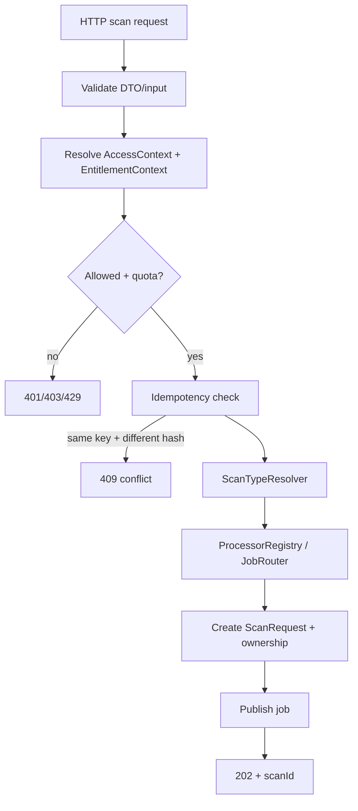

# I-WP11 — Request Controls, Authorization & Scan Dispatch

**Owner:** Kiên  
**Module:** M12 Shared Scan Platform  
**Cycle:** W09 · 27/09/2026 → 05/10/2026  
**Feature IDs:** M12-F001, F002, F003, F004, F018, F019  
**Release target:** MVP v0.1.0


> **Nguồn chuẩn:** Architecture V3.3 · Modules Specification V1.3 · Schema V1.0 Draft · Feature Backlog V2.  
> Nếu tài liệu task này mâu thuẫn với các tài liệu chuẩn trên, **tài liệu chuẩn thắng**. Các mục ghi “Working decision” là quyết định triển khai tạm thời cho sprint và phải được review nếu muốn đưa vào contract chuẩn.


## 1. Outcome cần đạt

M12 nhận request scan đã validate, resolve quyền/quota/idempotency, tạo `ScanRequest`, chọn đúng processor/routing key cho `URL | TEXT | ENTITY | QR`, rồi publish job an toàn. Task phải chạy được bằng fake auth + FakeMessageBus để không chờ worker thật.

## 2. Scope / Non-scope

**IN:** `AccessContext`/`EntitlementContext`, quota gate, idempotency, `ScanTypeResolver`, `ProcessorRegistry/JobRouter`, ownership metadata, dispatch, public scan request acceptance.  
**OUT:** result consumer/lifecycle retry (I-WP12), nested scans (I-WP13), AI barrier (I-WP14), actual worker analysis.

## 3. Input

```text
ValidatedScanCommand
AccessContext
EntitlementContext / ScanExecutionPolicy
Idempotency-Key? + request hash
```

`AccessContext` canonical:

```text
actorType = GUEST | AUTHENTICATED_USER | ADMIN | API_CLIENT(future)
subjectId = guestSessionId | userId | apiClientId(future)
roles[]
authenticated
```

MVP entitlement:

```text
guest → guest quota, no persistent account history, inferenceProfile=standard
free  → account quota, persistent history, inferenceProfile=standard
```

## 4. Output

```text
Accepted scan:
- scanId
- ScanStatus=PENDING/PROCESSING
- ownership metadata
- published worker job

Business failures:
- invalid input -> 4xx
- unauthorized -> 401/403 theo access policy
- quota exceeded -> 429 + Retry-After
- idempotency conflict -> 409 IDEMPOTENCY_KEY_CONFLICT
```

## 5. Processor mapping

```text
URL    -> /v1/scans/url    -> q.scan.url    / scan.url.requested
TEXT   -> /v1/scans/text   -> q.scan.text   / scan.text.requested
ENTITY -> /v1/scans/entity -> q.scan.entity / scan.entity.requested
QR     -> /v1/scans/qr     -> q.scan.qr     / scan.qr.requested
```

`WEB_CONTENT` không có public endpoint/queue riêng. `TRANSACTION_POST` đi `q.scan.text`.

## 6. Business flow



## 7. Idempotency rules

- `Idempotency-Key` gắn với request hash.
- TTL là **platform config**, không hard-code 24h.
- cùng key + cùng request → replay cùng logical outcome, không tạo duplicate scan/job.
- cùng key + khác request hash → `409 IDEMPOTENCY_KEY_CONFLICT`.
- key storage có thể ở Redis; durable business state vẫn ở PostgreSQL.

## 8. Ownership / authorization invariants

1. `scanId` **không phải authorization token**.
2. Authenticated scan gắn `ownerUserId`.
3. Guest scan dùng opaque guest ownership/access proof theo policy; không tạo `users` record.
4. Guest không có persistent account history.
5. Quota phải check **trước dispatch** công việc tốn tài nguyên.
6. Worker không nhận raw auth token/credential/payment/credit state.

## 9. Job contract tối thiểu

Working shape:

```json
{
  "eventId": "evt_...",
  "jobId": "job_...",
  "correlationId": "corr_...",
  "eventVersion": "1",
  "attempt": 1,
  "scanId": "scan_...",
  "scanType": "URL",
  "payload": {},
  "executionPolicy": {
    "inferenceProfile": "standard"
  }
}
```

Không đưa password, access/refresh token, raw CCCD, credit/payment/subscription data vào job.

## 10. Failure behavior

- RabbitMQ unavailable → không được giả `202 Accepted` nếu job chưa được publish an toàn.
- Redis/idempotency unavailable → theo platform safe-failure/fallback; không silently duplicate.
- unknown scan type/processor → fail fast trước publish.
- quota exceeded → 429 + user-facing error.
- duplicate same idempotency request → không double dispatch.

## 11. Mock-first boundary

```text
FakeMessageBus
FakeAccessContextResolver
FakeEntitlementResolver
InMemoryScanRepository
FakeClock
```

Dùng fake processor/worker result; không cần M02/M03/M04/M05 worker thật.

## 12. Test matrix

- 4 public scan types map đúng queue/routing key.
- guest allowed public scan; guest history policy không persistent.
- free user ownership gắn đúng userId.
- unauthorized/invalid request fail trước dispatch.
- quota exceeded 429 + `Retry-After`.
- same idempotency key/same hash → một dispatch.
- same key/different hash → 409.
- RabbitMQ publish failure → không trả accepted giả.
- job payload không chứa auth secrets.

## 13. Acceptance criteria

- [ ] `ScanTypeResolver` + `ProcessorRegistry/JobRouter` cho đủ URL/TEXT/ENTITY/QR.
- [ ] Guest/Free access/quota policy enforce trước dispatch.
- [ ] Idempotency request hash + configurable TTL.
- [ ] 409 conflict semantics đúng.
- [ ] 429 + `Retry-After` khi quota/rate policy chặn.
- [ ] ownership metadata đúng; `scanId` không được dùng như quyền truy cập.
- [ ] FakeMessageBus tests pass không cần worker thật.
- [ ] publish fail không trả 202 sai.
- [ ] contract fixture được TEAM-C01 freeze.
- [ ] PR/test/demo evidence dán tracker.
