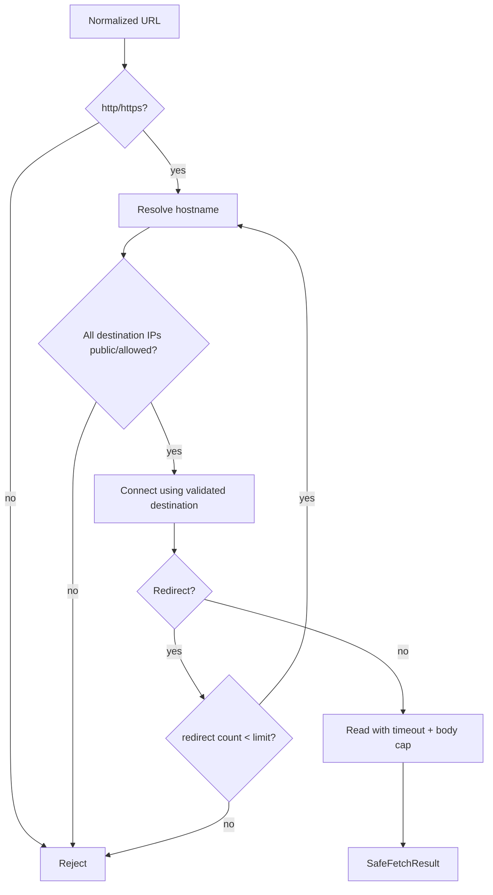

# K-WP02 — Safe Fetch & SSRF Guard

**Owner:** Khải  
**Module:** M02 URL & Website Risk Scan  
**Cycle:** W01 · 06/10/2026 → 12/10/2026  
**Feature IDs:** M02-F009…F016  
**Release target:** MVP v0.1.0


> **Nguồn chuẩn:** Architecture V3.3 · Modules Specification V1.3 · Schema V1.0 Draft · Feature Backlog V2.  
> Nếu tài liệu task này mâu thuẫn với các tài liệu chuẩn trên, **tài liệu chuẩn thắng**. Các mục ghi “Working decision” là quyết định triển khai tạm thời cho sprint và phải được review nếu muốn đưa vào contract chuẩn.


## 1. Outcome cần đạt

URL Worker có một safe-fetch boundary đủ để **không thể dùng hệ thống làm SSRF proxy** vào loopback/private/link-local/metadata/internal destinations. Kiểm tra phải lặp lại sau mỗi redirect.

## 2. Scope / Non-scope

**IN:** scheme gate, DNS resolve-before-connect, IP range block, redirect destination re-check, redirect/size/time limits, no credential forwarding, isolation tests, attack fixtures.  
**OUT:** advanced redirect semantics (K-WP03), TLS analysis (K-WP04), HTML/Form (K-WP05), scoring.

## 3. Input

```text
normalized public URL from K-WP01
fetch policy/config
correlation metadata
```

Không nhận DB credential, application access token, internal service headers.

## 4. Output

Success:

```text
SafeFetchResult
- finalUrl
- redirectChain[]
- status/content metadata
- bounded response body/stream for later analyzers
```

Rejected:

```text
SSRF_BLOCKED / UNSUPPORTED_SCHEME / REDIRECT_LIMIT /
RESPONSE_TOO_LARGE / FETCH_TIMEOUT / DNS_RESOLUTION_FAILED
```

Tên error code cụ thể phải freeze trong fixture.

## 5. Mandatory SSRF rules

- chỉ `http`/`https`;
- chặn loopback/private/link-local/metadata ranges;
- tối thiểu cover: `127/8`, `10/8`, `172.16/12`, `192.168/16`, `169.254/16`, `::1`, `fc00::/7`;
- block internal hostname như `localhost`, `.local`, configured internal suffix;
- resolve DNS **trước** connect;
- validate **mọi resolved destination**;
- sau **mỗi redirect**, resolve + validate lại;
- redirect limit mặc định 5;
- response body limit mặc định 5 MB;
- connect/read timeout;
- không forward internal credential/header;
- giới hạn port theo configurable allowlist.

## 6. Logic flow



## 7. DNS rebinding rule

Không được chỉ validate hostname string. Mỗi connect/redirect cần dựa trên destination đã resolve/validate theo safe-fetch implementation. Test phải có case domain công khai/redirect trỏ về private/loopback.

## 8. Worker/network isolation

Canonical boundary:

```text
URL Worker network access:
- RabbitMQ
- public Internet through SSRF-safe fetch

NO:
- PostgreSQL
- Redis
- Spring Boot internal API
- management plane
```

M02-F014 yêu cầu fetch runtime/user không có DB access. M02-F016 container/network-policy tách riêng là P2; không bắt buộc để Done cycle nếu basic isolation test đã có.

## 9. Working decision

Exact allowed port list chưa được canonical docs chốt. Working recommendation: config allowlist, bắt đầu 80/443 nếu use case không cần khác; team phải freeze trước production deploy.

## 10. Failure/degraded behavior

Fetch fail không đồng nghĩa URL safe/danger. K-WP02 chỉ trả fetch failure/safety metadata; M02/M12 vẫn có thể dùng lexical/DNS/reputation signals khác để finalize degraded result.

## 11. Attack test matrix bắt buộc

- `http://127.0.0.1`
- `http://localhost`
- `http://169.254.169.254`
- RFC1918 IPv4 ranges.
- IPv6 loopback/ULA.
- public URL redirect → private IP.
- redirect chain > 5.
- DNS-rebinding style fixture.
- unsupported `file://`, `ftp://`.
- oversized response > 5 MB.
- read/connect timeout.
- headers do not include internal Authorization/cookie.

## 12. Independence / mocks

SafeFetcher có thể unit/integration test bằng local controlled HTTP/DNS fixtures. Không cần M08/M09/M11. Không dùng production DB/cache.

## 13. Acceptance criteria

- [ ] chỉ http/https.
- [ ] private/loopback/link-local/metadata blocked trước connect.
- [ ] DNS resolve trước connect.
- [ ] redirect destination re-check từng hop.
- [ ] redirect limit 5 configurable.
- [ ] response limit 5 MB configurable.
- [ ] timeout implemented.
- [ ] no internal credential/header forwarding.
- [ ] attack test suite pass.
- [ ] worker không có DB/Redis/core API route.
- [ ] PR/test evidence dán tracker.
