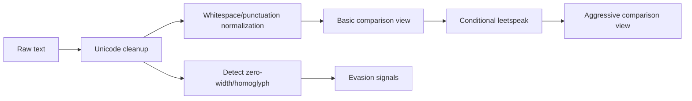

# T-WP01 — Vietnamese Text Normalization & Evasion Handling

**Owner:** Thắng  
**Module:** M03 Text & Transaction Scam Analysis  
**Cycle:** B0 · 27/09/2026 → 05/10/2026  
**Feature IDs:** M03-F001…F007  
**Release target:** MVP v0.1.0


> **Nguồn chuẩn:** Architecture V3.3 · Modules Specification V1.3 · Schema V1.0 Draft · Feature Backlog V2.  
> Nếu tài liệu task này mâu thuẫn với các tài liệu chuẩn trên, **tài liệu chuẩn thắng**. Các mục ghi “Working decision” là quyết định triển khai tạm thời cho sprint và phải được review nếu muốn đưa vào contract chuẩn.


## 1. Outcome cần đạt

Xây pipeline normalize văn bản tiếng Việt đủ ổn định để rule/indicator extractor xử lý các kiểu viết né filter: bỏ dấu, leetspeak, Unicode/homoglyph, zero-width và khoảng trắng bất thường. Task này **không chấm final risk**.

## 2. Scope / Non-scope

**IN:** basic normalization, aggressive/evasion normalization, leetspeak detection, Unicode/zero-width handling, language/encoding metadata, fixtures/tests.  
**OUT:** scam keyword/pattern scoring + API async (T-WP02); entity extraction (T-WP03); taxonomy (T-WP04); AI inference.

## 3. Input

```text
raw text
contentType = MESSAGE | TRANSACTION_POST (metadata có thể chưa dùng trong WP này)
```

Giới hạn input cấp module hiện tại: 20.000 ký tự; enforcement HTTP thuộc M12/T-WP02.

## 4. Output

Working internal result đề xuất:

```text
TextNormalizationResult
- originalText
- basicNormalizedText
- evasionNormalizedText
- detectedLanguage?
- encodingWarnings[]
- evasionSignals[]
```

`evasionSignals[]` có thể chứa facts như:

```text
LEET_BRAND
ZERO_WIDTH_INSERTION
HOMOGLYPH_SUSPECTED
EXCESSIVE_SEPARATOR_OBFUSCATION
```

Tên code phải được freeze trong fixture trước khi consumer phụ thuộc.

## 5. Business logic

Hai mức normalize phải được giữ riêng:

```text
RAW
 ├─ basic normalization
 │   ├─ lowercase
 │   ├─ normalize whitespace
 │   └─ Vietnamese diacritic-stripped comparison view
 │
 └─ aggressive/evasion normalization
     ├─ leetspeak map có điều kiện
     ├─ zero-width removal/detection
     ├─ punctuation/separator normalization
     └─ homoglyph normalization/detection khi an toàn
```

**Không được chỉ overwrite raw text**, vì UI/evidence về sau cần giải thích trên nội dung người dùng thực sự nhập.

## 6. Leetspeak invariant

Feature hiện tại yêu cầu leetspeak conversion theo token có chứa chữ cái, ví dụ `vi3tc0mb4nk` → comparison form gần `vietcombank`.

Không convert mù mọi digit vì có thể phá:
- số điện thoại;
- số tài khoản;
- số tiền;
- OTP.

Do đó:

```text
if token contains alphabetic chars:
    apply leetspeak candidate mapping
else:
    keep numeric token intact
```

## 7. Evasion detection flow



## 8. Privacy / security

- WP này không persist raw text.
- Raw CCCD-like value không log.
- Không gửi text ra external AI/provider.
- Log chỉ metadata cần debug; fixture dùng data giả.

## 9. Working decisions cần freeze

- Exact Unicode normalization form (`NFC`/`NFKC`) chưa được canonical docs chốt. Working recommendation: chọn một form và lock bằng tests; tránh transformation làm mất bằng chứng ngoài ý muốn.
- Homoglyph mapping không được quá aggressive; nếu uncertain, phát signal thay vì thay text silently.
- Nên giữ mapping/offset metadata nếu T-WP02 cần highlight đoạn raw text; đây là implementation recommendation, chưa phải canonical contract.

## 10. Mock / dependency boundary

Task hoàn toàn độc lập:

```text
text fixture input
→ TextNormalizer
→ TextNormalizationResult
```

Không cần RabbitMQ, DB, M09, M11, URL/Entity worker.

Fixtures tối thiểu:

```text
safe-message.json
urgent-bank-transfer.json
refund-asks-otp.json
asks-for-cccd.json
message-with-url-phone-bank.json
+ custom evasion fixtures
```

## 11. Test matrix tối thiểu

- lowercase/whitespace deterministic.
- Vietnamese text có dấu và comparison view bỏ dấu.
- `vi3tc0mb4nk` phát hiện leet + normalize comparison.
- chuỗi số thuần không bị leet-convert.
- zero-width insertion được phát hiện.
- Unicode homoglyph case được signal/normalize theo policy.
- emoji/punctuation không làm crash.
- URL/phone/account numeric content không bị phá.
- malformed encoding handled deterministically.

## 12. Acceptance criteria

- [ ] Basic normalization deterministic.
- [ ] Aggressive/evasion view tách riêng raw/basic.
- [ ] leetspeak conversion có guard cho numeric-only token.
- [ ] zero-width detection có test.
- [ ] Unicode/homoglyph policy có fixture.
- [ ] không phá URL/phone/bank extraction fixtures.
- [ ] không persist/log raw sensitive text.
- [ ] interface đủ để T-WP02 consume mà không biết implementation details.
- [ ] PR/test evidence dán tracker.
