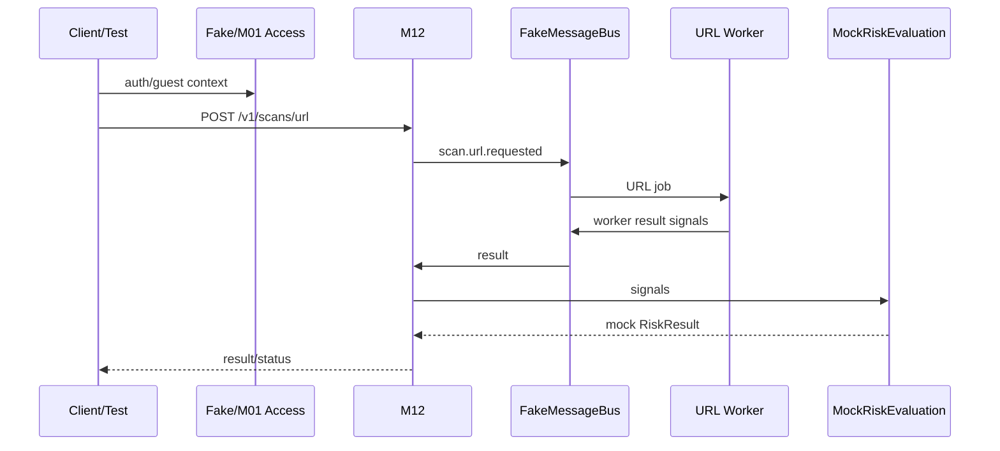

# TEAM-C02 — Integration Checkpoint 1

**Owner:** Cả nhóm  
**Cycle:** W01 · 06/10/2026 → 12/10/2026  
**Goal:** chứng minh bốn workstream ghép được bằng contract, chưa cần toàn bộ dependency thật.


> **Nguồn chuẩn:** Architecture V3.3 · Modules Specification V1.3 · Schema V1.0 Draft · Feature Backlog V2.  
> Nếu tài liệu task này mâu thuẫn với các tài liệu chuẩn trên, **tài liệu chuẩn thắng**. Các mục ghi “Working decision” là quyết định triển khai tạm thời cho sprint và phải được review nếu muốn đưa vào contract chuẩn.


## 1. Outcome cần đạt

Chạy được ít nhất hai vertical smoke flows bằng mock/fake:

```text
A. auth/session context → URL dispatch → URL worker fixture → mock RiskResult
B. auth/session context → TEXT dispatch → Text Worker → mock RiskEvaluation → mock RiskResult
```

Không cần AI thật, threat DB thật hay notification provider thật.

## 2. Input

Artifacts từ 8 WP cá nhân:

```text
H-WP03, H-WP01
K-WP01, K-WP02
I-WP11, I-WP12
T-WP01, T-WP02
```

Contract freeze từ TEAM-C01.

## 3. Output

- integration branch/PR hoặc test environment chạy được;
- smoke-test script;
- danh sách contract mismatch nếu có;
- fix nhỏ tại đúng owner;
- demo recording/log screenshot nếu thuận tiện.

## 4. Integration flow A — URL



## 5. Integration flow B — Text

```text
AccessContext
→ POST /v1/scans/text
→ M12 dispatch q.scan.text
→ Text Worker
   → T-WP01 normalization
   → keyword/pattern signals
→ q.scan.result
→ M12 result consumer/dedupe
→ MockRiskEvaluationPort
→ RiskResult fixture
→ UI/mock client render
```

## 6. Must-not during integration

- Không sửa contract silently chỉ để test pass.
- Không cho worker gọi DB/core API tắt qua cho nhanh.
- Không hard-code final score ở worker.
- Không bỏ idempotency/session checks.
- Không đưa raw token/OTP vào queue/log.

## 7. Checkpoint matrix

| Seam | Producer | Consumer | Pass condition |
|---|---|---|---|
| AccessContext | Hùng | Kiên | guest/free fixture resolve đúng |
| Scan job envelope | Kiên | Khải/Thắng | worker parse được cùng fixture |
| Worker result | Khải/Thắng | Kiên | schema + event IDs pass |
| Text normalization | Thắng WP01 | Thắng WP02 | evasion fixture detect đúng |
| Mock RiskEvaluation | Kiên/fixture | UI/core | RiskResult render được |
| SSRF boundary | Khải | URL worker | private target blocked trước fetch |

## 8. Failure cases phải demo/test

- duplicate worker result không double-count;
- revoked session/invalid access không dispatch;
- invalid URL/text fail trước worker;
- SSRF blocked target;
- worker result malformed → reject/DLQ seam;
- RabbitMQ/FakeMessageBus publish failure không trả accepted giả.

## 9. Acceptance criteria

- [ ] URL smoke flow pass end-to-end bằng fake/mock.
- [ ] TEXT smoke flow pass end-to-end bằng fake/mock.
- [ ] không có contract mismatch chưa ghi issue.
- [ ] duplicate-event test pass.
- [ ] auth/access gate pass.
- [ ] SSRF smoke attack pass.
- [ ] worker isolation không bị phá.
- [ ] mỗi owner có ít nhất một integration evidence.
- [ ] tracker cập nhật Done/Blocked đúng thực tế trước họp Thứ 2.

## 10. Evidence

```text
integration test log
+ smoke script
+ PR(s)
+ issue list cho mismatch còn lại
+ demo/screenshot ngắn để dùng báo cáo GV nếu cần
```
