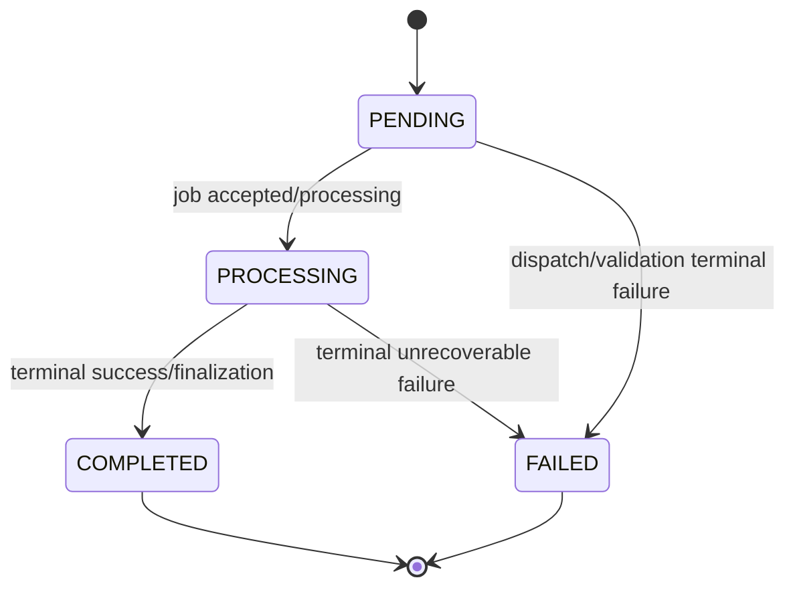

# I-WP12 — Scan Lifecycle, Event Envelope, Retry & Idempotency

**Owner:** Kiên  
**Module:** M12 Shared Scan Platform  
**Cycle:** W10 · 06/10/2026 → 12/10/2026  
**Feature IDs:** M12-F005, F006, F007, F008, F012  
**Release target:** MVP v0.1.0


> **Nguồn chuẩn:** Architecture V3.3 · Modules Specification V1.3 · Schema V1.0 Draft · Feature Backlog V2.  
> Nếu tài liệu task này mâu thuẫn với các tài liệu chuẩn trên, **tài liệu chuẩn thắng**. Các mục ghi “Working decision” là quyết định triển khai tạm thời cho sprint và phải được review nếu muốn đưa vào contract chuẩn.


## 1. Outcome cần đạt

Sau khi I-WP11 dispatch job, M12 phải quản lý lifecycle thống nhất, consume worker results idempotently và xử lý retry/DLQ theo at-least-once semantics. Duplicate event không được double-count hoặc tạo state transition sai.

## 2. Scope / Non-scope

**IN:** `PENDING→PROCESSING→COMPLETED|FAILED`, event envelope, worker-result consumer, dedupe `eventId`, retry max 2 sau attempt đầu, DLQ.  
**OUT:** nested child orchestration (I-WP13), AI barrier/race (I-WP14), full Risk Fusion implementation (M09).

## 3. Input

```text
ScanRequest đã được I-WP11 tạo
published worker job
WorkerAnalysisResult event từ q.scan.result
```

Generic worker result canonical semantics:

```json
{
  "eventId": "evt_123",
  "jobId": "job_123",
  "attempt": 1,
  "scanId": "scan_123",
  "parentScanId": null,
  "scanType": "URL",
  "status": "ANALYZED",
  "signals": [],
  "derivedIndicators": [],
  "pendingAiTasks": [],
  "processorVersion": "...",
  "processedAt": "..."
}
```

Envelope/message còn phải trace được `correlationId` và `eventVersion`.

## 4. Output

```text
updated ScanStatus
validated AnalysisSignal[] handed to aggregator boundary
accepted/ignored duplicate outcome
retry / DLQ outcome
failure metadata / audit trace
```

I-WP12 chưa cần final RiskResult thật; có thể dùng `MockRiskEvaluationPort` ở integration checkpoint.

## 5. Lifecycle state machine



**Invariant:** không có scan treo `PROCESSING` vô hạn. Deadline/finalization đầy đủ sẽ được mở rộng ở I-WP13/I-WP14; cycle này phải có ít nhất fail-safe timeout/test seam.

## 6. Event identity & idempotency

Mỗi message cần đủ:

```text
eventId
jobId
correlationId
eventVersion
attempt
scanId
processor/model version metadata khi áp dụng
```

Consumer:

```text
if eventId already processed:
    ACK + ignore
    do not append signal again
    do not increment counters again
else:
    validate schema
    persist/mark event processed
    apply state/signal operation atomically enough to prevent double count
    ACK
```

## 7. Retry / DLQ policy

Canonical MVP:

```text
attempt 1
+ tối đa 2 retry
→ exhausted
→ DLQ tương ứng
```

Ví dụ:

```text
q.scan.url.dlq
q.scan.text.dlq
q.scan.entity.dlq
q.scan.qr.dlq
```

Không auto-retry DLQ vô hạn.

## 8. Manual ACK rule

ACK chỉ sau khi event đã được xử lý/idempotently persisted theo design. Nếu process crash trước safe point, RabbitMQ có thể redeliver; consumer phải chịu được redelivery.

## 9. Failure behavior

| Case | Expected |
|---|---|
| duplicate eventId | ACK/ignore, không double-count |
| malformed result | reject/retry theo class lỗi; exhausted → DLQ |
| transient worker processing error | bounded retry |
| permanent schema/version error | không retry vô hạn; DLQ/observable |
| event for unknown scanId | reject/observable, không tạo phantom scan |
| terminal scan nhận duplicate result | no mutation ngoài allowed audit trace |

## 10. Mock-first setup

```text
FakeMessageBus
InMemoryScanRepository
FakeClock
worker-result fixtures
malformed-result fixture
duplicate-event fixture
```

Không cần RabbitMQ thật để unit/contract tests; integration có thể chạy broker container sau.

## 11. Test matrix

- lifecycle happy path.
- invalid transition blocked.
- duplicate event twice → one logical signal/state update.
- crash/redelivery simulation.
- retry attempt 1→2→3 then DLQ.
- malformed schema/version.
- unknown scanId.
- correlationId preserved end-to-end fixture.
- `eventVersion` validation.

## 12. Acceptance criteria

- [ ] lifecycle thống nhất `PENDING/PROCESSING/COMPLETED/FAILED`.
- [ ] Worker Result Consumer validate schema.
- [ ] dedupe by `eventId`.
- [ ] duplicate ACK/ignore không double-count.
- [ ] message envelope có event/job/correlation/version/attempt/scan IDs.
- [ ] bounded retry: 2 retry sau attempt đầu.
- [ ] exhausted → DLQ.
- [ ] không auto retry DLQ vô hạn.
- [ ] có trace/metric seam cho failure/DLQ.
- [ ] FakeMessageBus + duplicate/retry tests pass.
- [ ] PR/test evidence dán tracker.
