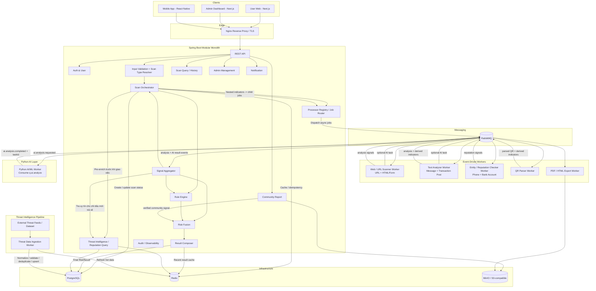

# Báo cáo Week 8 — Rà soát và tiến hóa kiến trúc Anti-Scam Platform

## 1. Tài liệu đối chiếu

Báo cáo sử dụng các tài liệu sau làm nguồn đối chiếu. Đường dẫn được viết tương đối từ `weekly-reports/Week8/`:

| Tài liệu | Vai trò |
|---|---|
| [`architecture_v1.0.md`](../../architectures/architecture_v1.0.md) | Kiến trúc nền tảng ban đầu |
| [`architecture_v2.0.md`](../../architectures/architecture_v2.0.md) | Phiên bản làm rõ ranh giới Java/Python và sync/async |
| [`architecture_v3.1.md`](../../architectures/architecture_v3.1.md) | Nguồn của Mermaid runtime view ở section 3.1 |
| [`architecture_v3.2.md`](../../architectures/architecture_v3.2.md) | Kiến trúc hiện hành — Async AI Alignment |
| [`02-tong-the-v2.png`](../../architectures/diagrams/02-tong-the-v2.png) | Sơ đồ tổng thể dùng cho người đọc/trình bày |
| [`02-tong-the-v2-check.md`](../../architectures/diagrams/02-tong-the-v2-check.md) | Đối chiếu consistency giữa sơ đồ và đặc tả |
| [`modules_specification_v1.1.md`](../../specifications/modules_specification_v1.1.md) | Đặc tả module hiện hành, đã đồng bộ V3.2 |

## 2. Input và Output của hệ thống

Nội dung dưới đây được rút từ **section 1.1 — Input và output chính thức** của kiến trúc V3.2.

| Loại | Giá trị |
|---|---|
| **Input** | - URL/link đáng nghi - Nội dung tin nhắn, đoạn hội thoại - Bài đăng giao dịch / nội dung rao bán, tuyển dụng, hoàn tiền, giao hàng... (`TEXT` + `contentType`) - Số điện thoại - Số tài khoản ngân hàng / mã ngân hàng nếu có - QR code / VietQR - Báo cáo lừa đảo do cộng đồng gửi lên - **HTML/Form** được phân tích như bước nội bộ của URL scan, không bắt buộc là public input - **CCCD** trong MVP chỉ được phát hiện như tín hiệu yêu cầu/thu thập dữ liệu nhạy cảm trong Text/Web; standalone CCCD lookup thuộc Future Scope |
| **Output** | - Điểm rủi ro `0–100` - Mức cảnh báo `SAFE`, `CAUTION`, `DANGER` - Bằng chứng theo rule / signal - Giải thích lý do - Khuyến nghị hành động - Trạng thái xử lý `PENDING`, `PROCESSING`, `COMPLETED`, `FAILED` - Lịch sử scan của user - Audit / operational log cho admin và vận hành |

Về nguyên tắc xử lý, hệ thống sử dụng **Modular Monolith + Event-Driven Workers**: Spring Boot sở hữu business state và final result; các worker chuyên biệt xử lý bất đồng bộ qua RabbitMQ. AI/ML là tín hiệu bổ sung, vì vậy MVP vẫn có thể đưa ra kết quả dựa trên rule/heuristic và reputation/community signal khi AI không khả dụng.

## 3. Kiến trúc V3.2

V3.2 tiếp tục hướng **Modular Monolith + Event-Driven Workers**, nhưng chốt rõ quyền sở hữu trạng thái và luồng xử lý: **Spring Boot là business core và tạo final verdict; scanner/AI worker chỉ trả signal qua RabbitMQ**. AI được tách thành worker bất đồng bộ, còn Scan Orchestrator quản lý nested scan, AI task và completion barrier.

### 3.1. Sơ đồ tổng thể dành cho người đọc

### 3.2. Mermaid runtime view

Mermaid dưới đây lấy từ **section 3.1 của `architecture_v3.1.md`** và được dùng làm high-level runtime view của kiến trúc V3.2.

**Ý chính:** Client → Nginx → Spring Boot → RabbitMQ → các worker. Worker trả signal/result event về core; Spring Boot gom signal, tra reputation, áp Rule Engine + Risk Fusion và persist `RiskResult`. PostgreSQL là source of truth; Redis dùng cho cache/coordination; MinIO/S3 lưu evidence/export.

## 4. So sánh V3.2 với V1 và V2

| Khía cạnh | V1 | V2 | V3.2 |
|---|---|---|---|
| **Mục tiêu chính** | Chọn hướng kiến trúc khả thi cho nhóm 4 người | Thu hẹp runtime và chốt ranh giới Java/Python | Hoàn thiện pipeline event-driven, ownership và degraded behavior |
| **Kiến trúc nền** | Modular Monolith + Event-Driven Workers | Giữ Modular Monolith, giảm async không cần thiết | Giữ Modular Monolith nhưng chuẩn hóa toàn bộ scan lifecycle qua RabbitMQ |
| **Worker & dữ liệu** | Worker có thể chạm PostgreSQL/Redis và lưu kết quả | Java worker sở hữu I/O/state; Python không DB | Scanner/AI worker bị cô lập: không DB/Redis/core API, chỉ giao tiếp qua RabbitMQ |
| **Vai trò Python/AI** | Hướng phát triển, chưa là boundary rõ | Python `scan-engine` gọi đồng bộ, có thể đánh rule/chấm điểm | Python AI Worker chạy bất đồng bộ; chỉ trả prediction signal; Java tạo verdict |
| **Sync / Async** | Async cho các tác vụ scan nặng | Text/entity ưu tiên sync, URL sync-first rồi escalate | 4 scan type dùng lifecycle async thống nhất; AI có queue riêng và deadline riêng |
| **Chấm điểm** | Rule Engine cộng điểm/weight và map risk level | Điểm tập trung trong `scan-engine` | Rule Engine → Risk Fusion → Result Composer, policy versioned + renormalization |
| **Threat/Reputation** | Worker có thể lookup trực tiếp | Java lấy dữ kiện rồi truyền Python | Core-only ThreatQuery; pre-enrichment + deferred enrichment; worker chỉ trả `DerivedIndicator` |
| **Nested scan / AI task** | Chưa có coordination đầy đủ | Chưa là cơ chế trung tâm | `scan_relations` + `scan_ai_tasks`, barrier, deadline, cycle detection, degraded result |
| **Observability** | Audit/log ở mức module | Có correlation ID và vận hành cơ bản | M14 Audit & Observability riêng; event/task IDs, retry/DLQ và late-result trace |

### Tiến hóa chính

**V1 → V2:** từ kiến trúc tổng quát sang ranh giới triển khai cụ thể hơn: mono-repo, contract-first, Java sở hữu I/O/state và Python là thành phần phân tích riêng.

**V2 → V3.2:** chuyển từ mô hình gọi Python đồng bộ và worker còn sở hữu nhiều I/O sang **event-driven isolation**: AI chạy queue riêng, worker chỉ phát signal, Spring Boot sở hữu business state/final verdict, Risk Fusion được version hóa và Orchestrator chịu trách nhiệm toàn bộ nested/AI completion.

## 5. Tóm tắt modules trong `modules_specification_v1.1.md`

Đặc tả hiện tại chia hệ thống thành **14 module end-to-end/shared platform**. Ownership được xác định theo feature/module, không tách thành các team frontend/backend riêng.

| Module | Chức năng chính |
|---|---|
| **M01 — Account & Identity** | Xác thực, session/token, profile và RBAC thống nhất cho Web, Mobile và Admin. |
| **M02 — URL & Website Risk Scan** | Quét URL/website: URL, DNS, TLS, redirect, HTML/Form, reputation; worker chỉ trả signal và AI task nếu cần. |
| **M03 — Text & Transaction Scam Analysis** | Phân tích tin nhắn/bài đăng; phát hiện scam cues và trích URL/SĐT/STK để tạo nested scan. |
| **M04 — Phone & Bank Reputation Check** | Kiểm tra uy tín số điện thoại và tài khoản ngân hàng từ reputationContext do core cung cấp. |
| **M05 — QR / VietQR Scan** | Decode QR/VietQR, phân loại payload và trả derived indicators để Orchestrator tạo scan con. |
| **M06 — Scan Result, History & Export** | Read-side chung cho status, RiskResult, history, export/share; hiển thị rõ degraded result. |
| **M07 — Community Report & Moderation** | Nhận báo cáo cộng đồng + evidence, moderation; chỉ report VERIFIED mới ảnh hưởng reputation. |
| **M08 — Threat Intelligence Management** | Quản lý threat sources, ingestion và core-only ThreatQuery; scanner worker không đọc DB/cache. |
| **M09 — Rule, Risk Policy & Admin Operations** | Rule Engine + Risk Fusion + Result Composer; version hóa rule/policy và tạo verdict cuối. |
| **M10 — Notification & User Follow-up** | Notification cho scan/report/export; lỗi notification không rollback nghiệp vụ chính. |
| **M11 — AI/ML Inference** | Python AI/ML Worker bất đồng bộ qua RabbitMQ; trả prediction signal, không trả business verdict. |
| **M12 — Shared Scan Platform** | Scan lifecycle/orchestration: routing, idempotency, nested scan, AI task tracking, barrier và finalization. |
| **M13 — Platform Infrastructure** | Nginx, PostgreSQL, Redis, RabbitMQ, MinIO/S3, Docker/CI; enforce network/runtime boundaries. |
| **M14 — Audit & Observability** | Audit & Observability: audit trail, correlation ID, retry/DLQ, failure và operational metadata. |

Nhìn tổng thể, **M02–M05** là các feature scan; **M06–M10** bao phủ kết quả, cộng đồng, threat, policy và follow-up; **M11–M14** cung cấp AI, orchestration, infrastructure và observability dùng chung. M12 + M09 là hai điểm trung tâm của runtime: M12 điều phối lifecycle/signals, M09 chuyển signal thành final `RiskResult`.
