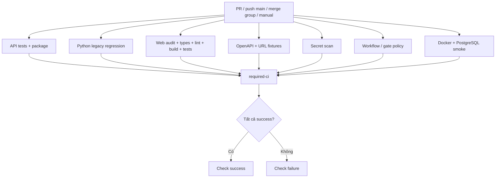

# K-MVP01 · Secrets, CI và URL Worker Contract — Báo cáo tính năng

## Thông tin chung

| Trường | Giá trị |
|---|---|
| **Mã / source WP** | `K-MVP01` · `K-WP09`, `K-WP11`, `K-WP08` |
| **Người thực hiện** | Ninh Văn Khải |
| **Review chéo** | Chưa có human approval trong PR #6/#9 khi kiểm tra ngày 06/10; cần Kiên/Thắng review contract, Hùng review tác động auth/audit |
| **Thành phần** | `api`, `contracts`, `infra`, CI scripts; `web` cập nhật dependency và generated types |
| **Tuần / kiến trúc** | W09 · 27/09–05/10/2026 · Timeline V2.1, Architecture V3.3 |
| **PR / commit** | [#6][pr6] — `63cc335`; [#9][pr9] — `4e92abd645b72b4354821f5752e29f6146e2cb15` |
| **Trạng thái** | #6 đã merge; #9 đang mở, CI xanh 8/8 job; chưa xác nhận team contract freeze/nghiệm thu toàn bộ WP |
| **Ngày lập hồ sơ bổ sung** | 06/10/2026; mô tả code và evidence W09 |

Nguồn phạm vi: [Timeline V2.1](../../../plan/v2.1/Timeline_full_Anti_Scam_2026_2027_V2.1.md), [task W09](../../../tasks/W09/K-MVP01_Secrets_CI_URL_Worker_Contract.md), [Backlog V2](../../../specifications/features/v2.0/Anti_Scam_Feature_Backlog_V2.md). Báo cáo này bàn giao **implementation slice**, không tuyên bố đóng toàn bộ source WP.

## 1. Tóm tắt trong 30 giây

- **Đã làm:** bảo mật cấu hình/log, mở rộng CI và định nghĩa schema/fixtures trao đổi giữa core với URL worker theo V3.3.
- **Ai dùng ngay:** cả nhóm dùng pipeline; Kiên/Thắng dùng URL fixtures để phát triển consumer/producer độc lập. Chưa có URL scanner runtime trong phần này.
- **Demo nhanh:** từ root `Scam-Risk-Detector`, chạy `python contracts/validate_events.py job contracts/events/fixtures/url-job.json` sau khi cài `contracts/requirements.txt`.

## 2. Phạm vi đã làm

### 2.1. Đã triển khai trong slice

| Ưu tiên / feature | Phần triển khai | Bằng chứng và giới hạn |
|---|---|---|
| P0 · `M13-F001/F002` | Hạn chế log payload/credential; che phone/bank/email, token/OTP/PIN/CVV; làm sạch audit metadata/user-agent | `SensitiveDataRedactor`, Logback converter và test; không phải audit toàn bộ nơi lưu dữ liệu |
| P0 · `M13-F005/F035` | Bỏ JWT/DB secret mặc định, template không chứa credential, kiểm tra JWT key, mock auth mặc định tắt | Config + `JwtSecretTest`; mới là environment/config baseline, chưa có secret vault/provider rotation tự động |
| P0 · `M13-F012` | API/Python/web tests, OpenAPI/URL fixture validation, secret scan, workflow/gate policy, Docker/PostgreSQL smoke | [Workflow][workflow], [CI PR #9][ci9] |
| P0 · `M13-F013` | `required-ci` fail khi job lỗi/thiếu/skip/cancel; giữ tên check để cấu hình repository dùng lại | Logic và CI đã kiểm chứng; enforcement setting là bằng chứng riêng, xem mục 13 |
| P0 · `M02-F054` | Result chỉ chứa signal/indicator/pending AI và trace metadata; chặn score/verdict/business fields | [Schema][schema], `test_worker_cannot_send_business_state_or_credentials` |
| P0 · `M02-F055/F056` — mức contract | Job có `reputationContext`; host mới đi qua `DerivedIndicator`; worker không được phát `REPUTATION_UNAVAILABLE` | Fixture/test; chưa triển khai `ThreatQuery`, Redis→PostgreSQL hoặc timeout lookup thật |

PR #9 còn bổ sung production dependency audit, vá Next.js/eslint-config-next 16.3.8, kiểm tra generated-type drift và sửa route mock bị tắt trả 500 thành 404. Không nhận phần auth/session của Hùng là đã hoàn tất.

### 2.2. Chưa làm

| Phần còn lại | Lý do / mốc |
|---|---|
| URL intake/normalization và worker runtime, bus thật | `K-MVP02`, W10; W09 chỉ có schema và offline tooling |
| SSRF-safe fetch, redirect, CD | `K-MVP03`, W11 |
| TLS/header, HTML/form và demo entry UX | `K-MVP04`, W12 |
| `M02-F053` UI 4 tab; secret-provider integration/rotation đầy đủ | Không nằm trong implementation W09 này |
| Final verdict, persistence scan, AI barrier | Trách nhiệm core/owner tương ứng; không triển khai thay bằng Python scoring legacy |

## 3. Hợp đồng API và event

### 3.1. HTTP bị ảnh hưởng

Không thêm public URL scan endpoint. Với mock auth bật ở dev, `POST /v1/dev/token` cấp token, `GET /v1/dev/accounts` chỉ trả account/role/hướng dẫn và **không có password chung**. Khi `AUTH_MOCK=false`, cả hai route trả HTTP **404**, `error.code=NOT_FOUND`; `MockAuthDisabledTest` kiểm tra qua security filter và error handler.

OpenAPI và `apps/web/src/types/api-generated.ts` đã cập nhật cùng code. Consumer cũ đọc `data.password` từ `/v1/dev/accounts` cần bỏ cách dùng đó; không có bằng chứng đã thông báo nhóm ngoài nội dung PR.

### 3.2. URL event contract v1.0

| Hướng logic | Routing key | Queue | Trách nhiệm |
|---|---|---|---|
| Core → URL worker | `scan.url.requested` | `q.scan.url` | Core cung cấp URL/context; worker nhận job |
| URL worker → core | `scan.url.analyzed` | `q.scan.result` | Worker trả quan sát; core xử lý tiếp |

Exchange dự kiến: `antiscan.topic`. Đây là mapping contract trong [README events][events], **chưa có publish/consume RabbitMQ thật** ở commit báo cáo.

| Nhóm field | Ý nghĩa / kiểm tra |
|---|---|
| `eventId`, `jobId`, `scanId`, `correlationId`, `eventVersion`, `attempt` | Trace envelope; version `1.0`, attempt 1–3 |
| Job: `requestedAt`, `deadlineAt`, `payload.normalizedUrl`, `payload.reputationContext` | Deadline phải sau requested time; URL http/https; reputation do core cung cấp |
| Result: `status`, `signals`, `derivedIndicators`, `pendingAiTasks`, `processorVersion`, `processedAt` | Fixture thành công dùng `ANALYZED`; không chứa final `riskScore/riskLevel/verdict` |
| Indicator: `type`, `normalizedValue`, `handling` | `REPUTATION_ONLY` hoặc `CHILD_SCAN`; validator reject `CALL_CORE` |
| Pending AI: `taskId`, `kind` | Không trùng task ID; fixture giả định publish thành công, validator chưa chứng minh broker ack |

Năm fixture trong `contracts/events/fixtures/`: `url-job.json`, `worker-result-url-safe.json`, `worker-result-url-suspicious.json`, `worker-result-with-derived-indicator.json`, `worker-result-with-pending-ai.json`. Tên `url-safe` chỉ có nghĩa fixture không chứa quan sát đáng ngờ, **không phải verdict SAFE**. CLI báo `PASS`/`FAIL`, exit 0/1 và không in payload bị reject.

## 4. Mô hình dữ liệu

Không thêm bảng, index, migration hoặc Redis key. `AuditService` dùng bảng audit hiện có nhưng sanitize metadata trước lưu. Runtime smoke dùng PostgreSQL 16 tạm, chạy migration hiện có (V1 tại commit này), Hibernate `validate` và kiểm tra một đăng ký được lưu vào `users`. Redis có trong stack nhưng chưa được kiểm thử nghiệp vụ cache/idempotency. Không lấy smoke này làm bằng chứng migration V2/V3 ở nhánh thành viên khác.

## 5. Luồng xử lý



`always()` cho gate chạy cả khi dependency fail/skip; script chỉ chấp nhận đủ 7 job với `result=success`. Có test đối chiếu toàn bộ job trong YAML với `needs` và `REQUIRED`, tránh bỏ quên job mới. Repository protection/rules mới quyết định check failure có chặn merge hay không.

## 6. Cấu trúc mã nguồn

Tất cả link dưới đây cố định tại commit `4e92abd`; mở [cây source][source] khi cần tìm file cùng thư mục.

| Điểm đọc code | Trách nhiệm |
|---|---|
| [`.github/workflows/ci.yml`][workflow], `scripts/required-ci.py` | Chạy các job và tổng hợp kết quả bắt buộc |
| `scripts/tests/test_required_ci.py`, `scripts/install-actionlint.sh` | Regression gate/CLI, kiểm tra workflow và installer checksum |
| `scripts/scan-secrets.sh`, `.gitleaks.toml` | Scan file/lịch sử, exact synthetic-key allowlist, negative control |
| [`scripts/ci-runtime-smoke.py`][smoke], `infra/docker-compose.ci.yml` | Stack tạm, kiểm tra migration/write/outage/recovery và cleanup |
| [`contracts/events/url-worker-v1.schema.json`][schema], [`contracts/validate_events.py`][validator] | Schema và validation semantic offline |
| [`contracts/tests/test_url_contract.py`][urltests] | Roundtrip/invalid cases và bảo vệ CLI output |
| `services/api/.../auth/jwt/JwtService.java`, `JwtProperties.java` | Reject key yếu/placeholder; che secret trong `toString()` |
| `services/api/.../common/SensitiveDataRedactor.java`, `SafeLogConverter.java`, `logback-spring.xml` | Che dữ liệu ở console appender; `AuditService` sanitize trước persist |
| `GlobalExceptionHandler.java`, `MockAuthDisabledTest.java` | Route không tồn tại trả 404 thay vì catch-all 500 |

Điểm bắt đầu: đọc workflow để hiểu CI; đọc validator cùng fixture để tích hợp contract. Script Python validation **không phải** implementation URL worker.

## 7. Quyết định kỹ thuật và đánh đổi

| Quyết định | Phương án khác | Lý do / đánh đổi |
|---|---|---|
| JSON Schema + fixture offline | Dựng worker/broker ngay W09 | Dễ review giữa Java/Python, không chờ runtime; chưa chứng minh delivery/isolation |
| Giữ tên check, dùng gate tổng hợp | Cấu hình từng job riêng ở protection | Một check ổn định; thêm job phải cập nhật YAML và script, đã có test chống lệch |
| Giữ test Python legacy | Xóa test trước khi chuyển runtime | Bảo vệ code hiện có; kết quả xanh không phải nghiệm thu AI async V3.3 |
| H2 + PostgreSQL smoke riêng | Chỉ H2 hoặc toàn bộ test dùng Docker | Unit chạy nhanh, smoke bắt lỗi migration/DB thực; chưa thay load/concurrency test |
| Regex redaction ở boundary + hạn chế log | Cho phép log mọi payload rồi mask | Defense-in-depth; regex không đảm bảo tìm hết secret tự do |
| Audit production là gate | Chặn full dev audit ngay | Production audit sạch tại 05/10; chấp nhận tồn đọng dev-tool advisory được công khai |

## 8. Cấu hình và biến môi trường

| Biến | Mặc định / cách cấp | Ý nghĩa |
|---|---|---|
| `JWT_SECRET` | Không có key dùng được; tối thiểu 32 **byte**, không placeholder | Ký JWT; lấy từ môi trường |
| `POSTGRES_PASSWORD` / `DB_PASSWORD` | Không có mật khẩu dùng chung | Compose / Java chạy trực tiếp; `.env` không tự được Java nạp |
| `AUTH_MOCK` | `false` | Chỉ bật chủ động ở dev cô lập |
| `CI_POSTGRES_PASSWORD`, `CI_JWT_SECRET` | Script tự sinh ngẫu nhiên mỗi run | Credential stack CI, không cần người dùng điền `.env` |
| `CI_NEEDS` | Actions truyền JSON `needs` | Đầu vào gate; thiếu/malformed thì fail |
| `GITLEAKS_BIN` | Mặc định installer pinned Linux x86_64 | Có thể chỉ định binary tương thích trên máy khác |

`.env.example` đã cập nhật trong #6; không đưa `.env` thật vào báo cáo. Thay JWT key hiện tại sẽ làm JWT cũ mất hiệu lực; chưa có coordinated key rollover.

## 9. Bảo mật và quyền riêng tư

| Rủi ro | Xử lý / bằng chứng |
|---|---|
| Secret mặc định hoặc lộ qua object/log | JWT validation, redacted `toString()`, Logback và audit sanitization; Java tests |
| Mock token xuất hiện ngoài dev | Mặc định false; token/accounts 404 khi tắt; runtime smoke |
| Credential lẫn vào result/CLI lỗi | Metadata allowlist và field rejection; CLI không echo payload |
| PR code nhận quyền ghi/secret deploy | `contents: read`, checkout không persist credential; không dùng `pull_request_target` |
| CI đụng DB/dev stack | Project name/cổng/credential riêng; cleanup đúng project tạm |

Không khẳng định full application privacy audit. Gitleaks sạch không chứng minh không có mọi dạng dữ liệu nhạy cảm; URL schema không thay SSRF guard.

## 10. Kiểm thử

Evidence ngày 05/10 ở commit `4e92abd`: **152 test đạt** (40 Java, 25 Python legacy, 68 web, 11 URL contract, 8 gate/workflow). [CI run 37341308147][ci9] đạt **8/8 job**, được kiểm tra lại trạng thái ngày 06/10. Docker smoke là kiểm tra riêng, không cộng thành test unit. Xem [BCKT](BCKT_K-MVP01_Secrets_CI_URL_Contract_Khai.md) để biết từng case, lệnh chạy và giới hạn. Chưa đo coverage %, latency, Precision/Recall/F1.

## 11. Cách chạy thử / demo

Yêu cầu: checkout code PR #9/commit `4e92abd`, Python có venv; Docker Compose hỗ trợ `up --wait` cho demo runtime. Chạy từ root `Scam-Risk-Detector`:

```bash
python3 -m venv .venv
source .venv/bin/activate
python -m pip install -r contracts/requirements.txt -r scripts/requirements-ci.txt
python contracts/validate_events.py job contracts/events/fixtures/url-job.json
python contracts/validate_events.py result contracts/events/fixtures/worker-result-*.json
python -m unittest discover -s contracts/tests -v
python -m unittest discover -s scripts/tests -v
python scripts/ci-runtime-smoke.py
```

Kỳ vọng: fixture `PASS`, 11 contract + 8 gate tests đạt; smoke in các dòng `PASS` cho migration/probe, PostgreSQL write/mock disabled và DB outage/recovery rồi `Removed disposable CI stack`. Đây là demo script/contract, không phải màn hình quét URL. Không có ảnh UI vì không sửa giao diện sản phẩm.

## 12. Ảnh hưởng tới người khác

| Ai | Thay đổi cần biết / hành động |
|---|---|
| Kiên | Review envelope, `reputationContext`, indicator handling; dùng fixture trước khi có consumer thật |
| Thắng | Review shared signal/derived/pending AI; không diễn giải fixture `url-safe` thành final SAFE |
| Hùng | Review log/audit và 404 khi mock tắt; tự cấp secret dev hợp lệ, không dựa vào password seed chung |
| Cả nhóm | Khi đổi OpenAPI phải regenerate types; khi thêm CI job phải nối vào gate; Docker smoke là bước bắt buộc |

PR là kênh bàn giao có bằng chứng; chưa xác nhận cuộc họp/thông báo chat hoặc approval của từng người. Bộ hồ sơ này không thay quyết định freeze của nhóm.

## 13. Hạn chế và việc còn nợ

- #9 chưa merge; chưa có human approval xác nhận contract freeze.
- Owner báo merge gate đã cấu hình; kiểm tra API ngày 05/10 trả 403. Có bằng chứng `required-ci` xanh, chưa có independent evidence PR đỏ bị chặn; không suy ra enforcement từ màu CI.
- Secret management mới ở environment/config; không nhận toàn bộ `M13-F035` là đã nghiệm thu. Full npm audit ngày 05/10 còn 8 high dev-tool entries; production audit không có finding ở lần chạy đó.
- Chưa có URL runtime/SSRF, AMQP delivery/retry/DLQ/isolation, AI publish/barrier hoặc kết quả phân loại để đánh giá. CI hiện có không chứng minh toàn bộ kiến trúc V3.3 đã chạy.

## 14. Nhật ký thay đổi

| Ngày | Nội dung | Bằng chứng |
|---|---|---|
| 03/10 | Secrets/logging, CI gate, URL schema/fixtures | `63cc335`, PR #6 |
| 04/10 | Merge baseline vào main; main CI xanh | `5cbfbb7` |
| 05/10 | CI/runtime smoke, type drift/audit, patch dependency và route 404 | `4e92abd`, PR #9, CI 8/8 |
| 06/10 | Bổ sung BCTN/BCKT/PR; tổ chức hồ sơ trong `Week9/khai/` | Chỉ cập nhật tài liệu, không thêm code W10 |

*Người viết: Khải · Mẫu 01 — BCTN · Kèm [báo cáo tuần](Tuan_W09_Khai.md) và [mô tả PR](PR_K-MVP01_Secrets_CI_URL_Worker_Contract.md).*

[pr6]: https://github.com/KLTN-2023-HCMSU/Scam-Risk-Detector/pull/6
[pr9]: https://github.com/KLTN-2023-HCMSU/Scam-Risk-Detector/pull/9
[ci9]: https://github.com/KLTN-2023-HCMSU/Scam-Risk-Detector/actions/runs/37341308147
[source]: https://github.com/KLTN-2023-HCMSU/Scam-Risk-Detector/tree/4e92abd645b72b4354821f5752e29f6146e2cb15
[workflow]: https://github.com/KLTN-2023-HCMSU/Scam-Risk-Detector/blob/4e92abd645b72b4354821f5752e29f6146e2cb15/.github/workflows/ci.yml
[schema]: https://github.com/KLTN-2023-HCMSU/Scam-Risk-Detector/blob/4e92abd645b72b4354821f5752e29f6146e2cb15/contracts/events/url-worker-v1.schema.json
[events]: https://github.com/KLTN-2023-HCMSU/Scam-Risk-Detector/blob/4e92abd645b72b4354821f5752e29f6146e2cb15/contracts/events/README.md
[validator]: https://github.com/KLTN-2023-HCMSU/Scam-Risk-Detector/blob/4e92abd645b72b4354821f5752e29f6146e2cb15/contracts/validate_events.py
[urltests]: https://github.com/KLTN-2023-HCMSU/Scam-Risk-Detector/blob/4e92abd645b72b4354821f5752e29f6146e2cb15/contracts/tests/test_url_contract.py
[smoke]: https://github.com/KLTN-2023-HCMSU/Scam-Risk-Detector/blob/4e92abd645b72b4354821f5752e29f6146e2cb15/scripts/ci-runtime-smoke.py
