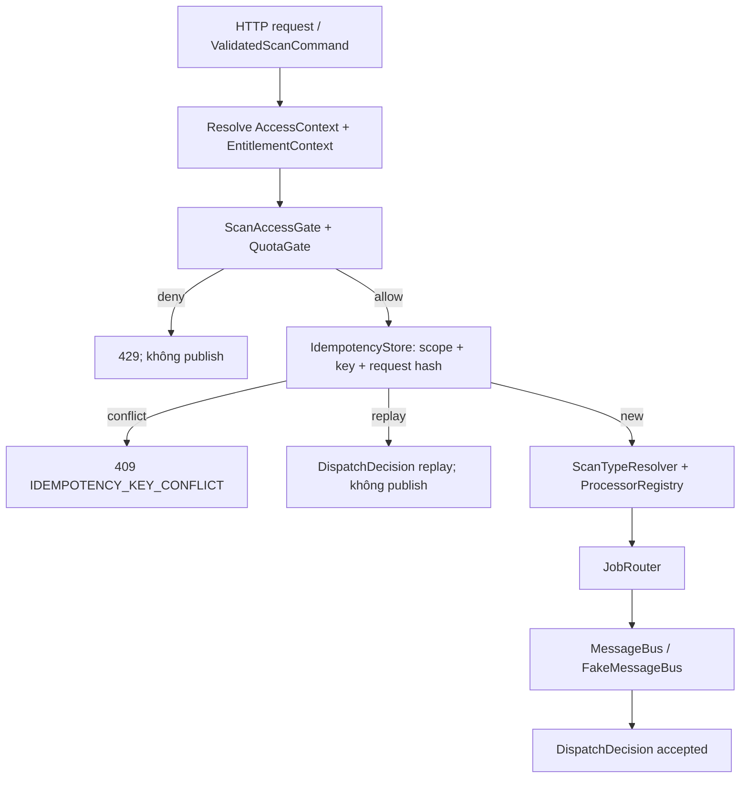

# I-MVP01 · Scan / Entity / Risk Contracts + Rule Repository Baseline — Báo cáo tính năng

## Thông tin chung

| Trường | Giá trị |
|---|---|
| **Mã nhóm tính năng** | `I-MVP01` (`I-WP11`, `I-WP17`, `I-WP07 basic`) |
| **Tên nhóm** | Scan intake, Entity/Risk contracts và Rule Repository baseline |
| **Người thực hiện** | Kiên |
| **Người review chéo** | Chưa chỉ định — chờ review team contract |
| **Thành phần** | `api` · `contracts` · `infra` |
| **Tuần / Sprint** | W09 · 27/09–05/10/2026 |
| **Mốc kiến trúc** | Timeline V2.1 · Architecture V3.3 |
| **Pull Request** | Chưa mở; branch `feat/I-MVP01-scan-entity-risk-contracts` |
| **Commit chính** | `8d02692` → `ead99af` |
| **Trạng thái** | ☑ Hoàn thành implementation slice W09 · ☐ Chưa merge/review chéo |
| **Ngày nộp báo cáo** | 05/10/2026 |

## 1. Tóm tắt trong 30 giây

- **Tôi đã làm gì:** Đóng băng hợp đồng nhận yêu cầu scan cho URL, TEXT, ENTITY và QR; mọi request đi qua access/quota gate, idempotency, registry routing và `MessageBus` giả trước khi W10 có worker/runtime thật.
- **Ai dùng được ngay:** Khải và Thắng có thể gửi URL/Text job theo routing key đã cố định; I-MVP02 dùng các port `RiskEvaluationPort`, `ThreatQuery`, `IdempotencyStore` và `ActiveRuleSetLoader` để làm lifecycle/risk core mà không đổi contract.
- **Chạy thử nhanh nhất:** `cd Scam-Risk-Detector/services/api && ./mvnw -Dtest=ScanRoutingContractTest,IdempotencyContractTest,RuleRepositoryTest test`.

## 2. Phạm vi đã làm

### 2.1. Đã hoàn thành

| Ưu tiên | Tính năng | Bằng chứng |
|---|---|---|
| P0 | `ValidatedScanCommand`, `ScanType = URL/TEXT/ENTITY/QR`, `EntityType = PHONE/BANK_ACCOUNT` | `scan/contract/*`, `ScanContractModelTest` |
| P0 | Idempotency actor-scoped: same key + same hash replay; khác hash conflict | `RequestHasher`, `IdempotencyStore`, `IdempotencyContractTest` |
| P0 | Routing ổn định tới 4 queue/routing key | `ProcessorRegistry`, `ScanRoutingContractTest` |
| P0 | Guest/free access, ownership, history policy và quota gate trước dispatch | `ScanAccessGateTest`, `ScanIntakeService` |
| P0 | Unified ENTITY contract và `NO_DATA != SAFE` | `EntityNormalizerRegistry`, `ThreatLookupResult`, entity fixtures |
| P0 | Risk/Threat port + mock deterministic | `RiskEvaluationPort`, `ThreatQuery`, `MockRiskEvaluationPort`, `MockThreatQuery` |
| P0 | `rules`/`rule_versions` versioned baseline, migration PostgreSQL và active loader | `V3__rule_repository_baseline.sql`, `RuleRepositoryTest` |
| P0 | OpenAPI `/v1/scans/*` + `Idempotency-Key`, 409, 429/`Retry-After` | `contracts/openapi/anti-scam-api.yaml` |

### 2.2. Chưa làm — và vì sao

| Tính năng | Lý do hoãn | Dự kiến làm ở |
|---|---|---|
| Persist `scan_requests`, `risk_results`, scan lifecycle | Thuộc I-MVP02; W09 chỉ freeze intake boundary | W10 |
| RabbitMQ runtime, result consumer, retry/DLQ | W09 dùng `MessageBus`/FakeMessageBus để module phát triển độc lập | W10 |
| Threat provider, cache-aside/reputation thật | `ThreatQuery` chỉ là core seam trong W09 | W10+ |
| Rule Engine, Fusion, Result Composer, final `RiskResult` | Không được suy diễn final verdict từ worker/`NO_DATA` | I-MVP02 |
| Rule admin CRUD/version publish UI | Ngoài baseline repository | Sau W10 |

## 3. Hợp đồng API và port

### 3.1. Endpoint public đã freeze

| Method | Path | Quyền/đầu vào chung | Mục đích W09 |
|---|---|---|---|
| `POST` | `/v1/scans/url` | `Idempotency-Key`, `url`, nguồn tùy chọn | Dispatch URL job |
| `POST` | `/v1/scans/text` | `Idempotency-Key`, `text`, `contentType` | Dispatch Text job |
| `POST` | `/v1/scans/entity` | `Idempotency-Key`, `entityType`, `value`, `bankCode?` | Dispatch PHONE/BANK_ACCOUNT |
| `POST` | `/v1/scans/qr` | `Idempotency-Key`, payload đã decode ở client | Dispatch QR job |

Response W09 chỉ là `ScanDispatchAcceptance { accepted, replayed }`; **không** trả `RiskResult`, `SAFE`, `PROCESSING` hay scan lifecycle.

### 3.2. Idempotency và lỗi

| Điều kiện | Kết quả | Publish job |
|---|---|---|
| Key mới trong actor scope | `accepted=true`, `replayed=false` | 1 lần |
| Cùng key, cùng semantic SHA-256 hash | `accepted=true`, `replayed=true` | Không publish lại |
| Cùng key, hash khác | `409 IDEMPOTENCY_KEY_CONFLICT` | Không publish |
| Quota deny | `429 SCAN_QUOTA_EXCEEDED`, có `Retry-After` theo quota decision | Không publish |

Hash chỉ dùng semantic input (`scanType`, `entityType`, payload canonical); không hash Authorization, correlation ID, timestamp hoặc chính idempotency key.

### 3.3. Routing contract

| Scan type | Queue | Routing key |
|---|---|---|
| URL | `q.scan.url` | `scan.url.requested` |
| TEXT | `q.scan.text` | `scan.text.requested` |
| ENTITY | `q.scan.entity` | `scan.entity.requested` |
| QR | `q.scan.qr` | `scan.qr.requested` |

### 3.4. Contract nội bộ

```text
RiskEvaluationPort.evaluate(UnifiedSignalSet, ScanProfile)
ThreatQuery.lookup(ThreatIndicator)
```

`ThreatQuery` chỉ thuộc Java core. Worker chỉ trả signal/derived indicator; không gọi database, Redis hoặc `ThreatQuery` trực tiếp.

## 4. Mô hình dữ liệu

Migration [`V3__rule_repository_baseline.sql`](../../../Scam-Risk-Detector/services/api/src/main/resources/db/migration/V3__rule_repository_baseline.sql) thêm:

| Bảng | Ý nghĩa | Ràng buộc quan trọng |
|---|---|---|
| `rules` | Định danh rule ổn định: code, category, name, enabled | `code` unique; `active_version_id` FK đến rule version |
| `rule_versions` | Snapshot version được publish của rule | `UNIQUE(rule_id, version_no)`; `condition_json JSONB`; `created_by_user_id` FK `users` |

`ActiveRuleSetLoader` chỉ trả rule `enabled=true` có active version `PUBLISHED`. Test tạo user/rule/version trong H2; không seed tài khoản production giả.

## 5. Luồng xử lý W09



Điểm không hiển nhiên:

1. Quota chạy trước dispatch để request bị chặn không tiêu tốn worker/queue.
2. Idempotency scope theo actor để key giống nhau của hai user/guest không gây conflict chéo.
3. `NO_DATA` khác `REPUTATION_UNAVAILABLE`: cái đầu là chưa có dữ liệu uy tín, cái sau là dependency lỗi; cả hai không phải `SAFE`.

## 6. Cấu trúc mã nguồn

| Vị trí | Trách nhiệm |
|---|---|
| `services/api/.../scan/contract/` | Vocabulary và output intake immutable |
| `scan/application/ScanIntakeService.java` | Orchestration: quota → idempotency → route → publish |
| `scan/idempotency/` | Canonical SHA-256, in-memory adapter, Redis Lua reservation atomic |
| `scan/routing/ProcessorRegistry.java` | Nguồn mapping queue/routing key duy nhất |
| `scan/entity/` | Normalize PHONE/BANK_ACCOUNT, không lookup reputation |
| `threat/contract/` | Threat port và outcome `FOUND/NO_DATA/REPUTATION_UNAVAILABLE` |
| `risk/contract/` | Risk evaluation seam/mock không có final verdict |
| `risk/rule/` | JPA baseline và active published-version loader |

## 7. Quyết định kỹ thuật và đánh đổi

| # | Quyết định | Phương án đã cân nhắc | Vì sao chọn | Đánh đổi |
|---|---|---|---|---|
| 1 | Fake bus thay RabbitMQ W09 | Dựng RabbitMQ runtime / transport-neutral port | Contract routing test được độc lập, không lấn I-MVP02 | Chưa chứng minh delivery/retry thật |
| 2 | SHA-256 semantic request hash | Hash raw JSON / dùng key đơn lẻ | Thứ tự JSON không làm hash đổi; cùng intent được replay đúng | Controller W10 phải canonicalize trước tạo command |
| 3 | Explicit `NO_DATA`/`UNAVAILABLE` | `Optional`/default SAFE | Không nhầm thiếu dữ liệu với an toàn hoặc lỗi dependency | Consumer phải xử lý thêm trạng thái |
| 4 | PostgreSQL `JSONB` cho rule condition | Chuỗi text/varchar | Lưu rule condition có cấu trúc, phù hợp future Rule Engine | H2 test mô phỏng bằng mapping Hibernate; đã smoke PostgreSQL thật |

## 8. Cấu hình và bảo mật

| Biến | Bắt buộc | Mặc định | Ý nghĩa |
|---|---|---|---|
| `SCAN_IDEMPOTENCY_TTL` | Không | `10m` | TTL reservation idempotency Redis |

- Không commit secret; Redis adapter là seam và test dùng in-memory adapter.
- Phone/bank fixture dùng dữ liệu tổng hợp; không log input raw trong phần contract này.
- `scanId` không phải token authorization; ownership được derive từ `AccessContext`.

## 9. Kiểm thử và bằng chứng

| Nhóm | Chứng minh |
|---|---|
| Contract Java | Guest/free policy, hash deterministic, replay/conflict, 4 route, quota-denied-no-publish, entity normalization, NO_DATA, mock port, active rule loading |
| OpenAPI | Redocly validate file `anti-scam-api.yaml` thành công; có 5 warning baseline ngoài I-MVP01 |
| URL event contracts | `python -m unittest discover -s contracts/tests -v`: 11/11 pass |
| PostgreSQL | Docker PostgreSQL 16: Flyway V1–V3 chạy từ DB rỗng và Hibernate validate `jsonb` pass; API startup thành công |
| Secret safety | `bash scripts/scan-secrets.sh` pass |

## 10. Cách chạy thử / demo

```bash
cd Scam-Risk-Detector/services/api
./mvnw -Dtest=ScanRoutingContractTest,IdempotencyContractTest,ScanAccessGateTest,EntityContractTest,RuleRepositoryTest test

cd ../..
python -m unittest discover -s contracts/tests -v
npx @redocly/cli lint contracts/openapi/anti-scam-api.yaml
```

Kết quả mong đợi: các test Java và 11 test contract Python pass; linter OpenAPI hợp lệ (cảnh báo baseline được in rõ).

## 11. Ảnh hưởng tới người khác

| Ảnh hưởng | Ai | Họ cần làm gì |
|---|---|---|
| Public scan namespace plural + `Idempotency-Key` | Khải, Thắng, Web/Mobile | Dùng `/v1/scans/*`; retry giữ nguyên key và payload |
| Routing key/queue freeze | Khải URL worker, Thắng Text/QR | Publish/consume đúng key đã nêu, không hard-code mapping khác |
| Risk/Threat ports | I-MVP02, Khải, Thắng | Dùng mock/port, không import implementation nội bộ |
| `NO_DATA` semantics | UI/Result/Entity consumers | Không hiển thị/convert thành SAFE |

## 12. Hạn chế và handoff W10

W09 chưa có public controller/runtime scan end-to-end, persistent scan state, RabbitMQ consumer, retry/DLQ, provider reputation, rule execution, fusion hay final verdict. I-MVP02 giữ nguyên contracts W09 và bổ sung các implementation đó.

## 13. Nhật ký thay đổi

| Ngày | Thay đổi | Commit |
|---|---|---|
| 05/10/2026 | Core scan contracts | `8d02692` |
| 05/10/2026 | OpenAPI, idempotency, routing, entity/risk/threat seams | `41cdf1e` – `d23bce5` |
| 05/10/2026 | Rule repository, PostgreSQL JSONB, evidence | `400d50d` – `ead99af` |

*Người viết: Kiên · Ngày: 05/10/2026 · Mẫu: BCTN v1.0*
